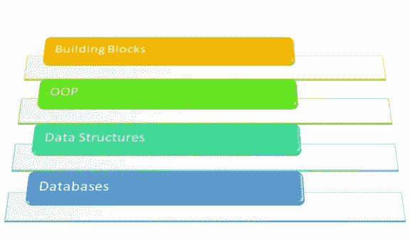
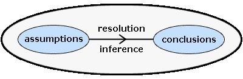
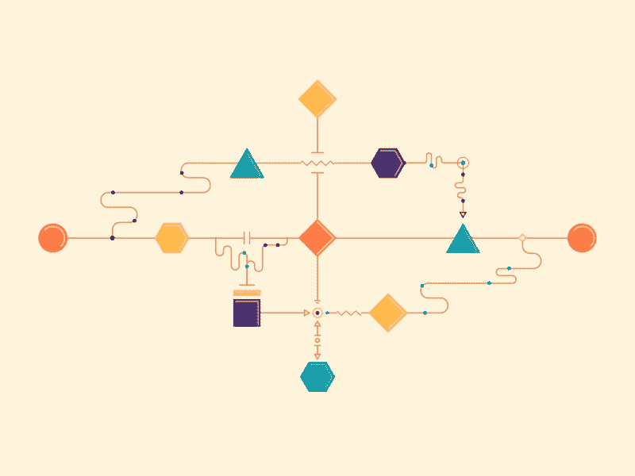
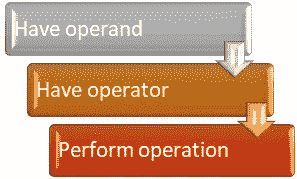
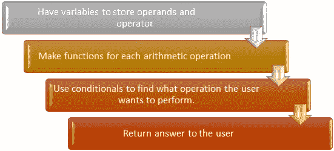

# 编程中如何建立逻辑？

> 原文：<https://blog.devgenius.io/how-to-build-logic-in-programming-f067887b7ac1?source=collection_archive---------18----------------------->

**绝对不是程序员生活中的一天**

W 当人们开始他们的编程生涯时，经常听到的事情是:

从哪里开始？

什么该学什么不该学？

写代码的时候怎么做逻辑构建…等等。

我讨论的重点是分享我在编码时帮助我建立逻辑的经验。

**首先，**试着慢慢来，多探索。也许你会找到更有趣的事情来投入时间，因为，我们都在学习，学习需要时间，虽然，如果你能很快学会东西，这是一件好事。

其次，不要为进入哪个领域而给自己压力。品尝你喜欢的任何一种口味，并找到你最感兴趣或最感兴趣的东西。

有很多人已经毕业，但仍然在探索或从一个领域跳到另一个领域，因为他们无法找到自己感兴趣的东西或跟上技术。

以上的话只是为了激励你，但是你还是要考虑到未来的职业生涯，因为我们毕业后都需要找工作，因为这是一个必要的话题，你应该在早期关注这个话题。

概念

分析

逻辑思维

# **概念:**

所需的概念是程序的构建模块(变量、循环、函数等)。)，面向对象编程，数据结构，数据库。这些是应用在编程中的概念，了解它们会使编码变得容易。

**基本概念要求**

# **分析:**

能够分析你的项目走向的情况是必要的。明确你项目的目标，以及应该应用什么样的数学材料和概念来完成这个项目。

**项目分析**

# **逻辑思维:**

说到讨论的要点，逻辑思维是发自内心的，没有人能把它灌输给你，也没有人能告诉你它是如何产生的。一个人需要意识到他/她的思维是如何工作的，因为“思维”是每个人的私事。如果我们按照字典提供的逻辑定义:

**图解说明**

> "根据严格的有效性原则进行或评估的推理."

也就是说“**逻辑**”就是简单的“**推理**”。以及一种符合验证法则的推理。这个世界上发生的一切都是基于一种人类发现并接受的逻辑；一个人看、听、说、吃、喝…等等。都是基于某种导致特定结果的逻辑。那么，我们怎么能说我们不能在编程中建立逻辑，而我们自己的身体却在用我们接受的逻辑做一切事情。

现在让我们看一些正常的例子，在这些例子中，我们甚至没有意识到自己在使用逻辑。每个人肯定都玩过纸牌游戏或棋盘游戏，虽然，我们玩它但没有意识到我们用来试图赢得游戏的策略本身就是一种“逻辑”。如果你赢了任何一场比赛，那就意味着你的逻辑思维是你赢的原因，或者其他玩家没有用他们的大脑。

同样，在编程中，我们需要的是实现目标的策略。只有当你意识到规则、你可以应用的概念、你可以创造的情境等等时，这个策略才能建立起来。

当我在寻找逻辑构建技巧时，我在某处读到过；你可以通过画**【流程图】**来增强你的逻辑，虽然这种方法看起来有点老，但它仍然是一种很好的逻辑实现方式。多玩一些战略游戏会有很大帮助。

**流程图**

我们必须牢记以下几点:

目的/目标。

可以用的概念。

什么步骤会导致什么后果。

后果会接近目标吗？

让我们考虑一个例子，如果我告诉你用基本的算术运算创建一个简单的计算器，从外行的角度和程序员的角度，你会怎么做。

## **从外行的角度来看:**

**外行流程图**

## **从程序员的角度:**

**程序员简化流程图**

这是我们没有意识到我们正在应用的逻辑，能够想到可能需要什么样的变量，可能产生什么样的函数，以及可能应用什么样的条件，这些就是制定策略并导致编程中的逻辑构建。

对这些问题的回答因人而异，因为每个人都有自己的能力。只有一些提示和练习可以帮助你，但是要达到效果，你必须自己去做。

> 最重要的建议是，不要仅仅为了灌输消极情绪而拿自己和某人比较，而是把他们作为提升自己的动力。永远积极面对事情，今天可能不是你的好日子，但总有一天会的。😊

以上所写的只是表达我的观点，它可能是错误的，你不一定要同意它，但它是我根据自己的经验和思考汇编而成的。感谢建设性的批评和反馈。