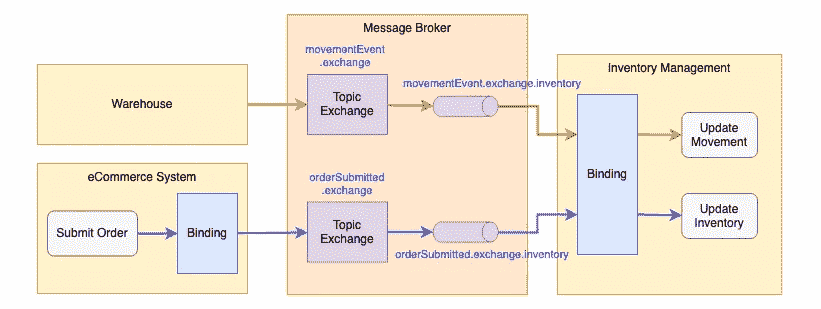
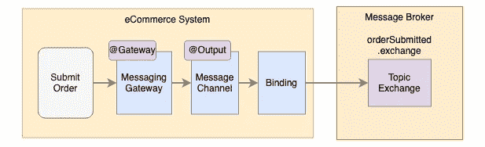
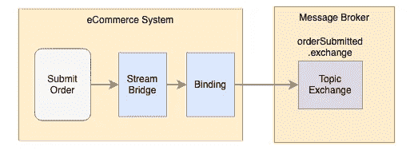
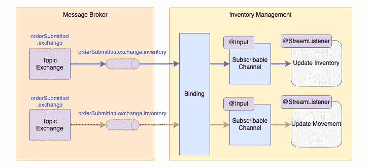
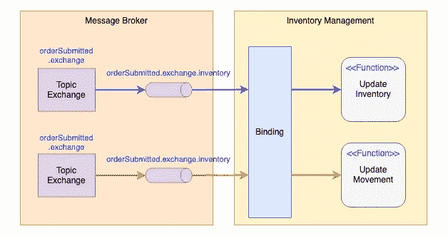

# 如何使用 Spring Cloud Stream 构建消息驱动的应用

> 原文：<https://blog.devgenius.io/how-to-build-message-driven-applications-using-spring-cloud-stream-e7ec2af24690?source=collection_archive---------0----------------------->

## 探索注释和函数式编程模型的方法

[史蒂夫·巴克](https://unsplash.com/@amaitu?utm_source=unsplash&utm_medium=referral&utm_content=creditCopyText)在 [Unsplash](https://unsplash.com/s/photos/color-shopping?utm_source=unsplash&utm_medium=referral&utm_content=creditCopyText) 上拍照

消息驱动处理是基于服务的架构中广泛采用的设计模式。这种设计有效地支持大量的请求处理，因为服务集成是基于无阻塞的消息通信。

消息代理是在服务之间传递消息的关键基础设施组件。然而，对于开发人员来说，为了编写与消息代理集成的代码而学习特定消息代理的 API 是一件苦差事，因为业界有许多流行的消息代理，如 ActiveMQ、RabbitMQ 和 Kafka。

由于 Java Spring framework 的惊人特性，它的 Spring Cloud Stream 组件提供了一个抽象，这样软件工程师就可以专注于应用程序逻辑的开发，而不必担心与消息代理交互的细节。

遵循 Spring 框架的习惯用法和实践，基于 Spring Cloud Stream 的应用程序开发最初使用注释来定义消息发送者和接收者。然而，从版本 3 开始，注释已经被弃用，函数式编程模型现在是构建基于 Spring Cloud Stream 的系统的唯一合适的方式。

在本文中，我将分享使用 Spring Cloud Stream 构建具有消息传递集成的消息驱动应用程序的分步指南。即使注释不再是推荐的方法，我仍然会强调注释和函数式编程模型，作为那些想过渡到新方法的人的参考。

## 基于注释的实现

如果您习惯于基于 Spring framework 构建应用程序，那么您应该熟悉注释的使用。通过添加注释，您可以简单地将特性添加到类和方法中。例如，annotation @Streamlistener 将指定由传入消息触发的方法。虽然注释在一段时间内仍可用于开发，但这种方法已经被否决，并且从 Spring Cloud Stream 版开始不再推荐使用。

## 函数编程模型

另一方面，函数式编程模型是一种新的方法。函数是函数式编程范例中的基本单位。每个功能都是解决特定问题的独立模块，而它们的组合可以解决复杂的问题。Java Stream 是函数式编程的典型例子。以下示例使用函数 filer()、map()和 average()来计算 2021 年 3 月 15 日下的所有订单的平均价格

与传统的命令式编程模型相比，程序代码更简单，更容易阅读。

# 示例消息驱动应用程序

让我们从一个带有消息传递集成的示例应用程序开始。我们有一个库存管理系统来记录库存。电子商务系统和仓库发出事件，并通过消息代理提交给库存管理。库存系统随后将执行业务逻辑，例如针对传入事件的库存更新。

# 消息发布者—基于注释的实现

订单提交逻辑通过消息传递网关向消息代理发送消息，消息传递网关依赖于消息通道进行通信。绑定由指定目标主题交换的配置组成。要构建一个消息发布器，您需要分别用注释@Gateway 和@ Ouptut 为消息传递网关和消息通道定义两个接口。然后，框架将在系统初始化期间提供实现。

## **消息通道**

使用绑定名称定义输出消息通道。

## **消息网关**

将@Gateway 批注标记到请求通道链接到相同绑定名称的接口方法。

## **应用代码发布消息**

应用程序代码可以通过调用消息传递网关接口来发送消息。默认情况下，框架将对象序列化到 JSON 中进行消息传输。

## 配置

在 application.yml 中，将目标主题 exchange 设置为绑定名称“orderSubmissionOutput”下的 destination 参数。当我们指定主机、端口和访问信息时，我们将应用程序连接到 RabbitMQ。应用程序初始化时，框架会自动在 RabbitMQ 上创建主题交换“orderSubmitted.exchange”。

# 消息发布者—基于功能的实现

基于函数的编程模型更简单，因为您不再需要为消息传递网关和消息通道定义样板代码。只需利用 StreamBridge 将消息直接发送到目标绑定名称。然后，框架将根据配置发送到相关的主题交换。

## 配置

应用程序配置与基于注释的实现相同。它只是从绑定名称到目的地(即主题交换名称)的映射。

# 消息监听器—基于注释的实现

Spring Cloud Stream 自动为相关消息队列中准备好的任何消息触发消息监听器。其概念是让框架知道处理传入消息的方法，并将其链接到目标消息队列，因此框架会自动将传入消息提供给该方法。

与 publisher 的实现类似，您需要一个消息通道来接收消息。消息通道是带有@input 注释的订阅通道。将@StreamListener 标记到消息处理程序方法中，然后框架将为传入的消息执行该方法

在本例中，库存管理系统监听 2 个单独的消息队列，分别用于接收从仓库和电子商务系统发出的事件。

## 信息通道

我们有两个消息渠道用于订单提交和仓库移动。

## 消息监听器

使用@StreamListener 指定传入消息处理逻辑的类方法。如果目标消息队列中有任何传入的消息，那么框架会将消息反序列化为 Java 对象 POJOs，然后执行 handler 方法。

## 配置

通过为每个绑定配置目的地和组来定义目标消息队列。Destination 是目标主题交换，而 group 通常是应用程序名或函数名。框架将自动创建一个名为 ***<目的地>的消息队列。<分组>*** 并将队列绑定到话题交换。例如，消息队列为“order submitted . exchange . inventory”带有 ***<目的地>****= order submitted . exchange*和 ***<组>*** *=库存*。

# 消息监听器—基于功能的实现

基于函数的实现不需要定义消息通道，因为框架直接将绑定链接到函数。

## 消息监听器

我们没有使用@StreamListener 注释，而是使用消费者函数实现来定义消息处理程序，并将它们注册为 beans。

## 配置

该配置类似于基于注释的方法，但是绑定名称由框架根据以下命名约定确定: ***<函数名称> -in- <索引>*** 其中 *<索引>* 在大多数情况下总是为 0，除非[函数具有多个输入和输出](https://docs.spring.io/spring-cloud-stream/docs/3.1.3/reference/html/spring-cloud-stream.html#_functions_with_multiple_input_and_output_arguments)。

其次，在**spring . cloud . function . definition**中注册函数名，使用流绑定。

# 最后的想法

Spring Cloud Stream 简化了消息驱动系统的开发，使得开发变得更加容易，并且有助于轻松地与消息代理集成。此外，该框架自动提供主题交换、消息队列和基于配置的绑定，实现代码作为基础设施，这大大减少了对环境设置的依赖。显然，使用函数式编程模型进行系统开发是一种很棒的方法，因为它用较少的样板代码产生了更简单的代码库。此外，这种方法与 Spring Cloud 函数一起工作，因此可以通过创建可重用函数管道来实现更复杂的逻辑，如数据转换。