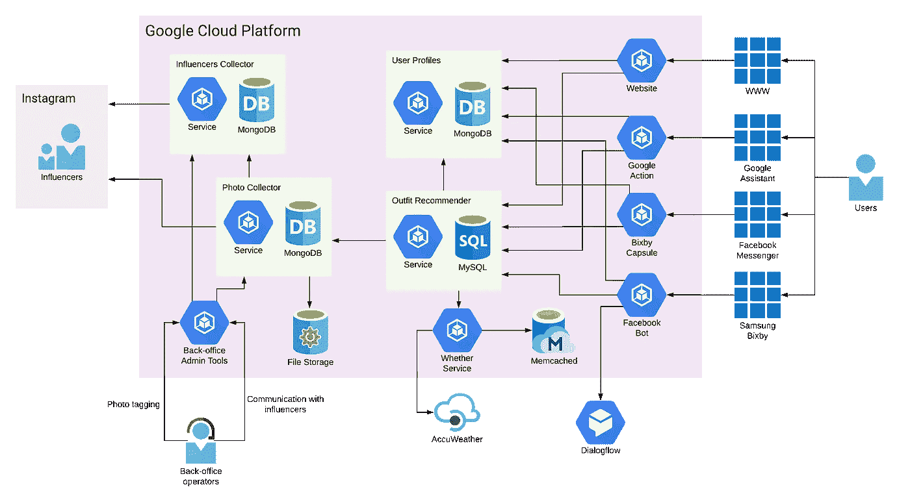

# 如何为启动构建微服务架构

> 原文：<https://blog.devgenius.io/how-to-build-microservices-architecture-for-startup-60727eadfd0a?source=collection_archive---------30----------------------->

有很多关于什么架构方法最适合快速变化的启动需求的讨论。有些人不建议从微服务开始，构建一个好的旧整体，然后在将来重新构建它。其他人根本不喜欢分布式架构的想法。他们通常是对的。当你是这种应用程序设计的新手时，你试图把每一部分都做得完美。你知道，在服务之间使用最快的通信协议，为每个任务选择最好的编程语言，使每个组件绝对独立，等等。但是它不是这样工作的。当你推崇这个工具时，很难去思考真正的问题。

我们已经使用微服务架构从零开始构建我们的系统，并且非常满意这个解决方案。我想分享一些技巧，帮助我们专注于业务任务，而不是基础设施和架构问题。但首先，我们是谁说几句话。

StyleHacks 是一个虚拟的时尚助手，帮助人们根据天气和他们的风格偏好决定从衣柜里挑选什么。

一些数字:
● 1.5 年生产
●支持 4 个聊天机器人和语音辅助系统(谷歌助手、Facebook Messenger、三星 Bixby、网站)
●12–15 个微服务(我们试验了很多，所以数字不是静态的)
●每天大约 2 万个推荐

顶层组件图:

这里有一些帮助我们在合理的时间用有限的资源开发系统的技巧。

**单回购。当你从零开始的时候，你没有很多代码，通常，你有一个非常小的团队。把所有东西放在一个地方很方便。您不需要为每个服务创建单独的存储库。只需在主 repo 中为新服务创建一个目录。另外，您可以在一个 IDE 窗口中打开所有服务。将来，如果一个项目足够大，您可以将它分成多个存储库。随时欢迎。**

**Monobase。**数据库也是如此。您可以将所有逻辑数据库保存在一个物理数据库中。从逻辑分离开始。只使用表(集合等。)属于你的服务。假装没有其他桌子。我知道抵制诱惑不越界真的很难。但是如果你能遵守惯例，你会赢得很多。维护一个数据库比维护多个数据库容易得多。当你需要的时候，你也可以随时将数据分割到多个数据库中。

**REST API。**我们的服务使用 REST APIs 相互对话。我认为这是一个很好的方法——简单、通用、人类可读，等等。也许它的工作速度没有一些替代品快。但是我相信这个速度对于大多数用例来说已经足够了。而且它提供的便利绝对是物有所值的。很容易手动测试，很容易调试，这是一个众所周知的标准。最后，有很多工具可以处理 HTTP 和 REST API。

**大小合适。**有时候，老实说，几乎总是很难决定一项服务的合适规模。然而，规模是架构的重要组成部分。当你有太多的服务时，管理所有的服务就变得太难了。您失去了领域复杂性，但获得了架构复杂性。另一方面，当您有太大的服务时，就不再是微服务了。它只是一群巨大的巨石，带着一系列老问题。

试着把每个服务都当成一个外部服务来考虑。电子邮件服务、天气服务、支付等。在这种情况下，您希望使用哪一组 API？
还有另一点。当您构建微服务时，一切看起来都像服务！但通常情况下，它比看起来要简单。有时，只实现一个模块或一个库就足够了。

**合适的工具。工具对我们的效率有着不可思议的影响。正确的工具可以节省大量的时间。当您使用 Python、JSON 和 Kubernetes 等常用技术时，更容易找到适合您情况的工具。只是有更多的选择。**

这里有一些我们使用的例子。
[Postman](https://www.postman.com/)—API 开发的协作平台。
[ReactAdmin](https://marmelab.com/react-admin/) —一个前端框架，用于在 REST API 之上构建在浏览器中运行的管理应用程序。
[Google Kubernetes Engine(GKE)](https://cloud.google.com/kubernetes-engine)—一个用于运行容器化应用程序的托管生产就绪环境。一开始，我们使用了 [GAE](https://cloud.google.com/appengine) ，这是一个更简单的管理微服务的解决方案。然而，它要贵得多，也不那么灵活，所以我们在某个时候搬到了 GKE。但这是另一个有趣的故事。

这些东西对我们有用。它们帮助我们获得微服务架构的许多优点，同时也弱化了缺点。也许并不是所有的都适合你的具体案例，但我相信这几点可以帮助你在另一个实用的关键来看待微服务。

编码快乐！