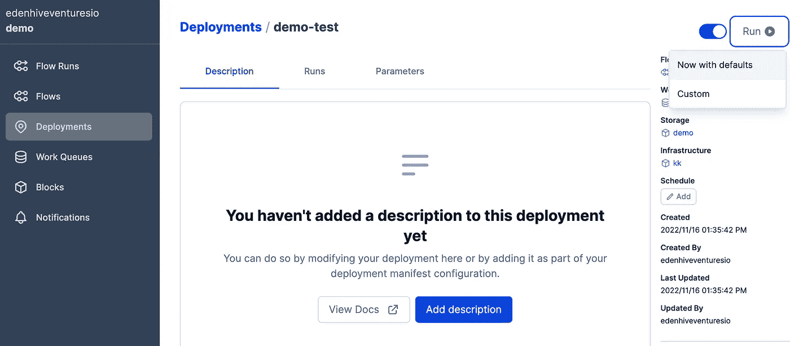

# 如何建立完美的工作流程

> 原文：<https://blog.devgenius.io/how-to-build-prefect-for-work-orchestration-1d824bd7893f?source=collection_archive---------5----------------------->

这是 101 教程，适用于想使用以下规格的人。GCP
2。提督 2.6.5
3。dbt 1.3.9

我发现 GCP+Prefect2.0 教程比较少。因此，我想在这里写下指导方针。请访问 [GithubRepo](https://github.com/dacozai/demo-gcp-prefect-dbt)

**请用 GCP 提供的 300 美元免费试用创建一个谷歌账户。然后，你就不需要担心收到账单了。**是的，我正在使用这个免费层来调查这一基础架构。这就是本教程的目的。

> ***目标:帮助人们将本教程用于他们的 GCP 概念验证，以决定他们是否应该使用提督***

# 步骤 1 创建完美的工作空间并登录

请在这里登录提督云
**由于提督** [**许诺**](https://medium.com/the-prefect-blog/modular-data-stack-build-a-data-platform-with-prefect-dbt-and-snowflake-part-2-cf753708a19e) **，我们不需要在这里设置信用卡。**因此，这里没有账单。看完教程，相信你会明白如何自己搭建猎户座。但是，我不会演示这一部分。

1.  创建名为`demo`的工作区
2.  然后，填写下面的命令，然后复制粘贴并输入🙌

```
API_KEY=[please_fill_your_api_token]
YOUR_ACCOUNT=[please_fill_your_account]
WORKSPACE=demo
# EXAMPLE
# API_KEY=pnu_AAq8ZJvEfzXIspHxsYha1hn6BJTXKc1DX75q [No worries it is deprecated]
# YOUR_ACCOUNT=edenhiveventuresio
# WORKSPACE=demo

prefect profile create demo
prefect profile use demo
prefect config set PREFECT_LOGGING_LEVEL=DEBUG
prefect config set PREFECT_API_KEY=$API_KEY
prefect cloud workspace set --workspace "${YOUR_ACCOUNT}/${WORKSPACE}"
```

**检查点**
请执行`hello.py`查看设置是否正确。
有两个地方可以检查它是否工作。
1。你的终端。你应该能看到👋在你的终端上
2。点击`Flow Runs`可以看到`foo/xxxxx` **完成**

# 步骤 2 创建 GKE 集群

## 创建服务帐户

我创建一个名为`prefect-demo`
的服务账号授予以下权限。
1。工作负荷标识用户
2。BigQuery Admin
3。存储管理员
注意。 **2 和 3 是非常危险的设置**。我将服务帐户设置为管理员级别，因为这样更容易编写 101 教程。否则，这将花费我更多的时间在这个教程上😫请`DO`在演示后修改它们，以遵循**此处**提到的[最小特权(PoLP)](https://cloud.google.com/iam/docs/using-iam-securely#least_privilege)原则。

## 创建 GKE 集群

1.选择标准[如果你愿意，你可以使用自动驾驶仪。只是费用的问题😅] ->点击`configure`
2。使用名称— `demo`
3。点击左侧`default-pool`->-`nodes`->选择 n1-standard-1 作为机器类型。
4。`cluster/ecurity`->-**启用工作量标识**

```
# Please fill your information below
CLUSTER_NAME=demo
COMPUTE_REGION=us-central1-c
PROJECT_ID=[======== YOUR_PROJECT_ID ========] 
# ex. PROJECT_ID=abcd-1234567
NODEPOOL_NAME=default-pool
SVC_ACCOUNT_NAME=prefect-demo
NAMESPACE=example

# IF YOU FORGET to enable workload identity, PLEASE use the commands below
# Please stick with me!
# 
# # setup workload identity and its pool
# gcloud container clusters update $CLUSTER_NAME \
#     --region=$COMPUTE_REGION \
#     --workload-pool=$PROJECT_ID.svc.id.goog
# # GKE metadata for the node pool
# gcloud container node-pools update $NODEPOOL_NAME \
#     --cluster=$CLUSTER_NAME \
#     --region=$COMPUTE_REGION \
#     --workload-metadata=GKE_METADATA

gcloud iam service-accounts add-iam-policy-binding \
 $SVC_ACCOUNT_NAME@$PROJECT_ID.iam.gserviceaccount.com \
 --role roles/iam.workloadIdentityUser \
 --member "serviceAccount:${PROJECT_ID}.svc.id.goog[${NAMESPACE}/${SVC_ACCOUNT_NAME}]"

# DON'T WORRY about k8s annotation
# This will be set while creating our deployment
```

**检查点**

```
# first connect to your GKE cluster
gcloud container clusters get-credentials $CLUSTER_NAME \
  --zone $COMPUTE_REGION --project $PROJECT_ID

kubectl create ns example
#>>> namespace/example created
```

# 步骤 3 为我们的 k8s 创建完美的代理

如果你想自己做这件事，请看看这里的[提督赫尔姆。如果你想做 Kustomize，请跟我来。](https://github.com/PrefectHQ/prefect-helm)

```
prefect kubernetes manifest agent
```

然后将`deployment`输出复制粘贴到 deployment.yaml 中，如果你不了解 k8s，我建议你先了解 k8s。本教程假设人们至少知道如何操作 k8s。请记住，我们将在之前创建的名称空间`example`中进行演示。然后在`spec.template.spec.env`中填写从`deployment.yaml`开始的以下命令行

## 可选择的

```
PREFECT_API_URL=https://app.prefect.cloud/api/accounts/583890cb-6790-47ac-9989-1bc8edc6a0ba/workspace/d8f7d359-21bb-42f5-b3a1-215d4e03e531
PREFECT_API_KEY=pnu_AAq8ZJvEfzXIspHxsYha1hn6BJTXKc1DX75q
kubectl create secret generic mysecret \
  --from-literal=PREFECT_API_URL=$PREFECT_API_URL \
  --from-literal=PREFECT_API_KEY=$API_KEY \
  -n example --dry-run=client -o yaml
```

😏请将输出直接复制粘贴到`secret.yaml` [参考](https://cloud.google.com/kubernetes-engine/docs/concepts/secret#using_a_secret)
注释中。这个演示在这里不会用到 secret。

**CHECK_POINT**
现在是激动人心的部分。如果设置正确，您可以在提督的`Work Queues`选项卡中看到`kubernetes`。

# 步骤 4 为容器注册创建一个映像

请遵循此处的指南[进行先决条件。使用以下命令为 GCR 图像创建图像。](https://cloud.google.com/container-registry/docs/quickstart#before-you-begin)

```
docker build -t gcr.io/$PROJECT_ID/prefect_gcp_demo .
docker push gcr.io/$PROJECT_ID/prefect_gcp_demo
```

确保图像已被放入容器注册表选项卡

# 检查我们的员工

这是一个检查我们的工人是否能与完美云正常工作的部分。但是，从理论上讲，这应该是可行的。
1。是时候为运行我们的 worker 创建所需的块了😃请运行`create_blocks.py`
[ **注意** ]做任何你喜欢的改变，尤其是 GCS 桶名！！！
2。为代理创建要执行的部署

```
prefect deployment build hello.py:foo -q kubernetes \
  -n "demo-test" -sb gcs/demo -ib kubernetes-job/kk -a
```

转到部署面板，单击运行



然后，您可以看到作业是通过 website/k9s 或其他 k8s 监视器界面执行的。

# 步骤 6 下载 dbt 演示报告— jaffle_shop

我把`jaffle_shop` 直接放到 GitHub [库](https://github.com/dacozai/demo-gcp-prefect-dbt)里。我想最好还是了解一下`dbt`如何设置`profiles.yml`
因此，请把`project`换成你的`PROJECT_ID`

要检查您的`dbt`是否工作，请进入文件夹**dbt-jaffle-shop**place`dbt seed`。如果 dbt 设置有效，您可以看到在 Bigquery 中创建了三个表

在那之后，我们想要验证你的服务帐户是否能为长官和 GCP 工作。

```
prefect deployment build dbt_build.py:dbt_build -q kubernetes \                                              ✔  data 
  -n "dbt-build-test" -sb gcs/demo -ib kubernetes-job/kk -a
```

然后，转到部署以手动触发此流运行。

如果是的话！！！恭喜你！！！和提督/dbt 以及我们的老朋友 GKE 玩得开心😄