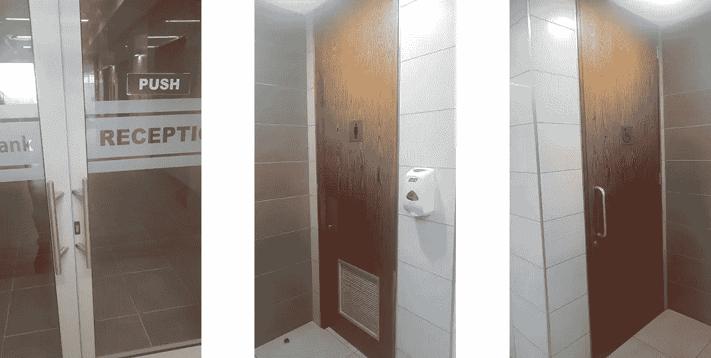
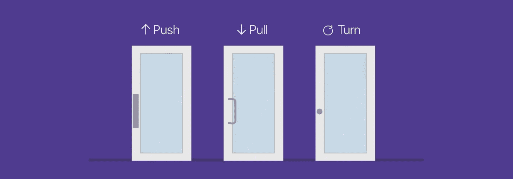

# 如何打造能创造难忘体验的产品

> 原文：<https://blog.devgenius.io/how-to-build-products-that-create-unforgettable-experiences-fdf936309612?source=collection_archive---------35----------------------->

## 在现代世界中应用古老的设计原则

在 [Unsplash](https://unsplash.com?utm_source=medium&utm_medium=referral) 上由[halance](https://unsplash.com/@halacious?utm_source=medium&utm_medium=referral)拍摄的照片

> “那么他们的用户必须有最大的经验，他必须指出制造商的好或坏的品质在使用中发展自己；例如，吹笛者会告诉制笛者他的哪支笛子令演奏者满意；他会告诉他应该怎么做，另一个会注意他的指示吗？”
> 
> “当然！”
> 
> 第十册，柏拉图的《理想国》

2300 多年前，柏拉图在他的对话中写下了这些话，关于正义和一个完美的城邦，共和国的基础。23 个世纪后，这些话仍然和它们第一次被说出来时一样真实。

苏格拉底、柏拉图、古希腊人知道一些我们今天在构建解决方案、解决问题时经常忽略的东西；与最终用户合作设计和建造。当我们忽略了这一点，我们就错过了不仅仅是构建产品，而是为最终用户提供迷人体验的机会。

无论你是软件工程师、用户界面/UX 设计师、建筑师、平面设计师、木匠，还是从事下一个大项目的时装设计师，这里概述的原则对于设计一个能为你的最终用户提供真正感人体验的产品都是至关重要的。

门 1 |门 2 |门 3

在你继续之前，我希望你花一点时间检查一下上面的门，并在脑海中记下它们的特征，不管它们有多平凡。

完成了吗？

你注意到了什么？它们是怎么打开的？推，拉，还是转？是什么引起了你的注意？

第一扇门是推门。上面有一个标签就是这么写的。第二个和第三个门是不同的故事。他们没有贴纸指引你，但我打赌你知道该做什么，这就是伟大的设计所做的。它本质上讲，不需要不必要的装饰。

设计精美的门

例子可能是门，但是所使用的设计原则可以应用于任何需要产品的地方。

**原则**

**可发现性:**这在问题“是否有可能找出什么行动是可能的，在哪里以及如何执行它们？”好的设计是显而易见的，看着它可以让用户知道什么是可能的。

设计良好的用户界面是显而易见的。用户第一次拿起一个应用程序，看着它的界面，就能知道它有什么功能。

如果一个设计是不可发现的，它可能会导致你的产品被不正确地使用，损坏，挫败，并且通常会给你的用户带来不好的体验。

**启示:**这是一个对象的属性和该对象的能力之间的关系，确定该对象可能如何被使用。

把手可以拉，所以把把手放在不能拉的地方是没有意义的，也是令人困惑的。

门可以打开、关闭，可能还可以上锁，而墙却不能。一把可以坐的椅子。一个系统的可发现性将帮助用户决定它的启示。

**意符:**如果启示决定了什么行为是可能的，那么意符就决定了那个行为应该发生在哪里。它们是可以做些什么的明显信号。

水龙头可以转动，但上面的蓝色和红色标记表示冷水或热水应该转向哪个方向。

**映射:**这是一个控件与其效果之间的关系。打开灯开关就意味着灯亮了。

按下向上箭头键映射到计算机屏幕上向上滚动的屏幕。测绘可以打破或制造一个产品。方向盘可以将左转映射到右转，反之亦然，但这可能不会有好结果。

**反馈:**反馈是指向用户发送关于其输入或动作效果的信息。它可以是视觉的、听觉的、触觉的，或者是这些的组合。

你改温度的时候空调上的声音就是你的指令已经收到的反馈。这可能是一个简单的开门动作。

**概念模型:**我们创造出与我们互动的产品的心智模型，甚至没有有意识地去思考它。概念模型是产品如何工作的心理模型。

一个糟糕的概念模型会导致不正确的产品使用或损坏。比如，很长一段时间，我对一个电熨斗的操作持有错误的概念模型。

如果我需要它快速加热到 60%,我会把它调到 100%。与水龙头和水桶相比，它等同于完全打开水龙头，将水桶装满 60%的容量，然后关闭。

现在我知道自动调温器的水龙头总是全开的，只有当温度达到要求时才会关断，而不是在温度较低时半开。

有一个流行的说法是唯一“直观”的界面是奶嘴。之后就都学会了。

我坚决不同意！

直觉说的是本能地理解某件事，而不是有意识地对它进行推理。

回想一下门，围绕产品创造直观的体验是可能的。

就像柏拉图概述的那样，下一次你在创造一个产品时，考虑这些原则，让终端用户参与进来并向他们学习，你将不再只是创造产品，而是创造融入并改善目标用户生活的体验。