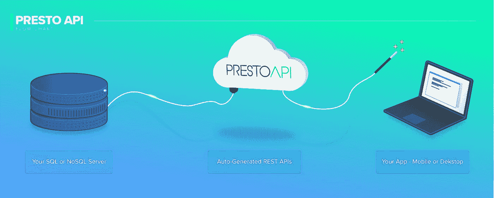

# 如何在几分钟内构建 Rest API 以及为什么应该这样做

> 原文：<https://blog.devgenius.io/how-to-build-rest-api-in-minutes-and-why-you-should-203282604227?source=collection_archive---------19----------------------->

约书亚·索蒂诺在 [Unsplash](https://unsplash.com?utm_source=medium&utm_medium=referral) 上拍摄的照片

REST APIs 通过创建一种应用程序可以相互通信的标准方法，彻底改变了 21 世纪初软件开发的面貌。这种“通用语言”允许应用程序水平扩展，并通过标准方法与其他应用程序共享数据。系统间的通信对于当今几乎每个业务系统所使用的软件应用程序的扩展都是至关重要的。

虽然有更多类型的 API 可用，但[REST API](https://prestoapi.com/)占据了主导地位，超过 83%的 web 应用程序选择它，而不是主要的替代品 SOAP API。有几个方面促成了 REST API 的流行，并使其与众不同:它对带宽的适度需求(这对性能和速度至关重要)，支持更大灵活性的宽松准则，以及数据优先于功能。

所有这些因素使得 REST API 成为创建应用程序的简单选择，这些应用程序可以让用户更快地接近他们想要做的事情。

这里有一个例子。

想一想当你访问一个旅游网站预订旅行时会发生什么。您输入您的旅行日期和地点，网站会返回符合您搜索标准的可用航班、酒店和租车。很简单，对吧？然而，在幕后，在几秒钟内，您观察到加载器栏，该网站已经接触到多个数据源(想想数据库、网站等)来为您编译这些信息。它能在几秒钟内查询日期、空房情况、房间数量、汽车类别、出发时间。

如果这些请求中的每一个都必须手动创建和更新，那么对于请求中的每一个更改，都需要十几个全职旅行社人员和在他们的办公室中等待数小时。手动连接每个应用程序并不比这更合理。不同的网站使用不同的语言构建，不同的平台使用不同类型的数据库存放数据。然而，REST API 允许这些平台通过使用标准的数据传输框架来轻松地相互通信。

这个简单的旅行预订示例显示了在应用程序中包含 API 的重要性。如果您计划在应用程序和任何其他系统之间传递数据，那么 API 是必不可少的。然而，API 有时很难创建。根据您使用什么语言来开发您的应用程序，这个过程是不同的，但是在所有情况下都需要相当多的后端开发技能和经验。还必须考虑其他因素，如安全性和身份验证。

到目前为止，从头开始创建自己的 API 需要一套全新的技能，而大多数程序员都不具备这些技能。幸运的是， [PrestoAPI](https://prestoapi.com/) 不再是这种情况，它是一种工具，允许您通过几次点击从您的数据创建 REST API，并且几乎完全消除后端开发的需要。

**PrestoAPI** 是一个中间件平台，可以从后端数据源轻松生成可定制的 REST APIs。只需将数据库连接到平台，然后创建端点。该平台支持最常见的调用，如 Get、Post、Put 和 Delete。它还支持所有最常见的数据库系统，如 SQL Server、MySQL、PostgreSQL、Oracle 和 Mongo DB。无论您使用何种编程语言或数据库系统，您都可以在几分钟内准备好一个 API。

担心安全性和身份验证？PrestoAPI 已经覆盖了你！该平台支持应用程序或项目级别的基于角色的访问，并通过 Identity Server、OAuth2 和 Active Directory 进行保护。您可以高枕无忧，因为您知道您的数据是安全的，不会受到未经授权的访问。

虽然您必须在应用程序开发期间创建 API 几乎是一个既定事实，但是您不再需要花费所有的时间从头开始创建它们。通过使用 PrestoAPI，您可以在几分钟内创建一个提供完整功能的 API，以便您的应用程序可以根据需要与其他应用程序进行通信。花时间完善您的架构和 UX，同时尽可能为您的用户提供最佳体验。无论您是经验丰富的开发人员还是刚刚开始涉足 API 创建，这个工具都将为您节省大量的时间和精力。

让我们让这些应用程序说话吧！今天就免费试用 [PrestoAPI](https://prestoapi.com/) 。

PrestoAPI.com

PrestoAPI 甚至有一个免费版本供用户试用。

在[PrestoAPI.com](https://prestoapi.com/)了解更多信息，并关注他们的社交网站@PrestoAPI

support@prestoapi.com