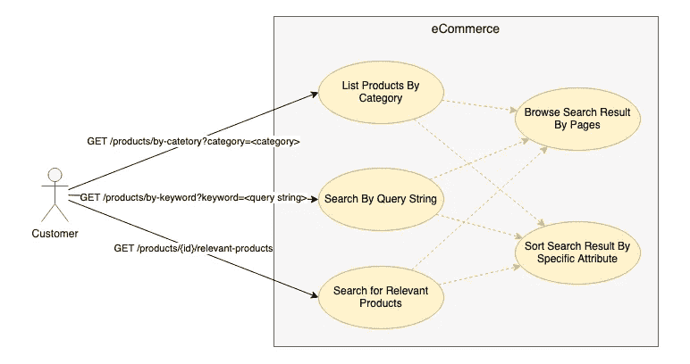
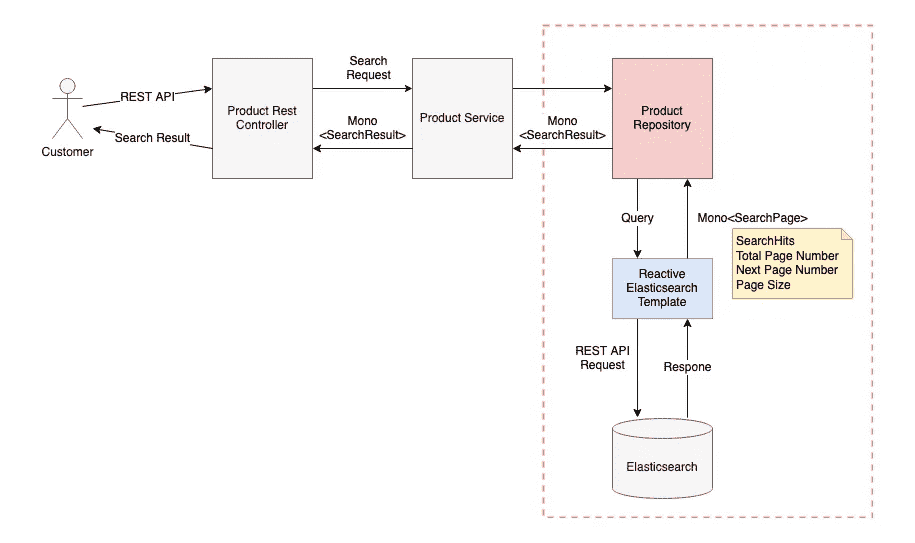
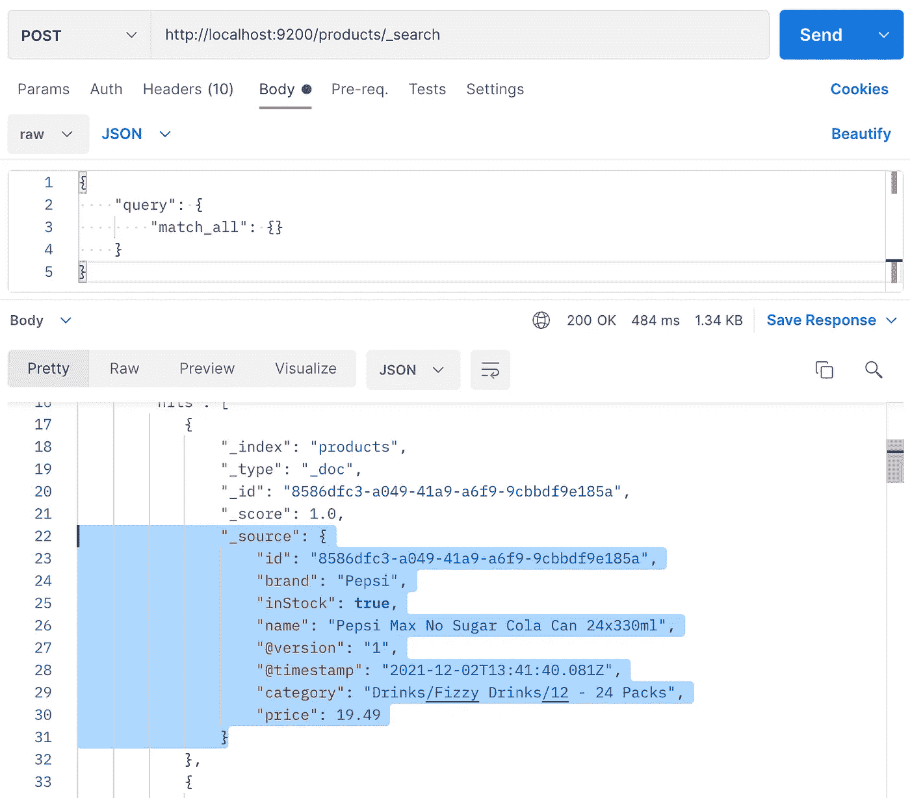

# 如何使用 NoSQL 数据存储为电子商务应用程序构建 SpringBoot API

> 原文：<https://blog.devgenius.io/how-to-build-springboot-api-for-ecommerce-app-using-nosql-datastore-elasticsearch-a8ba850c0a78?source=collection_archive---------2----------------------->

## 典型产品搜索功能的系统开发权威指南


由 [Unsplash](https://unsplash.com/@grakozy?utm_source=unsplash&utm_medium=referral&utm_content=creditCopyText) 上 [Greg Rakozy](https://unsplash.com/@grakozy?utm_source=unsplash&utm_medium=referral&utm_content=creditCopyText) 拍摄的照片

对于电子商务来说，产品搜索是一项至关重要的功能。传统技术—关系数据库不够灵活，无法处理高级搜索功能和不断增长的请求量。因此，许多人转向替代解决方案，如 NoSQL，以开发灵活和高性能的系统。

说到[全文搜索和强大的搜索功能](/how-to-enable-powerful-full-text-search-for-your-apps-mysql-vs-elasticsearch-f35ac45f816e)，Elasticsearch 是一个很受欢迎的数据存储。它基于 Lucene 支持的分布式数据存储的设计，实现了高度可伸缩的架构。

然而，与 Elasticsearch 的集成不同于传统的关系数据库。例如，Elasticsearch 是一个基于文档的数据库，其查询基于 REST APIs，而关系数据库利用 JDBC 连接上的 SQL 语句。拥有基于 SQL 的应用程序开发技能的软件工程师在构建基于 Elasticsearch 的应用程序时，可能会遇到一个陡峭的学习曲线。

关键是要熟悉基本的 REST APIs 和 Java query builder 的使用。在本文中，我将向您展示产品搜索的典型用例，并演示如何用 REST APIs 和 Java 代码构建查询。示例代码将为 Elasticsearch 应用程序开发提供一个快速入门工具。

# 电子商务网站中的典型产品查询

对于典型的电子商务网站，以下查询是必备功能:

*   按类别浏览产品
*   按关键字搜索产品
*   搜索相关产品

此外，所有的查询应该允许客户通过相关性，价格或其他特定领域的搜索结果排序。此外，分页是网站的另一个重要功能，有助于记录导航。



产品搜索用例

# 系统概况

为了实现用于产品查询的后端 API，SpringBoot 应用程序遵循了控制器-服务-存储库的典型设计模式。产品存储库负责访问 Elasticsearch。Spring 框架提供了一个实用程序类`**ReactiveElasticsearchTemplate**`，作为与 Elasticsearch 的 REST APIs 集成的“驱动程序”。该系统基于 Spring Weblfux，支持非阻塞 I/O 操作。

在本文中，我们将关注产品存储库的开发和用例的查询设置。



SpringBoot API 系统概述

# 开发环境设置

## 设置弹性搜索+样本数据

首先，您需要设置一个 Elasticsearch 实例，并在您的本地环境中使用示例数据运行。无需经历复杂的安装步骤，您可以使用 docker image 轻松创建一个一次性实例。从这个 GitHub 存储库中获取源代码

[](https://github.com/gavinklfong/spring-online-supermarket) [## GitHub-gavinklfong/spring-Online-Supermarket:网上超市的 SpringBoot 演示

### 该存储库包含 Webflux SpringBoot 应用程序的源代码，用于演示与…

github.com](https://github.com/gavinklfong/spring-online-supermarket) 

进入 **docker-compose** 文件夹。然后，您可以使用以下命令启动实例:

```
docker compose up
```

一旦 docker 容器启动并运行，通过运行下面的命令导入示例产品数据。它启动 Logstash 并将 JSON 文件`logstash-data/products.json`送入 Elasticsearch。在数据导入过程中，控制台将向您显示产品记录。

```
docker run --rm -it \
-v **.**/logstash-pipeline\:/usr/share/logstash/pipeline/ \
-v **.**/logstash-data/products.json:/usr/share/logstash/data/products.json \
--network docker-compose_default \
logstash:7.14.2
```

Elasticsearch 实例通过 9200 端口公开 REST APIs。要验证 Elasticsearch 上的产品记录，请在 Postman 上触发这个 HTTP 请求，或者运行下面的 CURL 命令来检索所有产品记录。

每个产品记录由一个唯一的 id、名称、类别、价格、品牌和库存指标组成。类别是一个层次结构。



使用 Postman 触发 Elasticsearch REST API

# Maven 依赖性

由于示例实现将基于 Spring Weblfux，您需要以下 SpringBoot Webflux 启动器和数据访问来进行 Elasticsearch

```
***<*dependency*>
  <*groupId*>***org.springframework.boot***</*groupId*>
  <*artifactId*>***spring-boot-starter-data-elasticsearch***</*artifactId*>
</*dependency*>
<*dependency*>
  <*groupId*>***org.springframework.boot***</*groupId*>
  <*artifactId*>***spring-boot-starter-webflux***</*artifactId*>
</*dependency*>***
```

此外，该库提供的实用程序类对于测试 Webflux 请求非常有用

```
***<*dependency*>
  <*groupId*>***io.projectreactor***</*groupId*>
  <*artifactId*>***reactor-test***</*artifactId*>
  <*scope*>***test***</*scope*>
</*dependency*>***
```

# 按类别列出产品

处理 Elasticsearch 的查询与 SQL 语句完全不同。Elasticsearch 上的原生查询是通过 REST API 请求完成的。因此，第一步是在 Java 编码之前创建 REST API 查询。

因为产品类别采用分层格式，如`*[Parent Category]/[Child category]*` *。“*匹配短语前缀”查询对于查找具有指定前缀的类别的所有产品非常有用。例如，下面的 REST API 查询列出了“饮料/碳酸饮料”类别下的所有产品。

要构建 Java 代码，首先需要将`**ReactiveElasticearchTemplate**`注入到产品存储库类中。我们不直接使用`**RectiveElasticsearchTemplate**`，而是引用它的实现接口`**ReactiveElasticsearchOperations**`。

然后，使用`**NativeSearchQueryBuilder**`构造一个查询对象。这一步非常简单，因为其结构与 REST API 请求非常相似。

Elasticsearch 客户端是一个响应式客户端，这意味着它会立即返回一个 Flux 对象，而无需等待 I/O 操作。一旦收到 Elasticsearch 的回复，Flux 将向用户返回一个搜索结果列表。您将能够从每个搜索命中的内容中获得产品。如果您是 Spring Webflux 的新手，那么您会发现这篇文章非常有用，因为它是 Spring Webflux 应用程序开发的介绍，并附有实际例子。

# 按关键字搜索

关键字搜索是许多电子商务网站上最常用的功能。如果你不知道该看哪一类，这是找到目标产品的快捷方法。

我们可以使用 REST API 中的“查询字符串”进行关键字搜索，它基本上是一个全文搜索功能。为了将搜索范围缩小到特定的数据字段，我们重点关注产品名称、类别和品牌。

产品名称的匹配更相关，因此我们强调使用语法“name^2”的产品名称字段，它指定了产品名称的权重，因此任何产品名称与关键字匹配的记录都将具有高相关性分数。

下面的示例查询搜索带有通配符“hom*”的关键字

下面的示例结果显示，产品名称与关键字匹配的记录比类别与关键字匹配的记录得分更高。

让我们看看如何用 Java 代码实现查询。同样，同样的结构可以从 REST API 查询翻译成 Java 中的`**NativeSearchQuery**`。

# 找出相关产品

当我们浏览产品详情页面时，电子商务网站通常会显示与我们正在查看的产品相关的其他产品列表，以促进销售。但是，相关性没有一个通用的定义，它确实取决于业务需求。出于演示目的，相关产品必须满足这两个匹配条件

1.  产品名称匹配当前产品名称的关键字，并且
2.  类别前缀与当前产品的类别相匹配。

下面的 REST API 查询展示了布尔查询的使用，布尔查询是多个匹配条件的容器。每个匹配条件都有一个 **must** 子句，以确保搜索结果符合搜索标准。

复合查询然后可以被翻译成 Java 代码中查询构造的方法调用

# 给我看看价格最低的匹配产品

如果搜索结果返回数百甚至数千条记录，那么识别正确的产品是一项挑战。一种快速的方法是按特定的数据字段(如价格)对结果进行升序排序。默认情况下，Elasticsearch 按匹配分数降序排列查询结果。换句话说，与查询最相关的记录被放在结果列表的顶部。

对于 REST API，可以通过指定排序字段和排序方向来完成排序

在 Java 代码中，将`withSorts()` 方法中的排序信息指定为查询构造的一部分。

# 给我几页的结果

Elasicsearch 支持按页检索记录。这可以通过将目标页码和页面大小分别设置为参数“from”和“size”来实现。下面的示例按类别检索第一页的产品(" from" = 0)，每页有 5 条记录。

在 Java 代码中，将带有页码和页面大小的`**PageRequest**`对象传递给查询构建器，然后通过调用`searchForPage()`方法提交查询。将返回一个 SearchPage 对象，它不仅包含产品列表，还包含下一页的参数。

下面的示例代码显示了如何从 SearchPage 对象中提取记录和分页信息

# 最后的想法

Elasticsearch 支持许多强大的查询，如模糊匹配、邻近查询、同义词短语查询等。详情请查看[官方指南](https://www.elastic.co/guide/en/elasticsearch/reference/current/query-dsl.html)。Spring 框架提供了实用程序类，使得与 Elasticsearch 的集成变得简单方便，因为我们可以简单地将 REST API 查询映射到 Java 代码中。除了原生查询构建器类，Spring 框架还提供了其他方式，如字符串查询、标准查询和类似 JPA 的存储库接口。然而，在撰写本文时，原生查询是最好的方法，因为其他方法要么只支持有限的查询功能，要么不能很好地工作。

从这个 GitHub 库获得完整的示例实现:

[](https://github.com/gavinklfong/spring-online-supermarket) [## GitHub-gavinklfong/spring-Online-Supermarket:网上超市的 SpringBoot 演示

### 该存储库包含 Webflux SpringBoot 应用程序的源代码，用于演示与…

github.com](https://github.com/gavinklfong/spring-online-supermarket) 

*更多内容尽在*[*blog . dev genius . io*](http://blog.devgenius.io)*。*