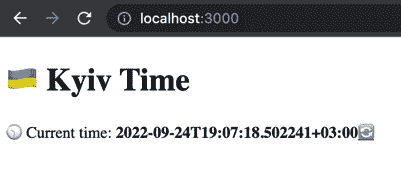
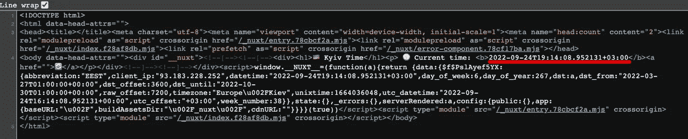
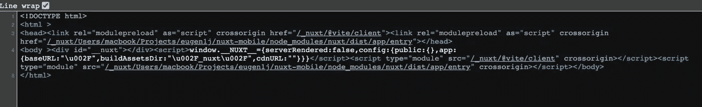
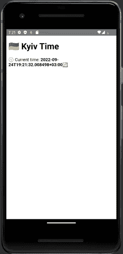

# 如何从相同的代码库构建 SSR web 应用程序和移动应用程序

> 原文：<https://blog.devgenius.io/how-to-build-the-ssr-web-application-and-mobile-apps-from-the-same-code-base-e6480640e8cf?source=collection_archive---------12----------------------->


服务器端呈现提高了初始页面加载速度。浏览器从服务器接收预先呈现的 HTML，因此构建页面花费的时间更少。

此外，SSR 网站与 SEO 配合得更好。搜索引擎爬虫抓取网站的 HTML 内容，而不执行 JS 代码。没有 SSR，搜索引擎将不会索引页面内容，也不会找到内部链接。

NuxtJS 有一个[服务器端渲染](https://nuxtjs.org/docs/concepts/server-side-rendering/)特性:

> *服务器端呈现(SSR)是应用程序通过在服务器上显示网页而不是在浏览器中呈现网页的能力。服务器端将完全呈现的页面发送给客户端。*

但是，当您为移动应用程序构建静态站点时，您不能使用 SSR。在这里，我将展示如何使用 CapacitorJS 和 NuxtJS 从相同的代码库创建一个 SSR web 和跨平台移动应用程序。

# 构建应用程序

例如，我们将构建一个简单的应用程序来显示基辅的当地时间。

为了测试 SSR，我们需要从 API 服务器获取数据。我们将使用 [useFetch](https://v3.nuxtjs.org/getting-started/data-fetching/#usefetch) 方法从[worldtimeapi.org](http://worldtimeapi.org/)API 接收数据。

让我们从[之前指南](https://dev.to/daiquiri_team/how-to-create-android-and-ios-apps-from-the-nuxtjs-application-using-capacitorjs-134h)中的应用开始。

删除`app.vue`文件，添加`pages/index.vue`，内容如下:

这里我们有:

*   在`const timeData`变量中检索当前时间。
*   🕥在页面上显示时间。
*   🔄刷新按钮。

运行`yarn dev`并检查 [http://localhost:3000/](http://localhost:3000/) 我们有什么:



让我们来看看页面源代码:



在 NuxtJS 中，默认情况下启用服务器端呈现。但是如果我们为移动构建创建一个静态站点，我们会得到什么呢？运行`yarn generate && yarn preview`并重新检查 [http://localhost:3000/](http://localhost:3000/) 。

如果你尝试刷新页面，你会发现时间并没有改变。NuxtJS 在静态站点生成期间从服务器检索时间，并将其保存在预先呈现的 HTML 页面中。

让我们给`nuxt.config.ts`加上`ssr: false`

并且用`yarn generate && yarn preview`重建站点。

现在 NuxtJS 在客户端运行 HTTP 请求。页面源中没有日期时间，每次刷新页面时日期时间都会发生变化。



因此，我们必须构建一个带有 SSR 的 web 应用程序和一个纯客户端模式的移动应用程序。让我们使用一个环境标志`MOBILE_BUILD`:我们将用`MOBILE_BUILD=0`构建一个 web 应用程序，用`MOBILE_BUILD=1`构建一个移动应用程序。

您可以使用一个`.env`文件来存储环境变量，我将使用`export MOBILE_BUILD=1`。

变更`nuxt.config.ts`:

运行`yarn generate && yarn preview`并验证应用程序是否在仅客户端模式下工作。

最后，让我们构建并检查 Android 应用程序:

```
yarn cap sync
yarn cap open android
```

在模拟器上运行应用程序，并检查刷新按钮是否有效。



🎉祝贺你，它工作了(至少在我的笔记本电脑上)🙂).