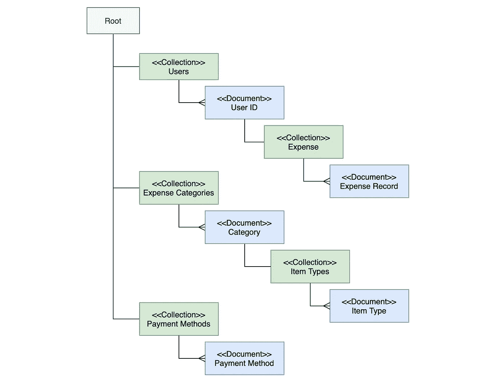

# 如何使用 Firebase 数据库构建应用程序

> 原文：<https://blog.devgenius.io/how-to-build-your-app-with-cloud-based-database-using-firebase-5e458aeaeb07?source=collection_archive---------0----------------------->

## 权威指南

## 轻松的云后端应用开发


拉蒙·萨利内罗在 [Unsplash](https://unsplash.com?utm_source=medium&utm_medium=referral) 上的照片

许多雄心勃勃的应用程序开发人员的梦想是实现他们的创新想法，而不打扰周围的技术东西。实际上，为应用程序开发设置数据存储可能会很麻烦，提供后端数据库、编写数据库模式脚本和 SQL 查询等任务需要付出巨大的努力。

好消息是，Firebase 等基于云的服务的出现，让我们只需几个函数调用就可以轻松地将应用程序数据放在云上。在本文中，我将分享如何使用 Firebase 数据存储以及如何与 app 集成。在分享的同时，我将用一个例子来说明这个想法，展示我如何将我的应用程序从 SQLite 本地数据库转换为云平台上的 Firebase 数据存储。

> 这是我分享如何利用 Firebase 服务进行应用程序开发的第二部分。你可以参考我之前的文章《[Firebase——快速跟踪你的应用](https://medium.com/dev-genius/firebase-the-way-to-fast-track-authentication-implementation-of-your-app-2e93f42002b)认证实现的方法》，该文章提供了使用 **Firebase 认证服务**实现签到和社交登录的分步指南。

# 什么是 Firebase 数据库？

Firebase 提供了广泛的基础架构组件，极大地加快了应用程序的开发速度，因为开发人员可以更专注于 UI 和功能开发，而花更少的时间来处理身份验证、安全控制以及存储等标准功能。

Firebase 数据库是一个 JSON 格式的基于文档的数据库，由 javascript 提供本地支持。它对开发者友好的 SDK 只需要几行函数调用就可以大大简化应用集成。由于底层云基础设施由谷歌云平台提供支持，它提供了企业级服务级别—高可用性和自动容量扩展。

Firebase 数据库有两个选项— **实时数据库**和**云 Firestore** 。总的来说， **Firestore** 适用于大多数用途，因为它提供了高级功能，而实时数据库是专门需要访问低级 API 的应用程序的后端数据库。您可以填写此 [**调查**](https://firebase.google.com/docs/database/rtdb-vs-firestore) ，这将帮助您决定哪一个适合您的使用情形。

在本文中，我将通过例子来演示 Firestore 的详细实现。

# Firebase 数据库设置

首先，让我们采取一些步骤来设置 Firebase 数据库。首先，如果你没有的话，你需要在 Firebase 控制台中创建一个项目。然后，只需点击“创建数据库”按钮来激活 Firebase 控制台中的服务。Firebase 为每个项目免费提供一个数据库，数据大小限制为 1GB，每日读取量为 50k，写入量为 20k，删除量为 20k。这种免费层产品足以让开发人员启动他们的计划，而无需为基础设施服务付费。


Firebase —数据库创建

接下来，您可以选择数据库的数据中心位置。除非您有任何特定要求，否则默认选项是选择多区域数据中心，以最大限度地提高数据库的可用性和持久性，因为您的数据将被复制到不同区域的数据中心。请注意这一点，因为在数据库创建后，您不能更改数据中心。


Firebase 数据库—数据中心选择

现在一切都设置好了，数据库可以使用了！接下来，让我们看看数据模式的设置。

# Firestore 数据结构

Firestore 基本上是一个基于文档的数据库，它允许我们在一个集合中存储一大堆记录，每个记录可以有不同的属性集。与传统的关系数据库不同，数据模式应该是固定的和定义良好的。因此，如果您习惯于在关系数据库上工作，那么您可能需要调整心态，将数据视为文档，而不是表簇和它们之间的关系。

Firestore 由文档集合组成。存储在每个文档中的数据是键值对。此外，它支持嵌套结构，这样我们可以在每个文档中存储文档集合。下图说明了数据结构的样子:


Firebase 数据存储结构

## 示例应用程序—费用追踪应用程序

以我的费用追踪器应用为例，这个应用是为了记录我的日常费用。我最初使用 SQLite 数据库作为后端数据存储来构建这个应用程序，实体关系图如下:


费用跟踪应用程序—原始数据库模式

数据结构简单明了，每条费用记录都与费用类别和支付方式相关联。费用记录中的付款方式 ID 和类别 ID 是查找付款方式和类别详细信息的外键。有趣的是，费用类别与其自身具有父子关系，这意味着类别可能有自己的子类别。例如，我可以定义费用类别——“个人”和“家庭”。“家庭”有子类别，如“账单”、“住房”、“交通”等。而“个人”具有诸如“早餐”、“午餐”等子类别。

我定义了 3 个文档集合来将关系数据库表转换为 Firestore，如下图所示:

*   **用户&费用** —这是一个很棒的增值功能，可以按用户分离费用记录，以支持多个用户。每个用户都有自己的费用记录集合。由于基于云的数据存储的能力，这个特性是可行的。
*   **费用类别** —嵌套的单据结构中保持原有的上下级关系。
*   **付款方式** —直接将付款方式表移动为单据集合。



费用跟踪应用程序 Firebase 数据存储上的数据模式

## Firebase 数据查看器

我们可以在 Firebase 控制台中查看和维护数据。这是一个便于开发和维护的特性。


Firebase 数据存储—用户配置文件

我们可以进一步浏览嵌套的文档结构。例如，查看特定用户下的费用记录。费用记录 ID 是基于 UUIDv4 的随机代码。当然，只有经过授权的人才能访问生产中的 Firebase 控制台。


# 数据安全控制

为了确保所有数据访问都经过身份验证和授权，数据访问控制非常重要。传统数据库的实现通常由应用逻辑负责。因此，数据访问控制被合并到应用程序逻辑的一部分。然而，应用程序逻辑是复杂的，不知何故，应用程序逻辑中的缺陷可能会导致允许未经授权的数据访问的漏洞。

## 安全规则

不用担心，Firebase 通过将安全规则从应用程序逻辑中分离出来，解决了这个问题并简化了安全控制。我们可以在 Firestore 上定义一套独立的安全规则来限制数据访问。数据访问控制的分离对于应用程序开发和持续维护是有价值和有益的，因为开发人员可以将安全规则作为独立的组件进行测试和开发。应用逻辑的发展不再影响数据安全控制。


在实施 Firestore 之前


Firestore 实施后

安全规则采用声明式定义的形式，易于理解，Firebase 也为开发人员建立规则提供了一个用户友好的控制台。以费用追踪应用程序的安全规则为例:

*   允许经过身份验证的用户只读访问费用类别和付款方式

```
**allow read :** if request.auth != null
```

*   经过身份验证的用户可以像他们的电子邮件地址(即用户 ID)一样对集合下他们自己的费用记录进行读/写访问

```
**allow read, write :** 
if request.auth != null 
&& request.auth.token.email == userId
```

以下是一整套安全规则:

Firestore 安全规则

用户应在访问任何应用程序数据之前登录。您可以通过使用 Firebase 身份验证服务在您的应用程序上启用身份验证功能。关于 Firebase 认证服务，请参考这篇[文章](https://medium.com/dev-genius/firebase-the-way-to-fast-track-authentication-implementation-of-your-app-2e93f42002b)。

## 安全规则开发工具

您可以在您喜欢的编辑器上开发安全规则，因为它们是基于文本的内容。此外，Firebase 控制台为开发人员提供了用户友好的 UI 界面来测试和排除安全规则故障。在复杂的安全规则的情况下，您可以在您的 PC 上设置本地环境来验证规则。


# 应用集成

最后，是时候将应用程序和后端数据库粘合在一起了。由于开发人员友好的 SDK，访问 Firebase 数据库非常简单。同样，我将通过我的费用跟踪器应用程序的示例源代码来说明如何初始化 Firestore 对象，运行标准查询，保存和删除费用。

## 初始化

我有一个服务组件 **ExpenseService** 负责底层数据库的数据访问。首先，Expense Service 要用 JSON 配置(firebase-api.json)初始化 Firebase service，可以从 Firebase 控制台生成。就是让 Firebase SDK 知道所有后续的函数调用都会连接到我们的 Firebase 项目。

Firebase SDK 初始化

## 按日期范围检索费用记录

要让费用跟踪应用程序显示当前用户在特定时间段内的费用记录列表，我们首先要指向我们的目标单据集合，并定义查询条件。在这种情况下，我们可以遵循应用程序数据层次结构:集合(用户)→文档(用户 ID) →集合(费用)。下面是函数调用:

```
collection("users")
.doc(loginId)
.collection("expenses")
```

Firebase 执行安全规则来验证后端的数据访问，因此，如果访问不满足安全规则的要求，Firebase 函数调用将抛出异常错误并拒绝访问。

Firestore 上的数据查询非常类似于 SQL。使用 ***定义标准，其中()*** 使用 ***orderBy()* 进行排序。**我们可以定义多个条件的复合查询。要按升序检索日期范围内具有日期属性的费用记录列表，下面是函数调用:

```
where("date", ">=", fromDate)
.where("date", "<=", toDate)
.orderBy("date")
```

将所有东西放在一起:

Firestore —数据检索

## 保存/删除费用记录

类似于查询功能，SDK 需要知道目标集合和文档。然后，分别调用 ***set()*** 和 ***delete()*** 就可以简单地完成保存和删除费用记录的操作。

Firestore —保存/删除

# 最终想法

无论是简单还是复杂的用例，持久数据存储都是应用程序开发的重要组成部分。后端数据库的传统实现涉及数据库供应、SQL 开发、REST API 构建以及应用程序集成。Firebase 数据库为开发人员提供了一种快速的方式来立即启用后端数据存储，其基于云的平台允许快速提供服务，其基于 web 的控制台对开发人员来说非常友好，可以设置数据结构和安全规则。一旦数据库准备就绪，开发人员可以立即进行应用功能开发，而无需开发后端 SQL 查询和 REST API。