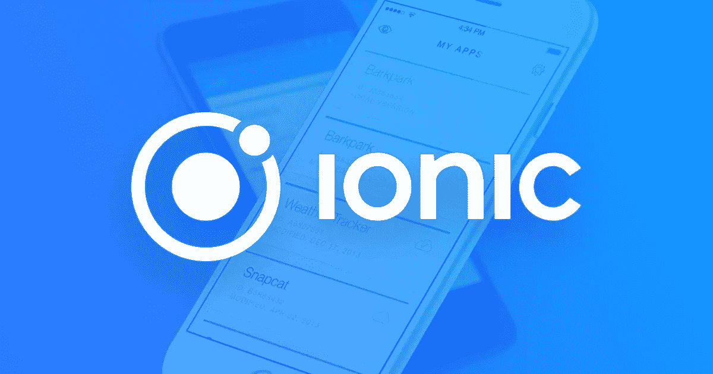
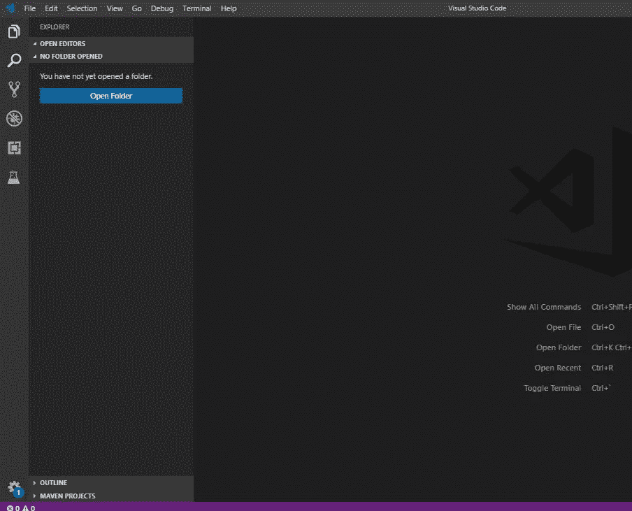
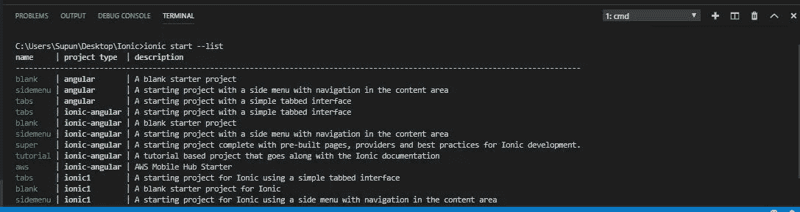
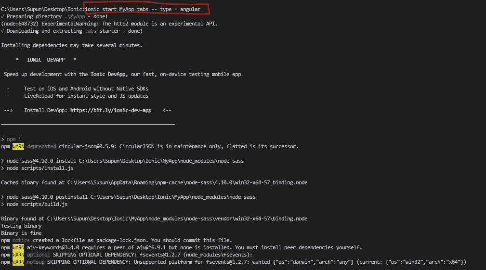
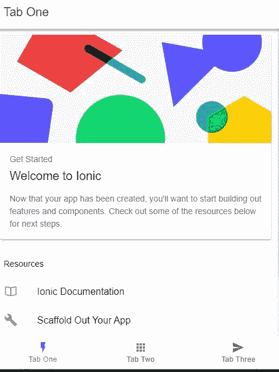

# 如何构建您的第一个 Ionic 项目

> 原文：<https://blog.devgenius.io/how-to-build-your-first-ionic-project-ccbaeaec9d5e?source=collection_archive---------2----------------------->

H 我，今天我要教你如何开始你的第一个离子项目。所以让我们开始吧。离子框架是什么？Ionic 是一个开源框架，可用于开发混合移动应用。混合移动应用程序是我们可以用来开发移动应用程序的一种方法(关于移动应用程序开发方法的单独文章将在后面发表)。



Ionic 框架的特点是，您可以在 Ionic 开发过程中使用许多第三方库。此外，Ionic 还支持 Angular 框架(这是大多数前端开发人员的❤)。仅供参考，目前最新发布的离子是离子版本 4。

我希望上面的介绍给了足够的关于**什么是离子**和**使用离子的基本目的是什么的知识。**

让我们开始建立我们的第一个离子项目。

1.  首先，您需要安装与 NPM 捆绑在一起的节点。这是节点[https://nodejs.org/en/download/](https://nodejs.org/en/download/)的下载链接。我的推荐是下载 **TLS 版本**。安装节点后，检查节点版本和 npm 版本。`**$ node --version**
    **$ npm --version**`
2.  然后我们必须在你的电脑里安装 Ionic 框架。为了在您的计算机上安装 ionic，请使用此命令。您可以使用您的 CLI(命令行界面)例如:CMD for windows

`**$ npm install -g ionic**`

3.打开 Visual Studio 代码或任何 IDE(您喜欢的集成开发环境)。请创建一个文件夹来创建项目。桌面或任何你喜欢的地方。然后使用 Visual Studio 代码打开该文件夹。然后使用 **( CTRL + SHIFT + ~)键导航到 Visual Studio 代码的 CLI。**



Visual Studio 代码开发接口

4.现在我们已经准备好创建第一个项目了。在创建第一个项目之前，你可能需要知道一些东西。有一个**模板列表**可用于创建您的第一个项目。您可以创建一个空白项目，也可以从列表中选择一个模板。使用此命令检查可用的模板

```
$ ionic start --list
```



可用离子模板列表

在这里，我将使用模板**选项卡**创建一个角度型离子项目。使用此命令创建项目。

**离子启动 MyApp tab--type = angular。**

好了，现在， **MyApp** 是应用程序的名称，您可以使用您选择的任何名称。你可以给任何你想要的名字。然后**标签**是模板名称，使用 **— -type = angular** 创建模板的角度版本。



创建项目

那么很可能会提示您一条名为。**“安装免费的 Ionic App flow SDK，连接你的 App？(是/否)”。**通常我会继续回答**否**如果你回答是，你的应用将被添加到 App flow SDK ( **这是一个你可以定制所有 ionic 应用**的地方，稍后将在另一篇文章中讨论。现在您已经完全完成了项目的创建。让我们运行这个项目。使用此命令运行项目。

一旦你创建了项目，你应该在**应用程序目录**中，否则你不能运行项目。所以要改变目录使用。 **CD MyApp。MyApp** 是您的项目文件夹名称。现在输入**离子发球。**它将运行项目，您将在默认浏览器中打开一个**选项卡。**



应用视图

默认的离子端口是 [http://localhost:8100/](http://localhost:8100/tabs/tab1)

此外，您可以使用命令 **Ionic lab，**运行该项目，这将为您提供 Android 和 iPhone 本地应用程序视图。

**敬请期待下一章关于爱奥尼亚的项目结构！！！再见了。**