# 如何用 Express JS 构建你的第一个 NodeJS 项目？

> 原文：<https://blog.devgenius.io/how-to-build-your-first-nodejs-project-with-express-js-21d5ebb545?source=collection_archive---------2----------------------->

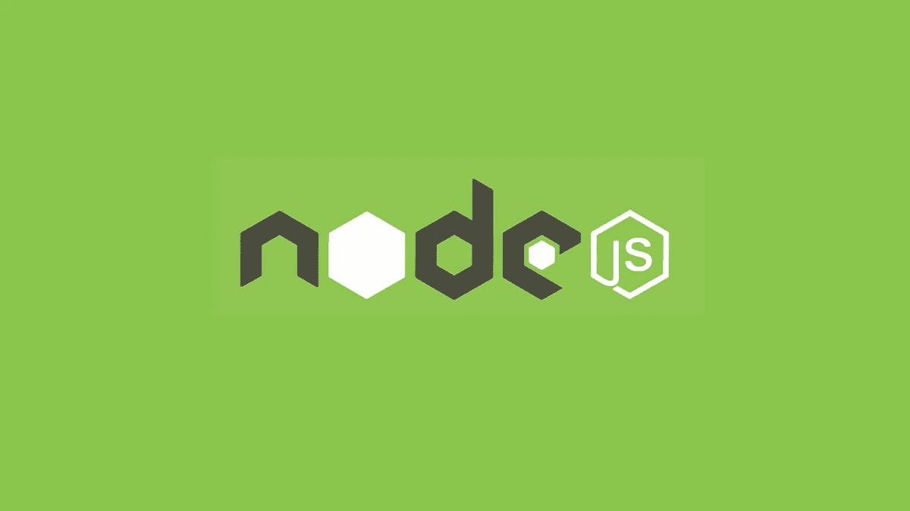

在本文中，我们将讨论如何使用 Node JS with Express 创建一个项目并配置服务器端。

## **什么是 Node JS？**

Node JS 是世界上最流行的软件开发工具之一。它是由瑞安·达尔在 2009 年开发的。它是一个基于 JavaScript 的服务器端脚本框架。Node JS 是一个开源、跨平台、后端的 JavaScript 运行时环境。它运行在 V8 引擎(Chrome 的 JavaScript 引擎)上。Node JS 可以在 MS Windows、Mac OS 和基于 Linux 的操作系统中使用。

## Node.js 的特性

这项技术可以用于创建实时 web 应用程序。事件驱动和非阻塞 I/O 模型概念有助于使 Node JS 轻量级和高效。该版本基于 Chrome 的 V8 JavaScript 引擎，Node JS 运行速度更快。Node JS 是一个单线程应用程序。可以轻松地进行水平和垂直缩放。通过在第一次使用后将模块缓存到内存中，性能得到了提高。

**节点 JS 的用例**

Node JS 非常适合开发 IO 绑定的应用程序。但是对于 CPU 密集型的重计算应用程序来说并不好。

> I/O 绑定的应用程序。
> 
> 数据流应用。
> 
> 基于 JSON APIs 的应用程序。
> 
> 数据密集型实时应用。
> 
> 单页应用程序。

**一些大公司使用 Node JS**

*网飞*

*PayPal*

*优步*

*易贝*

*中等*

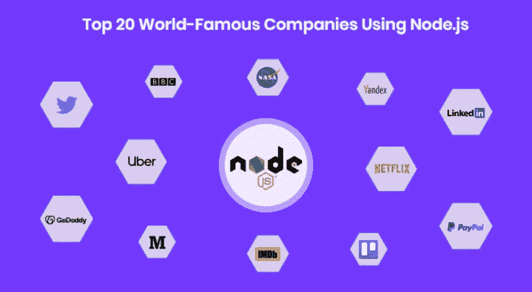

# 构建您的第一个应用程序！！

**创建开发环境**

首先，你需要下载节点到 PC。可以从 node 官方网站下载，轻松安装到 PC 上。它还安装 npm(节点程序包管理器)。该 npm 是世界上最大的软件注册帮助充分的发展。此外，纱是另一个受欢迎的包管理器。你可以从下面的链接下载 Node。

 [## 节点. js

### Node.js 是基于 Chrome 的 V8 JavaScript 引擎构建的 JavaScript 运行时。

nodejs.org](https://nodejs.org/en/) 

安装节点后，您可以检查是否在您的 PC 上正确安装。打开 cmd 并键入以下命令。

> 节点 v

如果您正确安装了节点，它会给出您当前安装的节点版本。如果您键入以下命令，您可以看到您的 PC 上安装的 npm 版本。

> npm -v

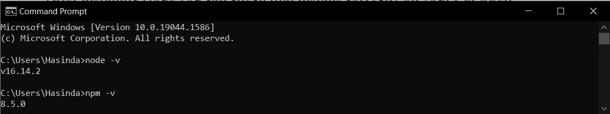

接下来，您需要 IDE 或代码编辑器来开发您的节点项目。您可以使用像 WebStrom 这样的 IDE，也可以使用 Visual Studio 代码编辑器来开发您的项目。VS Code 是世界上最流行的代码编辑器。这是一个轻量级的软件，很容易管理我们的项目。你可以从链接下载。

 [## Visual Studio 代码-代码编辑。重新定义的

### Visual Studio Code 是一个重新定义和优化的代码编辑器，用于构建和调试现代 web 和云…

code.visualstudio.com](https://code.visualstudio.com/) 

**开始构建您的项目**

您可以创建一个文件夹来开发项目。我将这个文件夹命名为 myFirstApp。接下来，您需要从 VS 代码中打开该目录。之后，你需要打开一个新的终端。您可以在菜单栏中看到终端，单击它并在下拉菜单中选择新终端。现在，您可以在终端中键入 init 命令。

> npm 初始化

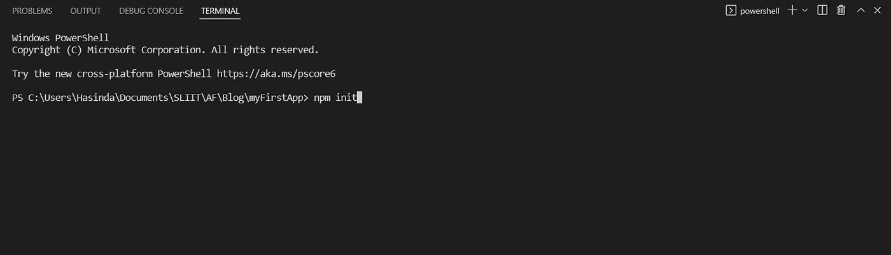

它会询问一些关于您的项目的信息。作者姓名，项目描述，将要使用的许可证，git 库之类的信息。您可以通过按 enter 键来设置默认值。正如您在 myFirstApp 文件夹中看到的，创建了一个名为 package.json 的新文件。

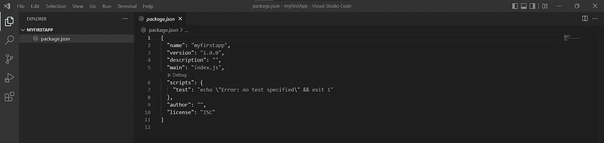

“main”是您运行应用程序时的入口点。默认情况下，它输入一个名为“index.js”的文件。可以改成“server.js”

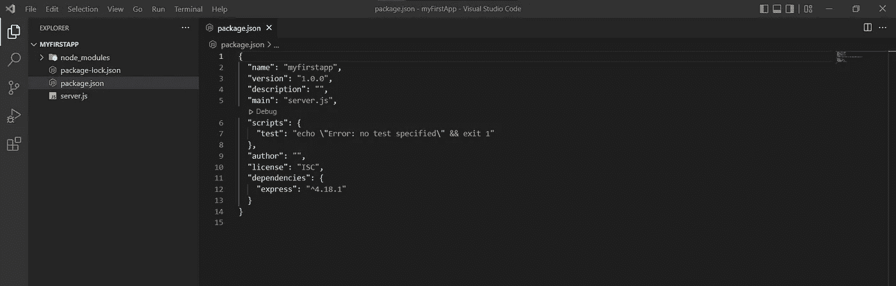

接下来，我们需要安装一个名为 Express.js 的依赖项，它是 NodeJS 的后端 web 应用框架。对于开发 web 应用和 API 很有帮助。Express JS 为开发提供了有用的特性。您可以通过在终端中键入以下命令来安装 Express。

> npm 快速安装

更多信息-->

 [## 表达

### 快速、非个人化、极简的节点 web 框架。这是一个 Node.js 模块，可通过 npm 注册表获得…

www.npmjs.com](https://www.npmjs.com/package/express) 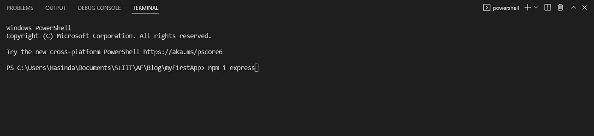

安装 Express 后，您可以在 packahe.json 中看到一个名为“dependencies”的新元素。在其中，您可以看到已安装的依赖项及其版本。

接下来，我们需要创建一个名为“server.js”的文件来编写服务器端的实现。您可以在 myFirstApp 目录中创建这个文件。现在你的文件结构如下。

> *|_ myFirstApp*
> 
> *|_ 节点 _ 模块*
> 
> *|_ package-lock.json*
> 
> *|_ package.json*

在“server.js”文件中，您需要实现如下示例所示的代码。

> const express = require(" express ")；
> 
> var app = express()；
> 
> app.listen(5000，function () {
> 
> console.log("在端口%d 上启动的应用程序"，5000)；
> 
> });

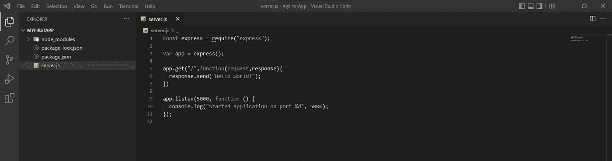

现在您可以运行您的项目了。您可以在终端中键入以下命令。

> node server.js

现在你可以看到你的程序正在成功运行。

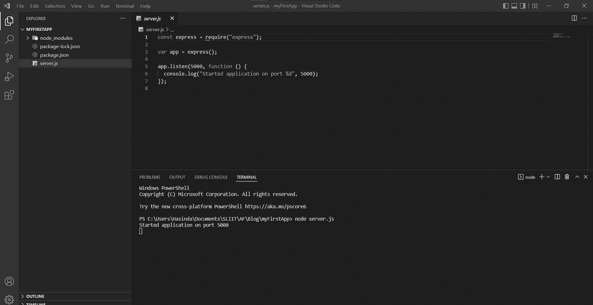

您可以使用“npm start”启动程序。为此，您需要在“package.json”中做一点小小的修改。您需要添加以下脚本元素。

> " start": "node server.js "

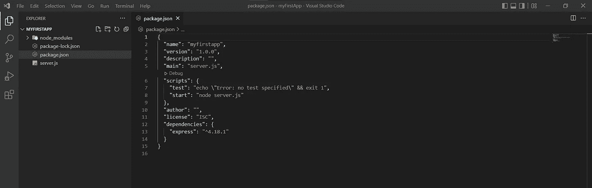

然后在终端发出“npm start”命令。你可以看到你的程序正确运行。

> npm 开始

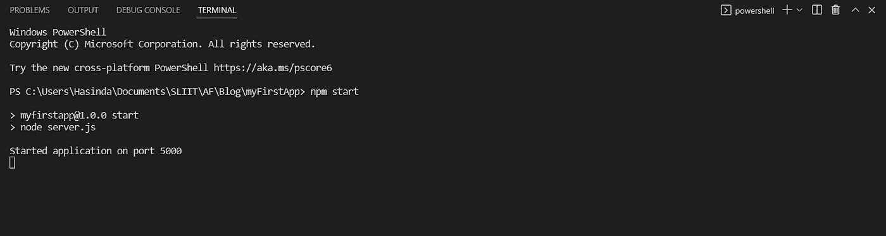

我们的应用程序运行在端口 5000 上。如果你在浏览器中调用 [http://localhost:5000/](http://localhost:5000/) ，你会看到“Hello World！”。

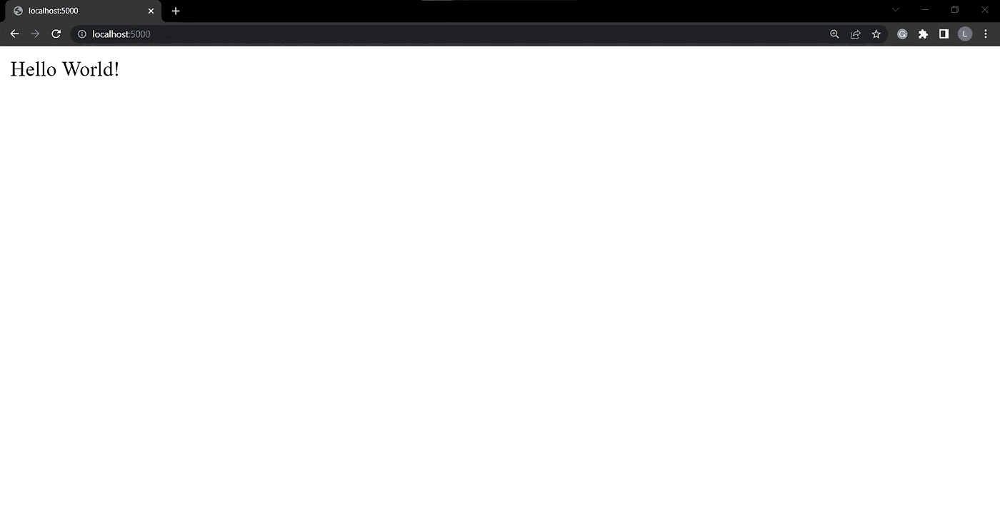

**恭喜恭喜！**

我认为您成功地构建了您的 Node JS 应用程序。这是一个非常简单的问题。如果你要开发一个应用程序，你需要添加更多的依赖项来完成你的工作。我们需要连接前端和后端。因此，我们需要通过添加更多的工具来设置我们的程序。

接下来，我们将讨论这些事情。如何开发 REST API，如何连接前端和后端之类的东西。

另一篇文章再见。

谢谢大家！