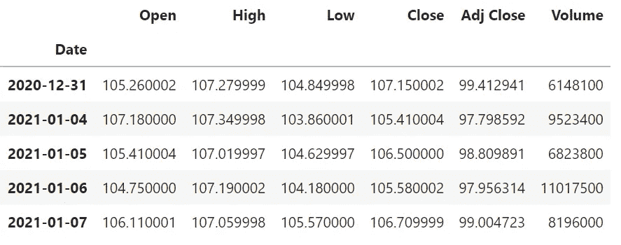
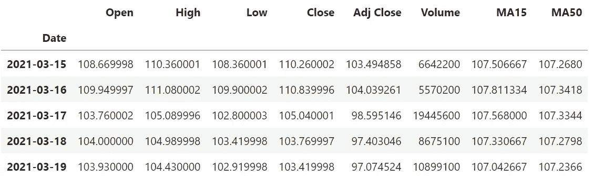
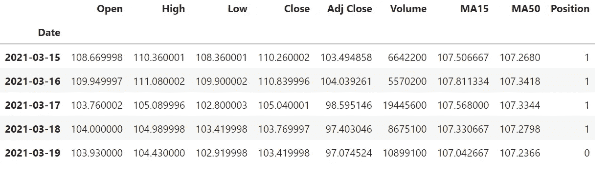
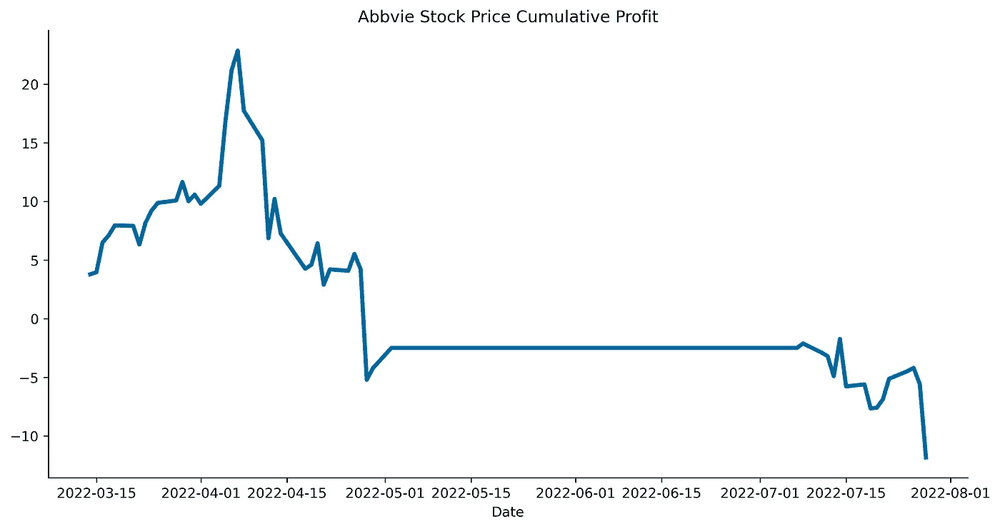

# 如何用 Python 建立你的第一个股票交易策略

> 原文：<https://blog.devgenius.io/how-to-build-your-first-stock-trading-strategy-in-python-d96b45e98aa2?source=collection_archive---------2----------------------->

## 好消息是它很容易实现。但是效果好吗？

里克·j·布朗在 [Unsplash](https://unsplash.com/s/photos/strategy?utm_source=unsplash&utm_medium=referral&utm_content=creditCopyText) 上的照片

是时候给你的股市分析工具箱增加一个新的项目了。

我们将使用**趋势交易**策略。它假设股票的价格将继续朝着与当前趋势相同的方向移动。

> 它的目标是通过分析资产在特定方向的动量来获取收益。

当价格向一个特定的方向移动，比如向上或向下，这被称为趋势。

这一战略使用不同的指标。我们今天将关注移动平均线。

***免责声明*** *:本帖仅为教育目的而写。没有任何股票的投资建议或推广。*

## 内容

1.  [导入库并检索库存数据](https://medium.com/p/d96b45e98aa2#41c8)
2.  [使用简单移动平均线(SMA)创建快慢信号](https://medium.com/p/d96b45e98aa2#975d)
3.  [如何生成多头头寸](https://medium.com/p/d96b45e98aa2#07c8)
4.  [计算并可视化累计利润](https://medium.com/p/d96b45e98aa2#1863)
5.  [结论](https://medium.com/p/d96b45e98aa2#d37f)

## 1.导入库和检索库存数据

我们首先导入我们需要的库。

然后，我们使用 yahoo finance (yfinance)通过输入相应的股票代码和选择的时间段来检索股票数据。在本帖中，我们将关注股票代码为“abbv”的艾伯维公司。

## 2.使用简单移动平均线(SMA)创建快速和慢速信号

下面是 Investopedia 的定义:

> 简单移动平均线(SMA)是一种计算方法，采用过去特定天数内一组给定价格的算术平均值；例如，过去 15 天、30 天、100 天或 200 天。投资媒体

幸运的是，这在 Python 中用 rolling()方法很容易计算。

让我们产生两个信号:

*   使用最近 15 天的股票价格的 SMA 的快速信号
*   使用最近 50 天的股票价格的 SMA 的慢速信号

带有两个新信号列的数据框

## 3.如何生成多头头寸

当购买资产时，希望其价值会上升，这被称为做多或看涨。

> 每当 MA-15 > MA-50 时，就会触发多头头寸:我们买入并持有一部分股票。

由于股价的移动平均线在最近 15 天内较高，因此显示出积极的趋势。

上面的代码设置了关于我们的 2 个信号的条件。当 MA15 >MA-50 时，np.select 将设置值 1，否则为 0。

“位置”列已创建

## 4.计算并绘制累计利润

让我们检查结果，看看它在所选期间的表现如何。

我们将首先计算我们的多头头寸每天产生的利润。日利润等于第二天的收盘价减去当天的收盘价。

然后，我们将使用 cumsum()方法计算这些天的累计利润。

让我们最后用 Matplotlib 绘制结果。

我们预计利润会持续到 5 月份左右，然后会有负面影响。我选择这只股票是为了说明这种交易策略的局限性。在投资之前，你需要做大量的研究。

## **5。结论**

这种趋势交易策略很容易实施。这是一个很好的机会来更新关键概念，如移动平均线，快速/慢速信号，多头头寸和每日/累计利润。

这种策略不足以在证券交易所单独使用，需要额外的投入。但是了解它的工作原理是很有趣的。

我希望你喜欢阅读这篇文章！未来的文章请关注我。它激励我继续下去。

 [## 通过我的推荐链接加入 Medium-Khuong LAN Cao Thai

### 阅读 Khuong lán Cao Thai(以及媒体上成千上万的其他作家)的每一个故事。您的会员费直接…

medium.com](https://medium.com/@Eyquem/membership) 

参考资料:

【investopedia.com 趋势交易定义

【investopedia.com】移动平均线(MA)定义

[用 Python 构建简单的交易策略—趋势跟踪|作者:Bee Guan Teo |金融编码手册| Medium](https://medium.com/the-handbook-of-coding-in-finance/building-a-simple-trading-strategy-in-python-trend-following-727cafecb78c)