# 如何在一天内建立你的免费网站

> 原文：<https://blog.devgenius.io/how-to-build-your-free-website-in-one-day-dc1bd4e91bf9?source=collection_archive---------7----------------------->


伊利亚·巴甫洛夫在 [Unsplash](https://unsplash.com?utm_source=medium&utm_medium=referral) 上的照片

世界每天都在变得更加社会一体化。社交媒体、论坛、网站等等，都是现代商业工具。网上的人比你在当地城镇能找到的人数还要多，所以只要想想你如何利用网上互动来推销你自己或你的企业。社交媒体、论坛、网站等等，都是现代商业工具。一个企业(或者像我这样的自由职业者)很重要的一部分就是它的网站。你的网站是你的虚拟面孔或你的组织的面孔。

今天，有几种网络服务可以让你不用代码就能建立自己的网站。两个主要的例子是 Wix 或 WordPress。然而，对于一些人(比如我)来说，这种方法很无聊，并且不能提供必要的个性化和自由。另一个选择是从头开始建立你的网站，包括设计。然而，这第二个选择是太费力，在一天内完成，特别是如果你没有 UX 设计知识和经验，并希望超过一页。最好的选择在中间。

在这篇文章中，我将指导你如何从一个免费的 HTML 和 CSS 模板构建你的网站，并在 GitHub 上托管网站。这些选项绝对永远免费，并且只需要你一点技术知识(只需要一点 HTML)。在我们开始之前，请确保您的机器上安装了 GitHub 帐户和 VSCode 或任何其他代码编辑器。我们开始吧！

## 1.选择 HTML+CSS 模板

你可以在网上找到免费的 HTML+CSS 模板。我的建议是 [HTML5 UP](https://html5up.net) 在那里你可以找到响应式的模板，并根据你的需求完全修改它们。所有的修改都是允许的，但是，你应该始终注明作者，并在每一页的末尾保留这一部分(只是不要接触 HTML“代码”)。

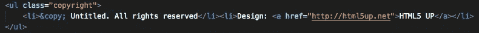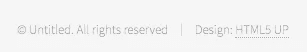

出于本文的目的，我选择“幻影”模板。您可以选择您喜欢的任何其他模板。我们将建立一个自由职业者的个人网站。现在你可以去[https://html5up.net](https://html5up.net)，选择你的模板，下载并解压。

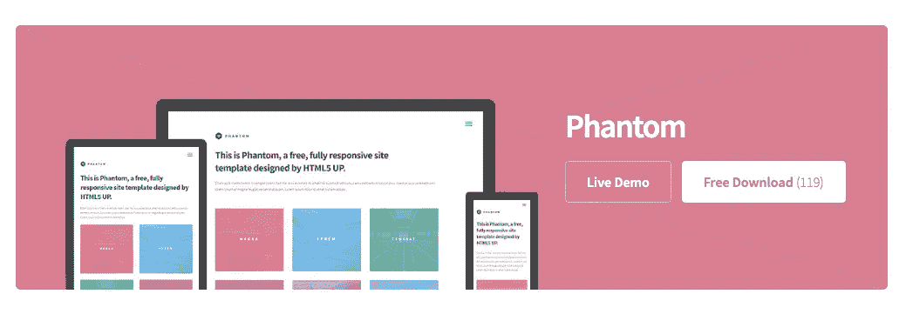

## 2.在您的机器上创建一个目录

这一步不是强制性的，因为您可以将以前的文件保存在您的下载目录中，但是建议您创建一个目录并用您的网站名称命名它。我将把它命名为**免费网站**，并在我工作的时候把它放在我的桌面上。稍后我可以将它移动到我的云中。

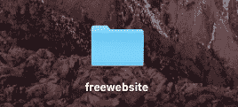

## 3.在 GitHub 上创建一个资源库

如果您还没有 GitHub 帐户，现在是时候创建一个了。你可以注册一个谷歌账户。从你的初始页面，进入**仓库**，点击**新建**。

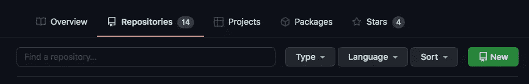

现在，用您的用户名命名您的新存储库是非常重要的。例如，我的用户名是 **boostmybusiness** ，所以我的存储库将被命名为**boostmybusiness . github . io**。

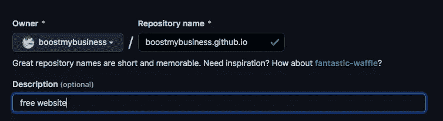

接下来是时候上传一些文件到你的仓库，检查它是否正常工作。您将选择**上传现有文件**，然后上传您的免费网站目录中的文件。不要忘记上传**图片**和**资产**文件夹，你可能需要在你的 GitHub 库上创建这个文件夹，然后从你的机器上传内容，或者你可以拖放。

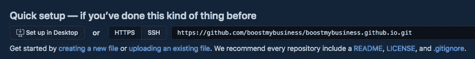

每次你添加一个新的文件到你的目录，不要忘记在页面的最后**提交修改**。

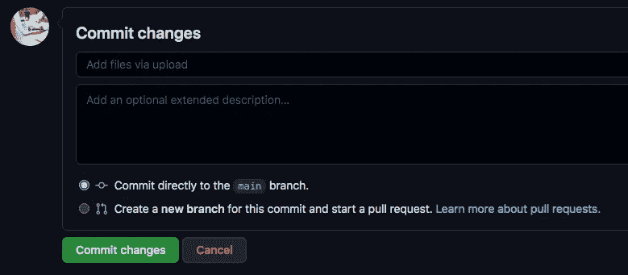

现在让我们第一次启动我们的网站，并检查它是否正常工作。只需在你的网络浏览器上写下[https://**boost mybusiness**. github . io](https://boostmybusiness.github.io)，你就有了自己的网站(用你的用户名更改 **boostmybusiness** )。

## 4.开始编辑 index.html

目前我们的网站只是一个托管在 GitHub 上的模板，所以我们需要个性化它。我将使用 VSCode，因为它是我首选的代码编辑器，但是您也可以使用您想要的编辑器。用您的代码编辑器打开您的**index.html**文件，并在您的 web 浏览器中打开同一个文件。

从**头**段开始，这里唯一需要改动的就是**头<头>头**头。标题定义了 web 浏览器选项卡上显示的文本。我们需要更改标题，这里我将使用:

```
<title>Boost my Business</title>
```

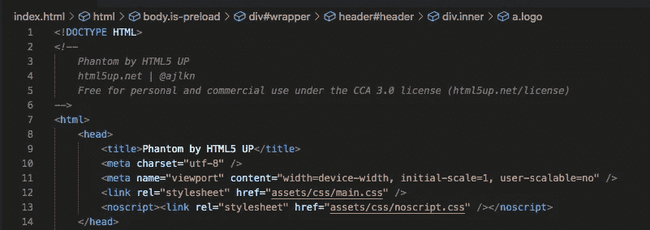

现在保存更改并刷新您的 web 浏览器以查看差异。

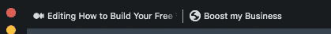

回到我们的代码编辑器，我们需要更改其他部分来使我们的网站个性化。我们可以更改主体部分的标题，也可以更改标题部分。在这一部分介绍你或你的企业是一个很好的做法。

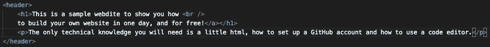

下一部分是类名块。在瓷砖区，我们可以向潜在客户和业务合作伙伴展示我们的服务。我选择的模板有十二个图块，但是这个数字可以根据我们的需要增加或减少。我会减少它，只用六块瓷砖。为此，我将注释包含最后六个图块的代码，这样它就不会被 web 浏览器读取。

要注释您使用的 HTML 代码:

```
<p>this section is not commented and will be read by the web browser</p>**<!--** <p>this section is commented and will not be read by the web browser</p> **-->**<p>this section is not commented and will be read by the web browser</p>
```

您还可以看到编辑器中注释代码的颜色会发生变化:

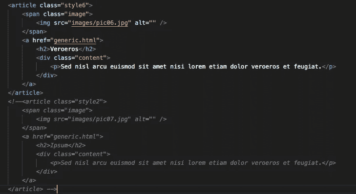

现在，您可以更改

## 标题和类别“内容”,以包含您或您的企业提供的服务的标题和简要描述。我已经做过了，最后的结果会是这样的:

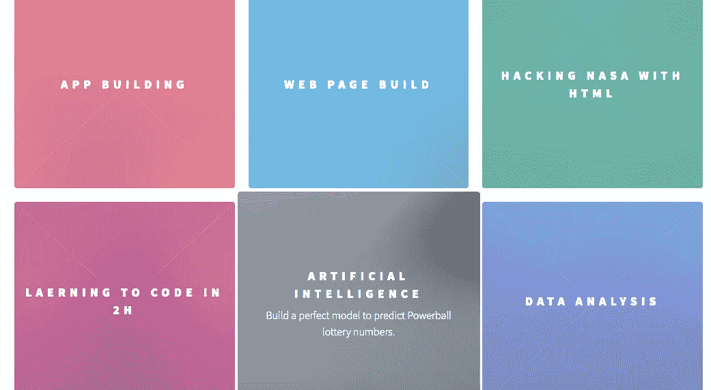

现在让我们只关注其中一个瓷砖。如果我们点击这个图标，浏览器将会打开一个名为 generic.html 的新页面。这个 generic.html 可以被改变来建立新的页面，更好地和仔细地描述每一个服务。

以应用程序构建为例，我们将创建 generic.html 文件的副本，并将其命名为 appbuilding.html。打开它，将 **<头>** 节中的 **<标题>** 改为 APP BUILDING，这样这个名字就会显示在 we 浏览器中。回到 index.html 和 App Building tile，就在**<H2>App build</H2>**之前，将 **href** 更改为**href = " App Building . html "**。保存您的更改。现在，当您单击应用程序构建切片时，您的 web 浏览器会将您带到一个新页面，在该页面上可以更好地描述此服务。选项卡标题将是应用程序建设，而不是通用的。

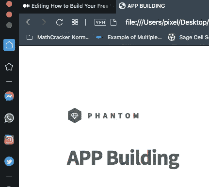

现在，您可以通过更改**内部类**中的段落来个性化该页面，并对磁贴和相关服务重复该过程。

## 4.选择您的图像

也许你选择的模板已经包含了图片，也许没有，或者你想改变它们。我将使用 freepik.com 的免费图像更改 index.html 文件中的图块**应用程序建筑**的图像。下载完我选择的图片后，我会将其重命名为 appbuilding，并将其复制到免费网站文件夹中的 images 文件夹中。您需要允许图像扩展可见。现在，在你的**图像类**中，将 **src** 改为**src = " images/app building . jpg "**。保存更改并更新您的浏览器以查看差异。

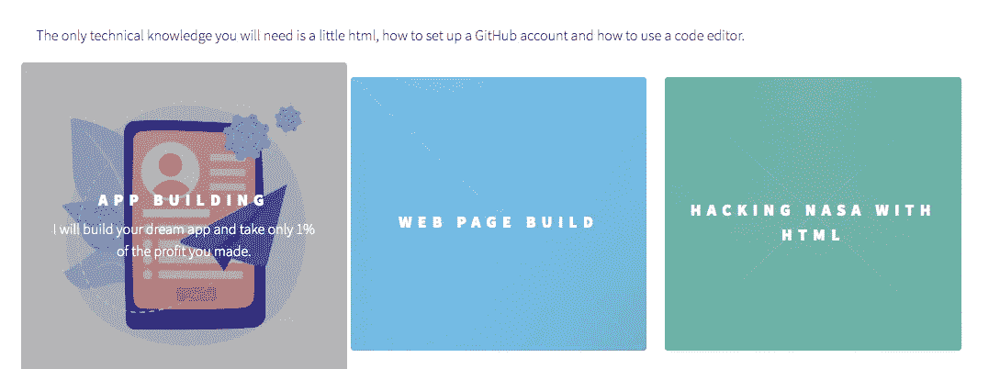

我们也可以改变 appbuilding.html 页面上的图像。在**内部类**中你会发现**图像主类**。这就是你想要改变的形象。我已经下载了一个免费的图片，命名为 appbuilding2.jpg，并转移到图片文件夹。您可以在下面看到更新后的代码，然后对其他图块进行同样的操作。

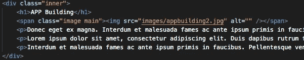

## 5.菜单部分

到现在为止，你一定已经注意到在你网站的右上方有一个菜单。如果你想在你的网站上有一个，我会教你如何配置它。回到我们的**index.html**文件，你会发现一个**菜单 ID** 。您可以更改显示在菜单栏中的 **href** 和名称。我的例子如下。

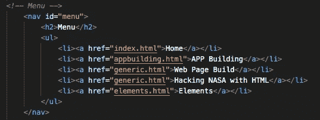

请注意，菜单是在一个未排序的列表**<ul></ul>**下组织的，每个项目都在 **<【李】>** 项目**</李>** 内。你将需要改变你的网站的每一页的菜单部分。您不需要手动操作，您可以将代码部分复制并粘贴到其他 html 文件中。

## 6.链接社交媒体账户

社交媒体账户是你在线展示的基础，因此将你的网站与 LinkdIn、Instagram、Twitter 或其他社交媒体链接起来是很重要的。你会在你的**index.html**文件的末尾找到一个图标类。

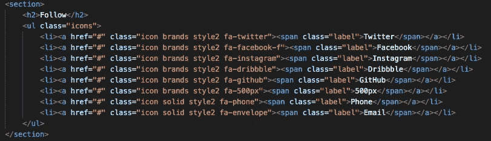

如果你不想使用所有这些项目，你只需要评论一个或几个你不想要的。如果您阅读 href="# "，只需通过您的社交媒体帐户链接更改#。不要忘记对所有的页面做同样的事情！

## 7.更新 GitHub

你的网站快好了！最后一步是将免费网站目录中的所有内容更新到 GitHub 存储库中。在 GitHub 中更新并提交所有文件后，只需使用以下命令再次启动您的网站:

[https://**boost mybusiness**. github . io](https://boostmybusiness.github.io)(用你的用户名更改 **boostmybusiness** )

***你已经准备好与全世界分享你的网站了！***

感谢您的阅读。您可以浏览我的个人网站，并在以下网址找到更多关于我的信息:

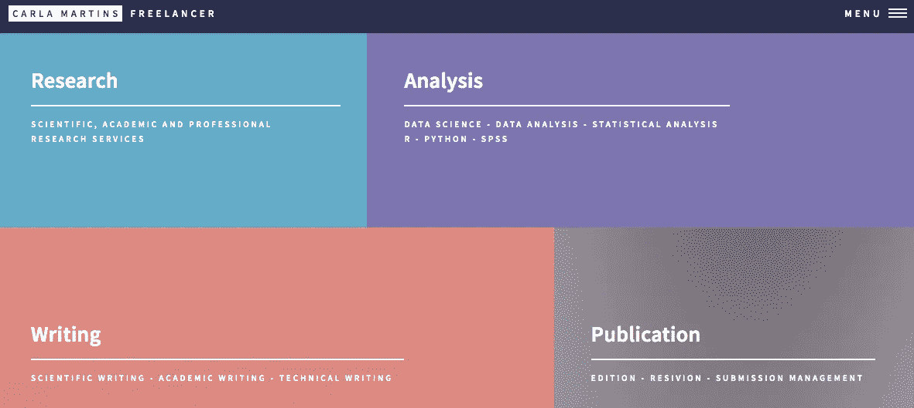

[**https://cdanielaam . github . io**](https://cdanielaam.github.io)

如果你喜欢这篇文章，别忘了关注我，这样你就能收到所有关于新出版物的更新。

**其他如果:**你想了解更多，可以通过[我的推荐链接](https://cdanielaam.medium.com/membership)订阅 Medium 会员。它不会花你更多的钱，但会支付我一杯咖啡。

**其他:**谢谢！