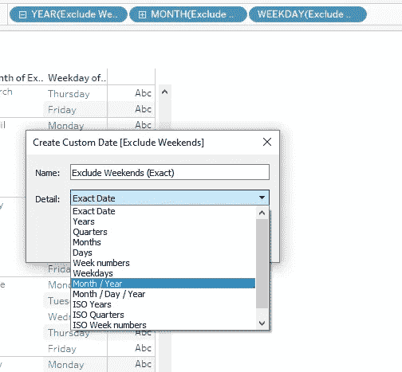

# 如何在 Tableau 中计算当月剩余工作日

> 原文：<https://blog.devgenius.io/how-to-calculate-remaining-working-days-in-current-month-in-tableau-5bc927cc4813?source=collection_archive---------9----------------------->

在本教程中，我们将演示如何在 Tableau 中计算当月的剩余工作日。为了解决这个问题，我们将使用 Tableau 中的 Date 函数。众所周知，Date 函数负责对多个数据记录执行各种日期操作。了解如何操作数据将有助于我们从多个数据源中收集关于数据日期的见解。

我们有一些流行的日期函数:

DATEDD，DATEDIFF，DATENAME，DATEPARSE，DATEPART，DATETRUNC，DAY，ISDATE，MAKEDATE，MAKEDATETIME，MAKETIME，MAX

现在，让我们按照下面的每个步骤，看看我们如何计算本月剩余工作日。

# 步骤 1:填充日期数据

通过生成截止到 2022 年 7 月的数据，用 Microsoft Excel 填充日期数据。下面显示了一个示例；

然后将数据导入 Tableau 并打开一个新的工作表。

# 第二步:计算工作日

计算我们每个月的工作日数，并从数据中排除周六和周日。因此，我们将为此创建一个计算字段。如下所示；

完成后，使用 year、month 和 weekday 将该字段放入窗格中，以查看该字段的外观。我们可以在下面看到，数据不包含周六和周日。

下一件事是将**排除周末**计算字段更改为格式为**月/年**和**月/日/年**的自定义日期，这样我们就可以在 LOD 计算中使用它进行聚合。
我们可以右键单击维度窗格上的“排除周末”,然后转到“创建”→“自定义日期”。

选择**自定义日期后，**点击月/年，然后遵循相同的早期过程。另外，选择月/日/年。这样，维度窗格中就有了这两个字段。

# 第三步:显示每月的工作天数

这里，我们需要通过计算每个月的每一天来显示每个月的工作日数。这是我们之前创建的自定义字段将被使用的地方。
我们使用固定的 LOD 计算，通过聚合自定义的年和月字段来对每天进行不同的计数。

创建之后，将计算字段放入窗格中。这给了我们下面的结果表，所以我们可以从下面的表中看到，2022 年 7 月有 21 个工作日。

# 第四步:计算最后一个工作日

下一件事是生成每个月的最后一个工作日。我们可以通过创建一个计算字段来做到这一点，该字段使用 MAX 来按月查找最近的日期(意味着每个月的最高日期)。这给了我们这个月的最后一个工作日。

现在，将字段放到窗格中，如下所示。我们可以看到，2022 年 7 月 29 日是最后一个工作日。

# 第五步:计算当月剩余工作日

要计算本月剩余的工作日，我们有两种方法:

I)使用每个工作日的时间间隔进行计算，直到月末

ii)使用今天的日期

**i)使用每个工作日的时间间隔进行计算，直到月末**

在这里，参考上一个工作日，然后找出每个工作日与上一个工作日之间的日期差异。我们还必须知道，我们将再次从数据中排除周六、周日。让我们解释一下原因。例如，让我们看看这些日期(2022 年 7 月 11 日至 2022 年 7 月 29 日)，以了解这两个日期之间的工作日。如果我们要计算差值，我们必须知道周六和周日在这里。

因此，我们创建了一个计算字段，该字段选取每个工作日的**(不包括周末)**字段和**(工作日的最后几天)**字段，方法是找出此间隔之间的日期差异，并从该时间段中删除每个周末。然后算出这些天的总和，这就是每个工作日到月底的剩余工作日。

在我们将日期字段放入年、月、周的窗格后，新计算的字段(**剩余工作日剩余**)和工作日的最后天数如下表所示；

**ii)使用今天的日期**

这里，我们通过使用今天的日期和最后一个工作日来进行计算。您要做的是将计算字段中的**排除周末**字段替换为**今天的日期**，如下所示:

之后，将字段放入窗格中。我们可以看到 7 月当月剩余的工作日。我们这里有 3 个，如下表所示；

你觉得这篇文章有帮助吗？在下面的评论区让我们知道吧。

如果你喜欢阅读这样的故事，并想支持我们的作家，考虑注册成为一个媒体成员。每月 5 美元，你可以无限制地阅读媒体上的故事。如果您使用我们的链接注册，我们将获得少量佣金。

 [## 通过我的推荐链接- Cndro 加入媒体

### 阅读 Cndro 的每一个故事(以及媒体上成千上万的其他作家)。你的会员费直接支持 Cndro 和…

medium.com](https://medium.com/@cndro/membership)