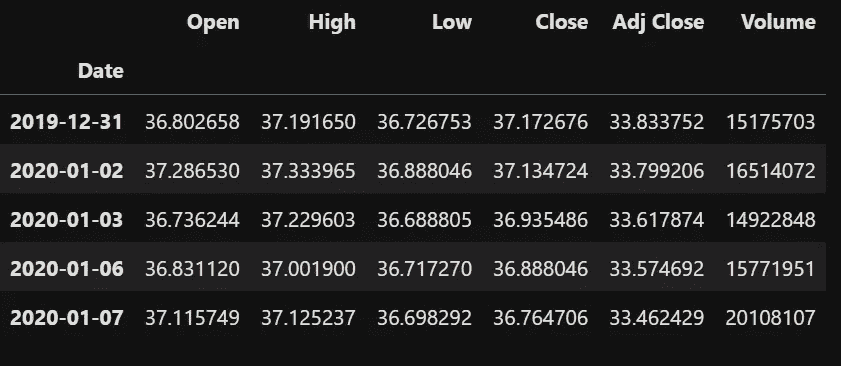
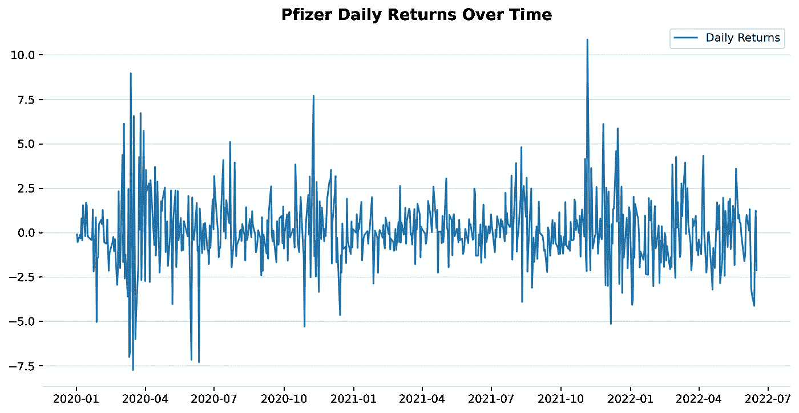
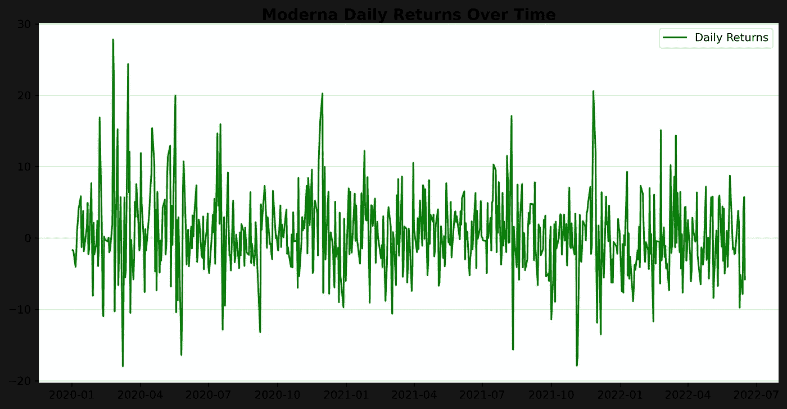
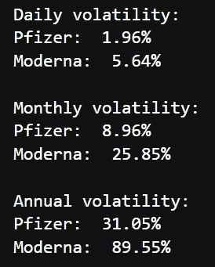

# 如何用 Python 计算一只股票的日收益和波动率

> 原文：<https://blog.devgenius.io/how-to-calculate-the-daily-returns-and-volatility-of-a-stock-with-python-d4e1de53e53b?source=collection_archive---------1----------------------->

让我们来练习一下辉瑞和现代股票在疫情期间的表现。


照片来自 Unsplash 的 Wance Paleri

“泡沫市场崩溃”、“加密裂缝”、“衰退”……如果你是一个股票投资者，你很有可能经常在最近几周检查你的投资组合。全球股市将在 2022 年下跌，原因有很多:乌克兰战争、通货膨胀、油价上涨和利率上升等。

这是开始用 Python 提升股票数据技能的绝佳机会。

***免责声明*** *:这篇博文的目的只是为了展示如何计算一只股票的日收益和波动率。没有任何股票的投资建议或推广。*

## 内容:

1.  [用例](https://medium.com/p/d4e1de53e53b#ac29)
2.  [所需的 Python 库](https://medium.com/p/d4e1de53e53b#834e)
3.  [用 yfinance 检索股票数据](https://medium.com/p/d4e1de53e53b#5b45)
4.  [计算并绘制每日回报](https://medium.com/p/d4e1de53e53b#00b3)
5.  [计算股票每日、每月和每年的波动性](https://medium.com/p/d4e1de53e53b#42e6)
6.  [结论](https://medium.com/p/d4e1de53e53b#fe4f)

## 1.使用案例

新冠肺炎疫情引发了世界的巨变。股票市场也不例外。多亏了 mRNA 疫苗，Moderna 和辉瑞已经成为家喻户晓的名字，他们的收入也有所增加。

**这两家公司的股票在此期间的日回报率和波动性是多少？**

这将给我们一个他们的风险水平的指示。波动性越高，风险就越大。

## 2.必需的 Python 库

首先，让我们导入我们需要的库。

```
import pandas as pd
import numpy as np
import matplotlib.pyplot as plt
import yfinance as yf
```

yfinance 是 Ran Aroussi 创建的免费开源 Python 库。你可以在这里找到更多关于它的信息。我推荐用它开始玩股票数据。

## 3.用 yfinance 检索股票数据

很直白。

*   为了检索股票数据，我需要使用 Pfizer 和 Moderna 各自的股票代码:PFE，MRNA
*   然后我用下载的方法注明时期。

```
Example with Pfizer stock
ticker= "pfe"
pfizer = yf.download(ticker, start="2020-01-01", end="2022-06-17")
pfizer.head()
```



用 yfinance 获得辉瑞股票数据的第一行

## 4.计算和绘制每日回报

股票日收益表明给定股票每天的收益或损失。我们通过从收盘价中减去开盘价得到它。

方便的是，Pandas 有 pct_change 方法来计算每日回报中变化百分比。让我们使用它并将它存储在一个新列“daily_returns”中。

让我们从辉瑞开始:

```
pfizer['daily_returns']=(pfizer['Close'].pct_change())*100
```

像往常一样，我更喜欢绘制结果，这样更容易可视化。

```
pfizer.dropna(inplace=True)fig,ax=plt.subplots(figsize=(12,6))
ax.spines[['top','right','left','bottom']].set_visible(False)
plt.plot(pfizer['daily_returns'], label = 'Daily Returns')
plt.legend(loc='best')
plt.title('Pfizer Stock Daily Returns Over Time')
plt.show()
```



由于新冠肺炎，辉瑞的股票在 2020 年波动非常大，在 2021 年由于 Covid 疫苗而变得不那么明显。我们可以看到，在 2021 年底，与 Omicron 变体外观相关的每日正回报。该图有助于我们监控每日随时间变化的幅度。

现在让我们对 Moderna 做同样的操作，看看它在同一时期的日收益率曲线是什么样的:



振荡在正侧具有更高的幅度。从 1 月到 22 日，我们观察到每日回报更多的是负面的。这对应于股票价格的下跌。

## 5.计算股票的每日、每月和每年的波动性

股票的波动性是其价格在一段时间内的变化。

**日波动率:**为了得到它，我们计算日收益率的标准差。提醒一下，标准差有助于我们看到有多少数据分布在平均值周围。

**月波动率:**我们假设一个月有 21 个交易日，所以我们用日波动率乘以 21 的平方根。

**年波动率**:我们假设一个日历年有 252 个交易日，我们将日波动率乘以 252 的平方根。

下面是代码:

```
import math
daily_volatility_pfe = pfizer['daily_returns'].std()
print('Daily volatility:')
print('Pfizer: ', '{:.2f}%'.format(daily_volatility_pfe))
daily_volatility_mrna = moderna['daily_returns'].std()
print('Moderna: ', '{:.2f}% \n'.format(daily_volatility_mrna))monthly_volatility_pfe = math.sqrt(21) * daily_volatility_pfe
print('Monthly volatility:')
print ('Pfizer: ', '{:.2f}%'.format(monthly_volatility_pfe))
monthly_volatility_mrna = math.sqrt(21) * daily_volatility_mrna
print ('Moderna: ', '{:.2f}%\n '.format(monthly_volatility_mrna))annual_volatility_pfe = math.sqrt(252) * daily_volatility_pfe
print('Annual volatility:')
print ('Pfizer: ', '{:.2f}%'.format(annual_volatility_pfe ))
annual_volatility_mrna = math.sqrt(252) * daily_volatility_mrna
print ('Moderna: ', '{:.2f}%'.format(annual_volatility_mrna ))
```



Moderna 的股票有很高的波动性:每年 90%，每月 26%！这表明投资者很难衡量该公司，因为其收入目前是基于新冠肺炎疫苗。他们正等着看它的潜力是否会实现。

辉瑞公司的年增长率为 31%，低于 Moderna，但仍然很高。辉瑞是一家拥有悠久历史的大型制药公司。

## 6.结论

获取股票数据并做一些初步计算来评估风险是很容易和容易的。Moderna 和辉瑞股票的例子表明，我们在投资股票时需要多么小心。我将在以后的博文中讨论其他指标。

感谢你阅读我！点击关注按钮来阅读我未来的帖子，如果你喜欢的话。

你也可以在 LinkedIn [这里找到我。](https://www.linkedin.com/in/lancaothai/)