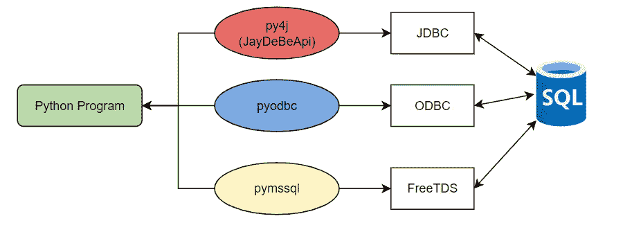

# 如何使用 AWS Glue 调用 MSSQL 存储过程，在 Spark 中传递和获取多个参数

> 原文：<https://blog.devgenius.io/how-to-call-mssql-stored-procedure-pass-and-get-multiple-parameters-in-spark-using-aws-glue-f21b2f19657b?source=collection_archive---------1----------------------->



# **问题陈述**

我们在 EC2 实例上用 MSSQL 编写了存储过程。这个存储过程中有一些输入和输出变量。输入变量应该从 Glue 传递，即 spark 代码，输出变量应该从存储过程再次返回到相同的代码。

# **概述**

要截断表或从 spark 中查询表，可以使用 spark read 函数或读取 dataframe 中的数据并对其使用 sparkSQL。

```
data_frame = glue_context.spark_session.read.format("jdbc")\
.option("url", url)\
.option("user", user_name)\
.option("password", password)\
.option("query", query)\
.load()
```

调用存储过程在 pyspark 中有多种方法(或者使用 python):
1 .使用 [**PyODBC 库**](https://github.com/mkleehammer/pyodbc/wiki)2。使用[**pymssql**](https://kontext.tech/article/893/call-sql-server-procedure-in-python)3。使用**内置的 Java JDBC-Spark 上下文驱动**

在本文中，我们将继续讨论 Spark 上下文，因为已经添加了其他两种方法的链接。

# **简介**

## **AWS 胶水**

AWS Glue 是一种无服务器的数据集成服务，可以轻松发现、准备和组合用于分析、机器学习和应用程序开发的数据。
AWS Glue 是一种 ETL 服务，我们可以在其中对 ETL 管道进行编码或可视化，它可以很容易地与其他 AWS 服务和其他工具一起用于编排目的。使用 spark 和 python，或者使用 Glue 中的拖放式服务，可以很容易地编写代码。

## **火花**

PySpark 是 Apache Spark 的 Python API，是一个开源的分布式计算框架和一组用于实时、大规模数据处理的库。如果您已经熟悉 Python 和 Pandas 之类的库，那么 PySpark 是一种很好的语言，可以用来创建更具可伸缩性的分析和管道。

## **MSSQL**

**SQL Server 又称 MS SQL Server，是一种 RDBMS(关系数据库管理系统)**。它是一个存储数据库数据并执行 SQL 命令和查询来操作关系数据库的应用程序。此外，它还管理和执行所有数据库操作

# 存储过程

我们已经编写了以下存储过程，并在托管于 [EC2 实例](https://aws.amazon.com/premiumsupport/knowledge-center/ec2-windows-launch-sql-server/#:~:text=Connect%20to%20the%20second%20node,the%20server%20to%20the%20FCI.)上的 MSSQL 服务器中执行了相同的过程

在下面的 SP 中，您可以添加自己的语句。对于这个博客，我只添加了最初的 create 语句，以便理解如何**传递和获取参数**

```
CREATE or ALTER PROCEDURE [schema].[usp_stored_procedure_example]@master_id int,
@parent_id int,
@child_id int,
@object_name varchar(30),
@glue_job_run_id varchar(100),
@o_main_id int output,
@o_last_name varchar(100) output,
@o_date varchar(100) output,
@o_message nvarchar(max) outputASBEGINSET NOCOUNT ON;****
****
****ENDGO
```

在上面的存储过程中，我们从 Glue Job 传递 5 个参数，并获取 4 个输出参数，将它们存储在我们的脚本中。

# Glue/PySpark 脚本

*   最初，我们需要获取数据库的相关信息来执行存储过程，比如 URL、用户名和密码。
*   现在我们应该从 spark 会话中获取驱动程序管理器，并通过传递数据库凭证从**驱动程序管理器**中创建连接对象

```
driver_manager = spark._sc._gateway.jvm.java.sql.DriverManagercon = driver_manager.getConnection(url, username, password)
```

*   通过传递所需的输入参数，创建需要执行的 SQL 语句
*   对于每个预期的**输出参数，一个“？”**必须添加到语句的末尾

```
statement =f"""{{call {schema}.usp_stored_procedure_example({master_id}, {parent_id}, {child_id}, {table}, {job_run_id}, ?, ?, ?, ?)}}"""
```

*   在我们创建的存储过程中，我们有 5 个输入参数和 4 个输出参数；因此，我们传递 5 个不同的值，通过提到“？”来获取输出值同样的
*   可以使用 ***"CALL"*** 关键字来调用存储过程，也可以使用 ***"EXEC "。*** 例如:
    这里，我们将一个输入作为“名称”传递，并期望一个输出参数

```
statement = f"""EXEC dbo.SP_DummySP  '{name}', ?"""
```

*   下一步是调用**可调用函数**

```
exec_statement = con.prepareCall(statement)
```

*   输出参数需要用可调用语句**注册**。这必须通过提供问号的索引(从 1 开始)及其数据类型来完成。
*   执行之后，需要使用正确的 **get-method** 根据它的(java) **数据类型**获取输出参数。

```
driver_manager = spark._sc._gateway.jvm.java.sql.DriverManagercon = driver_manager.getConnection(url, user_name, password)statement =f"""{{call {schema}.usp_stored_procedure_example({master_id}, {parent_id}, {child_id}, '{table}', '{job_run_id}', ?, ?, ?, ?)}}"""exec_statement = con.prepareCall(statement)exec_statement.registerOutParameter(1, spark._sc._gateway.jvm.java.sql.Types.INTEGER)exec_statement.registerOutParameter(2, spark._sc._gateway.jvm.java.sql.Types.VARCHAR)exec_statement.registerOutParameter(3, spark._sc._gateway.jvm.java.sql.Types.VARCHAR)exec_statement.registerOutParameter(4, spark._sc._gateway.jvm.java.sql.Types.VARCHAR)exec_statement.execute()res1 = exec_statement.getInt(1)res2 = exec_statement.getString(2)res3 = exec_statement.getString(3)res4 = exec_statement.getString(4)exec_statement.close()con.close()
```

*   注册输出参数时的索引应该在调用 Get-Method 时正确匹配
*   我们也可以获取 getParameters 并使用 for 循环注册参数

## 结论

所描述的使用内置 java JDBC 驱动程序的方法相当简单，但是不太为人所知。因为我们在 python 上下文中使用 java 对象，所以很难在线找到(正确的)信息。更多信息可以在 java 文档中找到。(例如，这篇关于执行存储过程的文章)

我希望这对开发人员和数据工程师有所帮助。请让我知道你对此的想法和/或任何可能的优化。

**参考文献:**
1。[https://docs . Microsoft . com/en-us/SQL/connect/JDBC/reference/registeroutparameter-method-int-int？view=sql-server-ver16](https://docs.microsoft.com/en-us/sql/connect/jdbc/reference/registeroutparameter-method-int-int?view=sql-server-ver16)

2.https://docs . Oracle . com/javase/8/docs/API/Java/SQL/types . html #:~:text = VARBINARY-，The % 20 constant % 20 in % 20 The % 20 Java % 20 programming % 20 language % 2C % 20 something % 20 refered % 20 to，The % 20 generic % 20 SQL % 20 type % 20 VARBINARY % 20。& text=VARCHAR-，The %20constant % 20in % 20the % 20Java 编程% 20 语言% 2C %有时% 20referred % 20to，The % 20 generic % 20 SQL % 20 type % 20 VARCHAR % 20。

3.https://github.com/mkleehammer/pyodbc/wiki

4.[https://kontext . tech/article/893/call-SQL-server-procedure-in-python](https://kontext.tech/article/893/call-sql-server-procedure-in-python)

5.[https://aws.amazon.com/glue/?whats-new-cards . sort-by = item . additional fields . post datetime&whats-new-cards . sort-order = desc](https://aws.amazon.com/glue/?whats-new-cards.sort-by=item.additionalFields.postDateTime&whats-new-cards.sort-order=desc)

6.[https://AWS . Amazon . com/premium support/knowledge-center/ec2-windows-launch-SQL-server/#:~:text = Connect % 20 to % 20 the % 20 second % 20 node，the % 20 server % 20 to % 20 the % 20 fci](https://aws.amazon.com/premiumsupport/knowledge-center/ec2-windows-launch-sql-server/#:~:text=Connect%20to%20the%20second%20node,the%20server%20to%20the%20FCI)。

7.[https://docs . Oracle . com/CD/e 17952 _ 01/connector-j-5.1-en/connector-j-usagenotes-statements-callable . html](https://docs.oracle.com/cd/E17952_01/connector-j-5.1-en/connector-j-usagenotes-statements-callable.html)

8.[https://medium . com/Delaware-pro/executing-DDL-statements-stored-procedures-on-SQL-server-using-py spark-in-databricks-2b31d 9276811](https://medium.com/delaware-pro/executing-ddl-statements-stored-procedures-on-sql-server-using-pyspark-in-databricks-2b31d9276811)