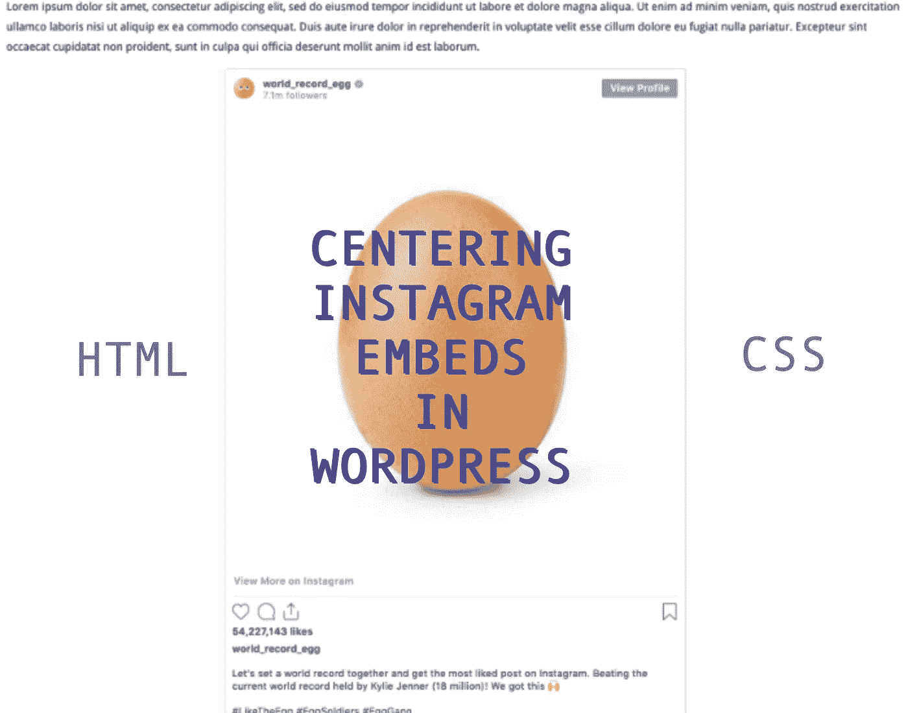
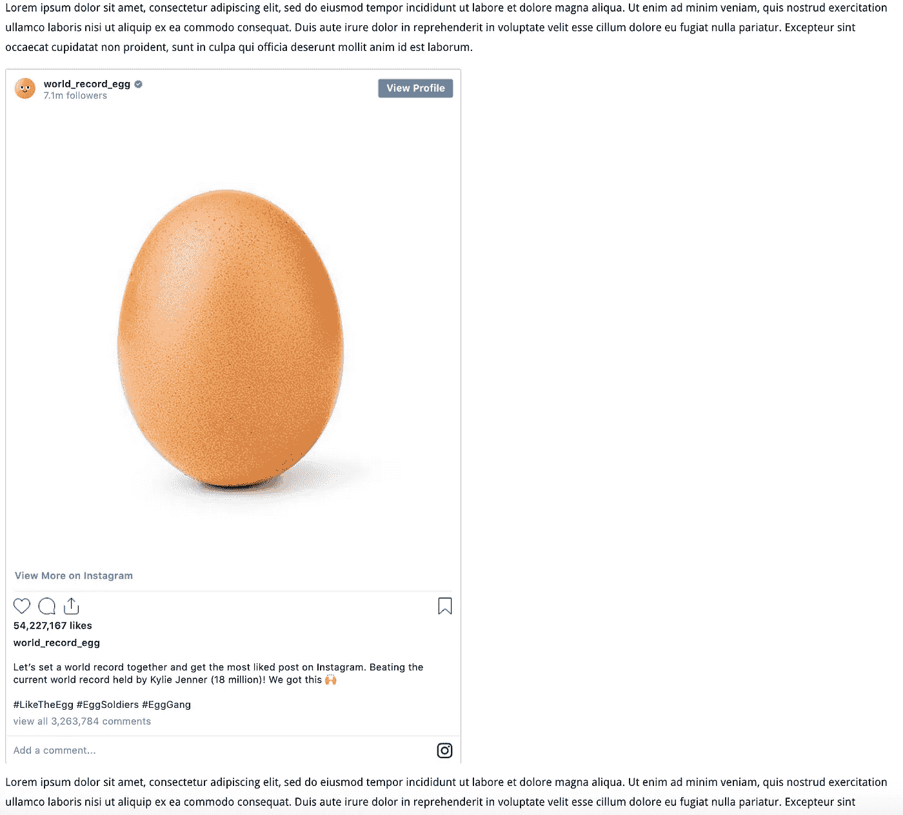
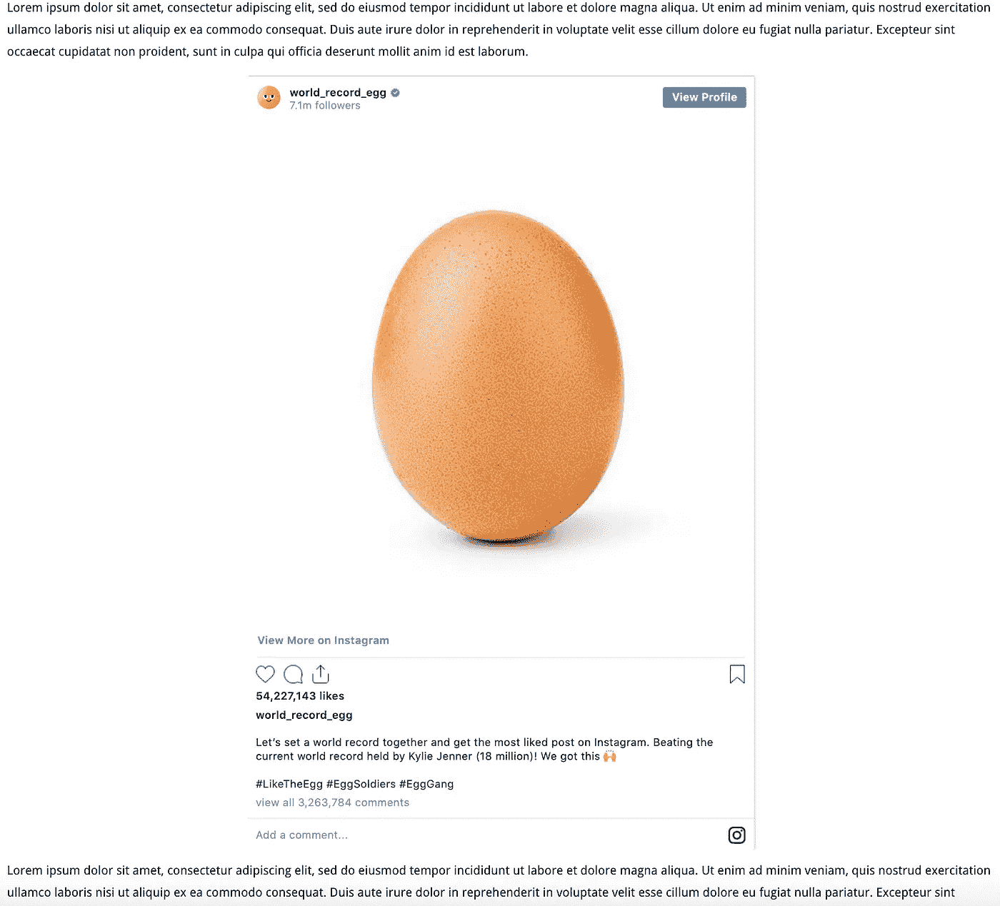
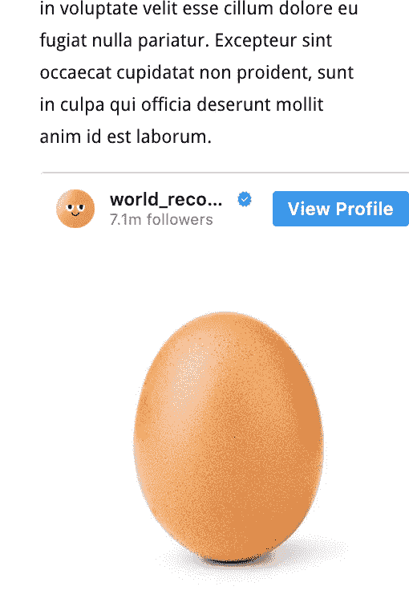
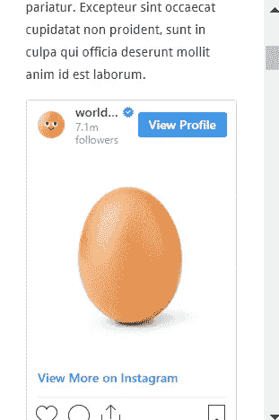

# 如何在 Wordpress 中居中嵌入 Instagram Iframe

> 原文：<https://blog.devgenius.io/how-to-center-instagram-iframe-embeds-in-wordpress-743bfb11bb56?source=collection_archive---------0----------------------->



# 如果你只是想要解决方案

## 半铸钢ˌ钢性铸铁(Cast Semi-Steel)

```
.instagram-media {
    min-width: 235px !important;
    width: 60% !important;
}
```

# 眼下的问题是什么？

Instagram 帖子嵌入在 Wordpress 里真的很有用。前提非常简单:只需将 Instagram 的网址复制粘贴到你的帖子中，其余的由 Wordpress 处理。画面会神奇的出现！

值得称赞的是，我刚刚描述的内容基本上完美地达到了这一点。每当我粘贴我的特定 Instagram URL 时，图片就会在帖子中呈现。

然而，有一个主要的缺陷。

默认情况下，帖子是左对齐的，这很好，但是没有办法(如果有办法，请告诉我——我会用它替换整篇该死的文章！)在可视化编辑器中，将 Instagram 嵌入到帖子的中心。

默认结果如下所示:



不理想。

它适用于一些网站，但在我的网站上，我特别希望它居中。

# 初步解决方案

为此，你需要将你的文章或页面编辑器切换到“编辑 HTML”。

基本上，在文章中，去找到你想要居中的 Instagram 链接。它看起来会像这样:

```
https://www.instagram.com/p/BsOGulcndj-/
```

然后，您需要用以下标记将该链接括起来:

```
<div align="center">
   [embed]
      https://www.instagram.com/p/BsOGulcndj-/
   [/embed]
</div>
```

这样做的目的是将 Instagram 嵌入到它所处的环境中。您可以预览甚至发布帖子来查看嵌入内容，如下所示:



好多了。

# 更完整的移动解决方案

在我的案例中，上述解决方案在桌面和平板电脑视图上运行良好。Instagram embed 像我希望的那样居中，但对于手机视图(因此屏幕较小)，图像似乎在右侧被截断了。

任何居中格式都无关紧要，因为整个嵌入对于屏幕来说太宽了；响应性似乎不是等式的一部分，所以它看起来像这样:



呸。

我的解决方案是隔离特定的 Instagram embed CSS 组件，然后缩小其宽度，使其既适合较小的屏幕，也适合较大的屏幕。看起来应该是这样的(这也是我在文章开头给出的内容):

## 半铸钢ˌ钢性铸铁(Cast Semi-Steel)

```
.instagram-media {
    min-width: 235px !important;
    width: 60% !important;
}
```

对你来说，确切的值可能不同，但这是对我有用的。它也更像是硬编码的，所以它可能不适用于所有的用例。因此，这可能只是一个临时的解决方案，而你想出了一个更具响应性的方法；我现在正在使用它，直到我能找到它不支持的设备屏幕尺寸。



整个嵌入适合所有视图！终于！

将 CSS 添加到 Instagram 嵌入的每个帖子或页面可能会有点累，所以我使用了一个名为 [WP Add Custom CSS](https://wordpress.org/plugins/wp-add-custom-css/) 的自定义 CSS Wordpress 插件。除了我使用它之外，我根本不属于那个插件；我非常喜欢它作为我的用例。

[](https://medium.com/cloud-native-the-gathering/how-to-use-css-to-fade-in-and-fade-out-html-text-and-pictures-f45c11364f08) [## 如何使用 CSS 淡入淡出 HTML 文本和图片

### 只使用 CSS，在几秒钟内淡入淡出你的 HTML 元素。

medium.com](https://medium.com/cloud-native-the-gathering/how-to-use-css-to-fade-in-and-fade-out-html-text-and-pictures-f45c11364f08) [](https://tremaineeto.medium.com/membership) [## 通过我的推荐链接加入媒体

### 作为一个媒体会员，你的会员费的一部分会给你阅读的作家，你可以完全接触到每一个故事…

tremaineeto.medium.com](https://tremaineeto.medium.com/membership)