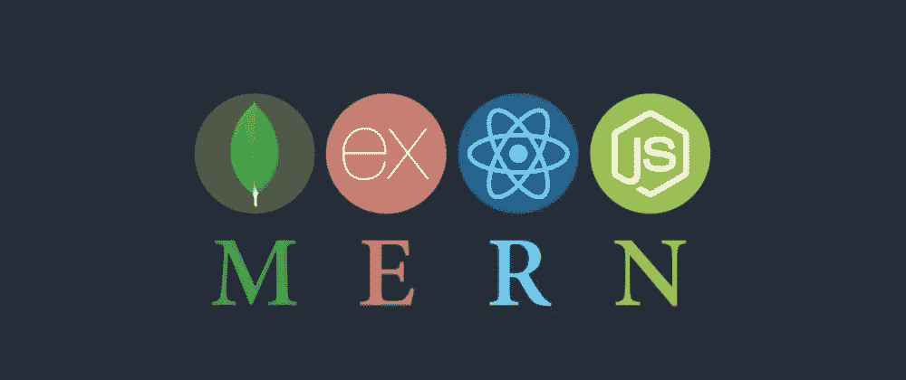
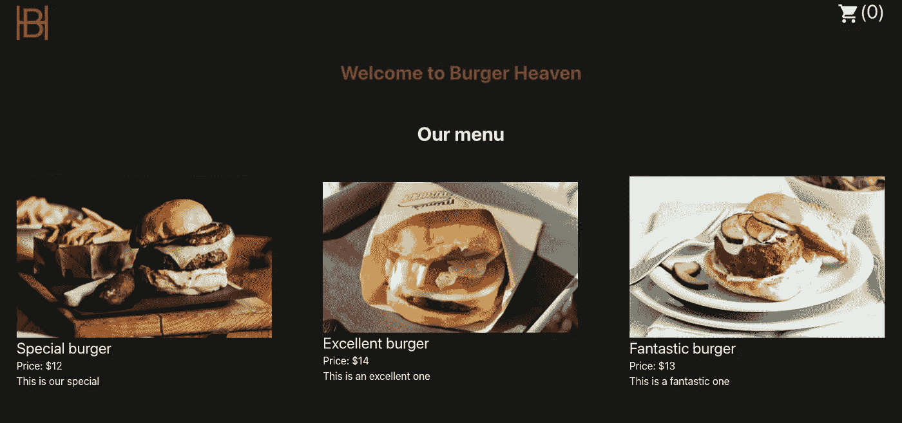
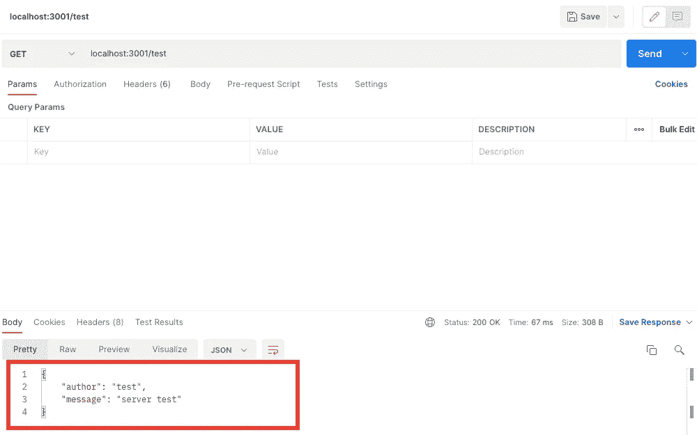
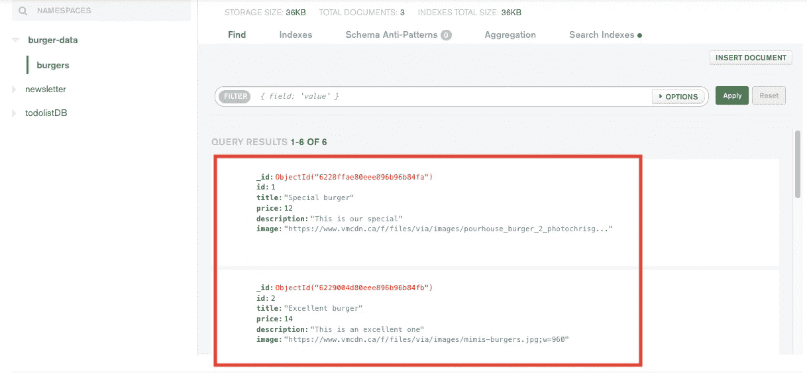
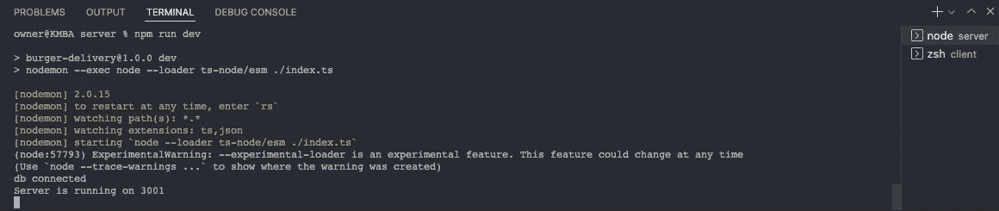
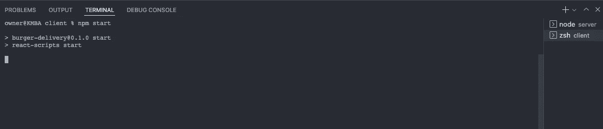

# 如何将基本的 react 应用程序更改为 MERN 堆栈

> 原文：<https://blog.devgenius.io/how-to-change-a-basic-react-app-to-mern-stack-3d93e22e48f3?source=collection_archive---------9----------------------->



图片来自[https://dev . to/koolkishan/a-roadmap-to-learn-mern-stack-for-初学者-2l9k](https://dev.to/koolkishan/a-roadmap-to-learn-mern-stack-for-beginners-2l9k)

**目的**

虽然我创建了基本的 react 和 redux 一个电商 app(上一篇文章的题目)，但是这些数据都是用 Jsonblob 从 Fake API 导入的。当你想练习通过从 API 端点获取数据来创建一些应用程序时，这个网站非常有用，但这不能用于真正的应用程序。基本上，你应该创建自己的后端(服务器端)部分和 API 端点，但是你怎么做呢？因此，我要分享我的知识，以取代假的 API 到真正的，这是在服务器文件夹中创建的。

**示例图片**

这是示例应用程序图像。



你会注意到卡片包含一些信息，如图像、标题、价格、描述。本文的目标是将 API 端点替换为真正的数据库来获取卡片数据。

**什么是 MERN 栈 app？**

这不是本文的主要范围，所以我将简单解释一下。基本上，MEAN 是“MongoDB”、“Express”、“React”、“Node.js”的一个首字母。

如果你使用这 4 个特性，你就可以相当容易地创建一个“全栈应用”。

你只需要知道每个部分用的是哪个特性，MongoDB = "数据库"，Express = "服务器端"，React = "客户端"，Node.js = "服务器端"。你可能知道，express 是 Node.js 的一个有用的应用框架，你可以很容易地创建 API 端点。

**我的基本文件夹结构**

```
burger-delivery
  ーーclient
    ーーnode_modules
    ーーpublic(including index.html)
    ーーsrc(including each components, app.tsx, index.tsx)
    ーーpackage-lock.json
    ーーpackage.json
    ーーtailwind.config.js
    ーーtsconfig.json ーーserver
    ーーnode_modules
    ーーcontrollers
      ーーburgers.js
    ーーmodels
      ーーburger.js
    ーーroutes
      ーーburgers.js
    ーー.babelrc
    ーー.env
    ーーindex.ts
    ーーpackage-lock.json
    ーーpackage.json
    ーーtsconfig.json
  ーー.gitignore
  ーー README.md
```

基本上你要准备 2 个不同的文件夹，里面有 2 个不同的“node_modules”文件夹和 package.json，如果要用 typescript，你也要为每个文件夹准备 tsconfig.json。这是我的困惑点，也是我们是否应该为客户端和服务器准备两个不同的存储库。虽然我在寻找不同的来源，如果我们创建的应用程序是大还是不小，我们应该创建两个不同的仓库，因为它更容易管理每个部分和部署。否则，我们可以只创建一个回购协议，并分成两个文件夹。你可以创建每个 gitignore 文件，虽然我只使用一个文件。这个应用程序不是一个大的，所以我遵循只有一个回购的想法，并创建如下 2 个文件夹。

**步骤**

1.  准备一个客户端应用程序(像 react)并为客户端创建一个文件夹，你把每个文件(除了 gitignore 文件，如果你想保留一个文件)到这个客户端文件夹，包括 node_module 文件夹。

2.为服务器端创建一个文件夹并移动这个文件夹，按照下面的步骤准备 package.json

```
#Follow steps below on command line{we are stay in root folder right now(in my case, burger-delivery)}.cd server -- to create every file related server side inside this folder.npm init  —to create package.jsonnpm install — to install node modules
```

3.为服务器端安装每个依赖项

如果是使用 javascript，需要安装“cors”、“dotenv”、“express”、“mongodb”、“mongoose”。但是，如果您想使用 typescript，您应该安装更多依赖项或类型，如下所示。“nodemon”和“body-parser”由您决定，这不是必须的。

下面的依赖项(如果您想在依赖项上安装，您可以在命令行上使用“npm install”。如果要安装 devDependency，应该使用“npm install — save -dev”)。

```
package.json(inside server folder, not client folder)"dependencies": {
    "[@types/body-parser](http://twitter.com/types/body-parser)": "^1.19.2",
    "[@types/mongodb](http://twitter.com/types/mongodb)": "^4.0.7",
    "body-parser": "^1.19.2",
    "cors": "^2.8.5",
    "dotenv": "^16.0.0",
    "express": "^4.17.3",
    "mongodb": "^4.4.0",
    "mongoose": "^6.2.3",
    "nodemon": "^2.0.15",
    "ts-node": "^10.5.0",
    "typescript": "^4.5.5"
  },
  "devDependencies": {
    "[@babel/core](http://twitter.com/babel/core)": "^7.17.5",
    "[@babel/node](http://twitter.com/babel/node)": "^7.16.8",
    "[@babel/preset-env](http://twitter.com/babel/preset-env)": "^7.16.11",
    "[@babel/preset-typescript](http://twitter.com/babel/preset-typescript)": "^7.16.7",
    "[@types/cors](http://twitter.com/types/cors)": "^2.8.12",
    "[@types/express](http://twitter.com/types/express)": "^4.17.13",
    "[@types/node](http://twitter.com/types/node)": "^17.0.21"
  }
```

4.这部分只是打字稿。所以如果你想用 javascript，请跳过这一部分。创建”。babelrc”文件夹，并像下面这样编写，以便为服务器端部分使用 typescript。

```
.babelrc
{
  "presets": ["[@babel/preset-env](http://twitter.com/babel/preset-env)", "[@babel/preset-typescript](http://twitter.com/babel/preset-typescript)"]
}
```

5.创建一个 models 文件夹和“brabra.tsx(在我的例子中是 burger.tsx，因为我的应用程序是用于汉堡交付的)”为了简单起见，我将编写为 burger.tsx。对于 mongoose，您应该创建如下所示的模式，该模式正在解释“哪种类型用作数据类型”。并且设置 schema 后，可以使用 as mongoose.model。

6.创建一个控制器文件夹和“burgers.tsx”，编写如下。从创建步骤 5 的 models/burger.tsx 导入 Burger，并使用它。

因为我想获得完整的数据，所以我使用了 find()。如果你想得到一个数据，你需要使用 findOne 方法。这非常有用，因为我们不需要选择 SQL 等项目。

如果你只想吃一个汉堡，你可以创建一个类似于“getBurgers”的 getBurgerOne 函数。这是一个非常可重复使用的方法。

7、创建根文件夹和 burgers.tsx，如下所示。您需要导入创建 step 6 的 getBurgers，并使用它。在这种情况下，我只设置了一个路由，但是您可以设置几个根，这样它也是可扩展。

8.在服务器文件夹中创建 index.ts，如下图所示。我会解释每一部分。

首先，导入 express、bodyParser(选项)、mongoose、dotenv、cors、burgerRoutes

```
import express from "express";
import bodyParser from "body-parser";
import mongoose from "mongoose";
import dotenv from "dotenv";
import cors from "cors";
import burgerRoutes from "./routes/burgers"
```

通常情况下，express 用作“const app = express()”。并使用如下所示的 bodyParser。Bodyparser 用于 post 方法，但这是 express 目前的默认函数(在 v4 之后)，所以你不需要它(这是可选的。).

这一次我们应该使用不同的端口来运行每个应用程序客户端和服务器，所以我们需要使用 cors 来解决从不同端口访问的冲突。

```
const app = express();
app.use(bodyParser.json());
app.use(bodyParser.urlencoded({ limit: "30mb", extended: true }));
app.use(cors());
```

我会用创造了第七步的汉堡路线。我可以通过导入来更改任何路由名称，而不是“路由器”。

```
app.use("/burgers", burgerRoutes);
```

你需要使用 dotenv 来保护你的数据(比如 mongoDB key)并作为 dotenv.config 使用，你也可以使用类似 process.env. <your env="" file="" element="">。</your>

```
dotenv.config();
const env = process.env;
const port = env.port || 5000;
```

如果你想用。婀，你需要准备一下”。env”文件，这是为了保护您的个人或重要信息。在我的例子中，我把“端口”信息和“mongodb url”放在下面。稍后我会解释 mongodb 的用户名和密码。

下面的代码只是一个正确运行服务器的测试。如果您将服务器准备到端口 3001，您可以在运行服务器后检查 postman 中的“localhost:3001/test”。(这是一种检查 url 是否正常工作的方法)。

```
app.get("/test", (_req, res) => {
  res.json({
    author: "test",
    message: "server test",
  });
});
```

Post man 屏幕截图(服务器运行正常)



这部分是连接猫鼬。在我的情况下，我使用。env 来保护“connection_url”，这就是我使用“env”的原因。CONNECTION_URL "。而在 mongoose.connect 里面，我放 app.listen 运行服务器。我也在里面输入信息。环境文件

```
mongoose.connect(env.CONNECTION_URL, (dbErr: any) => {
  if (dbErr) throw new Error(dbErr);
  else console.log("db connected");
  app.listen(port, function () {
    console.log(`Server is running on ${port}`);
  });
});
```

9.在 cilent 的包 json 中设置代理，如下所示。正如我已经写的，你应该运行不同的服务器来调用 API 端点，所以这是必要的。此代理 url 与创建服务器的 app.listen 相同。

```
package.json -inside client folder, not server one"proxy": “http://localhost:3001”,
```

10.在服务器文件夹中设置 package.json 脚本，以便在服务器端运行服务器。在我的例子中，我想使用 nodemon 和 ts-node，所以我写了如下代码。但是，如果不安装 nodemon，可以用 node 代替 nodemon。

```
package.json(server folder)"scripts": {
    "dev": "nodemon --exec node --loader ts-node/esm ./index.ts "
  },
```

11.更改使用 axios 从服务器端获取数据的客户端。

12.转到 mongo db Atlas，并登录它。如果您没有帐户，您需要创建它。或者你可以用谷歌这样的社交账号登录。

[https://docs.atlas.mongodb.com/getting-started/](https://docs.atlas.mongodb.com/getting-started/)

你可以使用上述网站作为指导。这非常容易，你不需要注册你的信用卡。那是很靠谱的！！

13.一旦创建了数据库，就应该设置用户名和密码。这是非常重要的，因为你应该你的用户名和密码作为连接网址。在我的例子中，我把我的 connect_url 放在里面。env，所以我应该改一下(如果要检查，请参考第八步中间)。

14.您应该在 mondo db Atlas 中创建您的数据，如下图所示。如果创建 post 方法，就不需要这部分了。然而，在我的应用程序中，我只是试图实现 get 方法，所以到目前为止你需要手动添加。



14.你需要运行 2 个不同的服务器，它们分别位于不同终端的服务器文件夹和客户端文件夹。在我的例子中，我可以通过在客户端文件夹上使用“npm start”来运行客户端服务器，同时，我可以通过使用“npm run dev”来运行服务器端服务器(该命令由您决定，您可以通过更改脚本来更改该命令)。



服务器端终端



客户端终端

15.搞定了。您可以成功连接 mongoDB 和 local，并且应该可以正确显示数据。

**结论**

由于从基本的 react 应用程序到 MERN 堆栈应用程序的改变有一些来源，我希望这篇文章将有助于更高级地改变你的应用程序。

**参考**

MongoDB:[https://docs . atlas . MongoDB . com/tutorial/create-MongoDB-user-for-cluster/](https://docs.atlas.mongodb.com/tutorial/create-mongodb-user-for-cluster/)

https://blog.logrocket.com/mern-stack-tutorial/ MERN 堆栈:完整教程:

如何使用 https://www.mongodb.com/languages/mern-stack-tutorial MERN 堆栈:一个完整的指南:

https://qiita.com/maiyama18/items/573247b12ff0bc4e5d3c[react+redux+express+mongodbでものすごくシンプルなcrudアプリをつくる:](https://qiita.com/maiyama18/items/573247b12ff0bc4e5d3c)

感谢您的阅读！！