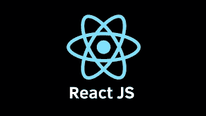

# 如何使用 webpack 将 react app 改为 typescript

> 原文：<https://blog.devgenius.io/how-to-change-react-app-to-typescript-by-using-webpack-f036e73f53cb?source=collection_archive---------5----------------------->


图片来自[https://en.wikipedia.org/wiki/Webpack](https://en.wikipedia.org/wiki/Webpack)



图片来自[https://www . freecodecamp . org/news/react-js-for-初学者-props-state-explained/](https://www.freecodecamp.org/news/react-js-for-beginners-props-state-explained/)

**目的**

当我正努力用 webpack 引入 typescript 以将我的 react 应用程序改为 typescript 时，我分享了我的知识。一般来说，大多数人只使用 create-react-app 和 typescript，所以很难找到正确的解决方案。

**步骤**

1.安装 ts-loader、typescript、webpack、webpack-cli(通过 webpack v5)、webpack-dev-server @types/react、@types/react-dom、@types/webpack、@types/webpack-dev-server

*   webpack-dev-server 是可选的，但是很有用

2.如下设置 package.json 中的 webpack-dev-server。

```
"scripts": {
    "serve": "live-server public/",
    "build": "webpack",
    "dev-server": "webpack-dev-server",
    "start": "webpack-serve"
  },
```

3.如下创建 webpack.config.js(我的代码不是最小的)。不要忘记将条目的文件扩展名改为 ts 或 tsx。

```
const path = require("path");module.exports = {
  mode: "development",
  entry: "./src/app.tsx",
  output: {
    path: `${__dirname}/public`,
    filename: "bundle.js",
  },
  performance: {
    hints: false,
    maxEntrypointSize: 512000,
    maxAssetSize: 512000,
  },
  module: {
    rules: [
      {
        use: ["babel-loader"],
        test: /\.(js|jsx)$/,
        exclude: /node_modules/,
      },
      {
        test: /\.tsx?$/,
        loader: "ts-loader",
        options: {
          configFile: path.resolve(__dirname, "./tsconfig.json"),
        },
      },
      {
        test: /\.svg$/,
        use: [
          {
            loader: "svg-url-loader",
            options: {
              limit: 10000,
            },
          },
        ],
      },
      {
        test: /\.s?css$/,
        use: ["style-loader", "css-loader", "sass-loader"],
      },
    ],
  },
  devtool: "source-map",
  devServer: {
    static: {
      directory: path.join(__dirname, "public"),
    },
    historyApiFallback: true,
  },
  resolve: {
    modules: ["node_modules"],
    extensions: [".ts", ".tsx", ".js", "jsx", "json"],
  },
  target: ["web", "es5"],
};
```

4.像下面这样创建 tsconfig.json。至少你要设置" sourceMap": "true "，" target": "es5 "，" module": "es2015 "，" jsx": "react "

```
{
  "compilerOptions": {
    "sourceMap": true,
    "target": "es5",
    "module": "es2015",
    "strict": true,
    "noUnusedLocals": true,
    "noImplicitReturns": true,
    "moduleResolution": "node",
    "esModuleInterop": true,
    "allowJs": true,
    "allowSyntheticDefaultImports": true,
    "jsx": "react",
    "lib": ["es2020", "dom"]
  },
  "include": ["./src/**/*"]
}
```

5.搞定了。启动服务器(在我的例子中，yarn 运行 dev-server)并获得结果。

我在努力克服哪些错误？

当我使用 webpack5.0.0 时，我得到

—>错误:webpack.webpackError 不是构造函数。

虽然我谷歌了一下，但是找不到解决办法。

所以我换成了 webpack 最新的 5.65.0，我得到了

—>错误:配置文件“tsconfig.json”中的“文件”列表为空

我在 package.json 的 site rules 中添加了选项，并修复了这个错误。

```
rules: [
      {
        test: /\.tsx?$/,
        loader: "ts-loader",
        options: {
          configFile: path.resolve(__dirname, "./ts.config.json"),
        },
      },
...
```

**结论**

最后，我可以在我的应用程序中引入 Typescript，但是我仍然在努力为我的应用程序分配类型。因此，当我可以将整个 react 应用程序改为 typescript 时，我将再次分享我的知识。

**参考**

webpack 指南打字稿:[https://webpack.js.org/guides/typescript/](https://webpack.js.org/guides/typescript/)

关于错误配置文件' tsconfig.json '中的' Files '列表为空:[https://programmerall.com/article/40291153056/](https://programmerall.com/article/40291153056/)

我的 github:[https://github . com/aujourdui/cats-community/tree/development](https://github.com/aujourdui/cats-community/tree/development)

感谢您的阅读！