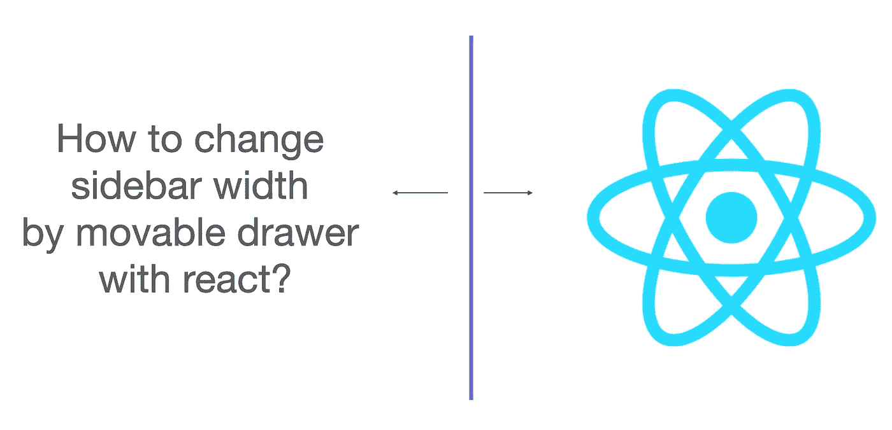
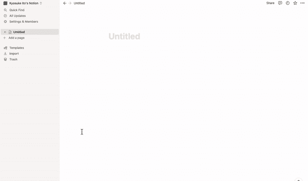
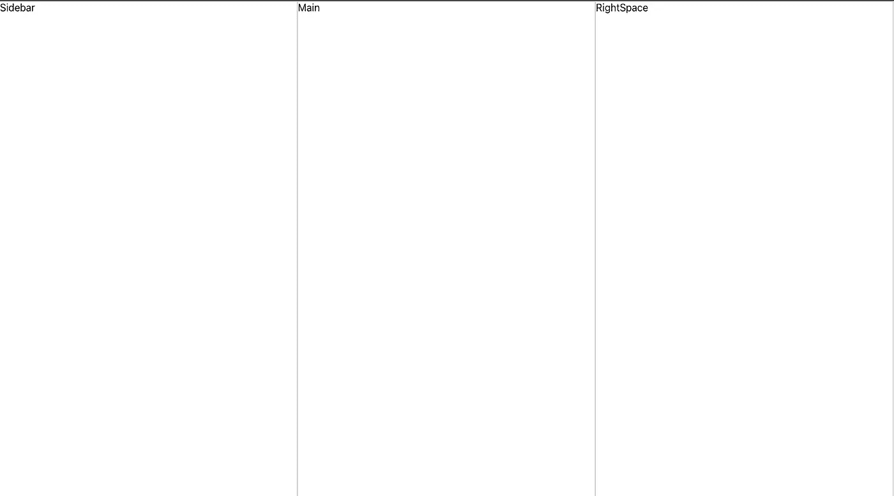
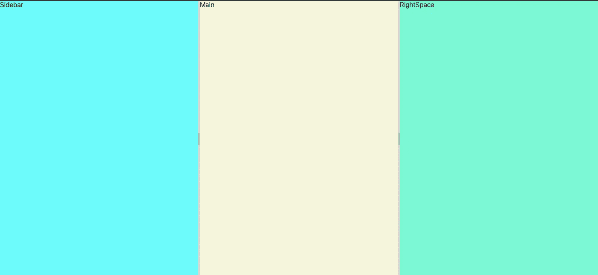
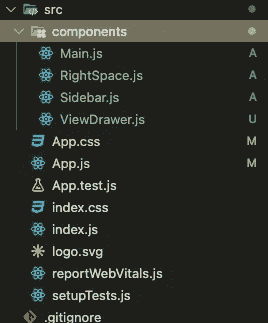
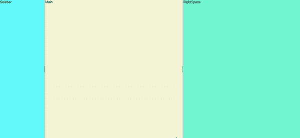

# 如何通过带 react 的可移动抽屉改变侧边栏宽度

> 原文：<https://blog.devgenius.io/how-to-change-sidebar-width-by-movable-drawer-with-react-16744acba10b?source=collection_archive---------2----------------------->



# 目的

因为我想创建一个函数来改变侧边栏的宽度，所以这个函数没有资源。我在努力创造它，所以我将与你分享。

# 目标

我想创建如下所示的函数(以概念为例)



# 我的计划

可能有几种解决方案，我考虑了两种方法，即调整侧边栏的大小或通过拖动可移动的抽屉来计算侧边栏的宽度。

## 平面 1:调整大小

使用 resizing 函数似乎更容易，因为我们不需要通过计算来改变宽度。只需创建调整大小函数并使用它。

## 平面 2:拖动

获取可移动抽屉的位置，并用它来改变侧边栏的宽度。这似乎比调整大小更困难，但似乎在细节上有所改变。

既然都试过了，我就跟你分享一下。

# 为什么我使用平面 2:拖动？

总之，我决定通过“Plan2 拖动”来实现。跟这个 app 的要求有关。

基本上，使用可调整大小的函数有三个问题。

首先，我应该有 2 个不同类型的抽屉，因为我正在工作的应用程序有 3 个部分，如下图所示。当我尝试使用 react 的“可调整大小”库时，它完全适用于“一个”抽屉。然而，如果我有“两个”抽屉，这两个抽屉会奇怪地同步。换句话说，如果我移动左边的抽屉，右边的抽屉也在移动。这对我来说并不理想。



其次，我需要使用定制设计的视图抽屉，并添加悬停功能。如果我可以使用正常的抽屉，如“边框 2px 固体浅灰色”，这是完全没问题的。因为它被认为是组件的一部分，所以如果我调整组件的大小，可能会调用 hover 方法。然而，当我想使用可移动视图抽屉时，它比我想象的要困难，因为它被识别为不同的组件。也就是说，当我调整侧边栏大小时，悬停功能不会被调用。“可调整大小”库有句柄方法，我们可以使用一些图标或任何东西作为调整大小的句柄，但它不适合我的情况。

第三，我想创建一个使用“显示:伸缩”的响应式设计。我尝试了几个库，但是几乎所有的库都将“position: absolute”作为默认行为。所以这些库和我的项目不太匹配。

如果你想创建一个不包括上述要求的简单应用程序，我建议你使用可调整大小的库，因为它非常简单(我会附上一个链接“可重新调整大小”，所以如果你对它感兴趣，请检查它。这个非常好用)。

我曾计划创建自己的可调整大小的组件，但我没有太多时间去做。所以我决定使用一个可拖动的函数。

# 如何实现拖动改变宽度功能(附例子)。

我用了“反应可拖动”，因为它似乎在细节上进行调整。

最重要的是直接为可拖动组件“添加位置”,因为如果没有位置，可移动的抽屉将不会与侧边栏宽度同步。

## 步伐

1.  与 CRA 一起创造你的环境

```
> npx create-react-app view-drawer-example // the name is up to you
```

2.在添加可拖动功能之前创建基本布局。下面只是我的例子。为了演示的目的，我想更快地创建和管理 css，我将每个 css 和样式作为道具传递给 App.js 并在 App.css 中管理。但这完全取决于你。

图像(为部分添加背景，使其易于理解)



文件夹结构



# 每个文件(仅查看部分)

App.js

Sidebar.js

主页. js

右空间. js

view 抽屉. js

App.css

好了，准备结束了。所以让我们实现 draggable 函数。

3.安装 react draggable

```
> npm install react-draggable
```

4.在带有 useState 的 App.js 中使用它。有几点需要注意

*   除非你准备好几个状态，否则这些可移动抽屉是同步的。
*   如果您直接在 Draggable 中设置位置，轴道具将不再起作用。如果你在 Draggable 的位置属性中有“y”位置，侧边栏宽度和抽屉位置不会同步。
*   您需要在每个内容中设置额外的宽度，或者宽度只是 0，因为默认位置是 0。

App.js

最终结果如下图。这并不完美，但效果很好。



# 结论

如果我们试图创造一些先进的东西，它可能只有几个资源来实现。我希望这篇文章能帮助你创建类似的功能。

# 参考

react draggable:[https://www . npmjs . com/package/react-draggable # draggable-usage](https://www.npmjs.com/package/react-draggable#draggable-usage)

可调整大小:【https://www.npmjs.com/package/re-resizable】T2

感谢您的阅读！！