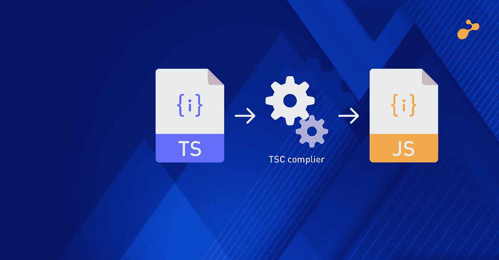

# 如何把香草 JavaScript app 改成 TypeScript？

> 原文：<https://blog.devgenius.io/how-to-change-vanilla-javascript-app-to-typescript-97f67f4c131c?source=collection_archive---------1----------------------->



图片来自[https://blog . e-zest . com/what-are-compiler-options-in-typescript](https://blog.e-zest.com/what-are-compiler-options-in-typescript)

**目的**

当我尝试将我的普通 JavaScript 应用程序改为 TypeScript 以用于我的实践时，几乎没有合适的文章。基本上，有一些文章使用 webpack，但我不认为这是一个好方法，因为我的应用程序只有一个长文件，所以我不需要像 webpack 那样的模块捆绑器。事实上，一开始我试着用 webpack 来改变，但是中途我改变了主意。那么，如何才能改变呢？在这种情况下，我决定使用 tsc。

**什么是 tsc？**

tsc 是微软官方的 TypeScript 编译器。如果我们使用 tsc，将 JavaScript 应用程序编译成 TypeScript 要容易得多。

**步骤**

1.  在命令行上使用 npm 安装 typeScript(NPM install typeScript—save-dev)
2.  创建“tsconfig.json”(或者只需在命令行上键入“tsc init”，就会创建 tsconfig.json)。
3.  编写如下所示的“tsconfig.json”。在我的例子中，我在 public file 中添加了我的文件，所以我指定了 outDir，这意味着在编译 tsfile 时在这个路径的文件夹中创建文件。

```
[tsconfig.json]{
  "compilerOptions": {
    "outDir": "./public/js",
    "allowJs": true,
    "target": "es5",
    "module": "commonJS",
    "moduleResolution": "node"
  },
  "include": ["script.ts"]
}
```

4.将扩展名更改为”。ts”。在我的例子中，由于我创建了 script.js，所以我把它改为 script.ts。

5.编译这个”。ts "文件。(如果想编译一次，只需输入“tsc 你的 ts . file’”。如果你想编译几次，你可以使用-w 选项" tsc 'your ts.file -w '然后 tsc 保持观察，当你改变你的 ts.file 时立即改变)
然后编译后的 script.js 会在 outDir 指示的路径处生成。我指示 outDir 的原因是为了避免弄乱文件，因为如果我们不指示 outDir，js 文件将在 ts.file 旁边生成(在我的例子中，它不起作用，所以我使用了不同的方式。稍后再分享)。

注意:tsc 可以编译”。ts“文件到”。js”文件，以便浏览器更容易理解。

例如，这是我的脚本代码的前五行。

```
[script.ts]const baseUrl = "[https://api.themoviedb.org/3](https://api.themoviedb.org/3)";
const imgUrl = "[https://image.tmdb.org/t/p/w500](https://image.tmdb.org/t/p/w500)";const popularUrl = `${baseUrl}/discover/movie?sort_by=popularity.desc&${apiKey}`;
const genreUrl = `${baseUrl}/genre/movie/list?${apiKey}`;
const searchUrl = `${baseUrl}/search/movie?${apiKey}&query=`;
```

但是，前 5 个文件编译后的 script.js 如下所示。

```
[script.js]var __awaiter = (this && this.__awaiter) || function (thisArg, _arguments, P, generator) {
    function adopt(value) { return value instanceof P ? value : new P(function (resolve) { resolve(value); }); }
    return new (P || (P = Promise))(function (resolve, reject) {
        function fulfilled(value) { try { step(generator.next(value)); } catch (e) { reject(e); } }
        function rejected(value) { try { step(generator["throw"](value)); } catch (e) { reject(e); } }
```

如你所见，这些完全不同。如果我们使用 webpack，基本上上面的那种文件就是收集并创建一个“bundle.js”文件。但是如果我们使用 tsc，我们应该像上面一样创建文件，所以如果你有多个文件，我建议你使用模块捆绑器，因为你的文件夹会很乱(因为每个文件应该有两个不同的 js，ts 文件)。

6.检查你在 index.html 的 src。您应该选择 outDir path 作为源匹配，因为此索引文件在编译后使用 js 文件。

```
[index.html(you don't need type="module" unless it's necessary to import and export file es6 way)]<script type="module" src="./js/script.js"></script>
```

7.搞定了。你可以看到你的应用程序工作正常。

*正如我在上面(步骤 5)所说的，我在使用 outDir 编译 ts 文件后未能选择 js 文件的目的地。所以我做了几种解决方案来应对。

解决方案 1:在命令行上使用 outDir 键入目标。例如，我们可以键入“tsc script.ts — outDir。/public/js”之类的(当然 outDir 之后要注明你的 js 路径)。

解决方案 2:在 package.json 中添加 outDir 命令

```
[package.json]"scripts": {
    "tsc:w": "tsc -w --outDir ./public/js”
  },
```

这意味着如果我们键入“npm(或 yarn) run tsc:w”，那么“tsc -w — outDir”。/public/js "自动运行并编译到 path 中。

**结论**
如果你想改变你那只有几个文件的普通 JavaScript app，用 tsc 编译 js 文件是不错的。在这种情况下，这比使用 webpack 容易得多，因为我们应该做一些设置来使用 webpack。希望这个解决方案能帮助你！

**参考**

什么是打字稿(percel):[https://parceljs.org/languages/typescript/](https://parceljs.org/languages/typescript/)

Tsc 选项:[https://www . typescriptlang . org/docs/handbook/compiler-options . html](https://www.typescriptlang.org/docs/handbook/compiler-options.html)

将 js 编译到不同的文件夹:[https://stack overflow . com/questions/24454371/how-can-I-get-the-typescript-compiler-to-output-the-compiled-js-to-a-different-d](https://stackoverflow.com/questions/24454371/how-can-i-get-the-typescript-compiler-to-output-the-compiled-js-to-a-different-d)

Github 回购:[https://github.com/aujourdui/movieAPI-app](https://github.com/aujourdui/movieAPI-app)

感谢您的阅读！！