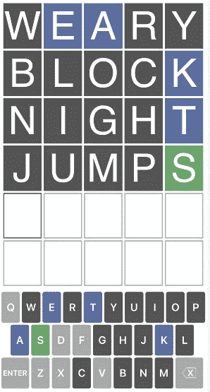
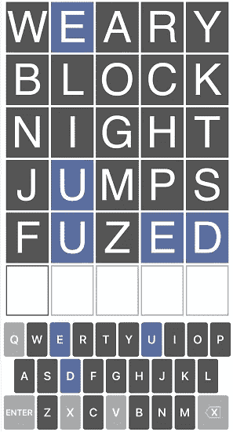
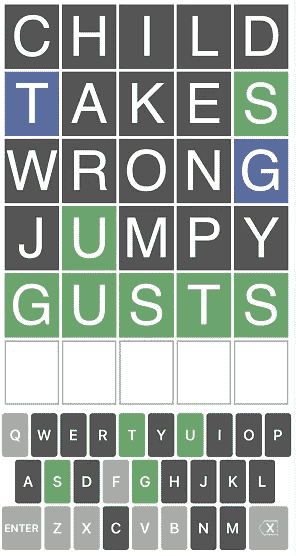
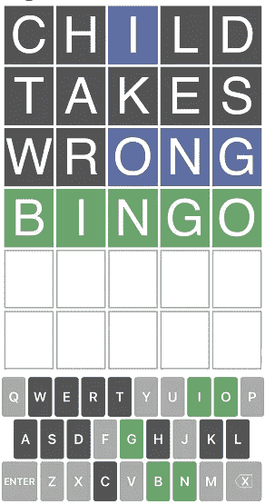
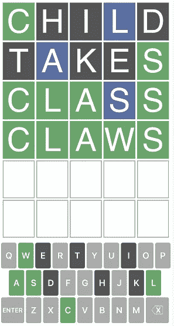

# 如何用 Python 在 Wordle 中作弊

> 原文：<https://blog.devgenius.io/how-to-cheat-in-wordle-with-python-b72e8904f868?source=collection_archive---------6----------------------->

*快速肮脏的解决方案*


在昨天之前，我从未听说过这个游戏，直到我看到了一篇关于媒体的文章，作者是 Rameez Kakodker。坦率地说，它在标题*第一次尝试*时让我迷失了，但多亏了这篇文章，我在 iPhone 上的 App Store 上搜索并找到了一个免费的应用程序，然后我在地铁里玩了几个小时这个游戏，睡觉前，今天早上又在地铁里。

# 手动解决方案和路障

我想出了我的第一个快速和肮脏的解决方案，首先输入最多 4 个单词，没有任何重复的字母，这使我能够快速排除大多数字母，并在最多 4 次尝试中获得尽可能多的线索。我的四个金字是:`weary`、`block`、`night` 、`jumps`，像下面这个:



截图 1

五个字母都已经确定，很容易猜出正确的单词，那就是`takes`。

但是，这种方法仍然会导致非常令人沮丧的情况，例如:



截图 2

你可以看到，在第四次尝试后，我仍然一无所知，所以我试图排除另外 3 个字母:`f`、`z`和`d`。这让我又尝试了一次，只剩下一次尝试，我仍然没有解决方案。(如果你能解决，请留言评论，我承认你更聪明)。

# Python 解决方案，版本 1

是时候发挥我的 Python 技能了，就像我每次遇到可以通过编程解决的问题时都会做的那样。

首先，我在网上搜索了一个 5 个字母的单词字典，在 GitHub 上找到了这个:

[](https://github.com/charlesreid1/five-letter-words) [## GitHub-Charles Reid 1/五个字母的单词:用 Knuth 的 5757 个五个字母的单词做实验。

### 这个库包含 Donald Knuth 的五个字母单词的 GraphBase 列表，以及运行各种…

github.com](https://github.com/charlesreid1/five-letter-words) 

它有 5757 个单词，应该足够了，毕竟你们中有多少人知道单词`aband`，它可以在这个 [12478 个五个字母的单词列表](https://www.bestwordlist.com/5letterwords.htm)中找到。下载 raw 格式的`sgb-words.txt`并保存到你的本地驱动器，在我的例子中，在`data`目录下。

第一步是以列表形式读取 txt 文件，这很简单:

```
sgb_file = 'data/sgb-words.txt' # save the file in your own local path
with open(sgb_file, 'r', encoding=encoding) as f:
    sgb = f.readlines()
sgb = getTxt(sgb_file, aslist=True)
len(sgb)**# Output:**
5757
```

那么简单的解决方案就是检查每个单词，看它是否只包含允许的字母:

```
letters = ['e', 'u', 'd', 'q', 'x', 'v']
for word in sgb:
    if all([l in letters for l in word]):
        print(word)**# output:** 
vexed
queue
exude
deque
```

因为我们知道`u`和`e`都不能出现在第二个位置，唯一可用的选项是`exude`，于是，问题解决了！

# Python 解决方案，版本 2

作为一个[务实的完美主义者](https://medium.com/p/pragmatic-perfectionism-884ce07a38b4)，我当然不会就此打住。我希望能够识别出符合 Wordle 中所有已知标准的单词。

所以我需要想出一个系统来整洁地记录所有的标准。经过一些尝试和错误之后，下面是标准记录代码:

```
import stringletters = {
    'e': [1, 3, 5], 
    'u': [1, 3, 4, 5],
    'd': [1, 2, 3, 4],
}
start_words = ['weary', 'block', 'night', 'jumps', 'fuzed']
others = list(set(string.ascii_lowercase)-set(''.join(start_words)))
for k, v in letters.items():
    if len(v)==1:
        others.append(k)
letters, others**# output:**
({'e': [1, 3, 5], 'u': [1, 3, 4, 5], 'd': [1, 2, 3, 4]}, ['x', 'v', 'q'])
```

这需要一些解释:

1.  `letters`字典记录了只允许在特定位置出现的已知字母，例如`e`不能出现在位置 2 和 4，所以可能的位置是`[1, 3, 5]`。
2.  如果一个字母显示为绿色，就像上面*截图 1* 中的字母`s` 一样，它应该被记录为`'s': [5]`，这意味着第 5 个字母必须是`s`。然而，在这种情况下，可能会有另一个`s`出现在其他位置。这就是为什么我们需要在下面的代码中将`s`追加到`others`中。
3.  我用一个`start_words`的列表找出哪些字母还没有测试，放在一个叫做`others`的列表里。
4.  最后，我添加了只有 1 个允许位置的字母，如*第 2 点*中所指出的。

标准准备好了，下面是我检查每个单词有效性的最后一段代码:

```
for word in sgb:
    if all([letter in word for letter in letters.keys()]):
        if all([letter in others for letter in set(word)-set(letters.keys())]):
            if all([w in others or i+1 in letters[w] for i, w in enumerate(word)]):
                if all([word[v[0]-1]==k for k, v in letters.items() if len(v)==1]):
                    print(word)**# output:**
exude
```

现在答案很完美，没有任何多余的话。请注意，我在层次结构中使用了 4 条`if`语句，可以将它们浓缩到一条`if`语句中，但是清晰比简洁好。

1.  第一个`if`语句检查所有已知字母(`e, u, d`)是否出现在单词中。
2.  第二个`if`语句检查一个单词中的所有未知字母(除`e, u, d`以外的字母)是否出现在`others` 列表中。
3.  第三个`if`语句检查单词的每个字母，看它是否出现在`others`列表中，或者出现在`letters`字典描述的允许位置。
4.  第四个`if`语句再次检查某个位置是否只包含某个字母(比如`'s': [5]`的情况)。

# 更进一步

你可能想知道我是怎么想出启动词黄金榜的:`weary`、`block`、`night` 、`jumps`，真相是偶然。但是我们能想出其他的组合吗？有没有包含 25 个字母的 5 个单词的组合？空谈不值钱，给我看看代码，大家一探究竟。

```
min_words = 4
magic_words = []
words = [w for w in sgb if len(set(w))==5]
for i, w1 in enumerate(words[:-2]):
    words2 = [w1]
    for j, w2 in enumerate(words[i+1:]):
        if any([any([d in w2 for d in w]) for w in words2]):
            continue
        else:
            words2.append(w2)
        if len(words2)==min_words:
            magic_words.append(words2)
            break
len(magic_words)**# output:**
228
```

上面的代码返回了 228 组 4 个单词的组合，它们都包含 20 个字母，下面是列表的预览图:

```
[['those', 'black', 'dying', 'frump'],
 ['might', 'world', 'space', 'junky'],
 ['world', 'being', 'facts', 'jumpy'],
 ['story', 'given', 'black', 'humpf'],
 ['kinds', 'power', 'match', 'bulgy'],
 ['vowel', 'bring', 'facts', 'jumpy'],
 ['girls', 'moved', 'watch', 'junky'],
 ['plant', 'forms', 'quick', 'wedgy'],
 ['wrote', 'child', 'banks', 'jumpy'],
 ['child', 'takes', 'wrong', 'jumpy'],
 ['solve', 'fight', 'drawn', 'jumpy'],
 ['force', 'sight', 'blank', 'jumpy'],
 ['cover', 'lands', 'fight', 'jumpy'],
 ['lands', 'fight', 'broke', 'jumpy'],
 ['drive', 'knows', 'match', 'bulgy'],
 ...
```

而且我特别爱这首:`[‘child’, ‘takes’, ‘wrong’, ‘jumpy’]`，朗朗上口，好记。

当然，上面的解决方案并不完美，搜索只是单向的，单词的顺序很重要。但是已经够快够好了。

一个更积极的解决方案如下:

```
words = [w for w in sgb if len(set(w))==5]
results = []
for i, w1 in enumerate(words[:-4]):
    sgb2 = [word for word in words[i+1:] if not any([d in w1 for d in word])]
    for j, w2 in enumerate(sgb2[:-3]):
        sgb3 = [word for word in sgb2[j+1:] if not any([d in w2 for d in word])]
        for k, w3 in enumerate(sgb3[:-2]):
            sgb4 = [word for word in sgb3[k+1:] if not any([d in w3 for d in word])]
            for w4 in sgb4:
                results.append([w1, w2, w3, w4])
len(results)**# output:**
1778289
```

几乎有 200 万个四字组合，涵盖 20 个字母。

而第二个问题的答案是否定的，没有涵盖 25 个字母的 5 字组合，至少在 5757 字列表中没有。

# 尝试一下

下面是我用 Python 作弊拍的几张截图:



截图三



截图 4



截图 5

最后一个代码供您参考:

```
letters = {
    'l': [2, 3], 
    'a': [3, 4],
    'c': [1],
    's': [5],
}
start_words = ['child', 'takes']
others = list(set(string.ascii_lowercase)-set(''.join(start_words)))
for k, v in letters.items():
    if len(v)==1:
        others.append(k)
print(letters, others)
for word in sgb:
    if all([letter in word for letter in letters.keys()]):
        if all([letter in others for letter in set(word)-set(letters.keys())]):
            if all([w in others or i+1 in letters[w] for i, w in enumerate(word)]):
                if all([word[v[0]-1]==k for k, v in letters.items() if len(v)==1]):
                    print(word)**# output:**
{'l': [2, 3], 'a': [3, 4], 'c': [1], 's': [5]} ['j', 'x', 'r', 'f', 'y', 'n', 'g', 'q', 'u', 'v', 'w', 'z', 'b', 'p', 'm', 'o', 'c', 's']
class
claws
clams
claps
clays
clans
colas
```

# 有问题或意见吗？

请在这里留下评论，如果你喜欢这个，请鼓掌和/或关注我的[medium.com](https://medium.com/@liaoshian)。