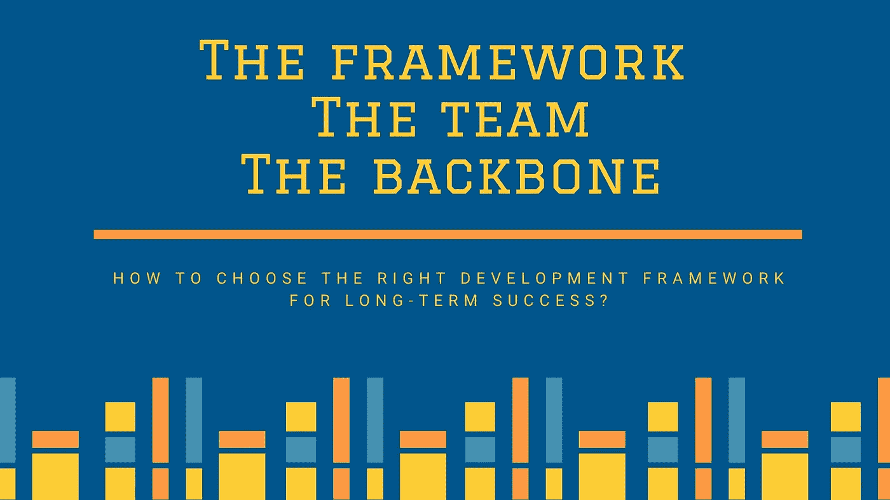
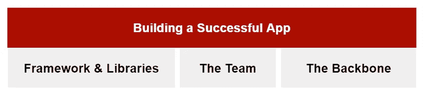
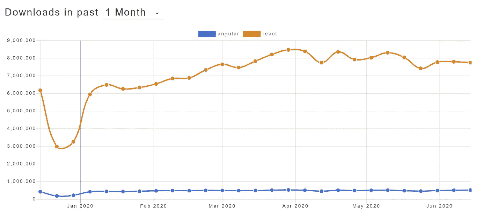

# 如何选择你的开发框架和库？

> 原文：<https://blog.devgenius.io/how-to-choose-your-development-framework-and-libraries-d36230960342?source=collection_archive---------7----------------------->

> 为长期成功的应用选择合适的框架时要考虑的三个方面

市场上有如此多的开发框架，我们经常迷失于如何选择正确的框架。在评估任何框架时，有三个主要方面需要考虑:

为成功的应用程序选择正确框架的三个维度

*   框架和库:选择框架或库对我有什么好处和坏处？
*   团队:框架对我现有的和未来的团队有多方便？
*   主干:框架的创建者有多可靠、可用和支持？

这三个方面对于选择正确的开发框架以获得长期成功非常重要。这些都是最佳的考虑，但并不保证将来会成功。为了保证成功，您应该选择最合适的框架，并且总是有 b 计划。

# 框架

选择开发框架时的一个核心因素是它的功能，我们在这一部分将考察框架的完整性、性能和可扩展性。

## 完全

框架带有一组内置特性，剩下的留给社区或您的团队去开发。当质疑完整性时，我们希望回答框架是否给了我们完整的功能来满足我们的需求，或者我们需要开发额外的特性来解决常见的问题。根据你的应用程序的复杂性，我们可以选择一个完整的框架或者一个简化现有功能的框架。

## 表演

在复杂的应用程序中，我们对分析应用程序如何执行和运行感兴趣。性能分析由两项工作组成:

1.  使用的框架和库。
2.  使用框架构建的应用程序。

当我们评估库和框架的性能时，我们应该考虑它们的大小、它们是如何加载的、运行时性能以及使用了什么优化库。在选择框架/库之前，您应该检查以下内容:

*   框架/库是否优化了依赖项的运行时编译？例如，它是提前还是在运行时加载静态资产？
*   框架/库是否有未使用的依赖项或代码？
*   什么时候加载代码？你的应用程序的某些页面中没有使用的代码是否仍然被加载？
*   通过使用服务器端渲染来改善你的应用的首次加载体验(我之前的文章:【https://medium.com/swlh/spa-mpa-or-a-hybrid-42fdf6b3415c对此有更深入的讨论)

在框架之间做出选择时，您必须考虑应用程序的性质。例如，在消费者应用程序中，消费者比企业应用程序更快地获得应用程序的第一批内容是至关重要的。

## **可扩展性**

开始构建一个 web 应用程序，然后决定将其扩展到移动或桌面应用程序，这种情况很常见。如果这是你的计划，那么从一开始就考虑这个框架是否允许你在未来扩展你的渠道是至关重要的。一个糟糕的框架选择将导致每个渠道的开发工作分别增加两倍，或者从头开始重新构建应用程序以适应渠道的扩展。

# 团队

如果您计划扩展您的开发团队，考虑选择一个能让您的生活变得简单的框架是很重要的。以下是选择框架时需要分析的一些方面:

## 易用性和学习曲线

评估一个框架的*易用性*和*易学性*是很重要的。大多数框架都有入门教程，可以让你了解开始使用框架有多容易。你的目标是随着你的应用变得越来越复杂，在入门和开发体验上以最小的投入选择最合适的框架。这一点非常重要，因为开发人员可能会跳进你的项目，复杂的体验会很昂贵。此外，考虑开始开发框架所需的开发人员技能对于轻松扩展您的团队非常重要。框架是用现有的还是易学的语言构建的？这让你有更大的机会为你的项目找到好的资源。总而言之，在选择框架之前，需要考虑以下几点:

*   入门教程有多复杂
*   API 的清晰度
*   证明文件
*   框架的架构
*   数据管理

## 可用工具

当选择一个框架时，我们希望确保它提供了一套完整的工具来加速开发。例如:提出以下问题:

*   框架有内置的模板语言吗？
*   IDE 和代码编辑器是否包含支持、插件和社区扩展，作为开发人员的内置功能？
*   有没有工具可以用所有的依赖和项目结构来搭建新的应用、功能或服务？
*   有没有自动化的工具来管理应用程序和运行本地服务器进行开发和调试？
*   有工具可以轻松地构建单元、功能或集成测试吗？框架有测试套件吗？
*   使用预构建的工具捆绑您的代码进行部署容易吗？

# 脊梁

选择了一个具有优秀功能和快速学习曲线的框架，让你的团队非常舒服，并不能保证你的应用程序长期成功。框架由他人开发、维护和支持。我们应该非常小心，如果其他人倒下或决定改变他们的业务方向，我们可能也会跟着倒下！我们可能会浪费大量时间来恢复和做其他人处理的工作。因此，我们应该选择一个框架，它有一个很强的支柱，不太可能打破。

## 成熟度(历史、知名度和社区)

我们使用框架来节省时间和提高生产力。然而，不成熟的框架会让开发人员修复不完整、错误、不兼容的升级，或者框架方向会改变，从而降低您的生产率和时间。我们可以从多个因素来推断框架的成熟度，例如:

*   *历史:*为什么以及何时创建框架？历史描绘了图书馆是如何开始的，以及它在未来将如何继续。
*   *流行度* **:** 现实生产应用程序中使用的流行框架是该库成功满足其他组织需求的标志。
*   社区生态系统(Community)&:一个流行的框架有可能是一个小社区，或者是一个不断缩小的生态系统，由扩展核心功能的插件和库组成。这可能表明该框架没有多少创新或发展。

您可以做一些活动来评估框架的成熟度、流行度和社区，例如:

*   https://stackshare.io/
*   libscore:[http://libscore.com/](http://libscore.com/)
*   npm 下载:[http://www.npmtrends.com/](http://www.npmtrends.com/)。这是一个对比 react 和 angular 上个月下载量的例子。

*   GitHub stars
*   StackOverflow 标记问题
*   检查空缺职位
*   如果 API 可用，您可以检查“尚未实现”的功能，以了解框架的未来计划。
*   检查现有的 bug 数据库:[https://github.com/vuejs/vue/issues](https://github.com/vuejs/vue/issues)

## 核心团队规模

核心团队的规模是团队支持和帮助社区的一个指标。不是每个框架都发布关于团队的信息。例如，Vuejs 有一个团队页面，与 angular 或 react 相比，他们的团队规模较小。来看看:[https://vuejs.org/v2/guide/team.html](https://vuejs.org/v2/guide/team.html)

## 支持

当你的应用处于生产阶段时，你希望它长期稳定。这是确保您使用的库和框架拥有 LTS(长期支持)的主要原因。例如，一个会改变其 API 的框架会破坏你的应用程序。因此，当您依赖大型框架或库时，您的应用程序崩溃的风险会更小，并且可以节省开发该功能的资源。另一个例子是，如果报告了安全漏洞，框架应该能够支持修复安全漏洞。

## 企业支持

一些框架得到了母公司或独立分支机构的支持。了解该框架是否由其他方发起或支持是很重要的。没有公司的支持，如果库被它的创建者放弃，你将没有内部维护、迁移或更新。你必须自己做这件事！这仍然不能保证主要支持者不会放弃他们的框架。例如，谷歌和脸书已经决定放弃他们的一些项目。

## 企业许可

最后但并非最不重要的一点是，考虑维护框架的许可也是一个关键点。利用开源产品的企业应该小心使用不违反源代码分发的软件。许可证的一个例子是 MIT 许可证，它可以在您创建的任何专有软件中使用。

## 总结

有大量的框架和库，我们经常会对选择哪一个感到困惑。一个糟糕的开发框架选择可能会使您陷入损失资源的风险中，并花费大量精力来修正您最初的选择！花足够的时间评估选项以做出正确的选择是非常关键的。