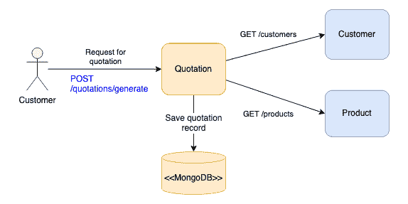

# 如何像亲依赖注入一样在 Java Spring 中编码

> 原文：<https://blog.devgenius.io/how-to-code-in-java-spring-like-a-pro-dependency-injection-69249fdb68?source=collection_archive---------0----------------------->

## 忘记@Autowired，拥抱构造函数注入

在 [Unsplash](https://unsplash.com?utm_source=medium&utm_medium=referral) 上由 [vadim kaipov](https://unsplash.com/@vadimkaipov?utm_source=medium&utm_medium=referral) 拍摄的照片

几十年来，就关键系统实现而言，Java 是占主导地位的编程语言。尽管基本概念保持不变，但随着语言的不断发展，编码风格和函数调用的使用有了很大的不同。

依赖注入已经成为软件设计领域的黄金法则。这样的概念在业界被广泛采用。关于依赖注入的介绍，请参考[这篇文章](https://www.freecodecamp.org/news/a-quick-intro-to-dependency-injection-what-it-is-and-when-to-use-it-7578c84fa88f/)。它是流行的软件框架(如 Java Spring framework)提供的一种通用设计模式。

依赖注入可以通过多种方式实现，如通过字段、方法和构造函数注入。常见的方法是使用@Autowired 按字段注入。然而，这是正确的方法吗？请记住，每种方法都可能对开发工作、可维护性和可测试性产生一定的影响。因此，采取正确的方法至关重要。

下面我们以保险报价服务为例来看一下。报价服务部负责根据要求提供产品报价。作为系统逻辑的一部分，它依赖于其他 3 个组件——报价库、产品服务客户端和客户服务客户端，以便制定报价。

如果没有依赖注入，传统的方法是让报价服务初始化它所依赖的服务。这将是创造一个新的瞬间或从工厂获得它。我相信没有人再用这种风格编码了。

像下面的示例代码一样使用@Autowired 是注入依赖项的常用方法:

使用@Autowired 没有任何问题，它完美地完成了工作。虽然有争议，但是有摆脱注解的趋势。事实上，在一次工作面试中，我就因为使用这种注释进行依赖注入而受到了挑战。

# 如何像专业人士一样编写依赖注入代码？

答案是构造函数注入。构造函数注入是一种更好的方法，主要是因为面向对象的设计概念和可测试性的好处。

下面的示例代码展示了使用构造函数注入的报价服务。很明显，注释被删除了。将 ***final*** 关键字应用于依赖项后，应该使用所有可用的依赖项来构造报价服务。构造函数是使用 Lombok annotation @ RequiredArgsConstructor 生成的(阅读[这篇文章](https://medium.com/dev-genius/how-to-magically-speed-up-java-coding-76fa1a68e0f4)了解更多关于 Lombok 的信息)

粗略地看一下示例代码，您可能不会意识到为什么构造函数注入是更好的方法。让我解释一下这篇文章的好处。

## 更清晰的代码

构造函数注入减少了代码行，因为不再需要注释。还需要为构造函数编码。使用 Lombok annotation @ RequiredArgsConstructor，它会自动为您的所有类属性生成一个带有 ***final*** 关键字的构造函数。它确保依赖关系作为组件构造的一部分提供。

通过@Autowired 注入神秘地将值设置为类的私有属性，这显然违反了基本 Java 编码模式的封装规则。相反，使用构造函数将依赖关系作为对象实例化的一部分是一种更自然的方法。

## 与软件框架无关

不可否认，Spring 是当今占主导地位的 Java 软件框架。大多数 Java 应用程序都是基于这个框架构建的。这个行业使用软件框架已经有几十年了。随着技术的不断发展，经验告诉我们，没有一个软件框架是永恒的。

如果将来升级或迁移，与框架的高度耦合可能会导致高成本。去掉@Autowired 使得代码对软件框架更加不可知。

通过构造函数注入，您可以轻松初始化类，而无需使用 Spring framework。有趣的是，它极大地简化了测试代码的设置。

## 增强的可测试性

如果依赖注入是由@Autowired 完成的，以便运行测试，那么我们需要 Spring framework 来创建上下文片。下面的示例代码依赖于 Spring 的注释来初始化带有模拟 beans 的报价服务。

通过构造函数注入，bean 的设置可以通过创建模拟和使用构造函数实例化报价服务来完成。显然，测试不依赖于 Spring 框架，它允许对测试设置进行更多的控制，因为我们可以自由地创建存根而不受框架的约束。

如果您的单元测试设置只是为了注入模拟 beans，那么由 Mockito 的扩展提供的注释简化了代码。@Mock 是创建模拟对象的简写，而@InjectMock 只是用所需的模拟对象实例化 QuotationService

# 结论

@Autowired 的使用肯定是现状，因为它是 Spring 框架发明的最古老的注释之一。尽管许多应用程序是使用@Autowired 构建的，但这并不意味着没有更好的方法。构造函数也无缝地实现了依赖注入。构造函数的使用不仅有助于我们从框架中分离出来，还允许测试设置有更大的灵活性。此外，代码仍然整洁，有 Lombok 注释帮助我们生成构造函数。