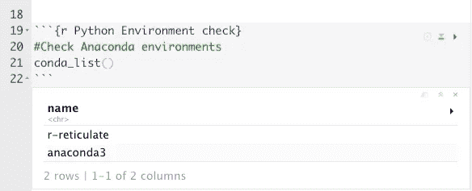

# 如何在 R Studio 中用 Python 编码

> 原文：<https://blog.devgenius.io/how-to-code-in-python-within-r-studio-caaec54c9d74?source=collection_archive---------5----------------------->

*在 R Markdown 中启动并运行蟒蛇和网纹*

连我孩子的毛绒玩具都喜欢 RStudio。图片作者。

我从来没有真正理解 Python 与 R 的争论，也不明白为什么会有无数关于它的文章。我坚信你应该使用你最熟悉的工具来完成工作。

当我使用 Python 工作时，我会选择使用 Jupyter 笔记本或 Spyder 作为我的 IDE *(集成开发环境)*。它们是很好的 IDE，而且还有很多用于 Python 的 IDE，但是我更喜欢 RStudio 用于数据分析的附加功能。通过使用充当 Python 接口的 [reticulate](https://rstudio.github.io/reticulate/) 包，您可以享受到在 RStudio 中使用 Python 的好处。

来源:[https://rstudio.github.io/reticulate/](https://rstudio.github.io/reticulate/)。图片作者。

# 如何开始

首先，确保安装了 [Anaconda](https://docs.anaconda.com/anaconda/install/index.html) 或者 Miniconda。Anaconda 是一个 Python 分发平台，它使得使用 Python 更加容易。安装完成后，通过打开 Anaconda Navigator 应用程序来验证您的安装。如果它打开了，你就成功了。

来源:[https://docs.anaconda.com/anaconda/install/index.html](https://docs.anaconda.com/anaconda/install/index.html)。图片作者。

回到 RStudio，打开一个新的 R Markdown 文档。插入一个 R 块来安装和加载 reticulate 包。作为参考，我使用的是运行 macOS Monterey 版本 12.0.1 的 MacBook

安装并加载 R 库。图片作者。

接下来，使用 [conda_list()](https://rstudio.github.io/reticulate/reference/conda-tools.html) 函数检查您的 Python 环境。第一列中的 dataframe 输出显示我有两个 Python 环境:r-reticulate 和 anaconda3。第二列返回 Python 环境的路径。

Python 环境检查。图片作者。

use_condaenv()函数允许您声明使用哪个环境。我将声明 anaconda3 环境，因为我发现它更容易使用。

声明 Python 环境。图片作者。

接下来，使用 py_install()函数安装 Python 包。我将连接我分析所需的 Python 包。输出窗口将向您显示您下载的软件包的状态，如果有任何更新发生。

用 py_install()安装 Python 包。图片作者。

***注意:*** *如果您因错误而无法使用 py_install()安装软件包，请在运行 R.* 中的 py_install()之前，使用[*pip install*](https://packaging.python.org/en/latest/tutorials/installing-packages/)*通过命令行(您操作系统的终端窗口)安装软件包*

接下来，我们可以插入 Python 块，而不是插入 R 块。

插入 Python 块。图片作者。

现在我已经插入了一个 Python 块，接下来我将导入我的 Python 库。

导入 Python 包。图片作者。

现在，您可以使用您的 Python 库，并像在 Python 编辑器中一样继续工作。

使用 pandas read_csv 函数导入 csv 文件并打印到控制台。信用数据集来自《统计学习导论》这本书。资料来源:statlearning.com。图片作者。

查看 Python 环境。

您可以在 Python 和 R 环境之间切换。图片作者。

Python 控制台。

作者图片

RStudio 中的 Python 环境。

RStudio 中的 Python 环境。图片作者。

在 RStudio 的 IDE 中使用 Python 有不同的方式，包括提供 Python 脚本，这些可以在 [reticulate](https://rstudio.github.io/reticulate/articles/rstudio_ide.html) 文档中找到。软件包作者建议对纯 Python 项目使用 Python 编辑器。然而，reticulate 允许您在不离开 RStudio 的情况下灵活地将 R 和 Python 结合在一起。

完整代码可以在 [Github](https://github.com/bonheurgirl/Python-in-R/blob/main/How%20to%20code%20in%20Python%20within%20R%C2%A0Studio.Rmd) 上找到。

# 参考

 [## Python 的接口

### Python 模块、类和函数的接口。当调用 Python 时，R 数据类型会自动转换…

rstudio.github.io](https://rstudio.github.io/reticulate/) 

詹姆斯·g .(2021)。统计学习导论:应用。[https://www.statlearning.com/](https://www.statlearning.com/)