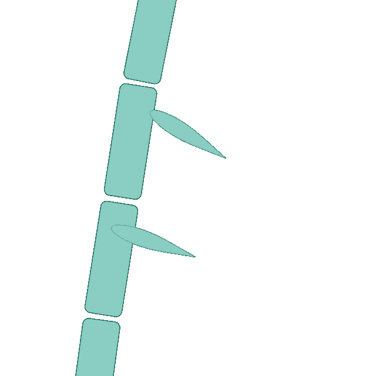
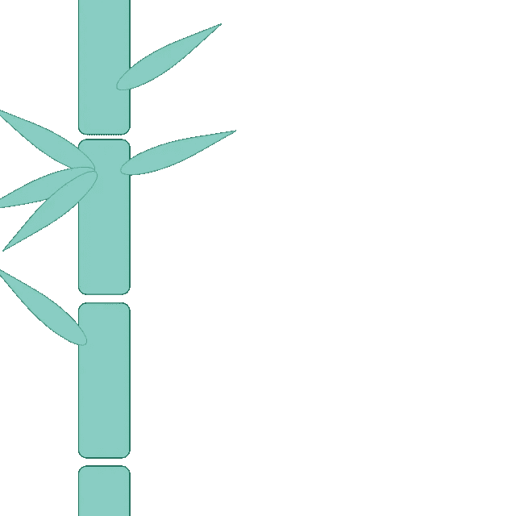
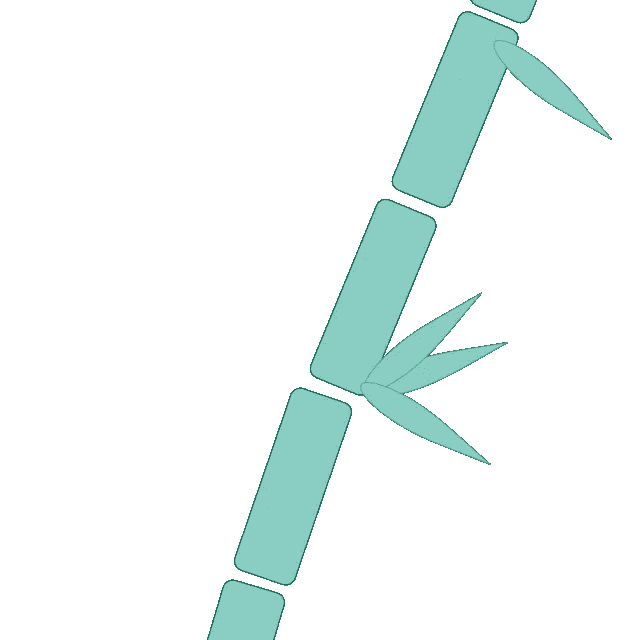
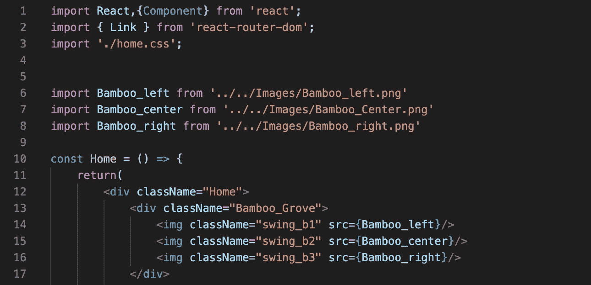
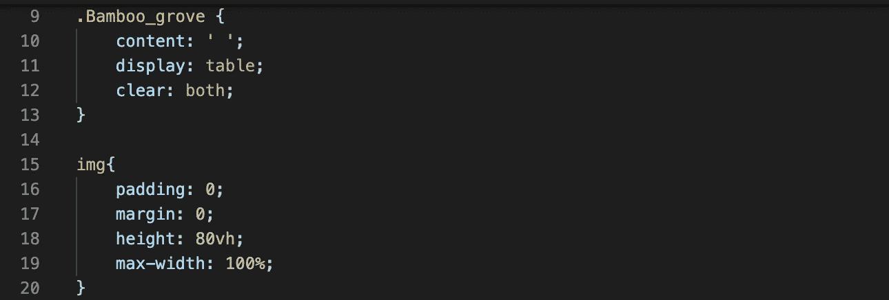
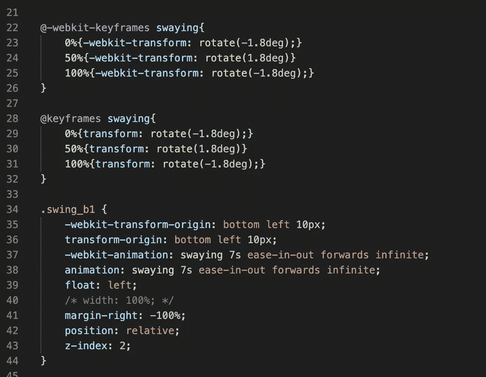
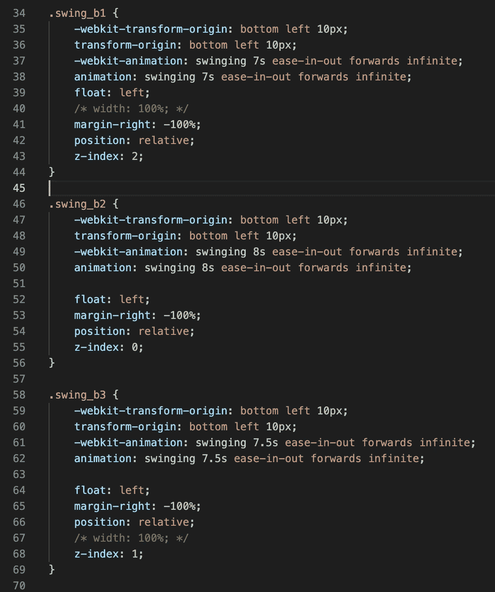

# 如何用 CSS 编码摇竹🎋

> 原文：<https://blog.devgenius.io/how-to-code-swaying-bamboo-with-css-f666232a3cf?source=collection_archive---------13----------------------->

添加动画是给简单的网页增添趣味的好方法。我也想这么做，但是发现了极其复杂的代码，我知道有一种更简单的方法。我所要做的就是把一些摇摆动画的代码反过来。这是我如何创造一个看起来在微风中摇摆的竹林。

第一步:准备你想制作动画的图像

我在一个免费的 Illustrator 复制品上创作了三(3)根竹子，但是使用你最熟悉的工具/技术。注意:如果你想要单独的柄彼此独立地移动，那么你需要为每个柄创建一个 png，就像我在这里展示的那样。

步骤 2:将图像添加到所需页面

将图像分别导入到 HTML 所在的页面上。创建一个 div 来保存所有的图像，并给它一个合适的类名，我把我的命名为“Babboo_Grove”。然后按照您希望的顺序调用它们作为 img 标签。

这是在反应，但使用任何你感到舒服

第三步:买鸭子🦆(或者竹子🎋)连续

首先，让我们设置我们的“grove ”,使图像看起来很漂亮。在你的 CSS 页面上调用 Bamboo_grove。将内容设置为“”，显示到表格，并清除到两者。这将允许图像重叠，以创建一个更繁茂的分组。根据您的喜好对图像应用样式。

第四步:制作一幅动画

现在我们开始讨论事情的实质。调用 webkit-keyframes，给动画起一个合理的名字，比如“摇摆”。我们将在树枝上制作一个轻微旋转的动画。所以对于 0%，我们想把它转换成-1.8 度的旋转。50%将是相同的，但为 1.8 度，100%将返回到-1.8 度。注意:确保 0%和 100%匹配，以获得平滑连续的动画。

现在我们需要将这个摇摆的动画应用到第一个图像上，以确保它看起来是正确的。首先，将 webkit-transform 的原点设置为“左下角 10px”，这是我如何使它合理地位于竹子图像底部的中心。对变换原点做同样的操作。现在，我们应用动画，对于 webkit 动画和常规动画，将它们设置为之前的摇摆动画，将持续时间设置为 7 秒，并将其设置为“渐入渐出向前无限”。测试它以查看它的外观，并根据需要进行任何更改。

第五步:复制，粘贴，并稍加修改

这是最简单的部分。从第一幅图像中复制代码并粘贴到其余的图像中。为了使摇摆看起来更自然，偏移动画时间。否则，你会在迪斯尼乐园的“世界真小”之旅中找到属于自己的东西。😬

第六步:沐浴在你创造的荣耀中

如果你想看完整的资源库，这里是我的 [Github](https://github.com/ReaganADavenport/portfolio-2.0) 。