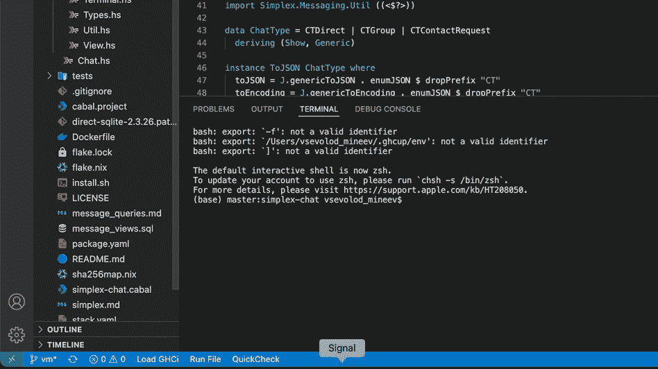
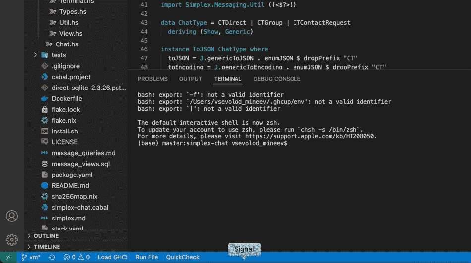
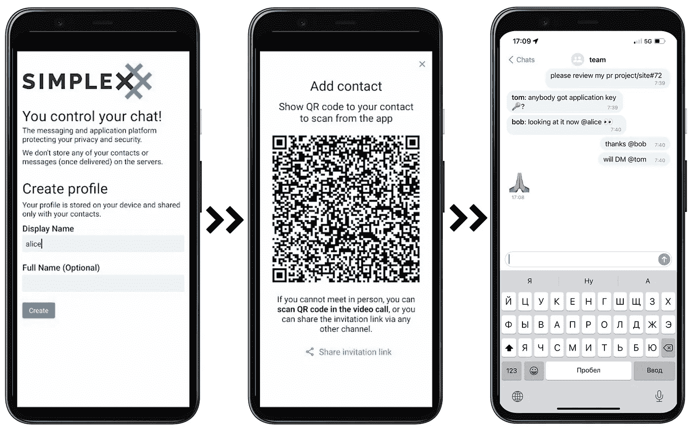

# 如何在 VS 代码中协作？

> 原文：<https://blog.devgenius.io/how-to-collaborate-within-vs-code-b70640b936d0?source=collection_archive---------6----------------------->

我想和你分享我最喜欢的 VS 代码生产工具，奇怪的是它不是一个扩展，而是一个 CLI 信使，你可以在终端视图中使用它。看一看:

Psssst，它支持降价！这是备忘单:

*   *粗体* ->粗体文本
*   _ italic _-->斜体文本
*   ~删除线~ ->删除线文本
*   `代码片段`-> `a + b //否*此处降价''
*   ！1 条短信！->红色文本(1–6:红色、绿色、蓝色、黄色、青色、洋红色)
*   # secret #--> # secret text #(可以复制粘贴)

# 酷！我们还能做什么？

嗯…相当多！我们可以发送文件，创建群组，给人们的手机发信息，同时保持隐私，并使用多层最先进的加密技术。下面是一个文件发送示例:

# 我如何安装？

**Linux & macOS:**

curl-o-[https://raw . githubusercontent . com/simplex-chat/simplex-chat/master/install . sh](https://raw.githubusercontent.com/simplex-chat/simplex-chat/master/install.sh)| bash

**窗户**

遵循这里的指示:[https://github.com/simplex-chat/simplex-chat](https://github.com/simplex-chat/simplex-chat)

# 功能的完整列表是什么？

*   在同一个终端窗口中与多人进行一对一聊天。
*   群发消息。
*   向联系人和群组发送文件。
*   用户联系地址—通过多用户联系链接建立联系。
*   消息保存在本地 SQLite 数据库中。
*   自动填充的收件人姓名—连接建立后，只需键入您的邮件即可回复发件人。
*   演示 SMP 服务器可用，并在应用程序中预配置，或者您可以[部署自己的服务器](https://github.com/simplex-chat/simplexmq#using-smp-server-and-smp-agent)。
*   没有全球身份或任何名称可见的服务器，确保您的联系人和对话的完全隐私。
*   两层 E2E 加密(双棘轮用于双工连接，使用带有临时 Curve448 密钥的 X3DH 密钥协议，NaCl crypto_box 用于 SMP 队列，使用 Curve25519 密钥)和接收者密钥的带外传递(参见[如何使用单工聊天](https://github.com/simplex-chat/simplex-chat#how-to-use-simplex-chat))。
*   消息完整性验证(通过包含先前消息的摘要)。
*   SMP 服务器使用自动生成的 Ed448 密钥验证每个命令/消息。
*   TLS 1.3 传输加密。
*   对从 SMP 服务器发送到收件人的邮件进行额外加密，以降低流量相关性。

# 这是一个应用程序吗？

耶！确实是。应用程序在 iOS 和 Android 上都可用，尽管它们处于开发周期的相对早期。点击这里查看这个网站的链接:[https://simplex.chat/](https://simplex.chat/)

