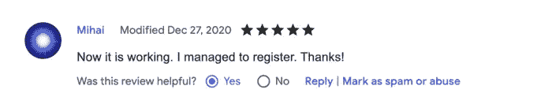

# 如何与谷歌、苹果、微软等竞争。

> 原文：<https://blog.devgenius.io/how-to-compete-with-google-apple-microsoft-and-co-315da7aa5376?source=collection_archive---------12----------------------->

## 个子小的好处。

照片来自 [Freepik](https://www.freepik.com/free-photo/white-stork-airplane_7677977.htm#query=opposite%20big&position=28&from_view=search)

在今天的世界里，像谷歌、苹果、微软等巨头决定了软件的质量标准。人们习惯了这些标准，并期望从每个软件中获得这种优秀的用户体验。大多数用户无法想象构建如此伟大的产品是多么具有挑战性。不可避免地，他们会将每个软件与他们每天使用的软件进行比较。对于小公司和开发人员来说，这些非同寻常的需求可能具有挑战性。

与雇佣世界上最好的开发人员的公司竞争并不容易。假设你是一家创建新音乐或视频流媒体服务的初创公司。你的软件需要与 Spotify、网飞等公司竞争，才能让人们相信你的产品。但是，开发这样的用户体验对于小型创业公司来说几乎是不可能的。然而，你可以做一些大型竞争对手做不到的事情——**做一些不具规模的事情。**

## 做不可扩展的事情

那是什么意思？就像用户习惯于拥有良好用户界面的优秀产品一样，他们享受着相当一般的客户服务。他们的客户服务标准是由他们的客户公司制定的，这些公司大多是大公司。当拥有数十亿用户时，提供让每个用户都感到独特和惊讶的客户服务是不可能的。这是小公司的一个优势:你可以提供大公司无法提供的服务水平。

> 蒂姆·库克不会在你买了笔记本电脑后给你寄一张手写的便条。他不能。但是你可以。— [保罗·格拉厄姆](http://paulgraham.com/ds.html?viewfullsite=1)

当你很小的时候，你可以采取非常措施，不仅是为了获得用户，也是为了让他们开心。你可以尽情发挥你的想法。一旦你意识到现有的惯例不是用户体验的上限，以一种非常愉快的方式思考你能在多大程度上取悦你的用户是很有趣的。五福就是一个例子。他们给每个新用户发了一封手写的感谢信。

> 你的第一批用户应该会觉得和你签约是他们做过的最好的选择之一。— [保罗·格拉厄姆](http://paulgraham.com/ds.html?viewfullsite=1)

如果你像我一样是一个有个人项目的开发人员，你是应用这个原则的最佳人选。通过与你的用户建立良好的关系，你会原谅你的应用程序中的许多错误。例如，由于一个 bug，一个用户在 Chrome 网上商店给了我一颗星的评价。我很快回复了他，并提出尽快修复这个 bug。幸运的是，我能够在同一天修复这个错误。发生了什么事？用户将其评论更改为 5 星评论:

 [## Web 亮点— PDF 和 Web 荧光笔

### 在每个网站或 PDF 上创建亮点、书签、标签和文件夹。以结构化的方式组织您的想法和研究…

chrome.google.com](https://chrome.google.com/webstore/detail/web-highlights-pdf-web-hi/hldjnlbobkdkghfidgoecgmklcemanhm) 

做不可扩展的事情可以在产品开发的许多领域有所帮助——例如，市场营销。一个引人入胜的故事是 Pinterest。他们早期经常去苹果商店，把所有浏览器都设置到 Pinterest 主页。他们可能不再这样做了，但是他们成功了。Airbnb 租了一台 5000 美元的相机，挨家挨户地为尽可能多的纽约房源拍摄专业照片。

有几个公司为了获得第一批客户而不按比例做事的故事。阅读更多关于 dothingsthatdontscale.com[的故事，从中获得灵感，让你的产品与众不同。](https://www.dothingsthatdontscale.com/)

## 最后的想法

与大型软件巨头竞争是很困难的。构建在质量方面更好的高质量软件似乎几乎是不可能的。因此，我们需要以不同的方式让我们的产品独一无二。做不成规模的事情，能让我们做很多大公司做不到的事情。例如，我们可以专注于卓越的客户服务，让每一位客户都感到独一无二。

谁知道呢？也许，如果你选择让你现有的用户超级开心，有一天，你会有太多太多的事情要做。这将是一个很大的问题。看看你是否能实现它！

我希望你喜欢阅读这篇文章。我总是很乐意回答问题，也乐于接受批评。请随时联系我😊

[**这里是无限制访问媒体上每一个内容的链接**](https://medium.com/@mariusbongarts/membership) 。如果你用这个链接注册，我会赚一小笔钱，不需要你额外付费。

 [## 通过我的推荐链接加入 Medium-Marius bong arts

### 作为一个媒体会员，你的会员费的一部分会给你阅读的作家，你可以完全接触到每一个故事…

medium.com](https://medium.com/@mariusbongarts/membership) 

关注我，不要错过我的下一篇文章。我写了关于 Typescript、Web 组件、前端框架、软件设计模式、Chrome 扩展以及更多的主题！🙏

## 关于我

我是埃森哲互动公司的软件工程分析师。我喜欢创造有价值的内容和产品，让人们的生活更轻松。例如，[**Web Highlights Chrome Extension**](https://chrome.google.com/webstore/detail/web-highlights-%20-bookmark/hldjnlbobkdkghfidgoecgmklcemanhm)使您能够在浏览器中高亮显示您访问的每个页面或 PDF 上的文本。您可以提供标签来对您的研究进行分组，并非常容易地重新找到它。你所有的精彩瞬间都会同步到 web-highlights.com[的相应网络应用上。看看吧！](https://web-highlights.com/)

通过**[**LinkedIn**](https://www.linkedin.com/in/marius-bongarts-6b3638171/)**联系我或者在 [**Twitter**](https://twitter.com/MariusBongarts) 上关注我。****

**** [## Web 亮点— PDF 和 Web 荧光笔

### 在每个网站或 PDF 上创建亮点、书签、标签和文件夹。以结构化的方式组织您的想法和研究…

chrome.google.com](https://chrome.google.com/webstore/detail/web-highlights-pdf-web-hi/hldjnlbobkdkghfidgoecgmklcemanhm)**** 

## ****进一步阅读****

**** [## 我的第一个 9.99 美元之旅与我的副业

### Chrome 扩展带来的被动收入

medium.com](https://medium.com/@mariusbongarts11/my-journey-to-the-first-9-99-with-my-side-project-3edc13dd1f2d)  [## 发布你的副业，现在！

### 如果你不为你的第一次发布感到尴尬，那你发布得太晚了。

javascript.plainenglish.io](https://javascript.plainenglish.io/publish-your-side-project-now-1e3bb170c079)  [## 用 Web 组件构建自己的博客组合:基础

### 第 1 部分—定制元素、阴影 DOM 和 HTML 模板

medium.com](https://medium.com/@mariusbongarts11/showcase-your-medium-articles-with-web-components-part-1-basics-d2c6618e9482)****