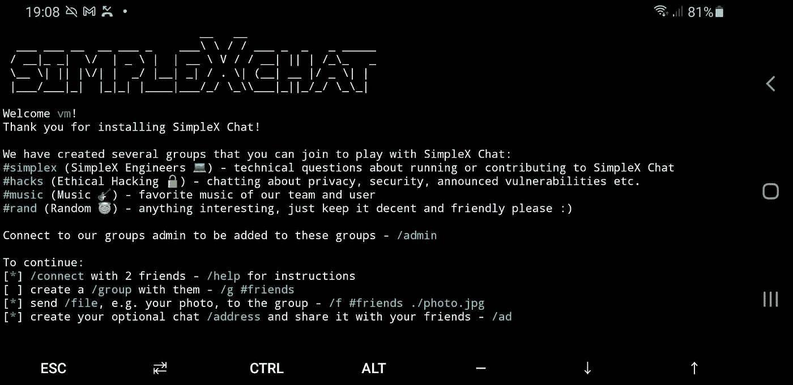

# 如何在 Termux 上为 aarch64 架构编译 Haskell！

> 原文：<https://blog.devgenius.io/how-to-compile-haskell-on-termux-for-aarch64-architecture-cc15375d3595?source=collection_archive---------3----------------------->

经过几周的尝试，我们让 Haskell 在 aarch64 架构上编译。这是在一部 Android 手机上完成的，Termux 运行了一个虚拟的 Ubuntu shell，这是由 PRoot 提供的，同时我们还付出了更大的努力来为 iOS 和 Android 移植 SimpleX。这个食谱假设一个新的 Termux 安装。



[SimpleX](https://github.com/simplex-chat/simplex-chat) 是一个瘦终端 UI 消息代理，使用 [SMP 协议](https://github.com/simplex-chat/simplexmq/blob/master/protocol)。单纯聊天的动机是[这里介绍的](https://github.com/simplex-chat/simplex-chat/blob/master/simplex.md)。

更新:

```
pkg update
```

更新 termux:

```
apt-get update && apt-get upgrade -y
```

安装依赖项:

```
apt-get install wget proot proot-distro git -y
```

前往个人文件夹:

```
cd ~
```

在 PRoot 上安装 Ubuntu:

```
proot-distro install ubuntu
```

登录 Ubuntu:

```
proot-distro login ubuntu
```

更新和安装依赖关系:

```
apt update && apt install curl libnuma-dev git llvm-dev clang make zlib1g-dev
```

安装 ghcup:

```
mkdir -p ~/.ghcup/bin && curl [https://downloads.haskell.org/~ghcup/aarch64-linux-ghcup](https://downloads.haskell.org/~ghcup/aarch64-linux-ghcup) -o ~/.ghcup/bin/ghcup && chmod +x ~/.ghcup/bin/ghcup
```

将其添加到路径:

```
echo “export PATH=\”\$HOME/.cabal/bin:\$HOME/.ghcup/bin:\$PATH\”” >> ~/.bashrc && source ~/.bashrc
```

设置 GHC 并安装 Cabal:

```
ghcup install ghc && ghcup set ghc && ghcup install cabal && ghcup set cabal
```

将 SimpleX 和 cd 克隆到其中:

```
git clone [https://github.com/simplex-chat/simplex-chat](https://github.com/simplex-chat/simplex-chat) && cd simplex-chat
```

为了避免 Android 杀死编译器，请启用电源模式，给手机充电，并通过“设置”的“设备管理”中的“内存”将 Termux 从跟踪中移除。

更新阴谋集团，然后建立:

```
cabal update && cabal build
```

单工目录-聊天将在最后的链接阶段打印。我的情况是:`/root/simplex-chat/dist-newstyle/build/aarch64-linux/ghc-8.10.7/simplex-chat-0.5.2/x/simplex-chat/build/simplex-chat/simplex-chat`

抓取位于上面目录中的 simplex-chat 的二进制文件->将其放在某个地方->使用`chmod +x simplex-chat` - >使其可执行，将放置二进制文件的位置添加到您的路径中。

最后输入`simplex-chat`启动单纯形。

本文转自[我的个人博客](https://sebastian-mineev.com/)。