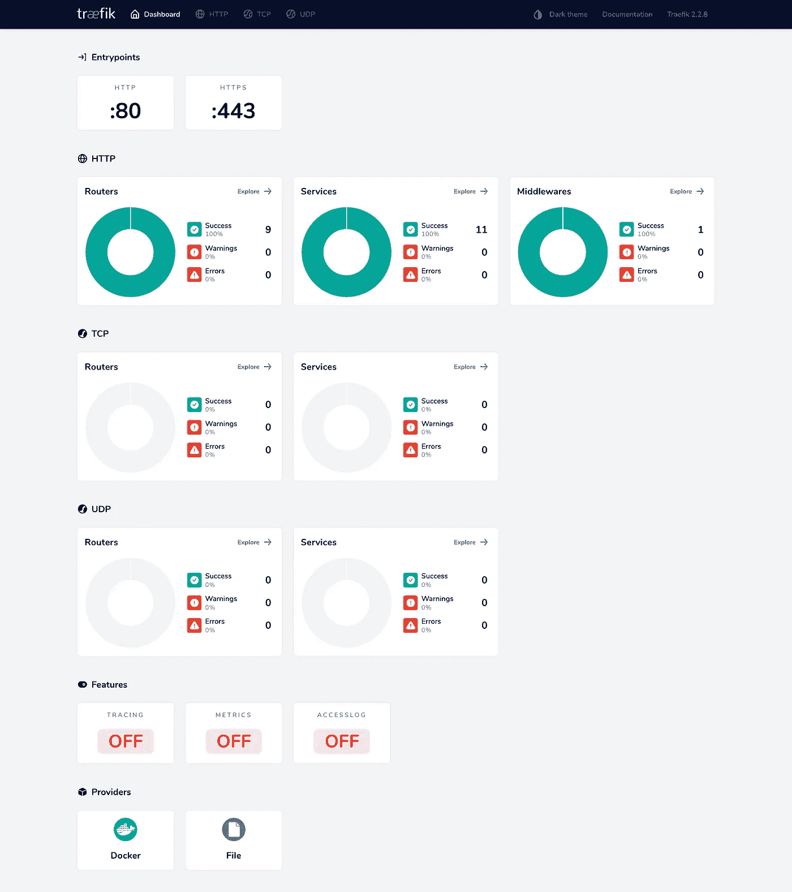

# 如何在 Docker 中配置 Magento Multistore

> 原文：<https://blog.devgenius.io/how-to-configure-a-magento-multistore-in-docker-5c26491d4ac5?source=collection_archive---------8----------------------->


保罗·埃施-洛朗在 [Unsplash](https://unsplash.com/s/photos/programming?utm_source=unsplash&utm_medium=referral&utm_content=creditCopyText) 上拍摄的照片

在 warden 中，可以为您的项目设置多个域。Warden 使用 Traefik，并作为全局服务安装。

Traefik 确保请求被拦截并发送到正确的后端服务，例如 https://app . example 1 . test https://app . example 2 . test。为此，它使用 HTTP 反向代理和负载平衡器。

它还有一个仪表板来监控不同的指标。这个你去 https:【https://traefik.warden.test/[就能找到。](https://traefik.warden.test/)

> 反向代理是位于 web 服务器前面的服务器，它将客户端(例如 web 浏览器)请求转发到那些 web 服务器。



在继续之前，请确保您已经在 Magento 中设置了一个多商店。你可以在我之前的博客文章[“如何在 Magento 2 中设置一个多商店”](https://rickdaalhuizen.com/posts/how-to-create-a-multi-store-in-magento/)中读到如何做到这一点。

要在本地为您的 Magento 商店设置多域，必须进行以下配置。

1.  为您的新域签署证书
2.  配置 Nginx 和 Varnish 来处理来自新域的流量
3.  通过设置运行参数，配置 Magento 2 加载不同的商店或网站。

# 步骤 1:为新域签署证书

```
warden sign-certificate <your_new_domain>.test
```

这将执行以下操作。

1.  更新您的 ssl 证书
2.  创建新的 ssl 证书。
3.  更新 Traefik

这是输出

```
❯ warden sign-certificate sportdrinks.test
==> Generating private key sportdrinks.test.key.pem
Generating RSA private key, **2048** bit long modulus
..+++
......................+++
e is **65537** (0x10001)
==> Generating signing req sportdrinks.test.crt.pem
==> Generating certificate sportdrinks.test.crt.pem
Signature ok
subject=/C=US/O=Warden.dev/CN=sportdrinks.test
Getting CA Private Key
==> Updating traefik
traefik is up-to-date
Connecting traefik to example_default network
Connecting tunnel to example_default network
Connecting mailhog to example_default network
Restarting traefik ... **done**
```

# 步骤 2:配置 Nginx 和 Varnish

从项目的根目录创建一个. warden/warden-env.yml 文件。此文件超出了 warden 中的环境模板。要查看完整的配置，请使用:warden env config。

> *每个环境的配置都使用一个基本配置 YAML 文件和一个可选的 darwin 和 linux 文件来将所有内容添加到基本配置中。*

将以下内容添加到您的。warden/warden-env.yml

```
**version**: "3.5"
**services**:
  **varnish**:
    **labels**:
      - traefik.http.routers.${WARDEN_ENV_NAME}-varnish.rule=
          HostRegexp(`{subdomain:.+}.${TRAEFIK_DOMAIN}`)
          || HostRegexp(`{subdomain:.+}.<your_new_domain>.test`)
  **nginx**:
    **labels**:
      - traefik.http.routers.${WARDEN_ENV_NAME}-nginx.rule=
          HostRegexp(`{subdomain:.+}.${TRAEFIK_DOMAIN}`)
          || HostRegexp(`{subdomain:.+}.<your_new_domain>.test`)
```

然后运行 warden env up -d 来更新您的容器。

# 步骤 3:配置 Magento 2 运行参数

创建一个 app/etc/Stores.php，按照 PSR-4 标准通过 composer.json 加载。

使用以下内容创建一个文件 app/etc/Stores.php:

```
<?php**use** \Magento\Store\Model\StoreManager;
$serverName = isset($_SERVER['HTTP_HOST']) ? $_SERVER['HTTP_HOST'] : **null**;**switch** ($serverName) {
    **case** app.<your_new_domain>.test':
        $runCode = <code>;
        $runType = <type>;
        **break**;
}**if** ((!isset($_SERVER[StoreManager::PARAM_RUN_TYPE])
        || !$_SERVER[StoreManager::PARAM_RUN_TYPE])
    && (!isset($_SERVER[StoreManager::PARAM_RUN_CODE])
        || !$_SERVER[StoreManager::PARAM_RUN_CODE])
) {
    $_SERVER[StoreManager::PARAM_RUN_CODE] = $runCode;
    $_SERVER[StoreManager::PARAM_RUN_TYPE] = $runType;
}
```

运行代码和运行时间是您的 Magento 商店或网站的商店代码和类型。您可以在 Stores -> Settings -> All Stores 下或者在 store_ *表中找到它。

```
{
    "autoload": {
        "files": [
            "app/etc/stores.php"
        ]
    }
}
```

运行 composer dump-autoload 以重新生成自动加载配置。

然后重新启动 warden containers 并导航到您的新域应用程序。<your_new_domain>.测试</your_new_domain>

# 觉得这个帖子有用吗？请点击👏下面的按钮！:)

## 来源:

*   [什么是反向代理？|代理服务器解释](https://www.cloudflare.com/learning/cdn/glossary/reverse-proxy/)
*   [典狱长——多个域](https://docs.warden.dev/configuration/multipledomains.html)