# 如何配置 AWS DynamoDB 表和 IAM 角色

> 原文：<https://blog.devgenius.io/how-to-configure-an-aws-dynamodb-table-and-iam-role-5c705a50230d?source=collection_archive---------19----------------------->

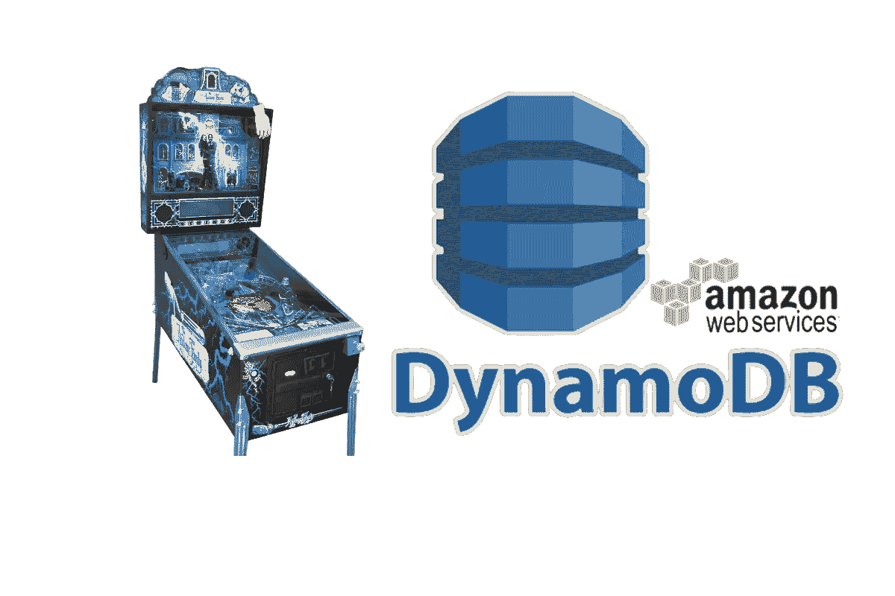

在这个项目中，我们将创建一个 DynamoDB 表，并用十大畅销弹球机填充它。然后，我们将应用基于角色的策略来允许来自 EC2 实例的读访问。

## 项目目标

*   创建一个 DynamoDB 表。
*   使用 IAM 角色和最小特权原则，授予 EC2 实例对 DynamoDB 的读取权限。
*   在 EC2 实例中使用 AWS CLI 扫描 DynamoDB 表。
*   在 EC2 实例中使用 AWS CLI 来验证您不能将项目写入 DynamoDB 表。

## 先决条件

*   AWS 自由层帐户
*   EC2 实例

## 什么是 DynamoDB？

DynamoDB 是由 Amazon Web Services 提供的完全托管的 NoSQL 数据库服务，以其低延迟和可伸缩性而闻名。

使用 DynamoDB，您可以以一种简单而经济的方式存储和检索任意数量的数据，并为任意级别的请求流量提供服务。固态硬盘提供高 I/O 性能，能够更高效地处理大量请求。用户通过 AWS 管理控制台或 DynamoDB API 与服务进行交互。

DynamoDB 数据库使用非关系的 NoSQL 数据库模型，因此可以在其数据模型之间操作文档、图形和列关系。DynamoDB 支持条件操作以及基本的 CRUD 操作。每个 DynamoDB 查询都使用一个唯一标识每个项目的主键。

## 步骤 1:创建表格

在 AWS 控制台中导航到 ***DynamoDB*** ，点击 ***创建*** ***表*** 。

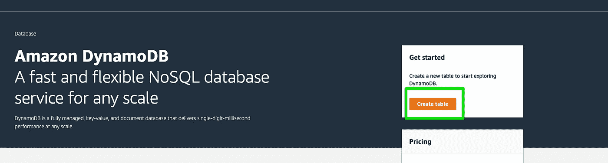

我将表命名为“ ***Pinball*** ”，并将值“ ***name*** ”用作分区键。不需要排序键，因为弹球机的名称将是唯一的。

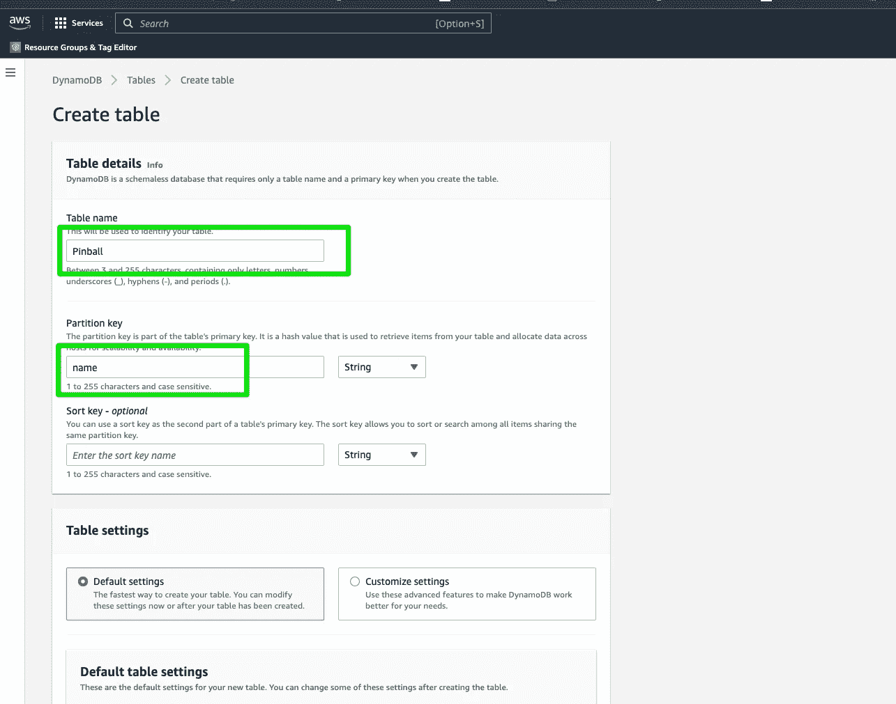

保留默认值然后点击 ***创建表格***

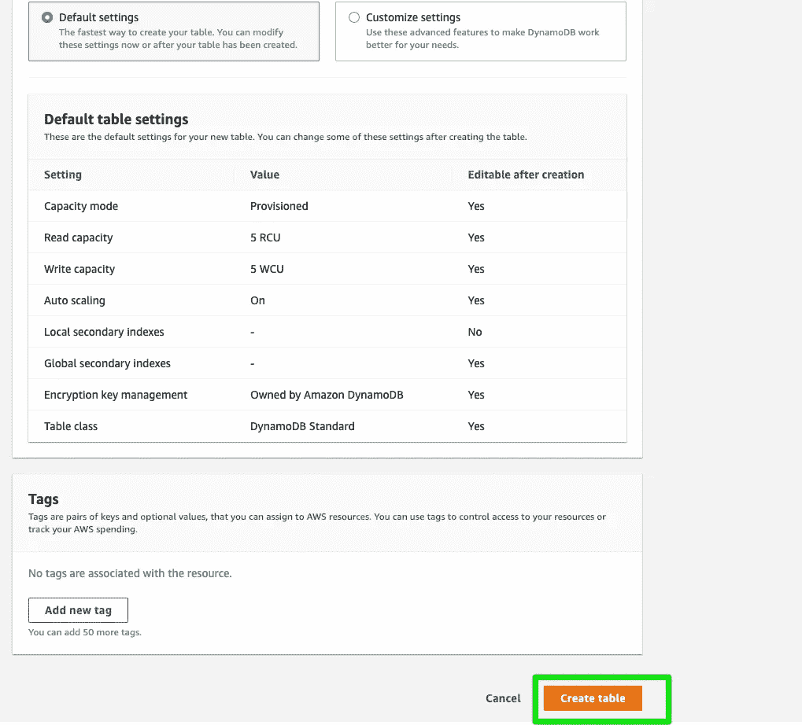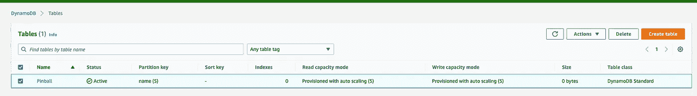

显示 DynamoDB 表

现在让我们用十大最畅销的弹球机填充表格。点击表格然后从操作下拉菜单中选择“ ***创建项目*** ”。

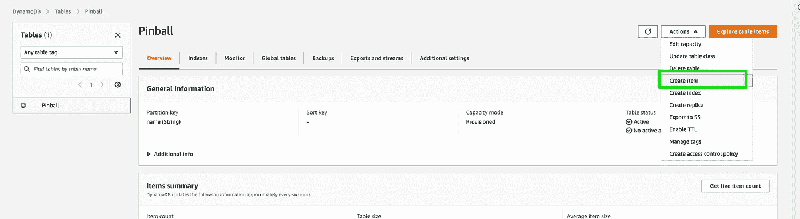

点击“添加新属性”下拉菜单，选择“**编号**，命名为“**单位**”。我们将在这里输入每台弹球机售出的数量。填写适当的信息并选择“**创建项目**”。重复接下来的九个项目。

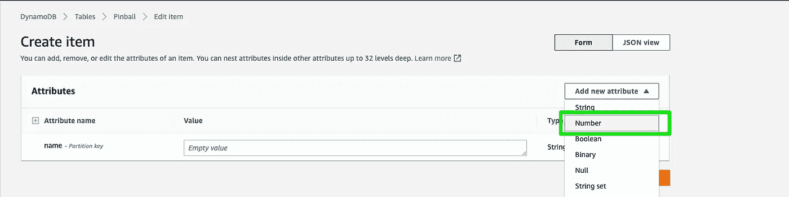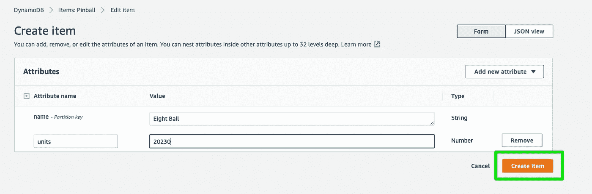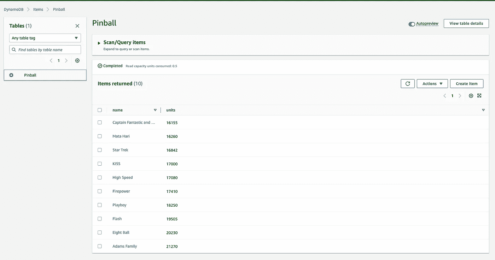

显示完成的表格

## 步骤 2:创建 IAM 角色

在身份与访问管理仪表盘中，点击 ***【角色】******【创建角色】*** 。为可信实体选择“ ***AWS 服务*** ”，为用例选择“ ***EC2*** ”。

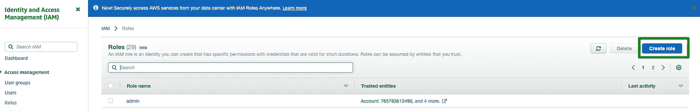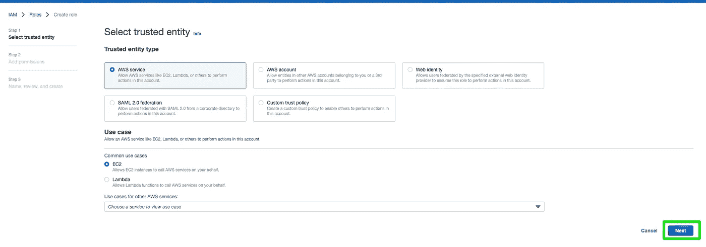

在下一个屏幕上，在搜索框中键入***DynamoDBReadOnlyAccess***并选择策略。

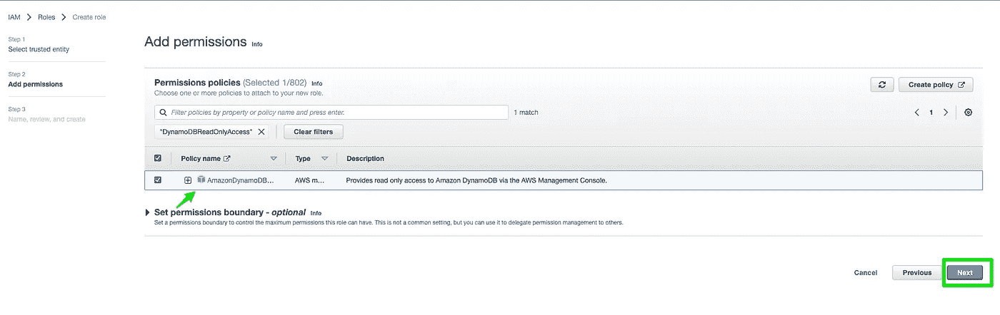

给角色起个名字然后点击 ***创建角色*** 。

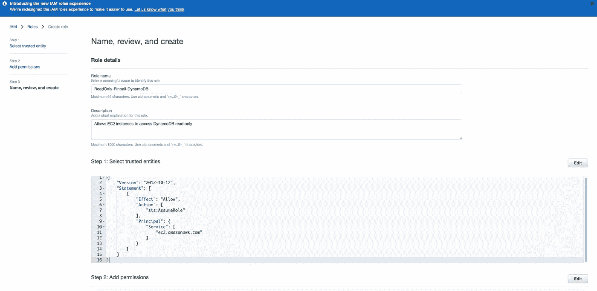

## 步骤 3:应用 IAM 角色

在控制台中导航到您的 EC2 实例。从 ***【动作】*** 【下拉转到 ***【安全】***>***修改 IAM 角色***

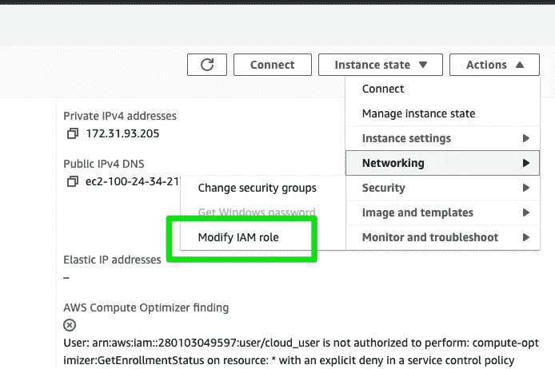

在下一个屏幕上，选择我们的 IAM 角色，然后单击“ ***更新 IAM 角色*** ”。

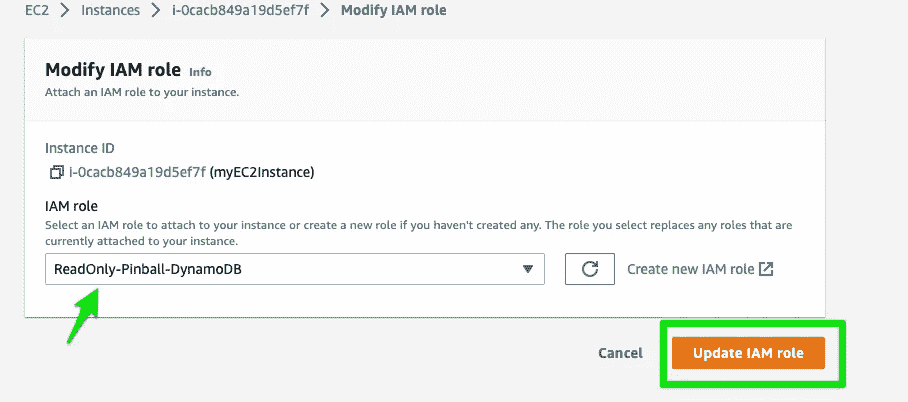

## 步骤 4:扫描 DynamoDB 表

连接到 EC2 实例，使用各自的表名运行下面的命令。

```
aws dynamodb scan --table-name Pinball --region us-east-1
```

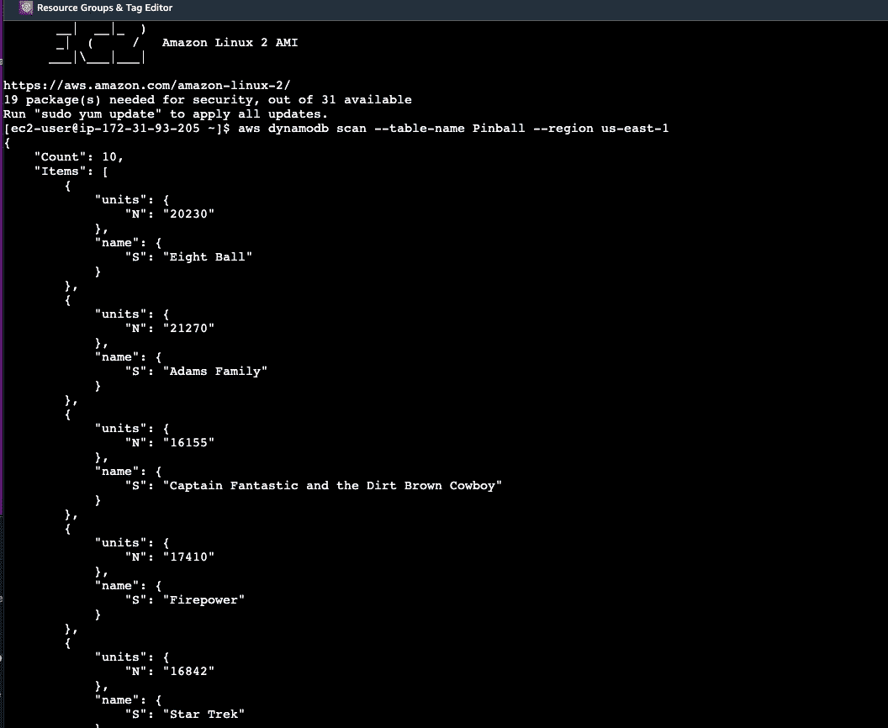

看起来我们成功了，可以从 EC2 实例中读取数据了。

## 步骤 5:测试权限

如果我们正确地设置了我们的角色，我们应该只能读表，不能写表。让我们通过尝试添加另一个项目来测试这一点。我将输入以下命令。

```
aws dynamodb put-item — table-name Pinball — item ‘{“name”: {“S”: “Twilight Zone”},”units”: {“N”: “15235”}}’ — region us-east-1
```

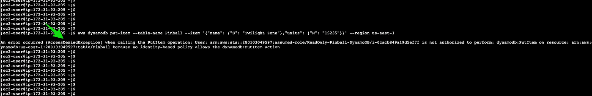

显示拒绝访问

成功！我们收到一个拒绝访问的错误。我们的 IAM 角色正在工作，不允许我们对表进行写操作。