# 如何配置 Apache Spark (Databricks)将日志发送到 Azure Log Analytics

> 原文：<https://blog.devgenius.io/how-to-configure-apache-spark-databricks-to-send-logs-to-azure-log-analytics-865050ccc147?source=collection_archive---------1----------------------->

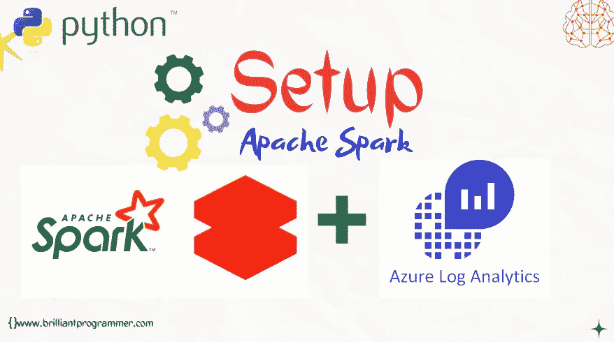

[brilliantprogrammer](http://www.brilliantprogrammer.com)

在本教程中，我们将配置 spark 集群，将日志发送到 Azure log analytics 工作区。如您所知，日志对于错误调试是必不可少的。

让我们直接进入设置:

在这里，我们使用[这个](https://github.com/mspnp/spark-monitoring)监控库。该库支持 Azure Databricks 10.x (Spark 3.2.x)及更早版本。

# 设置库的步骤:

## 步骤 1:克隆存储库[ [链接](https://github.com/mspnp/spark-monitoring.git)。

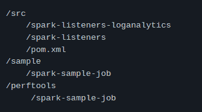

## 第二步:设置你的 Azure [数据块工作空间](https://docs.microsoft.com/azure/azure-databricks/quickstart-create-databricks-workspace-portal)。

## 步骤 3:安装 Azure Databricks CLI 并设置身份验证。

*   运行 bash 命令。

> *数据块配置—令牌*

*   然后它会询问您的数据块主机—输入您的数据块 URL https://adb- <workspace-id>。 <random-number>.azuredatabricks.net</random-number></workspace-id>

之后，输入您的 Databricks 工作空间的令牌。如果你不知道如何设置令牌，那么请阅读本博客。

## 步骤 4:安装

*   **Java 开发套件(JDK)1.8 版**

**安装 Java:**

*   **Scala 语言 SDK 2.12**

*   阿帕奇 Maven 3.6.3
*   从[网站](https://maven.apache.org/download.cgi)下载 Maven。

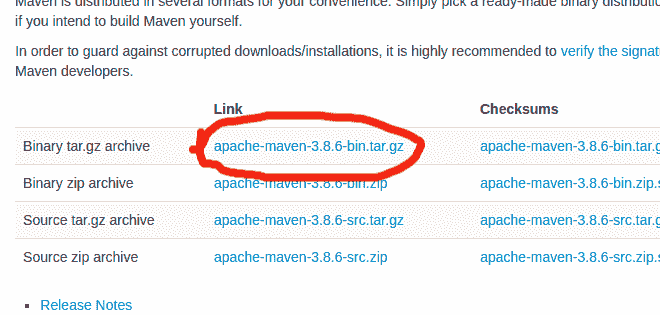

*   解压缩 tar.gz 文件

> *tar -xf {name}.tar.gz*

*   现在打开您解压文件的终端，并键入以下命令。

## **第五步:构建 Azure 数据块监控库**

**使用 docker**

*   打开终端并键入以下命令[首先将目录更改为/spark-monitoring]

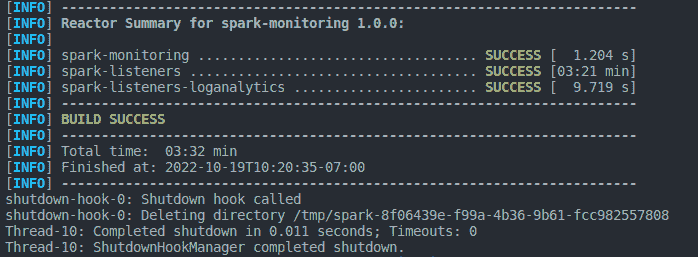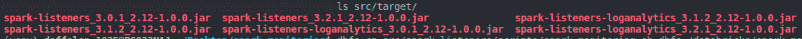

## 步骤 6:配置数据块工作区

*   **创建目录**

> dbfs mkdirs dbfs:/databricks/spark-monitoring

*   打开/src/spark-listeners/scripts/spark-monitoring . sh 文件，添加您的日志分析工作区密钥和 id。

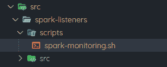

出于安全原因，您也可以在这里使用 azure key vault

*   现在输入您的 AZ_SUBSCRIPTION_ID，AZ _ RSRC _ 团体 _ 名称，AZ _ RSRC _ PROV _ 名称空间，AZ _ RSRC _ 类型，AZ _ RSRC _ 名称

**设置日志分析工作区**

*   打开日志分析工作区

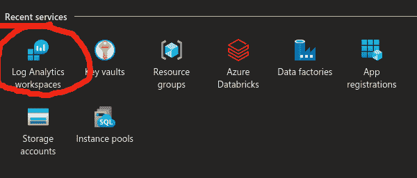

*   点击创建

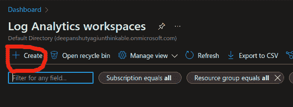

*   写下实例和资源组的名称，然后单击“查看和创建”

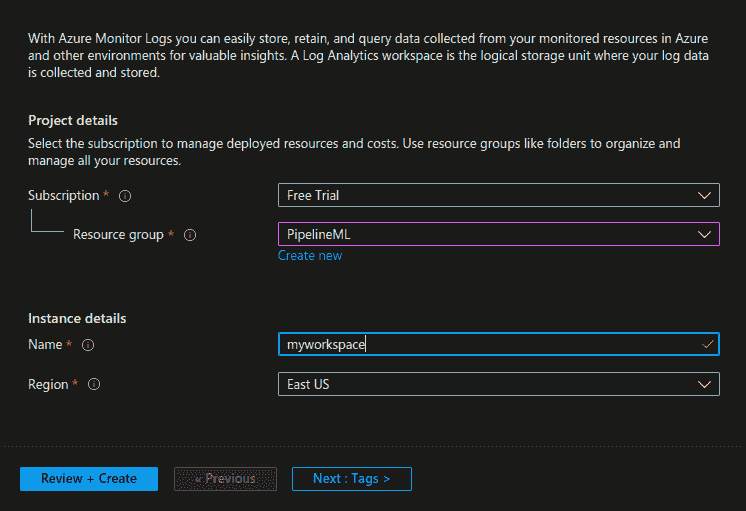

*   只需在 vault 中定义您的日志分析工作区机密。

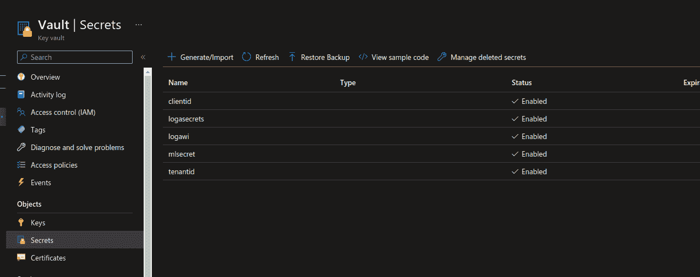

*   现在，在您的数据块笔记本中创建范围
*   在数据块 url 的末尾追加机密/创建范围

*   输入作用域名称，现在从 azure key vault 获取 azure key vault DNS 名称和密钥资源 ID

访问您存储日志分析工作区机密的 azure vault，复制 vault URI 并将其粘贴到资源 ID 的 DNS 名称和资源 ID 中。

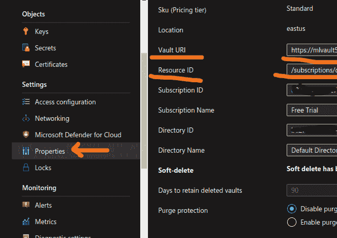

*   现在，点击创建

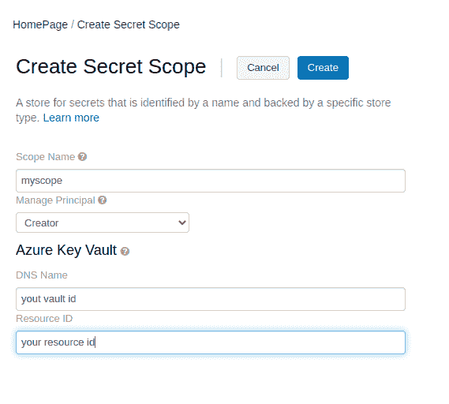

## 步骤 7:现在，将 src/spark-listeners/scripts/spark-monitoring . sh 复制到步骤 6 中创建的目录中，并将所有 jar 文件复制到 src/target 中

## 步骤 8:现在在 databricks 工作区中创建集群并打开高级选项

*   首先选择您的首选集群

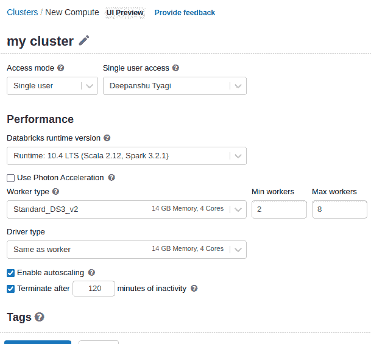

*   现在打开高级选项，像这样再添加两个环境变量

格式:{ {机密/{您的作用域名}/{您在密钥库中的机密名称}}}

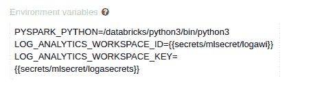

*   此外，将该脚本添加到您的 Init 脚本中，如下所示

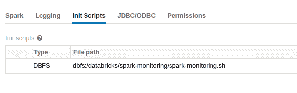

现在点击创建集群

**通过向 azure logs analytics 发送日志进行测试**

*   在 azure databricks 中创建新笔记本

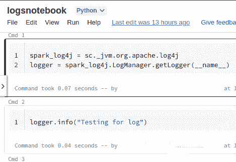

运行两个单元

*   访问 Azure 日志分析工作区现在访问日志部分

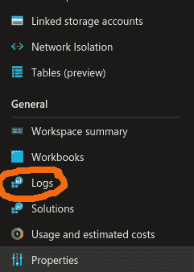

*   现在，您会看到自定义日志[如果您没有看到，请重新启动您的集群并等待一段时间，否则您会错过教程的某些部分]

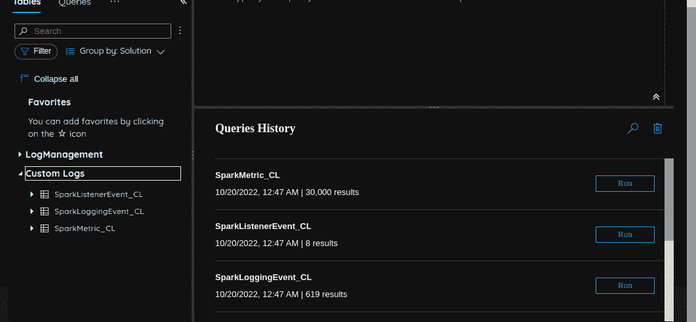

*   写一个查询并点击运行，你可以看到你的日志

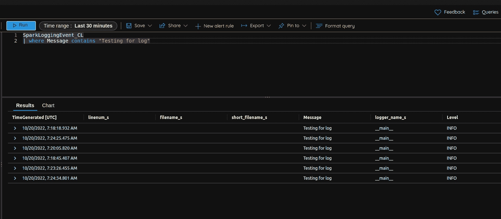

恭喜你，你已经成功地配置了我们的 spark 集群来将日志发送到 Azure log analytics 工作区。如果你想要更多这样的数据工程的东西。

> 请跟我来，也为这篇文章鼓掌。