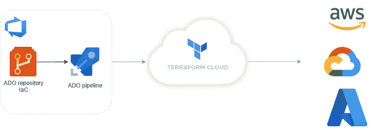
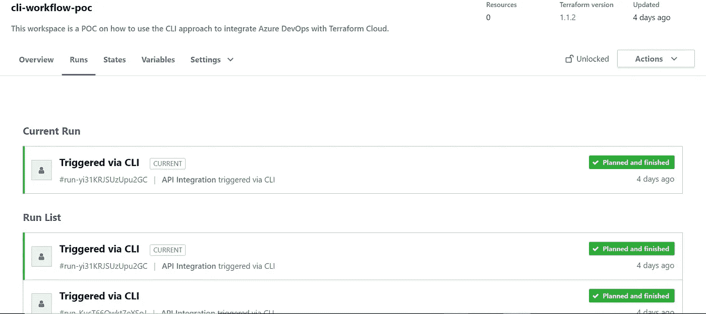
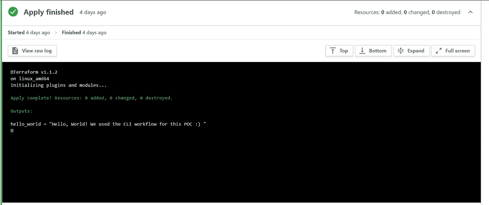
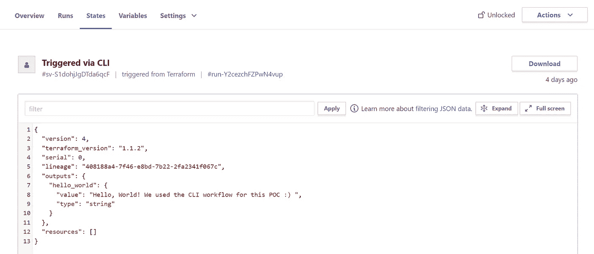

# 如何用 Terraform Cloud/Enterprise 配置 Azure DevOps？

> 原文：<https://blog.devgenius.io/how-to-configure-azure-devops-with-terraform-enterprise-cac1bbd9810b?source=collection_archive---------3----------------------->

在本文中，我们将重点关注如何使用 Terraform Cloud/Enterprise (TFE)从 Azure DevOps 环境中将基础设施部署为代码。



为了实现这一目标，有两种选择:

*   TFE **版本控制**集成
*   使用 **CLI 命令**的 Azure DevOps (ADO)管道

在这两个选项中，我们将在 Terraform 中部署一个简单的输出模块。

```
output "hello_world" { 
    value = "Hello, World! We used the VSC/CLI workflow for this POC :)"
}
```

所有代码都可以在我的 GitHub [库](https://github.com/ManelBoucenna/tfe-ado-connection)中找到。

# 假设

在开始之前，您应该有以下一些假设:

*   关于 ADO 管道的基本知识
*   TFE 或 Terraform 云组织
*   TF 工作区

# TFE 版本控制集成

这种方法包括将包含您的 TF 配置的特定于**的** ADO 存储库的分支关联到一个 TF Cloud workspace。

这可用于自动:

*   在该分支上创建拉请求时，执行[推测计划](https://www.terraform.io/cloud-docs/run/#speculative-plans)
*   当提交被合并到该分支时，TF 的触发器队列运行。

关于这种方法以及如何实施的更多细节可以在[这里](https://www.terraform.io/cloud-docs/run/ui)和[这里](https://www.terraform.io/cloud-docs/vcs/azure-devops-services)找到。

# 使用 CLI 命令的 ADO 管道

这种方法模拟了运行`terraform login`然后引入 TFE 令牌的手动步骤。这样做通常会生成以下 CLI 配置文件(`.terraformrc`或`terraform.rc`):

```
credentials "app.terraform.io" {
     token = "xxxxxx.yyyyyyy.zzzzzzzzzzzzz"
  }
```

要在管道中自动化这一步骤:

*   在 TF 配置文件中添加 TF 组织和工作空间的值:

```
terraform { 
    backend "remote"{ 
             organization = "YOUR-TFE-ORGANIZATION" #REPLACE_ME
             workspaces { 
                        name = "YOUR-TFE-WORKSPACE" #REPLACE_ME
                        } 
             }
}
```

> 为了连接到 TFE/Cloud，您需要提供 API 令牌的凭据。如 [TF 文档](https://www.terraform.io/cli/config/config-file#credentials-1)所述，提供的令牌必须是 [**用户令牌**](https://www.terraform.io/cloud-docs/users-teams-organizations/users#api-tokens) 或 [**团队令牌**](https://www.terraform.io/cloud-docs/users-teams-organizations/api-tokens#team-api-tokens)；组织令牌不能用于 CLI Terraform 操作。

*   将您的 TF API 标记作为敏感值保存在 ADO 变量组中。
*   在 ADO 管道的开头添加一个步骤，用于生成 CLI 配置文件。文件的位置可以使用`TF_CLI_CONFIG_FILE` [环境变量](https://www.terraform.io/cli/config/environment-variables)来指定。其他选项可能存在，如这里的[所述](https://www.terraform.io/cli/config/config-file#locations)。

```
variables:
- group: terraform-env

steps:
- script: |
        RC_FILE=".terraformrc"
        cat > ${RC_FILE} << EOF
        credentials "app.terraform.io" {
          token = "$(terraform-api-token)"
        }
        EOF
        mv .terraformrc ~/.terraformrc
        export TF_CLI_CONFIG_FILE="~/.terraformrc"
  name: terraform_cloud_credentials
  displayName: 'Terraform Cloud Credentials'
```

*   完成其余的 TF 步骤(安装、初始化、计划和应用)
*   添加最后一个步骤来清理您的 CLI 配置文件。

完整的 ADO 管道应该如下所示:

```
variables:
- group: terraform-env

steps:
- task: charleszipp.azure-pipelines-tasks-terraform.azure-pipelines-tasks-terraform-installer.TerraformInstaller@0
  displayName: 'Use Terraform latest'

- script: |
        RC_FILE=".terraformrc"
        cat > ${RC_FILE} << EOF
        credentials "app.terraform.io" {
          token = "$(terraform-api-token)"
        }
        EOF
        mv .terraformrc ~/.terraformrc
        export TF_CLI_CONFIG_FILE="~/.terraformrc"
  name: terraform_cloud_credentials
  displayName: 'Terraform Cloud Credentials'

- task: TerraformCLI@0
  inputs:
    command: 'init'
    backendType: 'selfConfigured'
    allowTelemetryCollection: true

- task: TerraformCLI@0
  inputs:
    command: 'plan'
    allowTelemetryCollection: true

- task: TerraformCLI@0
  inputs:
    command: 'apply'
    allowTelemetryCollection: true
- script: |
        rm ~/.terraformrc
  name: terraform_cloud_credentials_cleanup
  displayName: 'Terraform Cloud Credentials Clean Up'
```

> 至于 VC 方法，`[terraform plan](https://www.terraform.io/cloud-docs/run/cli#terraform-plan)`在 Terraform Cloud workspace 中启动[投机计划](https://www.terraform.io/cloud-docs/run/#speculative-plans)，`[terraform apply](https://www.terraform.io/cloud-docs/run/cli#terraform-apply)`启动正常计划并申请。

运行管道时，您应该在工作区中看到“通过 CLI 触发”的运行:



运行的输出



状态文件

完整的代码可以在我的 GitHub [库](https://github.com/ManelBoucenna/tfe-ado-connection/tree/main/cli-workflow)中找到。

# 参考

*   地形云和 TFE [文档](https://www.terraform.io/cloud-docs)
*   迈克·海克利的[文章](https://mikehacker.dev/blog/configuring-terraform-enterprise-credentials-to-work-with-azure-devops/) 在他的博客**[香蕉为鳞](https://mikehacker.dev/blog/)**