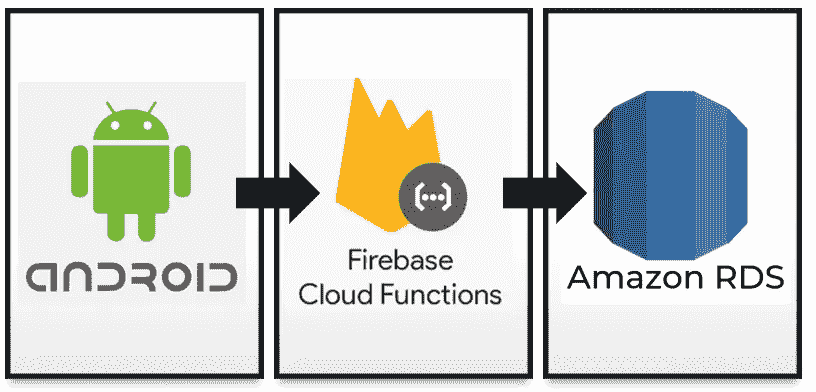
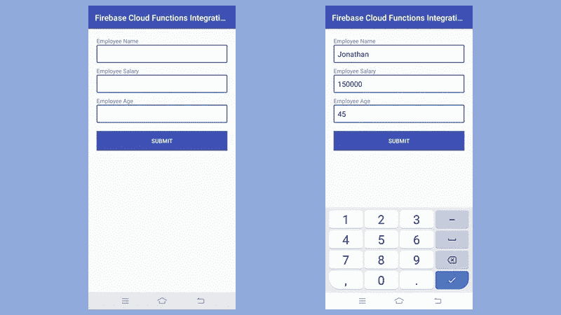
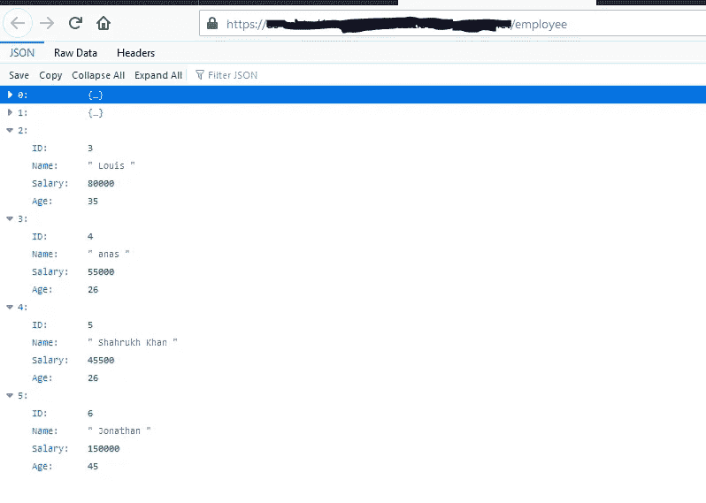

# 如何在不安装 Firebase SDK 的情况下连接 Android App 与 Firebase 云功能

> 原文：<https://blog.devgenius.io/how-to-connect-android-app-with-firebase-cloud-functions-without-installing-firebase-sdk-68d5ce7f12d0?source=collection_archive---------9----------------------->



在我的上一篇文章中，我提到了如何使用 Firebase Cloud 函数创建和集成您的 AWS RDS 数据库。我将使用(FCF 简称为 Firebase 云函数)。FCF(在我们的例子中)充当服务器来提供来自数据库的数据。但我们需要使用这些数据，并通过手机应用程序或网站的形式呈现给用户。在本教程中，我们将使用 Android 应用程序通过 FCF 向 AWS RDS 发布数据。这里的重点是从 Android 应用程序调用 FCF。无论如何，如果你错过了前一篇文章，请点击下面的链接。

查看更多: [FCF 与 AWS RDS 数据库的集成](https://medium.com/dev-genius/firebase-cloud-functions-integration-with-aws-rds-database-947a383e2e0c)

在本教程中，我将解释如何将你的云函数方法与你的 android 应用程序相结合。如果你在网上搜索，[Firebase](https://firebase.google.com/docs/functions/callable#java)的官方页面会告诉你添加依赖项安装 Firebase SDK 后才能调用 FCF。这是做这件事的一种方式，并没有什么不好(就我而言)。但在本教程中，我们将做一些更简单，更容易和通用的东西。

我们知道 FCF 充当 RESTful API，可以使用 postman 以类似的方式调用它。因此，我们将在本教程中使用类似的方法从 Android 应用程序调用 FCF，就像我们可以从 Android 应用程序调用任何 REST API 一样。

# 第一步:设置一个 android 应用程序，添加活动和布局页面。

如果你还没有 android 应用程序，那么使用 android Studio 创建一个新的 Android 应用程序。为样式编辑文本创建一个新的可绘制文件。通过编辑 manifest.xml 允许 internet 访问，并编辑您的布局文件，如下所示。

*edit_text_draw.xml:*

```
*<?***xml version="1.0" encoding="utf-8"***?>* <**shape xmlns:android="http://schemas.android.com/apk/res/android"** >
    <**solid android:color="#FDFDFD"** />
    <**stroke
        android:width="2dp"
        android:color="@color/colorPrimary"** />
    <**corners
        android:topLeftRadius="2dp"
        android:topRightRadius="2dp"
        android:bottomLeftRadius="2dp"
        android:bottomRightRadius="2dp"** />
</**shape**>
```

*AndroidManifest.xml:*

```
*<?*xml version="1.0" encoding="utf-8"*?>* <manifest xmlns:android="http://schemas.android.com/apk/res/android"
    package="com.akaystravel.apitest">
    **<uses-permission android:name="android.permission.INTERNET" />**
    <application
----------
----------
----------
    </application>
</manifest>
```

*activity_main.xml:*

```
*<?***xml version="1.0" encoding="utf-8"***?>* <**LinearLayout xmlns:android="http://schemas.android.com/apk/res/android"
    xmlns:app="http://schemas.android.com/apk/res-auto"
    xmlns:tools="http://schemas.android.com/tools"
    android:layout_width="match_parent"
    android:layout_height="match_parent"
    tools:context=".MainActivity"
    android:orientation="vertical"
    android:padding="20dp"** >
    <**TextView
        android:layout_width="match_parent"
        android:layout_height="wrap_content"
        android:text="Employee Name"** />
    <**EditText
        android:layout_width="match_parent"
        android:layout_height="wrap_content"
        android:inputType="text"
        android:layout_marginBottom="10dp"
        android:id="@+id/employeeName"
        android:background="@drawable/edit_text_draw"
        android:padding="10dp"** />

    <**TextView
        android:layout_width="match_parent"
        android:layout_height="wrap_content"
        android:text="Employee Salary"** />
    <**EditText
        android:layout_width="match_parent"
        android:layout_height="wrap_content"
        android:inputType="number"
        android:layout_marginBottom="10dp"
        android:id="@+id/employeeSalary"
        android:background="@drawable/edit_text_draw"
        android:padding="10dp"** />

    <**TextView
        android:layout_width="match_parent"
        android:layout_height="wrap_content"
        android:text="Employee Age"** />
    <**EditText
        android:layout_width="match_parent"
        android:layout_height="wrap_content"
        android:inputType="number"
        android:layout_marginBottom="20dp"
        android:id="@+id/employeeAge"
        android:background="@drawable/edit_text_draw"
        android:padding="10dp"** />

    <**Button
        android:layout_width="match_parent"
        android:layout_height="wrap_content"
        android:text="Submit"
        android:background="@color/colorPrimary"
        android:textColor="#FFF"
        android:id="@+id/submitId"** />

</**LinearLayout**>
```

# 步骤 2:编辑调用 Firebase 云函数的活动类。(使用邮寄方式提交表格)

这是教程的主要部分。我们记得，FCF 是一个 RESTful API。因此，在本教程中，我们将使用 Java HttpURLConnection 方法来调用 FCF。在 Android 中，当我们进行这样的网络调用时，最好的做法是调用异步方法，以确保它不会影响 UI 线程。出于同样的原因，我们将扩展 AsyncTask 类来调用托管在 FCF 上的 REST API。

本例中使用的最重要的 java 库如下:

```
**import** java.net.HttpURLConnection;
**import** java.net.URL;
**import** com.google.gson.JsonObject;
```

要使用 gson 库，我们需要在 build gradle 文件中添加依赖项，如下所示。这个库将帮助我们操作 JSON 对象。java.net.*库是内置的 java 库:

```
implementation **'com.google.code.gson:gson:2.8.5'**
```

*内部类 HTTPPostRequest:*

这是一个定制的内部类，用作异步方法进行 API 调用，在我们的例子中是 POST 方法调用。

```
**private class** HTTPPostRequest **extends** AsyncTask<Void, Void, Void> {
    HttpURLConnection **urlConnection** = **null**;

    @Override
    **protected** Void doInBackground(Void... voids) {
        **try** {
            JsonObject postData = **new** JsonObject();
            postData.addProperty(**"employeeName"**, **employeeNameET**.getText().toString());
            postData.addProperty(**"employeeSalary"**, **employeeSalaryET**.getText().toString());
            postData.addProperty(**"employeeAge"**, **employeeAgeET**.getText().toString());

            URL url = **new** URL(**"[YOUR-HOSTNAME]/employee/"**);
            **urlConnection** = (HttpURLConnection) url.openConnection();
            **urlConnection**.setRequestProperty(**"Content-Type"**, **"application/json"**);
            **urlConnection**.setRequestMethod(**"POST"**);
            **urlConnection**.setDoOutput(**true**);
            **urlConnection**.setDoInput(**true**);
            **urlConnection**.setChunkedStreamingMode(0);
            OutputStream out = **new** BufferedOutputStream(**urlConnection**.getOutputStream());
            BufferedWriter writer = **new** BufferedWriter(**new** OutputStreamWriter(
                    out, **"UTF-8"**));
            writer.write(postData.toString());
            writer.flush();

            **int** code = **urlConnection**.getResponseCode();
            **if** (code !=  200) {
                **throw new** IOException(**"Invalid response from server: "** + code);
            }
            BufferedReader rd = **new** BufferedReader(**new** InputStreamReader(**urlConnection**.getInputStream()));
            String line;
            **while** ((line = rd.readLine()) != **null**) {
                Log.*i*(**"data"**, line);
            }
        } **catch** (Exception e) {
            e.printStackTrace();
        } **finally** {
            **if** (**urlConnection** != **null**) {
                **urlConnection**.disconnect();
            }
        }
        **return null**;
    }
}
```

*MainActivity.java*:

```
**public class** MainActivity **extends** AppCompatActivity {

    EditText **employeeNameET**, **employeeSalaryET**, **employeeAgeET**;
    Button **submitButton** ;
    @Override
    **protected void** onCreate(Bundle savedInstanceState) {
        **super**.onCreate(savedInstanceState);
        setContentView(R.layout.***activity_main***);
        **employeeNameET** = (EditText) findViewById(R.id.***employeeName***);
        **employeeSalaryET** = (EditText) findViewById(R.id.***employeeSalary***);
        **employeeAgeET** = (EditText) findViewById(R.id.***employeeAge***);
        **submitButton** = (Button) findViewById(R.id.***submitId***);
        **submitButton**.setOnClickListener(**new** View.OnClickListener() {
            @Override
            **public void** onClick(View view) {
                **new** HTTPPostRequest().execute();
                Intent i = **new** Intent(MainActivity.**this**, MainActivity.**class**);
                startActivity(i);
                finish();
            }
        });
    }

    **private class** HTTPPostRequest **extends** AsyncTask<Void, Void, Void> {
--------------
-------------- **[SEE ABOVE - *Inner class HTTPPostRequest*]**
--------------
    }
}
```

**解释:**当用户点击提交按钮时，execute()函数将被调用，这是一个异步方法。活动将被重新加载，现有页面将被函数 finish()销毁。然而，将启动一个并行线程，该线程将调用 FCF API 来发布数据，如图所示。应用程序将记录从 API 返回的响应，否则将抛出一个 IOException，如图所示。应用程序的行为由您的业务规则以及您希望应用程序在出错和成功时的行为决定。你可以根据需要修改你的代码。

# 第 3 步:运行应用程序和测试。

我们的应用程序将看起来像这样。一旦您点击提交按钮，您的详细信息将通过 FCF 推送到数据库。



现在在浏览器中打开你的链接，它会显示你刚才输入的数据(如果它是这样显示的话。我的情况是)。



从 FCF 的 GET 方法返回值。

现在我们已经集成了来自 Android 的 FCF，为了增强您的项目，您可以通过使用 Android 中的 ListView 或 RecyclerView 来使用 GET 方法，以在您的应用程序中显示员工列表。

FCF 项目的 Git 代码。

[](https://github.com/ahmedkhan1991/firebaseFunctionsAwsRdsIntegration) [## Ahmed Khan 1991/firebasefunctionsawsrds integration

### Firebase 云功能 AWS RDS 集成。对 ahmedkhan 1991/firebasefunctionsawsrdsdintegration 做出贡献…

github.com](https://github.com/ahmedkhan1991/firebaseFunctionsAwsRdsIntegration) 

查看更多: [FCF 与 AWS RDS 数据库的集成](https://medium.com/dev-genius/firebase-cloud-functions-integration-with-aws-rds-database-947a383e2e0c)

本教程中描述的 Android 项目的 Git 代码:

[](https://github.com/ahmedkhan1991/androidFirebaseFunctionsIntegration) [## Ahmed Khan 1991/androidfirebasefunctions 集成

### 这个项目解释了如何在不使用 Firebase SDK 的情况下将 FIrebase 功能与 Android 集成。GitHub 是……

github.com](https://github.com/ahmedkhan1991/androidFirebaseFunctionsIntegration) 

更多这样的教程，请关注我的 Medium。

快乐学习。