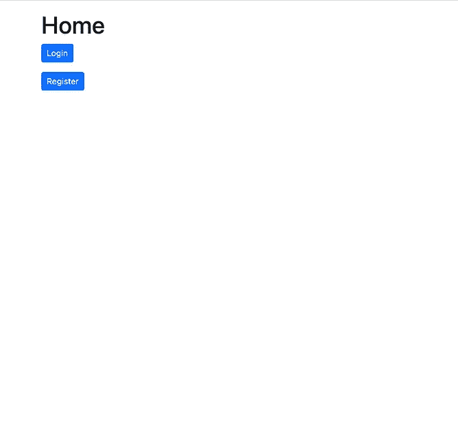
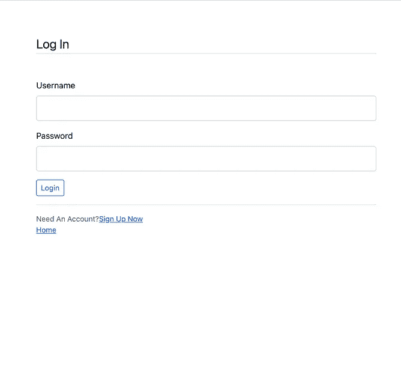
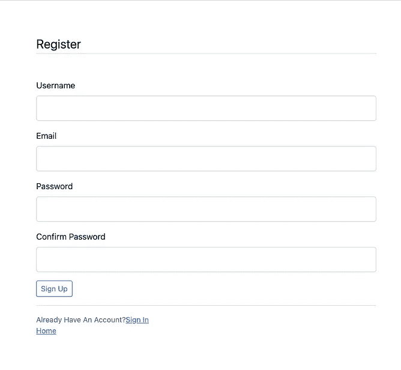

# 如何将数据库连接到 Flask 应用程序——第 1 部分

> 原文：<https://blog.devgenius.io/how-to-connect-database-to-a-flask-app-part-1-60611deea17a?source=collection_archive---------5----------------------->

## 通过 SQLAlchemy 将 SQLite 数据库连接到 Flask 应用程序


照片由[詹姆斯·哈里森](https://unsplash.com/@jstrippa?utm_source=unsplash&utm_medium=referral&utm_content=creditCopyText)在 [Unsplash](https://unsplash.com/s/photos/code?utm_source=unsplash&utm_medium=referral&utm_content=creditCopyText) 拍摄

# 介绍

在本教程中，我将解释如何使用 SQLAlchemy 将数据库连接到 Flask 应用程序。在我以前的一篇文章中，我描述了如何开始用 Flask 开发应用程序。所以，这篇文章可以被认为是它的扩展版本。因为，在本教程之后，您将能够向您的应用程序添加数据库。如果你错过了我之前的文章，请点击下面的链接。

[](https://medium.com/codex/getting-started-with-flask-development-4b52752e9545) [## 烧瓶开发入门

### 烧瓶入门指南。

medium.com](https://medium.com/codex/getting-started-with-flask-development-4b52752e9545) 

# 从一个基本的 Flask 应用程序开始

在本文中，我将在虚拟环境中安装必要的包。您可以使用下面的命令*轻松地为您的应用程序激活虚拟环境【我强烈建议您在为本教程设置开发环境之前参考上面的文章】*。

```
$ virtualenv env$ source env/bin/activateOnce you activate the virtual environment, you can install flask in it.$ pip install flask
```

然后我们可以用下面的基本配置文件来配置我们的 flask 应用程序。



作者截图

现在我们所有的配置文件都准备好了；然后，我们可以开始将数据库连接到我们的 flask 应用程序。

# 数据库创建

让我们使用下面的命令将 SQLAlchemy 安装到虚拟环境中。

```
$ pip install Flask-SQLAlchemy
```

然后我们可以将 SQLAlchemy 导入到我们的`app.py`文件中，并开始创建数据库。对于本教程，我使用 SQLite3 数据库，配置如下。

```
from flask_sqlalchemy import SQLAlchemy # database
app.config[‘SQLALCHEMY_DATABASE_URI’] = ‘sqlite:///db.sqlite3’
app.config[‘SQLALCHEMY_TRACK_MODIFICATIONS’] = False
db = SQLAlchemy(app)
```

接下来，我们需要为我们的数据库创建一个模型。因此，可以按如下方式进行配置。

```
class User(db.Model):
  id = db.Column(db.Integer, primary_key=True)
  username = db.Column(db.String(20), unique=True, nullable=False)
  email = db.Column(db.String(120), unique=True, nullable=False)
  password = db.Column(db.String(60), nullable=False)
  date_registered = db.Column(db.DateTime, nullable=False, default=datetime.utcnow)
```

# 配置注册和登录路由

一旦我们完成了数据库创建，我们就可以开始配置注册和登录路由，如下所示。

在您配置这些路线之前，请确保将`request, redirect, flash, url_for`包导入到您的`app.py`中。

# 初始化数据库并在主页上显示注册用户

在 SQLAlchemy 中，我们可以使用以下命令初始化数据库。我们可以在 route 中配置这个命令，这样一旦我们登陆主页，它将自动初始化我们的数据库，并准备好存储记录。

```
db.create_all()
```

此外，由于我们需要在主页上显示所有注册用户及其详细信息，我们可以使用下面的命令查询可用用户。

```
User.query.all()# here 'User' is our model name (eg: class User())
```

然后我们可以将这个查询与 home route 一起传递，这样它将在页面上显示所有注册的用户。

```
@app.route('/')def home():
  db.create_all()
  return render_template('home.html', title='Home', users=User.query.all())
```

之后，我们需要修改我们的`home.html`配置文件来显示用户的信息。我使用如下的`Jinja2`模板继承命令。

```
<p>
  {{ user.id }}<br />
  {{ user.username}} <br />
  {{ user.email }}<br />
  {{ user.password }}<br />
  {{ user.date_registered }}
</p>
```

# 为成功的用户注册和登录添加消息

我修改了`home.html`和`login.html`配置文件来显示用户注册和登录的消息，如下所示。我在两个配置文件中添加了下面相同的命令。

```
 
    
      <div class="alert alert-{{ category }}"> {{ message }}</div>
    
  
```

# 确认

在这个 flask 应用程序中，我们需要几个验证来确保在运行应用程序时不会出错。

因此，第一个验证是，当用户注册时，他/她必须为`password`和`confirm password`字段输入相同的**密码**。

让我们将验证添加到我们的`register.html`配置文件中。

```
<script>var password = document.getElementById("password"), confirm_password = document.getElementById("confirm_password"); function validatePassword(){
  if(password.value != confirm_password.value) {
    confirm_password.setCustomValidity("Passwords Don't Match");
  } else {
    confirm_password.setCustomValidity('');
  }
}password.onchange = validatePassword;
confirm_password.onkeyup = validatePassword;</script>
```

在本系列的下一部分，我将对应用程序进行一点点更新，并配置 **Flask WTForms** ，添加单独的表单和模型以确保我们接下来的验证。

在下一个教程中，我将检查新用户是否试图用现有的用户名或电子邮件注册；如果是这样，我们需要避免注册，并通知用户选择其他用户名或电子邮件。使用 **WTForms** 进行这种验证非常容易，所以我们将在第 2 部分重点讨论这一点。

*   [GitHub 回购](https://github.com/randiltennakoon/flask_DB)

**感谢您的阅读！**

**快乐编码**👨🏻‍💻