# 如何将 Databricks community edition 与 Power BI 连接

> 原文：<https://blog.devgenius.io/how-to-connect-databricks-community-edition-with-power-bi-6864f071c3cd?source=collection_archive---------4----------------------->

任何时候，我都见过人们在将社区数据块与他们的 power bi 桌面连接起来进行可视化时遇到困难。因此，在本文中，您将了解如何将 databricks 的免费版或社区版与您的 power bi 桌面连接起来。

## 首先，从 databricks 的 dbutils 中上传并读取您的 CSV 文件。

在您上传 CSV 或任何其他文件以便在 databricks 笔记本中读取之前，首先您需要创建一个目标文件夹，您将在其中上传您的数据。

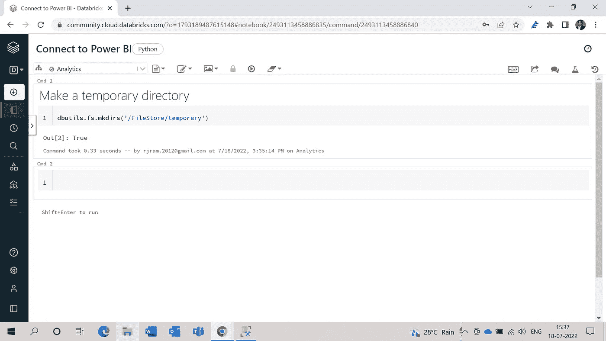

**在 dbfs 中制作一个目录**

要创建空白目录，请使用以下代码:

> dbutils . fs . mkdirs('/file store/temporary ')

现在，要上传 dbfs 中的数据，您必须选择选项**数据> DBFS >文件存储>临时**，然后单击上传按钮。

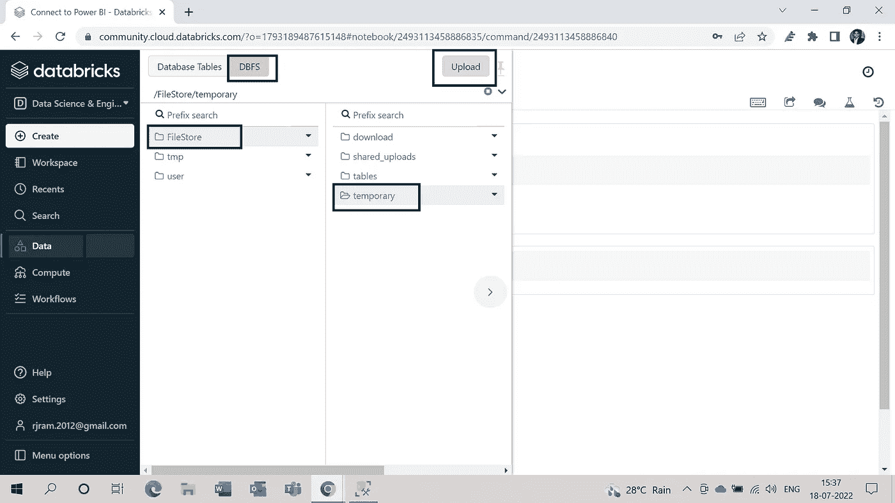

**数据块中的上传选项**

然后从本地机器中选择 CSV 文件，并按下**打开。这将把您的文件上传到 databricks 的 **dbfs** 中。**

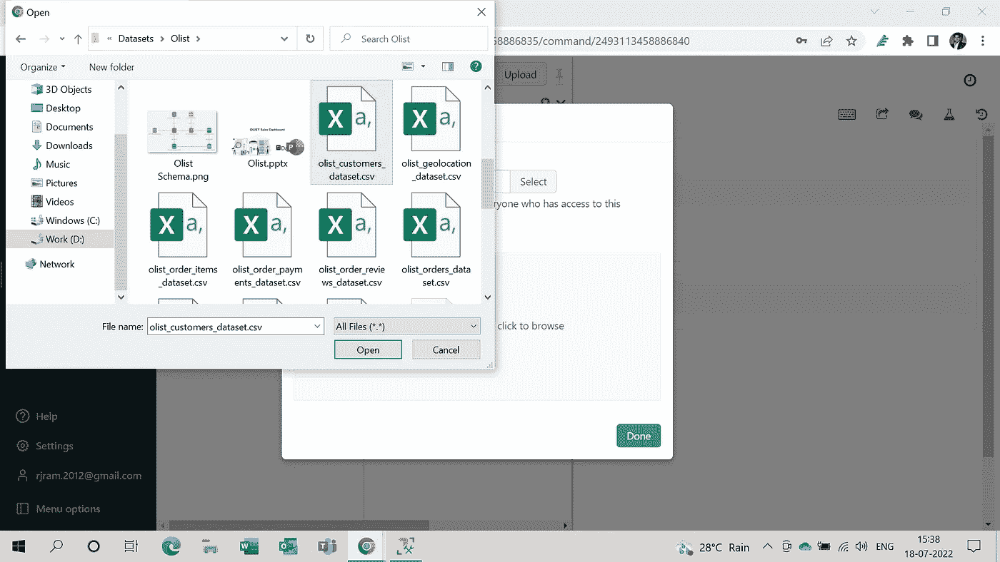

**选择 CSV 文件上传到数据块**

上传完成后，您可以在 CSV 文件上看到绿色勾号。

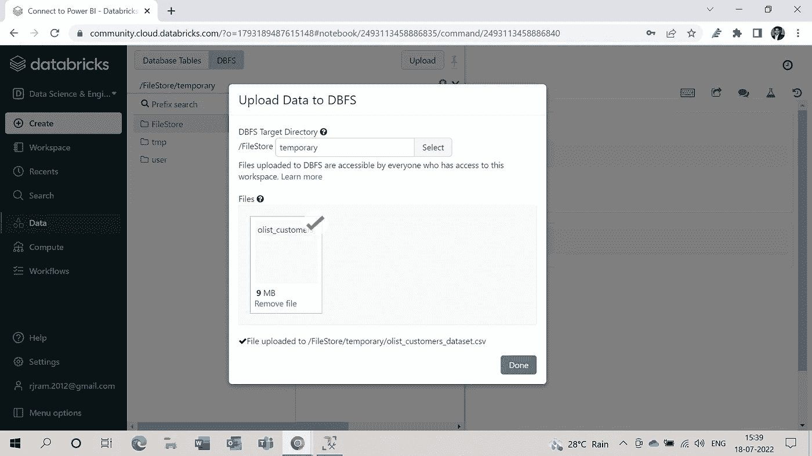

**CSV 文件现已上传**

成功上传 CSV 文件后，现在您可以开始 power bi 连接的主要工作，即通过在笔记本中编写简单的代码来读取 databricks spark 中的数据:

> customer = spark . read . format(' CSV ')。选项(header = True，inferSchema = True)。load('**Your _ File _ Location**')|在我的情况下是它的"**/File store/temporary/olist _ customers _ dataset . CSV**"

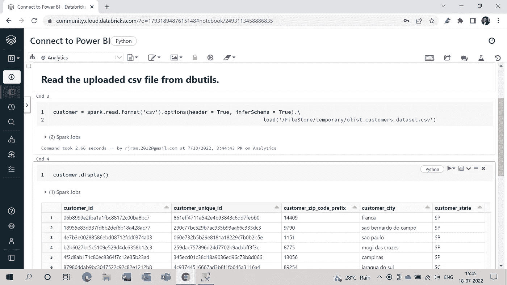

**读取 spark 中的 CSV 文件并显示**

当您成功读取 spark 中的数据并将其存储在数据帧中时，最重要的事情就来了，您必须使用您的数据帧**创建一个增量表，即客户，**使用这一行代码创建一个增量表:

> customer . write . option('**path '，'/power_bi'** )。saveAsTable(**‘客户’**)

上面的代码将在 dbfs 中创建一个名为 **'power_bi'** 的新文件夹，并在该文件夹中创建增量表，在创建增量表后，您可以像这样描述您的表以检查其属性:

> %sql
> 
> **描述表扩展**客户

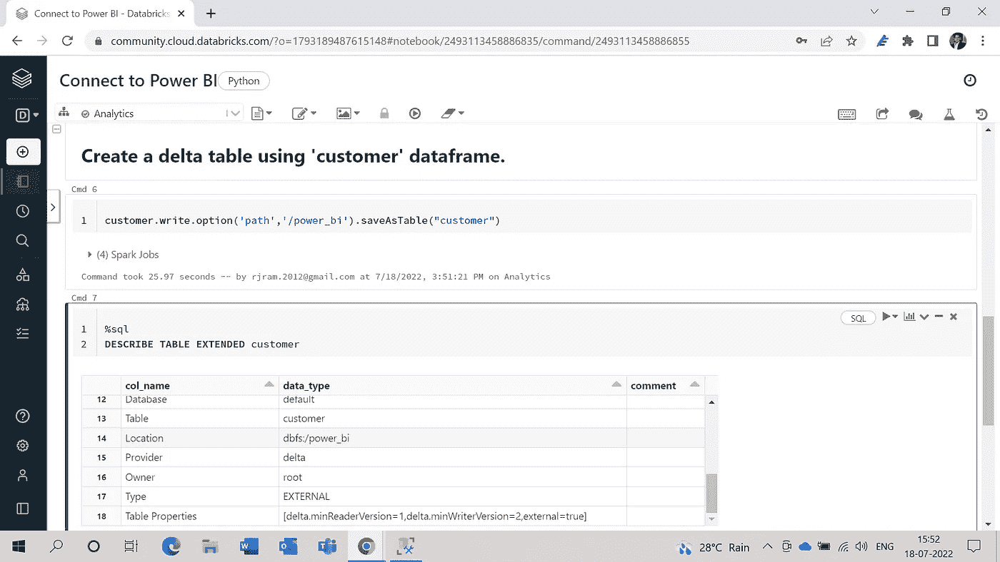

**使用客户数据帧创建增量表**

创建增量表后，您可以在选项**数据>数据库表、**中看到您的表，如下图所示:

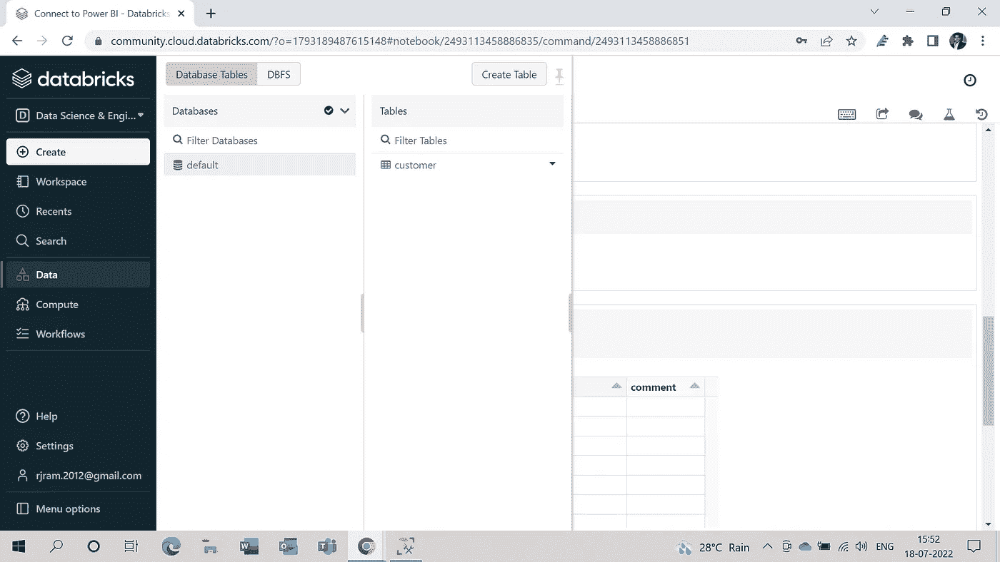

**检查创建的增量表**

一旦您彻底完成了上述所有步骤，那么您就已经准备好在 databricks 中使用 delta 表，现在是时候将您的 databricks community edition 与您的 power bi 桌面连接起来了。

## **其次，连接并导入所需的表格。**

为此，您必须打开 power bi 的桌面应用程序，单击选项**获取数据>更多>，并在搜索框中键入**“数据块”**，然后单击连接按钮:**

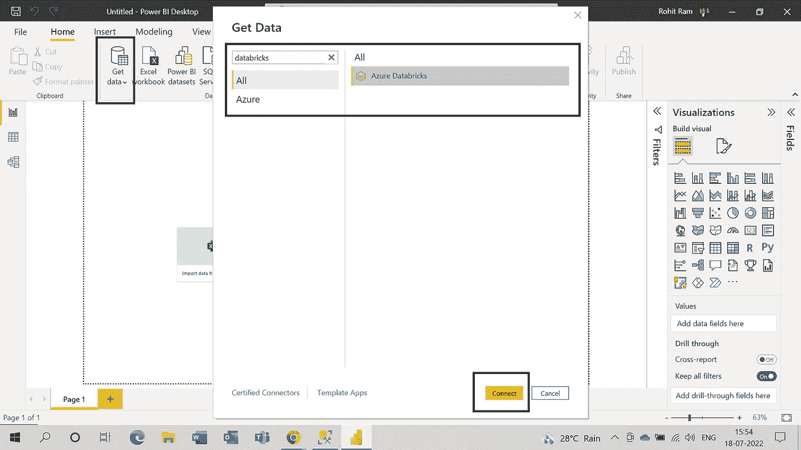

**使用获取数据选项创建连接**

单击 connect 按钮后，您将获得另一个窗口，在该窗口中，您必须指定可以从您的 databricks 集群获取的**服务器主机名& HTTP 路径、**。

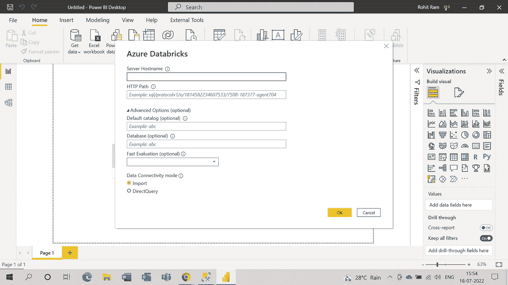

**所需的连接输入**

要获得上述两个输入的值，您必须按照此选项进入您的集群 **Compute >您的集群> JDBC/ODBC，**，一旦到达那里，您将找到服务器主机名和 HTTP 路径的值，现在您只需复制这些值并将其粘贴到 power bi 中的必填字段。

> 在我的例子中，集群名称是**分析**。

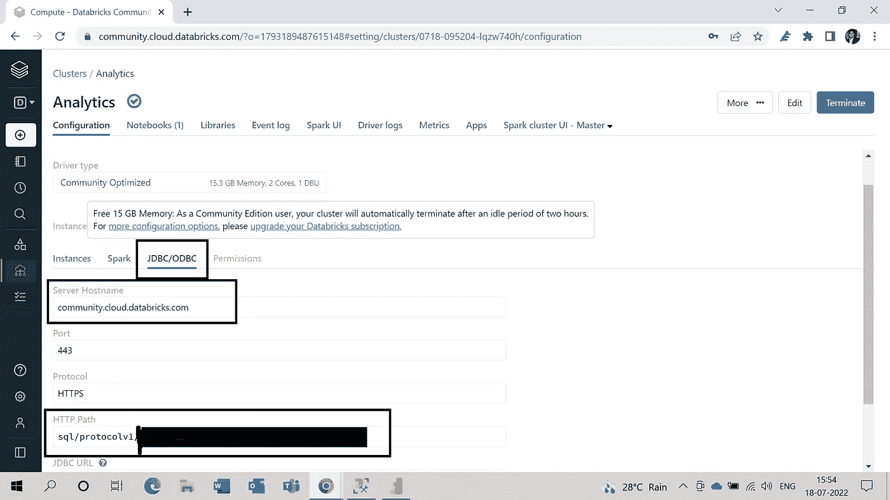

**获取连接凭证**

在连接提示中指定了所有必需的值后，在下一步中，您只需指定登录社区数据块所使用的登录凭据。

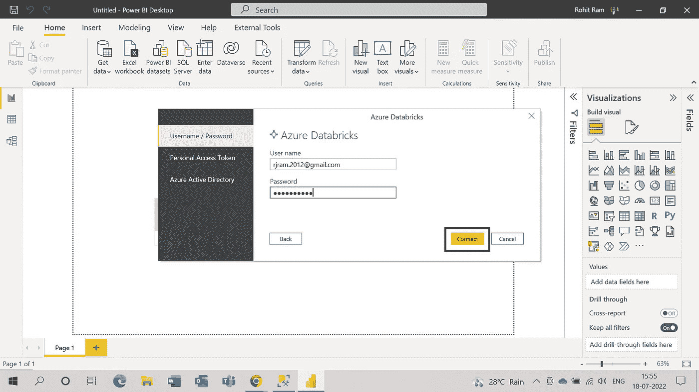

**登录凭证**

当您点击 connect 按钮时，您将在最后一个提示上结束，这个提示被称为 **Navigator** ，在这里您可以选择您想要导入到 power bi 桌面的所需表，只需点击表旁边的复选框即可。

> 在我们的例子中，我们只有一个客户表需要导入，但是如果你有很多表，你可以一次导入所有的表。

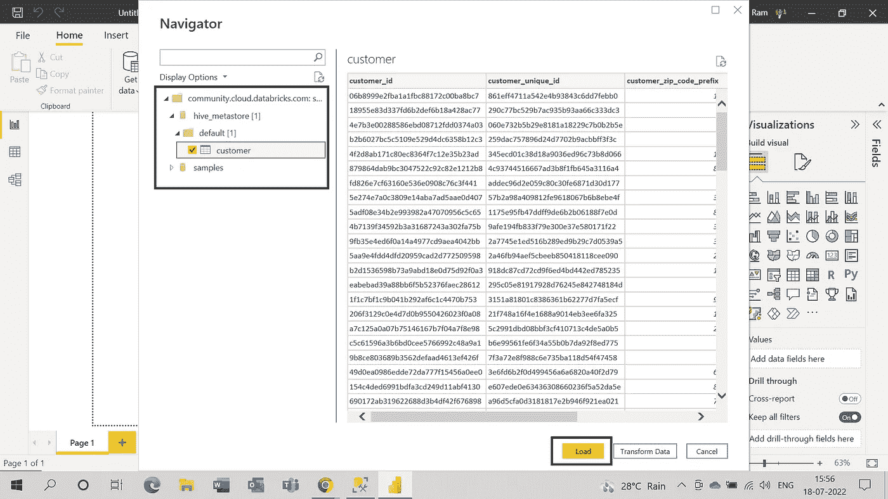

**加载所需的表格**

> 您可能想知道上图中的这个 **hive_metastore** 是什么，因为您根本没有使用过它，但它仍然出现在导航器提示符中，为此我将写另一篇博客，您将会了解它。

将数据加载到 power bi 桌面后，您可以看到 power bi 的**字段窗格**中包含所有列的表格。

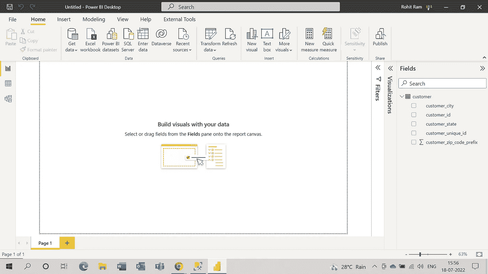

**字段窗格中的客户表**

**结论**

在本文中，我解释了如果您使用 databricks 的社区版，如何将 databricks 表或 delta 表与 power bi desktop 连接起来。此外，请随时在我的 [LinkedIn](https://www.linkedin.com/in/rohitjram/) 上建议/联系我，获取更多不同主题的文章。