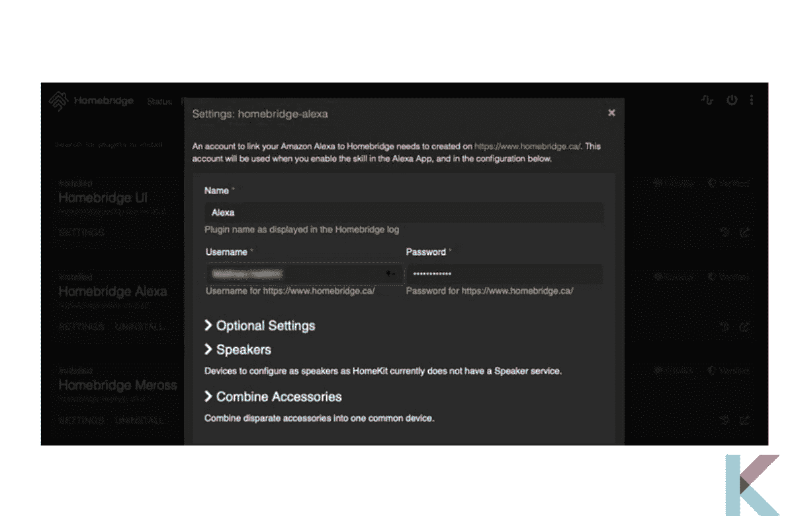

# 如何将 Homebridge 连接到我的 iPhone

> 原文：<https://blog.devgenius.io/how-to-connect-homebridge-to-my-iphone-62f9e50f56f8?source=collection_archive---------3----------------------->

现在，你可以使用 HomeKit 轻松控制你的非苹果认证设备。太棒了。你可以在 Homekit 和任何智能家居设备之间架起一座桥梁。这座桥叫做 Homebridge。

住宅桥

*   什么是 Homebridge？
*   建立 Homebridge 的最佳方式
*   什么是 HOOBS？
*   如何搭建一个 HOOBS 桥？
*   如何给 iPhone 添加 Homebridge？
*   如何用 app 轻松设置 Homebridge？
*   还有其他 Homebridge 应用吗？
*   使用 Homebridge 插件控制您的智能家居

# 什么是 Homebridge？

住宅桥

Homebridge 是一个 NodeJS 服务器。它模拟了苹果 home kit API。您可以使用 Siri 和 Home 应用程序来使用非 Apple 认证的配件。此外，它还是一个轻量级服务器。它可以在您的家庭网络上运行。

Homebridge 支持多个插件。这些插件安装在 Homebridge 上。此外，大多数插件旨在使 HomeKit 在任何非苹果认证的设备上友好。你可以直接从 NPM 网站安装插件。

# 建立 Homebridge 的最佳方式

胡布斯

您可以使用 [Homebridge](https://kodmy.com/homebridge/) 轻松扩展 HomeKit 设置的功能。它也是一个开源的桥接解决方案。它需要许多命令行命令和配置文件的编辑。因此，homebridge 社区运营的 HOOBS 项目简化了这种体验。现在，您可以使用 iPhone 轻松控制智能家居设备。

# 什么是 HOOBS？

HOOBS 是 Homebridge 的改进版本。它也代表 Homebridge 开箱即用系统。它增加了一些奇妙的功能，如预建的图像。它包括一个完全组装好的[树莓派](https://kodmy.com/homebridge/#plugin)以及一个预装在 microSD 卡上的 HOOBS Homebridge 服务器副本。

# 如何搭建一个 HOOBS 桥？

枢纽和桥梁

您可以使用 WiFi 连接或以太网连接来设置机顶盒。之后，您需要通过浏览器启动 HOOBS UI。它也可以在 iPhone、电脑或 iPad 上完成。

打开浏览器后，您希望在 URL 选项卡上键入 hoobs.local。您需要先创建一个帐户。但是一旦你进去了，你就可以开始安装插件了。你想用 HomeKit 设置你的盒子。一旦 HOOBS 启动并运行，你就可以像任何其他 HomeKit 设备一样将其添加到 HomeKit 中。在 Home 应用中，选择“添加附件”，扫描或输入 HomeKit 代码。

将它添加到 HomeKit 后，您会发现它列在您的家庭设置中的“桥”下(主页图标>主页设置…>选择主页>集线器和桥>桥)。当您点击网桥时，它会向您显示设备的设置，包括它所在的房间、它所连接的附件、序列号和固件版本。

您还会看到它通知您 HomeKit 认证的状态，现在是未认证的。如果你还没有弄明白，任何通过 HOOB/HomeBridge 的设备都不是本地 HomeKit 兼容的。因此，他们首先依赖 HomeBridge 来进入 HomeKit，而这并没有得到苹果的认证。

你可以使用网络界面来完成任何需要使用 HOOBS 的任务，而 iPhone 版本对各种任务都很有用。

# 如何给 iPhone 添加 Homebridge？

首先，你需要用你的配置在 iOS 设备上打开 Home 应用。然后选择加号并添加附件。之后，tap 无法扫描或没有代码。在下一页，您可以选择您的 Homebridge。

它将显示这是一个未经认证的配件。您必须选择添加并手动输入 HomeKit 设置代码。您可以找到您的 Homebridge 设备并将其添加到您的家中。

例如，你得到一个开关，用[嵌套恒温器](https://kodmy.com/smart-home-technology/#smartHomeDevices)打开和关闭回声模式。此外，这个开关可以设置你是否在家。当 Homebridge 服务器运行时，您添加的所有设备都会出现。

当您的设备进入 HomeKit 后，您可以在其中添加集线器。默认情况下，您的设备将出现在房间中。您可以像 HomeKit 中的其他设备一样，轻松控制设备并将设备移动到任何房间。

# 如何用 app 轻松设置 Homebridge？

通过 Home manager 应用程序和 HOOBS，您可以直接从 iPhone 或 iPad 上轻松设置和管理 Homebridge。

您是否已经拥有与 HomeKit 不兼容的设备？别担心。Homebridge 给出了一个解决方案，让一切都与 Homekit 兼容。

现在，您可以使用 Homemanager 应用程序从 iPhone 或 iPad 上维护和设置 Homebridge。这是一个社区驱动的应用程序，由社区决定价格和增强功能。

*   【Homebridge 的 Homemanager 应用

Homemanager 应用程序

首先，你要从 app store 下载 Homemanager 应用。它支持多种平台。下载后，您可以打开应用程序，也可以输入用户凭据。之后，您可以选择现有的 Homebridge 设置。选择一个新的使用 HOOBS 引导您完成 Homebridge 的交互式设置。

您可以选择通过 WiFi 或以太网将 HOOBS 连接到您的智能家庭网络。你必须等待几分钟，直到 HOOBS 安装。该应用程序将帮助您连接到 HOOBS 服务器。然后，点击搜索。一旦成功连接，您就可以添加您的管理员帐户。

***添加 HOOBS bridge 到 HomeKit***

HOOBS 桥现在必须添加到 HomeKit 中。你可以用第二台苹果设备(如 iPad)扫描二维码，或者在下一步使用同一台设备输入设置代码。

添加附件(HOOBS)

要添加附件，请打开 Apple 的 Home 应用程序，然后按加号。选择“我没有代码或无法扫描”并从 Homemanager 应用程序输入配对代码，或使用第二个设备扫描二维码。

轻按 Apple home 应用程序左上角的 Home 图标，并向下滚动桥和集线器部分，以验证 HOOBS 桥是否正确配对。

在这里，你可以通过“hoobs.local”的 web 界面管理你的 HOOBS 服务器，或者继续使用这个应用程序。如果你想继续使用该软件，你可以选择基本和专业许可，或者你可以免费试用 14 天。之后，你会被带到应用程序的仪表板。

您可以通过仪表板查看有关服务器的信息，如 CPU 温度和 CPU、内存以及 microSD 卡消耗。

下一节展示了这个场景中 HOOBS 服务的状态和正常运行时间。在“更新”部分，您可以查看和管理插件和系统的更新。该配置向您显示了所有已安装的插件和附件，您可以单独检查和管理它们。

最后，在仪表盘的底部，您会找到您的 HomeKit 配对信息。更多功能可以在应用程序的底部菜单中找到。

***在 HomeKit 上添加插件***

让我们看看如何添加插件。我们将添加 homebridge-tplink-smarthome 版本 4.0.1。没必要去 npmjs。我们将从应用程序中添加这个插件。

可以在仪表板的配置区域找到已安装的插件，或者您可以转到底部菜单，单击配置，然后单击插件。在搜索字段中，键入“tplink”并确保选择“Tplink Smarthome V4.0.1”选项。

点击插件，再次确认 Patrick Seal 是作者，然后点击 Install。点击“再安装一个”即可安装该插件。出现带有绿色圆圈和复选标记的消息“安装成功”。

从下拉菜单中选择插件配置。在这种情况下，我们将被重定向回仪表板，因为这个插件不需要我们将任何附加信息添加到配置文件(config.json)中，该文件可以在 config 菜单下的 advanced 中找到。

在这个插件的配置文件中，Homemanager 和 HOOBS 添加了我们需要的一切。当你安装一个插件时，需要修改配置文件。Homemanager 为您提供了一个可视化界面，您可以通过管理设备进行配置更改和管理。

HOOBS 服务必须通过点击 HOOBS 服务右边的三个点的 Start 来重新启动。当我们向下移动仪表板时，配置部分中连接的附件随之更新。这个总数应该反映连接的 TP-Link 设备的数量。

我们现在可以使用苹果的 Home 应用程序查看和操作我们新添加的 TP-Link 设备了！如果您在更新设备状态时遇到问题，请确保您的所有 HomeKit 设备(包括 HomeKit hub)都运行最新版本的 iOS。

# 还有其他 Homebridge 应用吗？

有几个应用程序可以让您更轻松地控制智能家居设备。这是 Homebridge 应用程序的另一个例子。

*   **苹果 Home App**

苹果 HomeKit

Apple Home 应用程序仅适用于 iPad、iPhone 和 Apple Watch 的 App Store。使用此应用程序，您可以安全轻松地控制您的智能家居和智能家居设备。

*   **Eve for HomeKit**

Eve 应用

通过使用 Eve 应用程序，您可以将您的家庭连接提升到一个全新的水平。此外，您将能够在一览部分找到您的所有配件，并使用它轻松控制您的智能家居。

# 使用 Homebridge 插件控制您的智能家居

有许多智能家居插件可以让自动化变得前所未有的简单。Homebridge 可以与您已经使用的智能家居设备集成。它通过安装在 Homebridge web UI 上的插件来控制设备。此外，您可以使用 Homebridge 插件将 Homebridge 连接到智能手机。

*   **Homebridge Alexa**

Homebridge Alexa 设置

这使得亚马逊 Alexa 可以操作 Homebridge 设备。它支持你集成所有的 Alexa 智能音箱，并使用基于技能的方法。

***如何安装***

安装它的简单方法是使用 Homebridge 中的内置安装程序。您必须从 web 浏览器登录 homebridge.local。然后单击插件。可以使用搜索功能搜索 Homebridge-Alexa。

从左边认证的 Homebridge-Alexa 插件安装。您还需要创建一个 Homebridge.ca 帐户。

然后，在你的 iPhone 或 iPad 上，打开 Alexa 应用程序。打开应用程序，从菜单中选择更多>技能和游戏。要查找 Homebridge，请使用搜索功能。激活这个能力。

返回到您的计算机，用您的登录信息填写 Homebridge-Alexa 设置屏幕。保存文件。Homebridge 应该重新启动。“Alexa，发现设备，”用户说，以完成设置。一旦你检测到它，你可以使用像“Alexa，关掉厨房灯”或“Alexa，把恒温器调到 50”这样的命令。

*   **谷歌智能家居**

Homebridge 谷歌智能家居

如果你选择使用 Google Home 而不是 [Alexa](https://kodmy.com/alexa-smart-home-devices/) ，谷歌智能家居插件是你的最佳选择。它可以从任何[支持 Google Home 的智能扬声器](https://kodmy.com/google-nest-mini-setup-and-reviews/)控制智能设备。这个插件需要在不安全的模式下运行 Homebridge。

有关如何将 Homebridge 设置为不安全模式的更多信息，请参见 Homebridge UI Github 页面上的“启用附件控制”。

***如何安装***

在 Homebridge 的插件部分寻找“谷歌智能家居”。在已验证的插件下，单击安装。在安装过程中，系统会提示您链接您的 Google 帐户。链接帐户后，单击保存。之后，你需要将你的设备链接到 Google Home 的 Homebridge 活动。

打开 Google Home 应用，点击左上角的加号(+)。轻按“设置设备”,然后在那里使用 Google。要查找 Homebridge，请使用搜索功能。

安装此操作并使用您已链接的 Google 帐户登录。然后选择你希望 Google Home 控制的设备。重新启动 Homebridge 服务器以完成安装。

说出“嘿，谷歌”，然后说出“将风扇设置为 3”或“调暗厨房灯光”等命令来使用 Homebridge 设备。

*   **梅罗斯**

Merross 插件

Meross 现在才开始接受 HomeKit 控制，所以您需要为较旧的 Meross 产品安装 Homebridge。Chamberlain MyQ G-0301 最受欢迎的替代品之一是 Meross 的 MSG100 车库门开门器。此插件允许您控制 MSG100 和其他 Meross 智能设备。

此插件需要 Meross 设备的 IP 地址和 Meross 应用程序才能正常运行。

***如何安装***

从 Homebridge 的插件页面，查找“Homebridge Meross”选择已经确认的 Homebridge Meross 插件，点击安装。

要完成设置，还需要一些凭据。你需要 HTTP Catcher，一个 iOS 应用程序。安装完插件后，您可以删除该程序。

若要将 HTTP Catcher 的 VPN 添加到您的 iPhone 或 iPad，请打开该应用程序并按照提示进行操作。要开始收集请求，请点击屏幕底部的电源图标。然后，在 Meross 应用程序中，选择要与 Homebridge 配合使用的设备并启用它。

要返回 HTTP Catcher，请单击此处。要停止录制，请点击电源图标。在搜索栏中，键入 Meross 设备的 IP 地址。点击 JSON，然后从下拉菜单中选择第一个序列。在屏幕的右上角，点击响应。从预览中复制 messageId、时间戳和签名的值。

返回 HTTP Catcher。要停止录制，请点击电源图标。在搜索栏中，键入 Meross 设备的 IP 地址。点击 JSON，然后从下拉菜单中选择第一个序列。在屏幕的右上角，点击响应。从预览中复制 messageId、时间戳和签名的值。

返回 Homebridge，从 Homebridge Meross 设置屏幕的下拉菜单中选择您的产品。输入设备的名称、设备的 IP 地址和 HTTP 收集器值。保存更改并重新启动 Homebridge。Apple Home 应用程序现在应该可以看到您的 Meross 设备了。

# 定论

如果你正在从头开始建造一个智能家居，你要么使用 HOOBS，要么购买那些众所周知能与 Homebridge 良好配合的小工具。此外，您可以使用 HOOB 轻松地将 Homebridge 连接到智能手机。