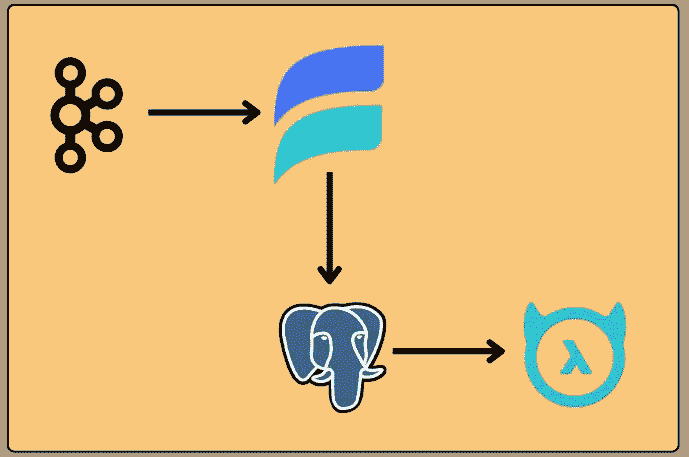
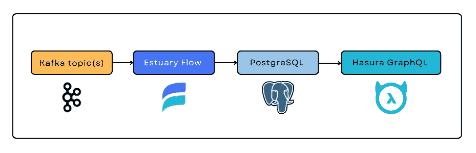
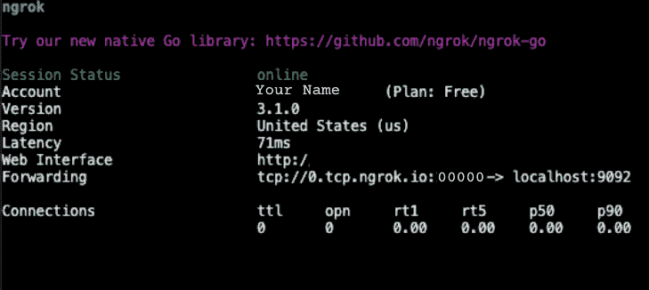
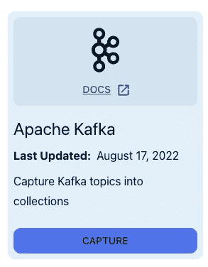
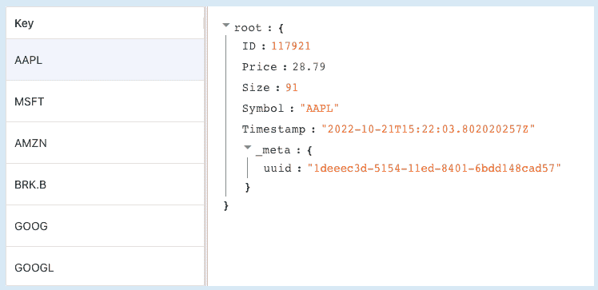
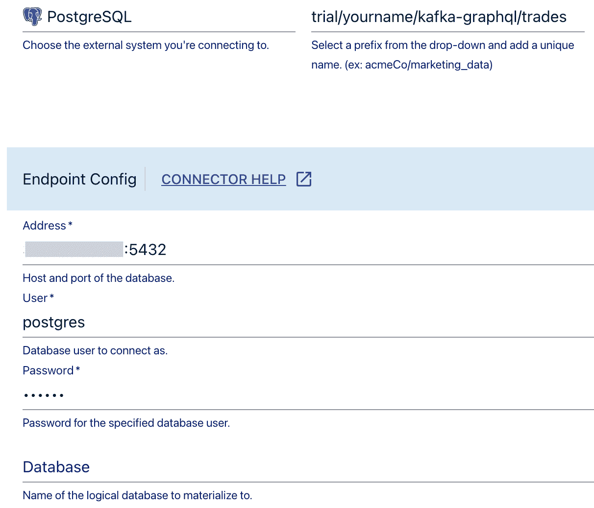
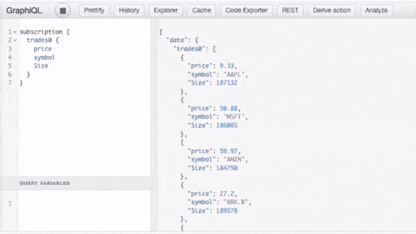

# 如何将卡夫卡与哈苏拉·格拉福 QL 联系起来

> 原文：<https://blog.devgenius.io/how-to-connect-kafka-to-hasura-graphql-560335c9bc66?source=collection_archive---------5----------------------->

# 使用这种管道方法将您的事件流转化为健壮的实时 API



# 介绍

在本教程中，您将学习如何使用 Hasura 和河口流将 Apache Kafka 与实时 GraphQL API 集成。

*注意:我们为这个练习改编的源项目是由河口的工程师 Will Baker 创建的。如果你宁愿跳过详细的演练或以不同的方式处理事情，* [*前往 GitHub*](https://github.com/williamhbaker/kafka-graphql/) *和 at！*

**Kafka** 是一个流行的开源事件流媒体平台。它功能多样，但也没有个性化，使用起来很有挑战性。将 Kafka 连接到您的应用程序或项目的前端，不仅是功能性的，而且是*高效的，*是一个主要的挑战。

这听起来像是 GraphQL 的工作。Graphql 是 API 的服务器端查询语言。它是 REST 的一个[替代品，正在迅速普及，并且可以为您的应用程序或项目提供一个健壮、高效的 API 层。](https://www.apollographql.com/blog/graphql/basics/why-use-graphql/)

然而，一个明显的问题是**如何连接这两个**。有没有可能以一种合理的、平易近人的方式做到这一点？同时又不会失去 Kafka 集群近乎实时的特性？

确实是。让我们看看我们将构建什么。

# 卡夫卡到 GraphQL 的管道

当我们在这里完成时，我们将有一个这样的管道:



每一个组成部分都是有原因的。我们已经介绍了 Kafka 和 GraphQL。

**河口流**是为实时数据流设计的 DataOps 平台。它将 ETL 供应商的熟悉程度与事件驱动的运行时相结合。它的优点包括:

*   与作为数据源[的 Kafka](https://www.estuary.dev/sources/)和作为目的地[的 Postgres](https://www.estuary.dev/destinations/)的开箱即用集成。
*   对 SaaS 产品的直观 CLI 和 UI 支持，以及一个开源选项。
*   通过验证和一次性语义实时传输文档。

[**Hasura**](https://hasura.io/blog/what-is-hasura-ce3b5c6e80e8/)**graph QL Engine**是一项服务，您可以使用它从任何风格的 Postgres 生成实时 GraphQL APIs。在众多促进 GraphQL 的服务中，Hasura 的优势包括:

*   易用性。
*   选择自托管开源版本，以及一个具有大量免费层的云平台。
*   Hasura 是为 Postgres 设计的，Postgres 是世界上最流行的开源 SQL 数据库之一。为了我们这里的目的，Postgres 也与河口流连接。

今天，我们将使用除 Kafka 之外的每个管道组件的云版本或 SaaS 版本。我们将只使用**免费试用版或免费等级来做到这一点。**

要运行此工作流，您不必是开发人员。我将把事情详细分解，这样只要你是一个熟练的技术使用者，你就能跟上。

最后，请记住，这是*远离*建设这条管道的唯一途径。将其用作您自己的定制工作流的起点。

# 先决条件和设置

我们需要所有这些东西:

*   **本地开发环境。**我推荐用 Visual Studio 代码工作，但是你想用什么都可以。
*   **一个带有数据**的卡夫卡集群。我们将使用本地托管的项目回购附带的版本。如果你有自己的集群，你可以自由地使用它。
*   **码头工人**。Kafka 集群和数据生成器是在一个容器化的环境中出现的。如果你以前没有用过 Docker，你需要下载一些东西。
*   **代理**允许流访问本地机器上的 Kafka 集群。我们将使用 **ngrok。**
*   **一个河口流量免费试账。**
*   一个 Postgres 数据库。我们将通过 Google Cloud SQL 使用托管版本。新账户有 300 美元的免费信用额度，这对我们的需求来说绰绰有余。
*   **一个哈苏拉云的账号。**免费层是供个人使用的，这再次满足了我们今天的需求。

以下是获得所有东西的方法:

1.  如有必要，下载并安装以下软件:
    1。 [VS 代码](https://code.visualstudio.com)2。 [Docker 桌面](https://www.docker.com/get-started/)
    3。 [VS 代码远程容器扩展](https://code.visualstudio.com/docs/devcontainers/containers)4。 [GitHub 桌面](https://docs.github.com/en/desktop/installing-and-configuring-github-desktop/overview/getting-started-with-github-desktop)(如果你不是开发人员，也从未使用过 Git 或 GitHub，这是最快的入门方式)。
2.  在本地克隆项目。
    1。去 [GitHub 回购](https://github.com/williamhbaker/kafka-graphql/)。
    2。点击**代码**，选择**用 GitHub 桌面打开。**GitHub 桌面**克隆存储库**对话框打开。
    3。将**本地路径**设置为您想要将源文件保存到本地的位置，然后点击**克隆。**这将创建一个名为 **kafka-graphql 的新文件夹。**
3.  下载并安装 [ngrok](https://ngrok.com/) 。
4.  通过在 [Flow web app](http://dashboard.estuary.dev) 中填写您的凭证来注册河口免费试用。
    *注:截至发稿时，流量处于私下测试阶段。我们将在 24 小时内为您提供一个试用帐户。*
5.  在 Google Cloud SQL 中创建您的 Postgres 数据库。
    1。开始您的试用。2
    2。创建一个新的 Postgres 实例。记下用户名和密码。
    3。[为实例](https://cloud.google.com/sql/docs/mysql/configure-ip#add)启用公共 IP，将河口的 IP 34.121.207.128 添加为授权 IP 地址。
6.  注册 [Hasura Cloud](http://cloud.hasura.io) 并在免费层创建一个新项目。

现在，开始有趣的部分。

# 启动 Kafka 集群和数据生成器

我们从 GitHub 克隆的项目包括一个 Docker 网络，可以用来旋转数据管道的不同部分:

*   卡夫卡集群。
*   向 Kafka 发送虚构的股票交易数据的数据生成器。这条信息流将在一个名为**交易的 Kafka 主题中发送。**

首先，让我们启用这两个服务，并确保它们通过 ngrok 代理可见。



该图像对应于下面的步骤 5。

1.  [启动 Docker 桌面。](https://docs.docker.com/desktop/install/windows-install/#start-docker-desktop)
2.  在 VS 代码中，打开 **kafka-graphql** 文件夹。
    它包含几个文件，包括一个名为 **data_gen** 的文件夹(数据生成器的源代码)和一个名为 **docker-compose.yaml** 的文件，其中包含了 docker 网络的详细信息。
3.  点击 **docker-compose.yaml** 打开文件。
    该文件包含多个 docker 容器的规范。(对于本教程，由于我们使用云托管的 Postgres 和 Hasura，我们可以忽略被注释掉的容器。)
4.  请注意，Kafka 被配置为在端口 9092 上运行。
    我们将为此端口设置一个代理。
5.  在终端窗口中，运行:`ngrok tcp 9092`
    该窗口显示您的代理的详细信息。在整个练习过程中，您将让它一直运行，但完成后一定要将其移除。
6.  复制转发地址，省略协议。它会像`0.tcp.ngrok.io:00000`一样被格式化。
    您将把它设置为 Kafka 主机的环境变量。
7.  找到名为**的文件。环境模板**。制作一个副本，并将其名称更改为`.env`。
8.  打开`.env`，将`KAFKA_HOST`设置为您的 ngrok 地址，(如`KAFKA_HOST=0.tcp.ngrok.io:00000`)。保存文件。
9.  打开一个新的终端窗口，构建 docker 网络、数据生成器和 Kafka 集群:
    `docker compose -f “docker-compose.yaml” up -d --build --remove-orphans` 进程退出，表示网络已成功构建并启动，但数据生成器和 Kafka 集群可能需要一段时间才能开始相互对话。让我们监视数据生成器日志。
10.  运行`docker logs --follow data_gen` 新的日志条目不断出现，每一两秒钟一次。当它们停止显示错误并开始看起来像:
    `data_gen | 2022/10/28 16:00:15 Producing record of trade: {“ID”:616,”Symbol”:”GOOG”,”Price”:44.35,”Size”:25,”Timestamp”:”2022–10–28T16:00:15.241172378Z”}` …您可以继续下一部分。

提示:如果日志似乎在几分钟后停止，你可能没有正确设置你的代理。检查 ngrok 是否仍在运行，以及是否在 Docker 合成文件中放入了正确的地址。如有必要，运行 `docker compose down` *并再次开始该部分。*

# 用河口流捕捉卡夫卡主题

我们现在有一个带有数据流的功能性 Kafka 集群，但是它没有连接到任何东西。下一步是利用河口流获取数据。



此图像对应于下面的步骤 3。

1.  登录[流程 web 应用](http://dashboard.estuary.dev)。
2.  点击**捕捉**选项卡，然后点击**新建捕捉**按钮。
3.  找到阿帕奇卡夫卡卡，点击**捕获。** 出现一个表单，其中包含设置从 Kafka 捕获所需的属性。我们将从给任务命名开始。
4.  在**名称**框内点击。
    您将看到一个或多个前缀，代表您有权访问的*名称空间*。很有可能，你的会说`trial/`。
5.  单击前缀并为其附加唯一的名称。比如`trial/yourname/kafka-graphql`。
6.  在**端点配置下，**找到**引导服务器**部分。单击加号按钮添加服务器。在出现的字段中，粘贴您的 ngrok 代理地址，例如`0.tcp.ngrok.io:00000`。
7.  展开**认证**部分。
    由于这只是一个演示，我们的 Kafka 集群没有认证。(对于您的生产用例，请确保[在您的集群](https://docs.estuary.dev/reference/Connectors/capture-connectors/apache-kafka/#authentication-and-connection-security)上设置身份验证)。
8.  点击**禁用。**
9.  点击**下一个**按钮。Flow 启动与您的 Kafka 集群的连接，并为数据*捕获*任务以及它将写入的数据*集合*生成 JSON 规范。
10.  在规范编辑器中，单击带有集合名称的选项卡(类似于`trial/yourname/kafka-graphql/trades`)。JSON 模式本质上是空的。因为 Kafka 没有对其存储的消息实施模式，所以 Flow 无法推断出模式。你会给它一个。
11.  将以下内容粘贴到编辑器中，删除之前的内容:

*注意:该方案的 YAML 版本包含在项目回购协议中。然而，web 应用程序目前只接受 JSON，所以我为你重新格式化了它，使事情变得更快。*

12.点击**保存并发布**按钮。

流部署数据捕获。虽然我们还没有在任何地方实现它，但是 Flow 在云支持的集合中保留了每个文档的副本。我们可以在 web 应用程序中预览这些数据。

13.当截图成功发布后，在显示日志的弹出窗口中点击**关闭**。

14.单击**收藏**选项卡，然后单击您的收藏名称旁边的**详细信息**。



数据存储时显示:按键。我们提供的模式使用股票符号作为键。

对于每个符号，Flow 每次从 Kafka 接收到一条新消息时都会覆盖价格。在 Postgres 中，这将转化为当前股票价格的紧凑表格。

我们现在将数据加载到 Postgres 中。

# 将数据具体化到 Postgres 数据库中

让我们继续将流中的数据连接到您之前设置的 Google Cloud SQL Postgres 实例。



此图像对应于下面的步骤 7。

1.  在 Flow web app 中，点击**物化**选项卡，然后点击**新建物化**按钮。
2.  找到 PostgreSQL 卡，点击**物化。** 出现一个表单，其中包含设置 Postgres 物化所需的属性。同样，我们先给它一个名字。
3.  在**名称**框内单击，选择您的前缀，并添加一个唯一的名称，如`trial/yourname/postgres-graphql`。
4.  要填写**地址**字段，您需要实例的公共 IP。
    1。去[谷歌云控制台](https://console.cloud.google.com/sql)选择你的实例。
    2。从实例的**概述**页面，在**连接到该实例下，**复制公共 IP 地址。
5.  回归流动。在**地址**字段中，粘贴公共 IP 地址并附加端口`:5432`，给出地址的完整格式`XX.XX.XXX.XXX:5432`。
6.  填写**用户**和**密码**字段。除非您在设置过程中更改了用户名，否则用户名为`postgres`。如果您在设置过程中没有设置密码，请将该字段留空。您可以在 Google Cloud Console 中实例页面的**用户**选项卡上查看您的用户信息。
7.  将数据库**留空。流将具体化到默认数据库，也称为`postgres.` 。接下来，我们将指定 trades 集合作为要具体化的数据，并命名将在数据库中创建的相应表。**
8.  向下滚动到**集合选择器。**使用**可用收藏**框搜索您的收藏(例如`trial/yourname/kafka-graphql/trades`)。
9.  在**表**字段中，输入`trades`。
10.  点击**下一步**测试连接，然后点击**保存并发布。** 当动作成功完成，这意味着你从 Kafka 到 Postgres 的数据流完成。本地 Kafka 集群上的交易事件以毫秒为单位反映在 Postgres 表中。

剩下要做的就是将数据库连接到 Hasura，并开始使用 GraphQL API。

# 将 Postgres 数据库连接到 Hasura GraphQL

1.  在 [Hasura 控制台](https://cloud.hasura.io/projects)中打开你的项目。
2.  将你的 Hasura 项目连接到你的 Postgres。按照 Hasura 文档中的[步骤](https://hasura.io/docs/latest/databases/connect-db/cloud-databases/gcp/)来做这件事(从**步骤 4:允许从 Hasura Cloud** 连接到你的 DB 开始)。
    一旦连接，数据库名称将显示在**数据**选项卡的侧边栏上。它包含默认的数据库模式， **Public。**
3.  点击侧边栏中的 **Public** 显示数据库表列表。找到 trades 表并单击 **Track** 向 GraphQL API 公开该表。
4.  点击 **API** 标签。
    我们将设置一个订阅—一个实时查询—并直观地验证我们的管道是否按预期工作。
5.  在查询框中，粘贴以下内容，然后按播放按钮:

```
subscription {
  trades {
    price
    symbol
    Size
  }
}
```

在右边的查看器中，您会看到来自 Postgres 的实时交易更新。



# 下一步是什么？

从这里开始，路就打开了，但我只能走到这里。您有一个高性能的 API，可以随时随地使用。

使用我们在这里使用的样本数据集，您可以创建一个应用程序，该应用程序提供定制的警报，或者根据当前的股票价格代表您自动进行交易(当然，您必须首先将您的集群与真实的股票数据联系起来)。

真正强大的地方是，如果您在自己的 Kafka 集群中有数据，并且您很难将其与应用程序的前端集成。尤其是随着您的数据量和复杂性的增长，拥有一个在验证和重塑数据的同时保持快速规模的管道非常重要。

*本文原载于* [*河口博客*](https://www.estuary.dev/how-to-connect-kafka-to-hasura-graphql/) *。*