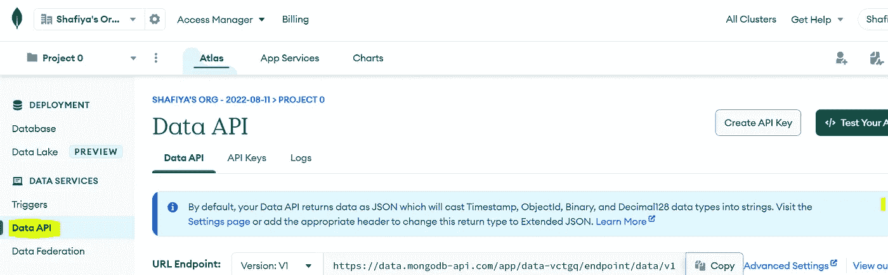
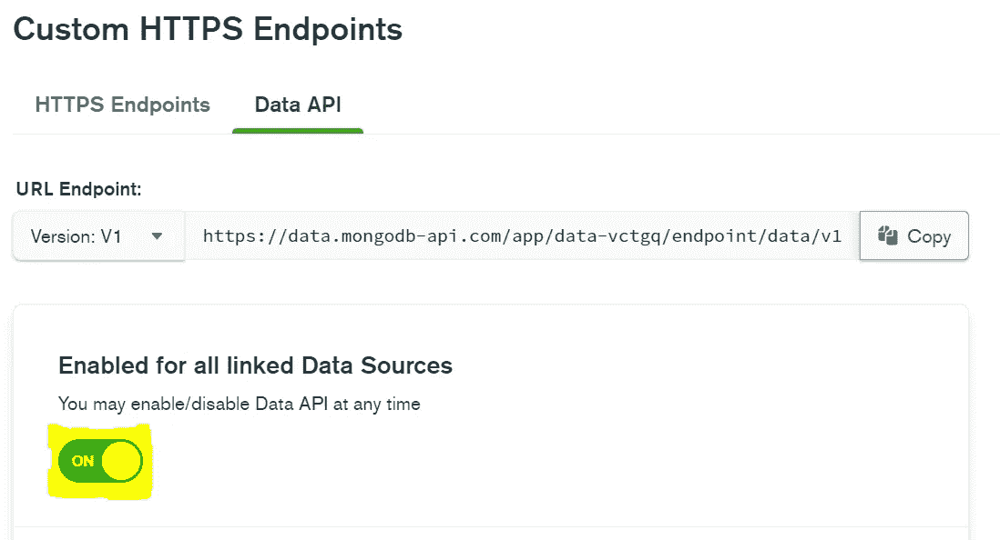
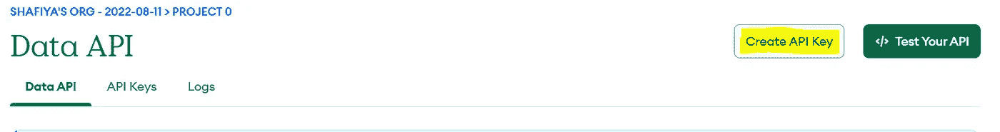
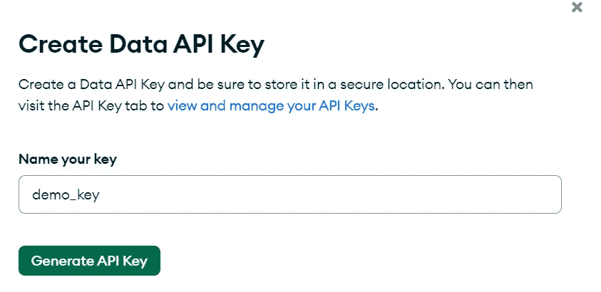
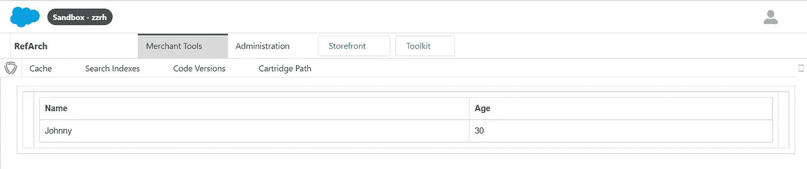

# 如何连接 MongoDB 和 Salesforce 商务云

> 原文：<https://blog.devgenius.io/how-to-connect-mongodb-with-salesforce-commerce-cloud-53f6387eb21f?source=collection_archive---------12----------------------->

弗拉基米尔·阿尼基耶夫在 [Unsplash](https://unsplash.com?utm_source=medium&utm_medium=referral) 上拍摄的照片

(*我假设读者熟悉 MongoDB 数据库的创建。如果没有，点击* [*这里*](https://www.mongodb.com/basics/create-database) *！*)

在本文中，我们将从 MongoDB 获取数据，并将其显示在 SFCC BM 中。

将您的 MongoDB 与 SFCC 集成非常简单。您必须将 MongoDB 视为需要与 Salesforce Commerce Cloud 集成的外部服务。众所周知，SFCC 的服务需要 API。

那么这就是你所需要的。**API。**

首先，让我们从获取我们的 API 开始，然后我们将进入集成部分。

由于 MongoDB 驱动程序或 Realm SDK 不支持 SFCC，我们将在工作中使用 **Data AP** I。它出现在左侧导航菜单中。

如果数据 API 尚未启用，您需要在设置中启用它。点击“高级设置”，继续并启用它。

下一步是创建 API 密钥。API 密钥用于管理访问和防止未经授权的请求。

单击“创建 API 密钥”，输入 API 名称，然后选择“生成 API 密钥”。

就是这样！现在您可以看到您的 URL 端点，它可以作为服务在 SFCC 使用。

先说整合吧！

我们需要四份文件。一个服务 XML、控制器、服务和一个 ISML。

首先，让我们在业务管理器中配置服务。在 **services.xml** 文件中创建新服务。

创建新的服务 JS 文件。使用上面生成的 API 密钥插入<your-api-key>。因为我们从 MongoDB 获取数据，所以我们将使用'/findOne '动作。</your-api-key>

(要查看更多操作，如插入、删除和更新，请查看[这个](https://www.mongodb.com/docs/atlas/api/data-api/)！)

下一步是创建一个控制器来调用服务。插入<data source="">、<database_name>、<collection>以及您的数据库详细信息。“过滤器”是用于获取日期的键。在本例中，我们正在获取一个名为“Johnny”的学生。</collection></database_name></data>

最后是 ISML！

只需部署您的代码并…

感谢阅读:)