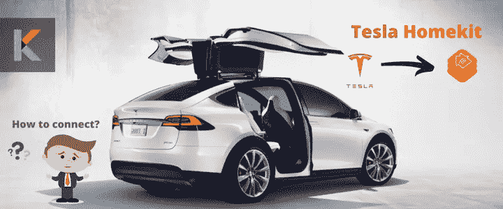

# 如何使用 Homebridge 将 Tesla 配件连接到 Apple HomeKit

> 原文：<https://blog.devgenius.io/how-to-connect-tesla-accessories-to-apple-homekit-using-homebridge-c06da8a9f505?source=collection_archive---------13----------------------->

你有没有想过如何用苹果 HomeKit 控制你的特斯拉汽车的配件？这不是一件容易的事。但是，你很幸运，因为你可以使用这个指南轻松地将你的特斯拉添加到苹果 HomeKit。Homebridge 是将您的特斯拉连接到苹果 HomeKit 的最佳解决方案。所以，你可以使用苹果 Home 应用和 Siri 语音控制来控制特斯拉配件。让我们更深入地了解特斯拉苹果 HomeKit 集成。



# 了解特斯拉汽车和苹果 HomeKit

特斯拉是世界上最有价值的公司和汽车制造商之一。他们设计电动汽车，电池储能，太阳能电池板和许多特斯拉配件。当我们看到目前的阵容时，它包括特斯拉 Model 3，Model S，Model X 和 Model Y。

简单来说， [Apple HomeKit](https://kodmy.com/homekit/) 是苹果的智能家居平台，也是他们的“物联网”解决方案。您可以使用 Apple Home 应用程序和 Siri 语音控制来控制 Homekit 兼容的智能家居设备。Homekit 不仅适用于[支持 Homekit 的设备](https://kodmy.com/homekit-compatible-smart-devices/)，也适用于不兼容 Homekit 的设备。耶！现在，您可以将任何智能家居设备添加到 Apple HomeKit。→

# Homekit +特斯拉集成背后的故事

你知道特斯拉和苹果 HomeKit 的故事吗？现在，您可以控制您的特斯拉配件，并通过特斯拉苹果 HomeKit 集成获得车辆更新，如充电水平、充电状态、预调节、气候控制以及锁定和解锁特斯拉汽车的车门。而且，你只需要把 Homebridge 插件添加到你的设备上。

如果你有一些编码经验，你可以自己把你的特斯拉加入苹果 HomeKit。让我们看看[如何使用 Homebridge 插件](https://kodmy.com/tesla-homekit/#tesla-apple-homekit-homebridge)将 Tesla 添加到苹果 HomeKit 中。

需要帮忙吗？如果你没有技术知识或编码经验，你最好从第三方 homebridge 安装服务如 Kodmy 专家那里获得帮助。他们做所有与 Homebridge 安装相关的事情。你可以点击下面的链接，让 Kodmy 的专家来帮助你。

[请求您的安装→](https://kodmy.com/homebridge-installation-request/)

另外，添加 Homebridge 插件后，您可以使用 Apple Home App 和 Siri 控制您的特斯拉。此外，您可以根据电池电量和汽车的预设温度轻松实现自动化。与 Homekit 的集成不仅为您创建自动化，还为您创建有用的快捷方式等提供了可能性。

作为 Homebridge 的替代品，你也可以使用 [HOOBS 即插即用 Hub](https://kodmy.com/store/product/hoobs-box-starter-kit/) 和 Raspberry Pi 将 Homekit 不兼容的配件连接到 Apple HomeKit。

# Tesla 的 Homebridge 插件

你刚来 Homebridge 吗？简单来说， [Homebridge](https://kodmy.com/homebridge/) 就是一个可以集成这么多智能家居设备的 node JS 服务器。此外，Homebridge 插件使自动化比以往任何时候都更容易。下面是一些特斯拉 homebridge 插件给你。

**homebridge-tesla**

这个特斯拉的 Homebridge 插件允许你使用苹果 Home 应用程序和 Siri 语音控制来控制你的特斯拉汽车。此外，你可以用这个特斯拉 homebridge 集成做一些令人惊讶的事情，如解锁车辆，打开后备箱，打开气候控制。是的。这是用 homebridge tesla 能做的最不可思议的事情之一。

**home bridge-Tesla-powerwall**

此插件使您能够创建 powerwall-homekit 桥。Tesla Powerwall homebridge 插件与 Tesla Powerwall 通信。此外，这个插件安装，它有 powerwall 和网格组件。此外，Powerwall homekit 服务有几个特征，如充电水平、充电状态和低电量。另一方面，Grid 是一个传感器附件，为传感器提供“打开”或“关闭”状态。

此外，下面是你的特斯拉汽车的一些其他插件。你也可以使用这些插件将特斯拉添加到苹果 HomeKit 中。

*   **Homebridge-my-tesla**
*   **Teslams 插件**

# 如何使用 Homebridge 将 Tesla 连接到 Apple HomeKit

逐步将您的 Tesla 添加到 Apple HomeKit

1.  向您的设备添加 Homebridge
2.  安装 Tesla 插件
3.  编辑配置文件
4.  运行插件
5.  在 HomeKit 上控制特斯拉配件

**01。将 Homebridge 安装到 Mac/PC 上**

首先，在将特斯拉添加到苹果 HomeKit 之前，需要将 Homebridge 安装到设备中。如果你想了解更多关于如何将 Homebridge 安装到你的设备上，你可以找到[如何将任何智能家居设备添加到 Apple HomeKit](https://kodmy.com/add-any-smarthome-device-to-homekit/) 文章中。

如果你自己安装 Homebridge 有困难，可以请 Kodmy 的专家来帮你解决这个问题。

特别注意:这个安装过程有点复杂。如果你自己安装 Homebridge 有困难，可以请 Kodmy 的专家来帮你解决这个问题。。

[请求您的安装→](https://kodmy.com/homebridge-installation-request/)

**02。安装特斯拉插件**

一旦你安装了 Homebridge，你就要安装 homebridge-tesla 插件

```
**$ sudo npm install homebridge-tesla -g --unsafe-perm**
```

03。编辑配置文件

现在，你已经安装了 tesla 插件。在运行 Tesla homebridge 之前，您需要配置您的~/。homebridge/config.json，平台如下。

```
**{ 
"bridge":{ 
"name":"Tesla",
"username":"11:11:11:11:11:21",
"port":51821,
"pin":"111-11-120"
},** **"description":"Sample configuration file",
"platforms":[
{
"platform":"Tesla",
"name":"Tesla",
"debug":true,
"vehicles":[****{
"name":"Model 3",
"vin":"your-vin-number",
"token":"your-refresh-token",
"expose":[
"ping",
"defrost",
"ventilation",
"trunk",
"hvac",
"doors",
"insideTemperature",
"steeringWheelHeater"
],****"accessories":{
"ping":{
"name":"Ping",
"requiredBatteryLevel":50,
"timerInterval":0.25
},****"defrost":{
"name":"Avfrostning"
},****"ventilation":{
"name":"Ventilation"
},****"trunk":{
"name":"Bakluckan"
},****"charging":{
"name":"Laddning"
},****"hvac":{
"name":"Fläkten",
"requiredBatteryLevel":20
},****"doors":{
"name":"Dörren",
"remoteStartDrivePassword":"omit-or-your-tessla-password"
},****"outsideTemperature":{
"name":"Ute"
},****"insideTemperature":{
"name":"Inne"
},****"thermostat":{
"name":"Termostat",
"requiredBatteryLevel":40,
"timerInterval":2
},****"steeringWheelHeater":{
"name":"Rattvärme"
}
}
}
]
}
]
}**
```

如果你渴望给 Apple HomeKit 添加更多的控件，你可以使用这个插件。这个插件可以显示温度，打开门，并控制当前的暖通空调。

**追加配件开关**

*   砰
*   充电
*   门
*   风扇
*   内部温度
*   室外温度
*   恒温器

**平**

想让你的特斯拉永远不再进入深度睡眠？然后，您可以使用 Ping 开关通过以下方式更新汽车的状态:

```
**"ping": {
"name": "Ping",
"requiredBatteryLevel": 40,
"timerInterval": 5
}**
```

**充电**

如果你想知道充电状态，你可以用这个开关。

```
**"charging": {
"name": "Charging"
}**
```

**门**

你可以用这个门开关来锁上和打开你的特斯拉汽车的门。

```
**"doors": {
"name": "Door",
"remoteStartDrivePassword": 
"tesla-login-password"
}**
```

**范**

您可以使用此开关打开或关闭暖风、通风与空调系统。

```
**"hvac": {
"name": "Fläkten",
"requiredBatteryLevel": 20 
}**
```

**内外温度**

如果你想显示室内温度，你可以使用这个开关。

```
**"insideTemperature": {
"name": "Inside"
}**
```

此外，您可以使用这个外部开关查看外部温度。

```
**"outsideTemperature": {
"name": "Outside"
}**
```

**恒温器**

你可以控制特斯拉的内部温度，并在特定时间自动打开这个开关。

```
**"thermostat": {
"name": "Termostat",
"requiredBatteryLevel": 40,
"timerInterval": 2
}**
```

注意:您可以指定名称、所需的电池电量和时间间隔。
名称 Apple Home 应用程序中的本地化名称
所需电池电量—运行
定时器间隔所需的电池电量—检查温度的间隔分钟数。

**04。运行插件**

首先，您希望使用 cd 导航到该目录..

然后，您可以使用运行 Tesla 插件

```
**homebridge -D -U ./config/ -P ./**
```

**05。将特斯拉配件添加到您的家庭应用程序中**

**步骤 01:** 首先，你要在你的 iPhone 或者苹果设备上打开 Apple Home App

**步骤 02:** 然后，您可以点击“添加附件”

**步骤 03:** 您可以选择“我没有代码或无法扫描”选项

**步骤 04:** 最后，你可以在屏幕上看到它，并且要将特斯拉添加到 Apple Home，请输入 8 位数字的设置代码或扫描 homebridge UI 的二维码。

# 特斯拉遥控器

减压阀应用程序是世界上第一个授权的特斯拉应用程序，具有 Siri/快捷方式和 Apple watch 支持，可用于您的特斯拉 Model S、3、X、Y 等。你甚至可以在不打开应用程序的情况下获得并控制你的汽车状态。您还可以根据触发器自动执行或安排命令，例如当您睡觉或开车时。

# 特斯拉的苹果 Siri 命令和苹果快捷键

现在是时候为你的特斯拉浏览苹果 Siri 命令和苹果快捷键了。如果你想获取信息并控制你的特斯拉，可以使用这些 Siri 命令和苹果快捷键。你很想知道如何创建苹果快捷方式和 Siri 命令，以便与特斯拉应用程序兼容吗？

在使用这些命令之前，您需要在手机上安装 Tesla 应用程序。那你需要打开它。并且，你可以使用以下 Siri 命令来控制你的特斯拉。

嘿 Siri，我的车的费用是多少？

*嘿 Siri，我的车能充多少电？*

*嘿，siri，我的汽车电池还剩多少？*

嘿，Siri，我需要给我的车充电吗？

*嘿 siri 激活我的汽车声音信号*

*嘿 siri 按喇叭*

*嘿 siri 闪一下我的车前灯*

*嘿 siri 锁了我的车*

*嘿 siri 解锁我的车*

*嘿 siri 打开后备箱*

嘿 siri 打开窗户

*嘿 siri 打开充电口*

嘿，Siri，我的车在哪里？

# 使用 Tesla Homelink 触发 HomeKit 附件

你知道吗，特斯拉有一个很棒的功能，可以使用车载 GPS 存在检测来触发 Homelink 启用的车库门开启器。所以，你的车库门会自动开关。特斯拉 model 3 2021 有 Homelink 吗？如果你有一辆特斯拉 Model 3 或 Model Y，这款 Homelink 开门器可以作为改型安装。

# 面向苹果的车辆更新

## 苹果播放器

苹果 CarPlay 在大多数新车上都有。您可以使用车载浏览器在您的特斯拉汽车上使用 Apple CarPlay。这个浏览器用来连接在特斯拉的屏幕上显示 carplay 界面和[树莓 Pi](https://kodmy.com/store/product/raspberry-pi-4/) 。但是，特斯拉没有向苹果 CarPlay 提供官方支持。

## 苹果车钥匙

面向苹果的新服务正在扩展。[苹果车钥匙](https://kodmy.com/apple-carkey/)是苹果集成到车辆上的功能之一。而且，司机可以用他们的 iPhones 代替他们的物理钥匙来锁车和开锁。苹果与宝马、现代 Genesis 和起亚等品牌合作，带来了这种数字汽车的关键功能。特斯拉汽车也将在不久的将来兼容苹果汽车的关键功能。

## **更多 CarPlay 相关产品**

如果你对快速将有线 CarPlay 转换为无线 CarPlay 感兴趣，你可以从亚马逊购买以下适配器。

**01。适用于工厂有线 CarPlay 汽车的 AutoSky 无线 CarPlay 适配器**

***品牌:*** *AutoSky*

***颜色:*** *黑色*

***是否包含电池:*** *否*

***语音命令:*** *按钮*

***物品尺寸 LxWxH:****2×1×1 英寸*

***兼容设备:*** *有线 CarPlay*

你可以从亚马逊以 74.99 美元买到这款 AutoSky 无线 CarPlay 适配器。

**02。CarlinKit 3.0 无线 CarPlay 适配器 USB，用于工厂有线 CarPlay 汽车**

***品牌:*** *Carlinkit*

***是否包含电池:*** *否*

***语音命令:*** *按钮*

***连接技术:*** *无线、蓝牙、USB*

***地图类型:*** *全球*

***车辆服务类型:*** *汽车*

***安装类型:*** *仪表板安装，在图像中找到*

你可以从亚马逊花 119 美元买到 CarlinKit 3.0 无线 CarPlay 适配器。

**03。适用于所有工厂有线 CarPlay 汽车的 SuperiorTek 3.0 无线 CarPlay 适配器**

***品牌:*** *Guete*

***连接技术:*** *蓝牙、Wi-Fi、USB*

**颜色:**黑色

***控制方法:*** *触摸*

***控制器类型:*** *IOS*

你可以从亚马逊花 119.99 美元买到 SuperiorTek 3.0 无线 CarPlay 适配器。

**04。OTTOCAST 无线 CarPlay 适配器 2022**

你可以从亚马逊花 109.95 美元买到这款速度最快的苹果无线 CarPlay 加密狗。