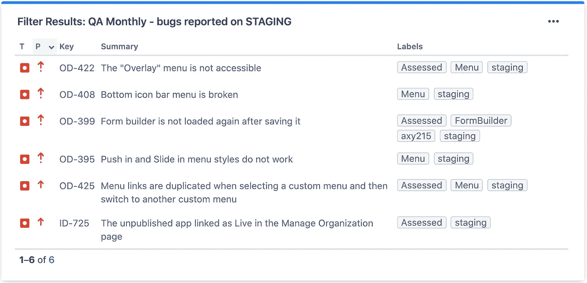
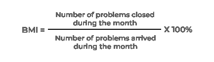
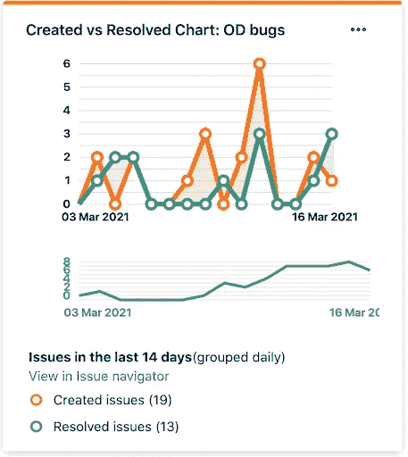
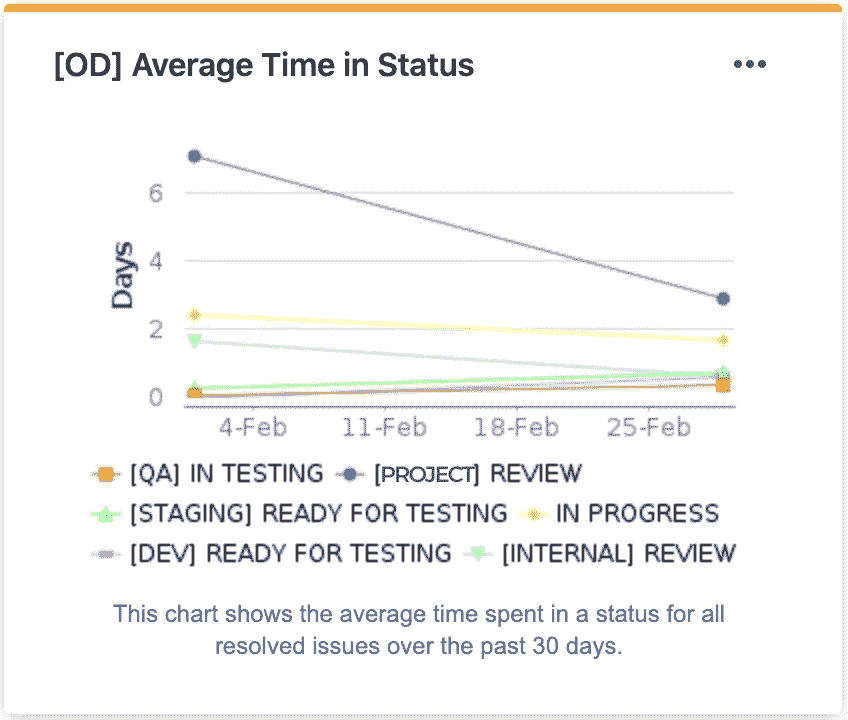

# 如何控制你的软件产品的质量？

> 原文：<https://blog.devgenius.io/how-to-control-the-quality-of-your-software-product-8bf1e8ea6dee?source=collection_archive---------5----------------------->

如何控制你的软件产品的质量？由 UppLabs 提供

最初，这份材料是由 Tonya Smyrnova 在 [UppLabs 博客](https://upplabs.com/blog/how-to-control-the-quality-of-your-software-product/)上发表的。

如何控制你的软件产品的质量？质量是最重要的特征之一，不仅适用于产品，也适用于交付的每个阶段。如果你想创造一个成功的产品，你必须在你做的每一件事上都是专业的。测试软件产品是开发的一个重要部分，因为即使很小的错误也会影响整个项目的有效性和成功。

质量保证差可能是导致软件启动失败的主要原因，因此执行质量保证测试的目的是避免交付质量差的产品。在本文中，我们将与您分享我们对质量测量的想法。

# 质量特性

1.  功能性——由软件在给定的软件条件下解决与用户的固定和预期需求相对应的问题的能力决定。这一特性确保了软件正确、准确地运行，具有互操作性，符合行业标准，并防止未经授权的访问。
2.  可靠性——软件在特定条件下，在特定时间段或特定操作次数内执行所需任务的能力。该特征的属性是整个系统的完整性和完整性、从操作故障中独立和正确恢复的能力以及弹性。
3.  可用性是用户容易理解、学习和使用软件的能力。
4.  效率是软件根据分配的资源、时间和其他指定条件提供所需性能水平的能力。
5.  可维护性提供了分析和测试软件、更改和修复缺陷、满足新需求、促进进一步维护以及适应现有环境的便利。
6.  可移植性根据从一个环境(软件/硬件)到另一个环境的可移植性来描述软件。

[**检查 UppLabs 的质量工程和测试服务**](https://wwwhttps//upplabs.com/services/quality-engineering-testing/)

# 质量测量

度量的引入和使用对于改进对开发过程的控制，尤其是对测试过程的控制是必不可少的。如果我们选择 Bug/缺陷度量，有以下类型:

*   打开/关闭的 bug(打开的 bug 与关闭的 bug(已纠正和重新检查)的数量之比)
*   重新打开/关闭的 bug**(**重新打开的 bug 数与关闭的 bug 数之比(已修复和重新检查)
*   被拒绝/打开的 bug**(**被拒绝的 bug 数与打开的 bug 数之比)
*   按严重性划分的错误
*   按优先级排列的 bug

在交付软件产品之前，我们需要测量它的质量，以确保它没有错误。需要每月报告组件中所有可能的环境(登台、开发、生产)中的错误。目标是在每月评审的基础上最大限度地减少产品中的 bug 数量。如果出现问题，QA 需要开会并找出原因来解决问题。团队可以使用吉拉工具并创建仪表板小工具“过滤结果”

可以按功能或史诗报告错误。目标是每周最大限度地提高每部故事片/史诗片的质量。如果需要，随后可以与开发团队和技术领导讨论代码质量经验教训。

每个 sprint 的开放或已解决的 bug 的目标是最小化开放 bug 的数量，并每周有效地管理积压。如果需要，团队可以讨论代码质量经验教训会议，并创建吉拉仪表板小工具“创建与解决图表”

积压管理指数(身体质量指数)是用来管理积压的开放和未解决的问题。

> *如果身体质量指数大于 100，意味着积压工作减少。如果身体质量指数小于 100，那么积压增加。*

状态中的平均时间和状态中的平均次数用于识别瓶颈并改进每天的开发过程。团队必须与负责被阻止项目的人员讨论团队解除阻止的平均时间，这样每个人都可以了解该流程的最新情况。出于这些目的，我们可以使用吉拉仪表板小工具“处于状态的平均次数”和“处于状态的平均时间”

# 质量要求

当编写测试计划、规范、用户界面、文档、培训材料和其他产品时，应该应用标准。共享项目的愿景有助于确保其质量。但是，除了标准之外，还必须确定它们的使用情况，并在必要时为采用标准以满足团队和产品的需求制定指导方针和要求。你采用的任何标准都应该有助于你把工作做到最好。

大多数需求可以直接从技术报告中使用，所有的需求都必须用于项目的定义。由于不良需求而报告的错误必须最小化由于不良需求或缺乏需求而导致的错误数量。团队通常可以在演示之后的每个 sprint 中执行这样的报告。如果需要，项目经理必须与团队和功能所有者一起概述行动项目，以避免将来需求不足。

[**问我们如何控制当前项目的质量**](https://upplabs.com/contact-us/)

# 拉取请求

质量度量可以让您了解合并或关闭请求所需的时间(通常以天为单位)。您可以计算所有存储库的交付时间，并了解团队动态。

要获得这个数字，跟踪每个拉请求并在打开和合并时保存每个拉请求的日期和时间是很重要的。对于质量测量，我们需要计算:

1.  未通过测试套件的拉取请求
2.  中断构建的提取请求
3.  被拒绝和合并的请求数
4.  拉取请求注释的数量

# 预防措施

在管理评审会议上，质量经理给出产品质量的评估。该信息应与满意度调查相对应。为了防止潜在的问题，管理团队选择负责的一方来审查代码审查，并实现有助于分析数据的行动。在预防措施中，我们可以强调:

*   内部代码审查由一个开发人员和技术主管每天进行，如果有现成的任务。如果需要，负责任的开发人员应该提供代码改进。如果这是一个常见问题，则应在经验教训会议上讨论。
*   代码质量经验总结会议回顾每个 sprint 的 PRs 中的反馈，以提高团队意识，提高代码质量，避免将来出现同样的错误。如果需要，负责任的开发人员应该提供代码改进。
*   开发人员和技术负责人与客户的开发人员一起进行故事开场会议，以确认技术方法并防止将来返工。如果需要，团队应该研究合适的解决方案，并检查相关组件的区域。

为了分析预防措施，我们可以使用值得信赖的最佳实践，例如:

1.  经验教训，项目后分析**——是主动提高工作质量的最有力的工具之一。**
2.  **回顾—是一个单独分配的时间段，以便研究获得的经验，并问自己以下问题:“什么对该产品有效，将来如何做同样的事情？”以及“该产品出了什么问题，如何避免？”**

**尽管事实上回顾被归类为最佳实践，但是它们很少被使用，因为很难召集整个团队:回顾发生在项目开发的最后。大多数团队成员已经在从事其他项目，留下来的团队成员正忙于发布项目或支持项目。**

**[**下载 UppLabs 的最佳交付实践清单**](https://share.hsforms.com/155GWR8MfT4Wqiatj7moEjA45lzw)**

# **我们在 UPPLABS 提供的质量工程和测试服务的类型**

**我们处理质量 [**工程和测试流程**](https://upplabs.com/services/quality-engineering-testing/) ，涵盖从测试管理和自动化到测试软件服务类别的所有阶段，例如:**

*   **技术咨询**
*   **自动化测试**
*   **性能试验**
*   **安全质量保证**
*   **回归测试**
*   **烟雾测试**
*   **功能测试**
*   **[**网络/移动应用**](https://upplabs.com/services/web-and-mobile-app-development/) 的自动化服务**
*   **API 测试**
*   **集成和单元测试**
*   **产品自动化框架和过程综述**

# **UPPLABS 如何提供帮助**

**我们的 [**软件开发公司**](https://upplabs.com/) 与客户端到端地工作，讨论所有可能的场景和问题，从战略到数字；我们带来转型成果。UppLabs 的任务是向您展示机会、需求和威胁。**

**作为您的开发团队，我们的保证包括:**

1.  **设计和应用适当的项目管理标准**
2.  **规划和监控项目(时间表和预算)**
3.  **[**管理项目风险**](https://upplabs.com/blog/key-elements-of-risk-management/)**
4.  **确保客户满意**
5.  **[**组织和激励项目团队**](https://upplabs.com/services/extended-team/)**
6.  **创建详细、全面、结构良好的技术文档**
7.  **评估、区分优先级、计划和协调测试活动**
8.  **[**开发**](https://upplabs.com/services/web-and-mobile-app-development/) 并对新产品和现有产品应用 [**开发和测试流程**](https://upplabs.com/services/quality-engineering-testing/) 以满足客户需求**
9.  **提供 [**发现会话**](https://forms.gle/5CnUYAFuGovxkkAY7)**
10.  **CI/CD(持续集成和持续交付)**

**因此，您可以随时 [**与 UppLabs**](https://upplabs.com/contacts/upplabs-calendly/) 预约通话，并将带有 [**价值主张**](https://upplabs.com/blog/value-proposition-to-validate-your-business-idea/) 的任务委托给我们！**

**感谢阅读！**