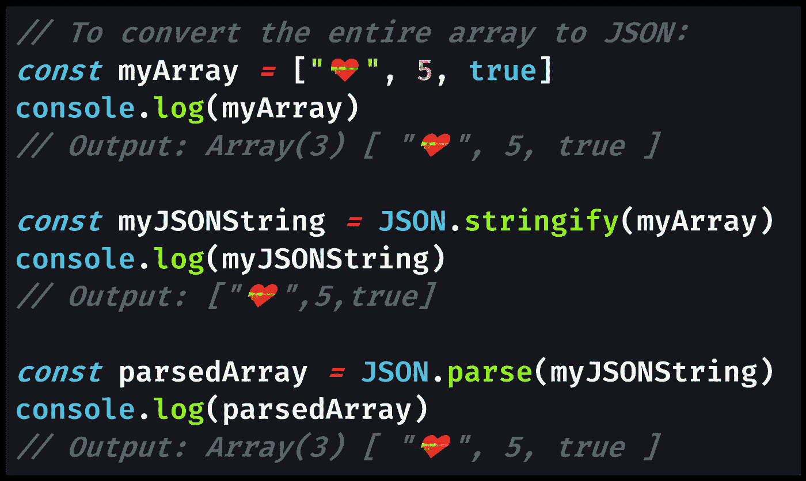
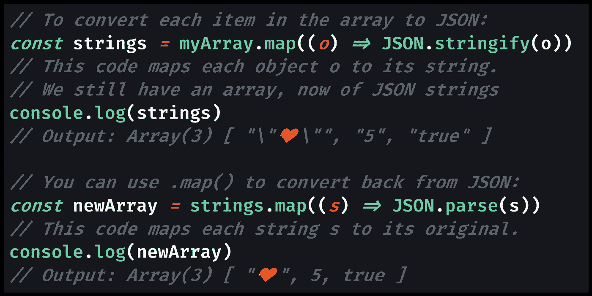

# 如何将 JavaScript 数组转换成 JSON 格式

> 原文：<https://blog.devgenius.io/how-to-convert-a-javascript-array-to-json-format-94daf35b8c21?source=collection_archive---------0----------------------->

## 当您有一个数组并且需要 JSON 格式时，您可以格式化整个数组，也可以使用`.map()`函数格式化单个项。

照片由 [Jonas Verstuyft](https://unsplash.com/@verstuyftj?utm_source=medium&utm_medium=referral) 在 [Unsplash](https://unsplash.com?utm_source=medium&utm_medium=referral)

# JavaScript 中数组的 JSON 格式

使用[JSON(JavaScript Object Notation)](https://medium.com/swlh/what-is-json-used-for-in-javascript-programming-9d71284359a9)可以方便地将 JavaScript 对象作为文本数据使用，这就是为什么我们在如此多的项目中看到 [JSON 格式的](https://medium.com/swlh/what-is-json-used-for-in-javascript-programming-9d71284359a9)配置文件，如`[.prettierrc](https://prettier.io/docs/en/configuration.html)`(用于[更漂亮的](https://prettier.io/))和`[.eslintrc](https://eslint.org/docs/user-guide/configuring)`(用于 [ESLint](https://eslint.org/) )。

有理由使用普通的`.js` JavaScript 文件而不是 JSON 文件来存储数据，比如 [webpack](https://webpack.js.org/) 如何使用`[webpack.config.js](https://webpack.js.org/configuration/)`文件。例如，某些值不是 [JSON 安全的](https://developer.mozilla.org/en-US/docs/Web/JavaScript/Reference/Global_Objects/JSON/stringify#Description)，比如`[null](https://medium.com/javascript-in-plain-english/how-to-check-for-null-in-javascript-dffab64d8ed5)`。

也就是说，如果您的数据包含典型的[原始类型](https://developer.mozilla.org/en-US/docs/Glossary/Primitive)，如[字符串](https://medium.com/javascript-in-plain-english/how-to-check-for-a-string-in-javascript-a16b196915ff)和[数字](https://medium.com/javascript-in-plain-english/how-to-check-for-a-number-in-javascript-8d9024708153)，JSON 格式仍然非常有用。JSON 语法使用`[]`方括号语法[来表示数组](https://json-schema.org/understanding-json-schema/reference/array.html)。

## **那么如何将 JavaScript 数组转换成 JSON 格式呢？**

这个问题的答案取决于您是希望将整个数组保存为一个 JSON 字符串，还是希望将数组中的项分别转换为 JSON 字符串。

通过调用数组上的`[JSON.stringify()](https://medium.com/javascript-in-plain-english/how-to-use-stringify-and-parse-in-javascript-6b637b571a32)`将整个数组转换成 JSON 作为一个对象，这将产生一个 JSON 字符串。要从 JSON 转换回一个数组，你可以在字符串上调用`[JSON.parse()](https://medium.com/javascript-in-plain-english/how-to-use-stringify-and-parse-in-javascript-6b637b571a32)`，留下原始数组。

要将数组中的每一项转换成 JSON 格式，那么您需要对数组进行循环。这是使用`.map()` ( `[Array.prototype.map()](https://developer.mozilla.org/en-US/docs/Web/JavaScript/Reference/Global_Objects/Array/map)`)的好时机，将数组中的每一项转换成 JSON。

在我关于通过内容寻找唯一对象的文章中，我在一个`.map()`调用中使用了一个类似的例子`JSON.parse()`，我比较了每个对象的 JSON 字符串的唯一性。[找到唯一的字符串](https://medium.com/p/e698b7957736)是[简单的](https://medium.com/better-programming/why-you-should-make-your-code-as-simple-as-possible-3b35e89f137)使用`[Set](https://medium.com/coding-at-dawn/how-to-use-set-to-filter-unique-items-in-javascript-es6-196c55ce924b)`，产生一个唯一对象的数组。

让我们来看一个在 JavaScript 中将数组与 JSON 格式相互转换的代码示例:

[将原始代码](https://gist.github.com/DoctorDerek/0b24deed7af25df3ac0f0c5738fc7267)视为 GitHub 要点

我们通过使用`stringify()`生成一个 JSON 字符串，将数组转换成 JSON 格式。调用`parse()`从 JSON 字符串创建一个对象与这个过程相反，会产生一个数组。

将数组中的每一项转换成 JSON 格式的工作方式略有不同，因为您必须添加一个`.map()`调用。例如，如果您有一个对象的[数组，这可能是您想要的解决方案。](https://medium.com/better-programming/how-to-find-unique-objects-in-an-array-in-javascript-by-object-reference-or-key-value-pairs-131338898d7a)

[查看原始代码](https://gist.github.com/DoctorDerek/0b24deed7af25df3ac0f0c5738fc7267)作为 GitHub 要点

我希望这能清楚地说明在数组上调用`JSON.stringify()`与使用`.map()`将数组中的每一项单独转换成 JSON 格式之间的区别。

当您希望将整个数组存储为一个文件时，可以将整个数组转换为 JSON 格式，作为一个 JSON 字符串。但是如果你有一个数组值，你想以 JSON 格式单独存储，你需要`.map()`每个数组元素到它的 JSON 字符串。

虽然我在数组中只使用了基本类型，但这两种方法都适用于包含其他对象的数组:内部嵌套了其他对象的“嵌套数组”。事实上，您甚至可以使用`JSON.parse()`结合`JSON.stringify()`来"[深度复制](https://medium.com/javascript-in-plain-english/how-to-deep-copy-objects-and-arrays-in-javascript-7c911359b089)嵌套对象——只要要克隆的对象中只有 [JSON-safe](https://developer.mozilla.org/en-US/docs/Web/JavaScript/Reference/Global_Objects/JSON/stringify#Description) 数据。

要将 JavaScript 数组转换成 JSON，可以利用全局 `[JSON](https://developer.mozilla.org/en-US/docs/Web/JavaScript/Reference/Global_Objects/JSON)` [对象](https://developer.mozilla.org/en-US/docs/Web/JavaScript/Reference/Global_Objects/JSON)上的`.stringify()`和`.parse()`方法。

**快乐编码！🎭🧶😸💻🧠**

Jonas Verstuyft 在 [Unsplash](https://unsplash.com?utm_source=medium&utm_medium=referral) 上拍摄的照片

[德里克·奥斯汀博士](https://www.linkedin.com/in/derek-austin/)是《职业规划:如何在 6 个月内成为一名成功的 6 位数程序员 》一书的作者，该书现已在亚马逊上架。