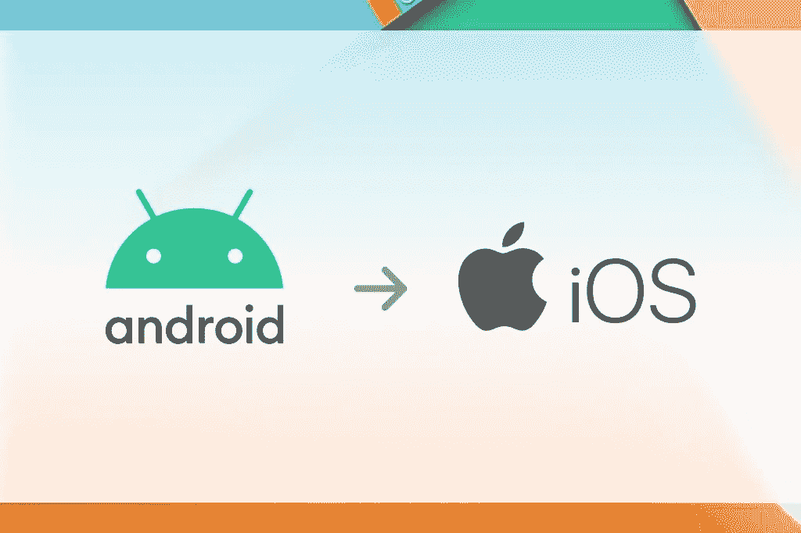
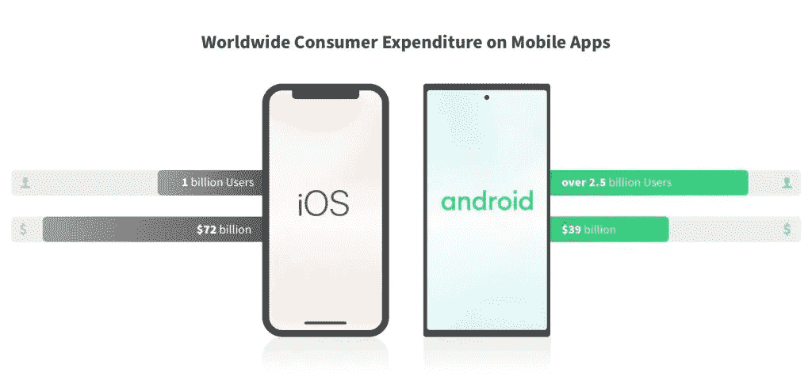
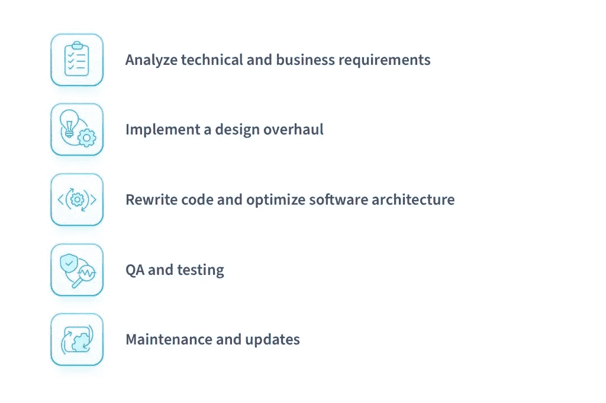

# 如何通过 5 个简单的步骤将 Android 应用程序转换到 iOS——NIX United

> 原文：<https://blog.devgenius.io/how-to-convert-an-android-app-to-ios-in-5-easy-steps-nix-united-322bfc57f01a?source=collection_archive---------6----------------------->

虽然 Android 在当前的移动市场表现不错，受到全球绝大多数智能手机用户的青睐，但 iOS 方面的交易仍然太有吸引力，因为它有一个专门的社区。这最终使得许多基于 Android 的软件提供商出于一系列原因考虑及时过渡到 iOS 平台。想知道哪些原因最重要，如何将一个 Android 应用整体转换到 iOS？让我们找出答案。

# 将 Android 应用程序转换到 iOS 的原因

从本质上来说，将 Android 应用移植到 iOS 的所有理由都归结为抓住机会，扩展到未知的有利可图的领域，以进一步扩大全球移动软件市场的范围。

# 扩大您的客户群并开发新市场

你可能会无缘无故地错过苹果市场的“另一面”。即使你是一个专注于 Android 的供应商，为什么不同时覆盖两个重要的细分市场呢？新的未开发的市场前景意味着新的市场份额和更多的用户。尽管 Android 在全球范围内都是非常受欢迎的买家选择，但苹果设备在美国仍然占据了 54%的市场份额，在加拿大占据了 53%，在大洋洲占据了 53%。在世界上大多数其他地方，iOS 的总市场份额可能会有 20–40%的差异；

如果你的目标是这样的地理位置，或者希望在最好的情况下成功扩展，你不能忽视在将 Android 应用程序转换为 iOS 后立即开始在这些地方运营的机会。

# 利用新的软件功能

将一个 Android 应用程序转换成一个 iOS 软件，你可以在这个过程中为你的产品添加全新的功能，根据苹果提供的功能对其进行扩展。因为将一个 Android 应用移植到 iOS 的整个过程实际上是从零开始重新设计应用，所以你有很好的机会添加或删除任何你认为合适的特性和功能。你也可以分析你从一个全面改造的产品中得到的结果，并在 Android 平台上实现它们。

# 在新的市场环境中增加利润

尽管覆盖全球市场的一小部分，iOS 软件的用户比 Android 用户更热衷于消费。除此之外，在基本移动平台上用两个应用程序覆盖全球市场，而不是一个，应该会帮助你创造更多利润。最终，你的营销机会以及未开发市场带来的所有好处都将翻倍。

# 进入独家品牌生态系统

苹果已经形成了一个独特的、独家的市场和用户生态系统，这是安卓所没有的。它的主要优势是覆盖了不同用户群和人口统计的多个使用领域。普通的 iOS 用户是一个不同的品种，必须得到适当的对待。从长远来看，精心设计一个合适的聚焦方法会有很大的回报。因此，鉴于 Macbook 和 iPad [迅速转向苹果 M1 芯片](https://nix-united.com/blog/apple-announced-big-sur-and-the-m1-chip-what-does-this-change/)，移植到 iOS 的 Android 应用只是涵盖整个苹果产品线的全面产品创造的第一步。

# 将 Android 应用移植到 iOS 之前需要考虑的 3 件事

有几个初步的措施，最好事先处理，以实现将 Android 移植到 iOS 的最平稳、无错误的过程。

# 选择一种编程语言

作为基本的 Android 开发语言， [Kotlin 被 Google](https://nix-united.com/blog/kotlin-vs-java-which-is-the-winner/) 推荐为最平滑、最简单、最快速的 Android 元素，因为它完全向后兼容 Java。与此同时，你最终还必须与苹果开发的编程语言 Swift 合作，以最终完成你的 iOS 转换应用。Objective-C 和 Objective-C++也可以交替使用，但是它们被用于 iOS 应用程序开发的机会微乎其微。

另一种有效的方法是使用 Kotlin 的多平台编程能力。你需要一台分别安装了 macOS 的 Mac 电脑，以便为新应用程序创建资源。但是在 Android 到 iOS 移植的背景下，Kotlin 提供的多平台机会非常灵活，可以成为一个有效的选择。然而，技术的最终选择在很大程度上取决于对最终产品功能的要求。

# 准备重新设计项目

虽然设计的某一部分可以重复使用，保持不变或只需稍微修改，但许多次要和主要的设计元素必须修改，包括所有的图标、按钮、字体、比例等。我们将在文章中深入探讨这方面的更多细节，但您应该首先概述并考虑材料设计和平面设计指南之间的差异。

# 设置一致的操作系统版本

与多种多样的 Android 操作系统形成对比的是，所有的 iPhone 设备都使用单一的 iOS 系统，该系统会随着新的 iPhone 不断更新。此外，只要有新版本发布，所有与之兼容的设备都会在全球范围内同步更新。因此，最好的选择是选择最新稳定的 iOS 版本进行过渡，以应对所需的用户受众群体。据 Statista 称，超过 75%的 iPhone 用户已经在使用最新版本的 iOS 14。

# 如何将 Android 应用移植到 iOS

# 步骤 1 —分析技术和业务需求

这意味着对应用程序的业务逻辑、与 iOS 平台的兼容性细节以及 Android 应用程序涉及的第三方模块和库的深入分析，以及扩展和优化的空间。需要注意的是，Android 和 iOS 应用程序共享一个通用的后端，这意味着执行业务逻辑层的代码保持不变。

所有这些都应该根据 iOS 平台的细微差别进行排序。最好有经验丰富的软件专家在你身边，帮助你收集所有适当的信息。在这个阶段，您通常需要弄清楚:

*   应用程序设计细节
*   功能规格
*   业务逻辑结构
*   源代码的细微差别

在这里，您应该最终从技术和业务细节的角度来看待整个项目。执行这两个领域中基本功能的最合适的元素可以分别由软件架构师和业务分析师最充分地安排。

这里的其他重要里程碑包括全面的市场分析、项目思维导图、代码和设计评审、工作流结构组织、功能规范。

# 步骤# 2——实施设计检查

现有 Android 应用程序的许多基本设计元素将不得不按照扁平化设计准则进行修改和更改。重要的方面包括 Android 原生 UI 镜像特性和预先设计的资产分割。应用程序移植的设计应该关注项目工作流的一个单独的补丁。

说到 UI 镜像，这有助于正确显示从左到右(LTR)和(RTL)从右到左的语言，你应该知道，自 Android 4.2 Jelly Bean 和 iOS 9 以来，不太常见的 RTL 界面分别是默认和自动化的。并且您必须自己实现定制元素的自动文本翻转。

平面设计驱动的改革将主要包括移动物体位置，并使视觉效果更具 3D 风格。另一个重要的事情是调整字体类型；Android 使用 Roboto 作为基本的系统字体类型，而 iOS 则建立在旧金山之上。

# 第 3 步—重写底层代码并优化整个软件架构

因为 Android 应用程序代码不能简单地重新编译以适应 iOS 架构细节，所以您需要重写大部分软件的代码。这里最重要的事情是保持与所有兼容性一致，并使该过程的每一步与新平台要求同步。这里的主要工作是技术专家(软件工程师和设计师)。有专门的软件把 Android 代码(Java，Kotlin)转换成 iOS (Swift)。然而，这些自动化解决方案生成的代码质量远非理想，需要 iOS 开发人员进行全面的修改和优化。

您必须在解决方案中融入大量必要的第三方集成，包括:

*   一个支付网关(多个，如 Stripe 和 PayPal，将是最好的)；
*   与最受欢迎的平台(脸书、Instagram、Twitter、LinkedIn 等)进行社交整合。);
*   数据分析模块(包括 Google Analytics、Mixpanel 等)；
*   订单交付集成。

代码移植例程的所有其余部分都是关于一步一步地修改和实现资产，确保工作流足够灵活，能够处理所有基本的项目阶段以及过程中可能出现的额外工作因素。

# 第 4 步—测试和质量保证

将应用从 Android 转换到 iOS 后，最重要的最终确定阶段是你需要彻底测试转换后应用的所有功能性 UI/UX 特性和其他操作能力的阶段。最重要的是，一些额外的质量保证工作，将授予应用程序的现场使用质量是必须的。

从长远来看，您的测试和 QA 工作应该包括:

*   性能负载测试
*   功能测试
*   UX/用户界面测试
*   安全测试
*   单元测试

一个久经考验的实践是结合手工和自动化测试技术来组织最彻底的测试过程。

# 第 5 步—维护和更新

当然，从 Android 到 iOS 应用程序转换过程中产生的最终产品必须在其特定的操作领域进行适当的维护。这涉及到修补只能在活动软件运行期间检测到的错误和缺陷，以及保持所有方便的产品及时更新。

# 把一个安卓应用移植到 iOS 需要多少钱？

整个流程的最终费用范围由整个流程范围和技术/业务细节构成。但最终的价格大约是从头开始创建一个应用程序的价格。完全转换将花费同样多的时间，而所有的设计和代码检查程序必须由全职的设计人员和开发人员以类似于构建新软件架构的方式来执行。

最终，将 Android 移植到 iOS 的最终成本将由以下因素构成:

*   要重新设计的体系结构的复杂性以及涉及的资产数量
*   UI/UX 设计细节和大量第三方集成
*   首选软件供应商的位置和价格
*   添加全新功能的程度
*   所有的项目管理、支持和维护工作

然而，在不了解一些潜在项目细节的情况下，很难指出甚至是大概的价格。

我们的专家可以根据您要完全免费转换的应用程序的潜在细微差别，为您单独计算并提供全面的估计。

# 将尼克斯联合视为您值得信赖的合作伙伴

NIX United 是一家经验丰富的软件开发和设计服务提供商，对主要市场趋势和深入的软件转换技术有着深刻的理解。特别是，我们在市场上提供超过 27 年的经验和专业知识，高性能、敏捷的[移动应用程序开发团队](https://nix-united.com/services/mobile-app-development/)可从 2000 多名专业软件工程师、3000 多个项目中进行选择。

求助于 NIX 专家，您可以获得成熟的工作流程、热情的专家以及最新、最时尚的技术和方法。我们覆盖了广泛的终端产品领域和行业，从电子商务、电信和制造业到医疗保健和生物制药、保险和信息管理。

我们可以根据最新的方法，以最合理的价格帮助您将 Android 应用程序转换为 iOS，无论您项目的目的和复杂性如何。

简而言之，我们认为我们的案例研究应该不言自明。

# 一款医疗保健应用

医疗保健软件是目前软件开发市场中最先进的领域之一，这需要独特的方法和努力。我们优化和改进患者保留增强 HIPAA 兼容应用程序的项目涉及三种不同的技术、一整套编程语言和工具(Swift 3.0、Objective-C 2.0、Java、Kotlin、浪子、JavaScript、Gradle、JQuery、RoR、Ruby、Sinatra 等。)，以及由 20 多名经验丰富的专家组成的大型团队。

我们最终设法根据相关的 HIPAA 要求对应用程序进行了彻底的修改。这包括优化现有代码、修订业务规则以提高 UX，以及适应所有 HIPAA 安全建议。

该项目帮助客户在 7 家医院中获得了超过 14，000 名新用户，实施了患者留存管理应用程序。

# 物业管理平台

另一个与时俱进的领域是房地产，在这个领域，公司和企业家仍在寻求和创造新的、更方便的管理方法和途径，以提高房地产企业的利润。这正是为房东构建定制的移动物业管理解决方案的目的。我们将 React Native 的强大功能与 Golang 结合起来，以实现一个全面的高性能、稳定、便捷的物业管理应用程序。

我们从零开始创建了一个完全定制的平台；一个由六名专家组成的团队实施了各种以房地产为中心的模块，让房东的生活最终变得更加轻松。

这包括添加一个直观的聊天系统、一个投票系统、日历和活动集成、一个住宅支出计划仪表板、电子签名、停车管理，以及大部分提到的功能的大量自动化。

# 最后的想法

Android 到 iOS 应用程序的转换是一项负责任的工作，需要全面的软件检查、改进和优化项目，以解决之前未开发的市场领域。然而，这项有些复杂的事业从长远来看肯定会有回报，因为你可以在当今最独特的细分市场积累新的付费用户。

*原载于 2021 年 8 月 6 日*[*【https://nix-united.com】*](https://nix-united.com/blog/how-to-convert-android-app-to-ios/)*。*