# IBM 集成总线中 JSON 和 XML 之间如何转换

> 原文：<https://blog.devgenius.io/how-to-convert-between-json-and-xml-in-ibm-integration-bus-2754a837aec9?source=collection_archive---------1----------------------->

沙哈达特·拉赫曼在 [Unsplash](https://unsplash.com/s/photos/xml?utm_source=unsplash&utm_medium=referral&utm_content=creditCopyText) 上拍摄的照片

消息格式之间的转换是集成软件的主要特性之一。之所以需要这样做，是因为应用程序使用不同的格式。一些应用程序被公开为基于 XML 的 SOAP API，而另一些被公开为基于 JSON 格式的 REST API。因此，在本教程中，我将解释如何在 IIB 使用 IIB 的母语 ESQl(也称为扩展 SQl 语言)完成 JSON 和 XML 之间的转换。

## 要求:

在本教程中，我们将使用 postman 向我们的应用程序发送请求，IBM App Connect 创建 REST API，根据我们收到的输入在 XML 和 JSON 之间进行转换。

## 第一步:

在您的 App Connect 工具包中，首先创建一个 REST API。

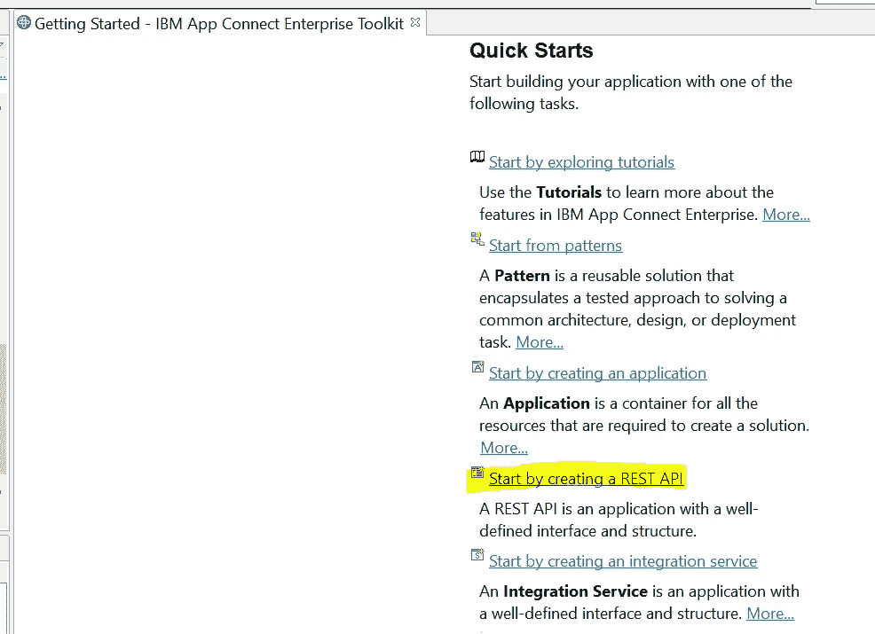

## 第二步:

打开 REST 描述符，通过单击 resources 旁边的(+)添加新资源。将其命名为/converter，并选择 post operation。单击应用，然后单击确定

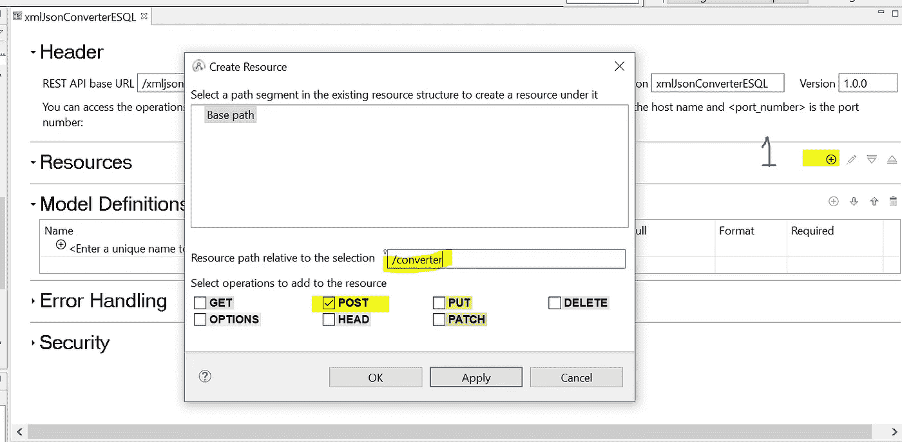

## 第三步:

如图所示，通过单击“创建子流程”图标来创建子流程。

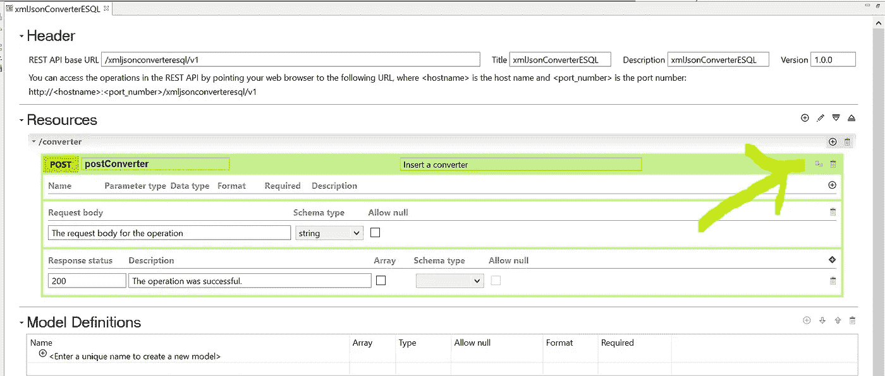

## 第四步:

一旦我们准备好了子流程，我们就可以开始开发了。添加以下节点，并如图所示进行连接。双击该节点，这样它将生成 ESQL 文件，以避免任何错误。

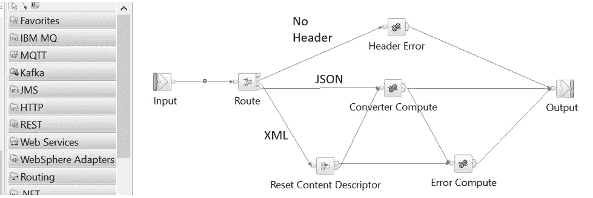

我们的 REST API 的消息流

> **IIB 的 REST API 默认解析 JSON 格式的数据**

设计这样一个消息流的原因是 IIB 的 **REST API 默认解析 JSON 格式的数据**。在我们的教程中，我们需要在 XML 和 JSON 之间进行转换，反之亦然。因此，我们还需要配置我们的流来接受 XML 格式。为此，我们使用了请求头中的头参数，并根据它的值路由我们的流。

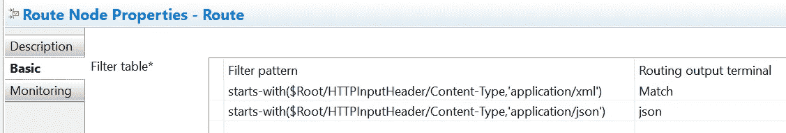

路由节点的属性

在匹配输出的情况下，它将路由到“重置内容描述符”节点，并将消息域设为 XMLNSC 以便解析。在 JSON 输出的情况下，流将转到 compute 节点进行转换。在流程中的任何一点，如果解析失败(JSON 或 XML ),它将从错误计算节点发送一个错误。

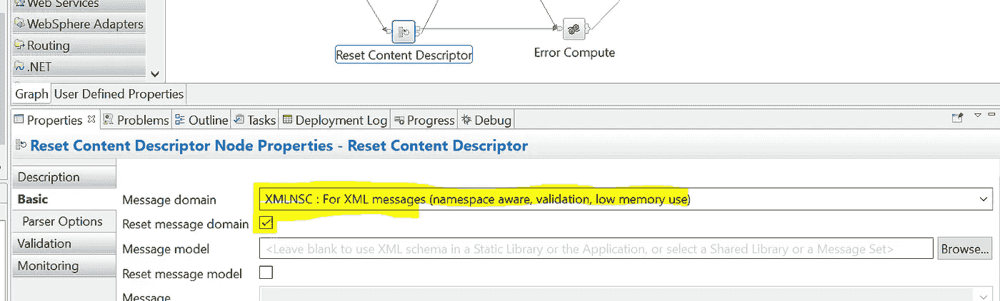

重置内容描述符节点的属性

## 第五步:实际代码

到这一步，我们已经设置好了所有的配置和消息流。现在是实际查看编码部分的时候了。下图显示了 ESQL 代码如何区分 XML 和 JSON 格式，并最终进行实际转换。

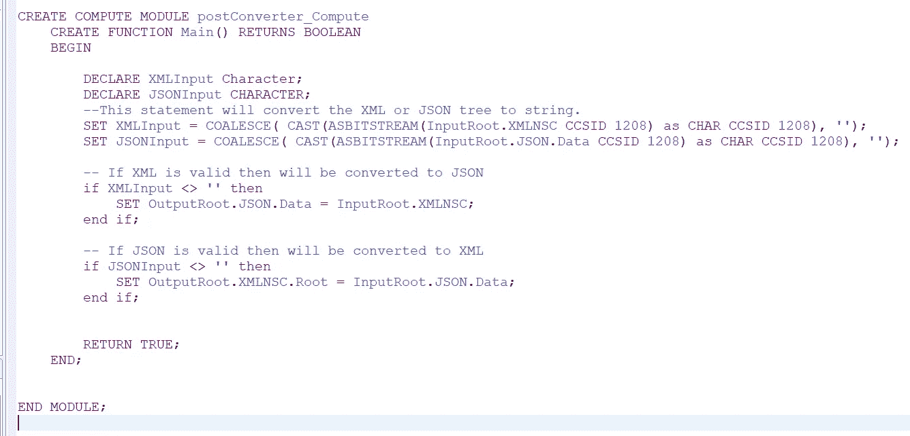

完整的项目上传到我的 github 库，链接如下:

 [## Ahmed Khan 1991/xmlJsonConverterESQL

### 此时您不能执行该操作。您已使用另一个标签页或窗口登录。您已在另一个选项卡中注销，或者…

github.com](https://github.com/ahmedkhan1991/xmlJsonConverterESQL) 

## 步骤 6:用邮递员测试

对于所有还没用过 postman 的人来说，Postman 是一个用来测试 REST APIs 的软件。现在我们的 REST API 已经准备好了，我们已经将它部署到我们的集成服务器中，并将使用 postman 测试这个 API。

1.  **测试 JSON 到 XML**

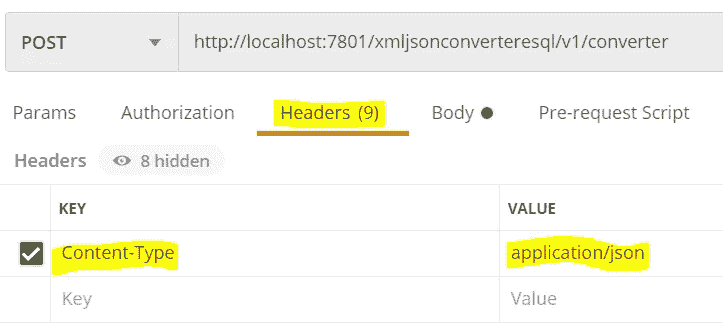

在 postman 中，转到标题选项卡，创建内容类型为“应用程序/json”。

然后打开 body 标记，输入任何想要转换成 XML 的 JSON 对象，应用程序将返回带有根元素“root”的 XML，如下所示。

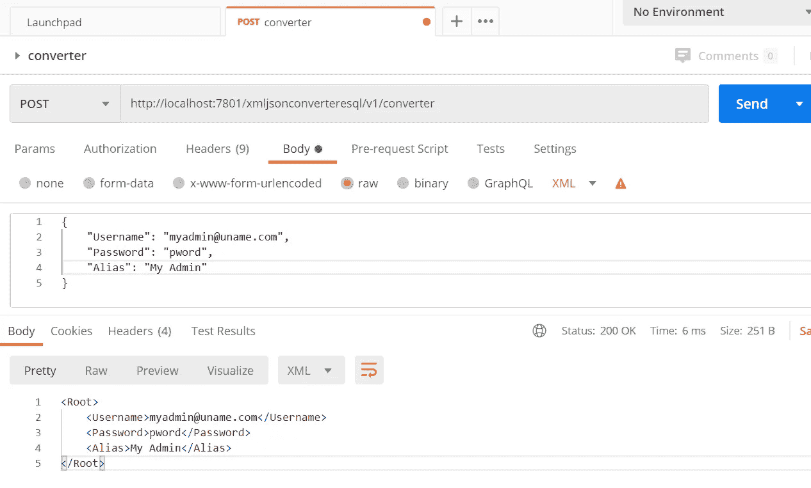

2.**测试 XML 到 JSON**

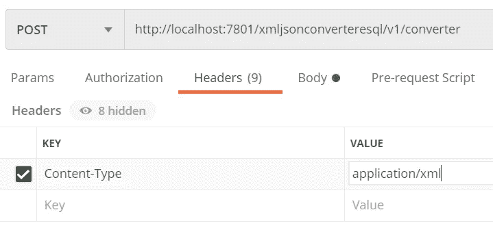

在 postman 中，转到 header 选项卡，将 Content-Type 更改为“application/xml”。

然后打开 body 标记，输入任何想要转换成 JSON 的有效 XML 文本，应用程序将返回相应的 JSON，如下所示。

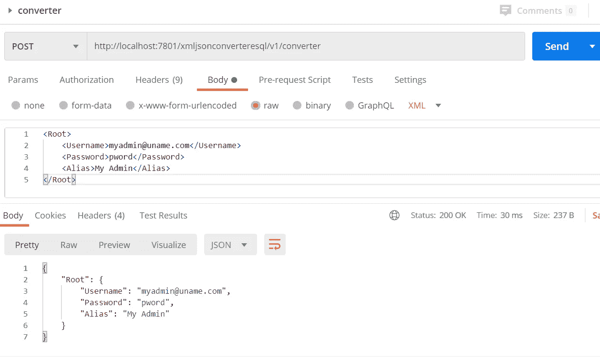

## 结论:

在本文中，我们比理论上解释 JSON 和 XML 格式更进了一步。我们使用 App Connect Toolkit 和 ESQL 创建了一个 REST API，用于在业界广泛使用的两种消息格式之间进行转换。

**阅读更多:**

 [## 如何使用 ESQL 在 IIB(App Connect Enterprise toolkit)将 XML 列表转换为 JSON 数组

### 以前我写过一篇关于如何在 SOAP XML 和 REST JSON 对象之间进行转换的文章，反之亦然。简而言之，这是…

medium.com](https://medium.com/dev-genius/how-to-convert-xml-list-to-json-array-in-iib-app-connect-enterprise-toolkit-using-esql-b495673fe838) 

**快乐学习。**