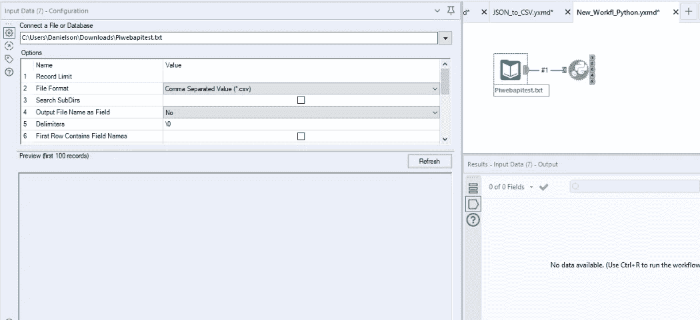
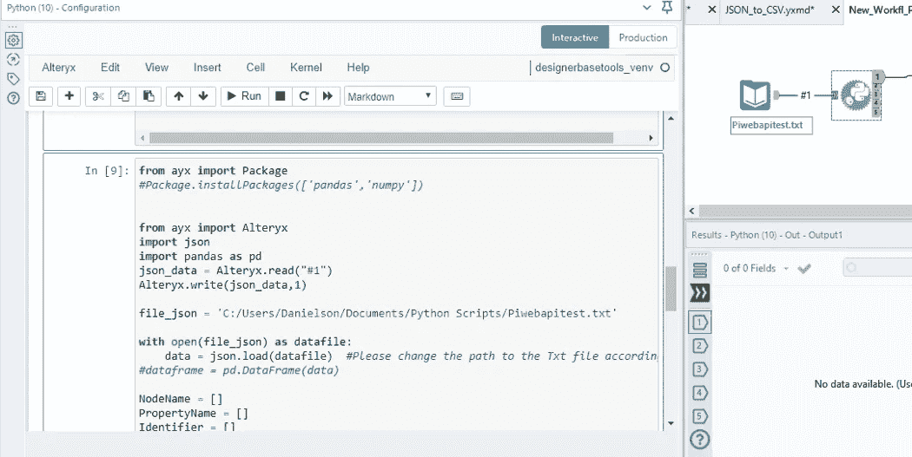

# 如何在 Alteryx 和 Python 中将 JSON 转换成 CSV

> 原文：<https://blog.devgenius.io/how-to-convert-json-to-csv-in-alteryx-and-python-9fdaa35af5fe?source=collection_archive---------8----------------------->


费伦茨·阿尔马西在 [Unsplash](https://unsplash.com/?utm_source=medium&utm_medium=referral) 上的照片

将 JSON 文件转换成 CSV 文件是一个相对简单的过程。Alteryx 和 Python 可以用于转换。

**JSON** 代表 JavaScript **对象符号**，它是作为 XML(可扩展标记语言)的替代品而创建的。像 XML 一样，它使用逗号、花括号和方括号来表示分层数据。JSON 的一个例子是这样的:

```
{“name”:” Peter”,” age”:”35"}, 
{“name”:” Shaw”,” age”:”35"}, 
{“name”:” Jessica”,” age”:”15"}
```

顾名思义，它可以很容易地将数据解析成本地 JavaScript 对象，这使得它对 web 应用程序非常有用。

另一方面，CSV 代表逗号分隔值。顾名思义，这种数据格式基本上是由逗号分隔的元素列表。例如，您的响应发回了一个特定家庭的成员列表。格式应该是这样的:彼得，肖，杰西卡。

有趣的是，Alteryx 和 Python 是强大的数据工程框架，让生活变得简单。Alteryx 作为一个 ETL 工具，可以用来将 JSON 转换成 CSV 以及 Python。将这两个框架结合使用，您可以灵活地使用 Alteryx 或 Python 来处理项目的不同部分。Alteryx 中的 Python 工具是一个游戏改变者；在 Alteryx 中你可以做很多有趣的事情。Alteryx 本身就很强大。

在今天的教程中，我们将转换来自 RESTful API 应用程序的 JSON 数据。这是对项目的完成很重要的一部分，我们将解释这部分是如何工作的。我们将使用输入工具引入数据(来自 API 应用程序的 JSON 数据)。Alteryx Python 工具将被用作转换工具，我们将把数据输出到项目的其他部分。

在本指南中，您将看到使用 Alteryx 和 Python 将 JSON 转换为 CSV 文件的步骤。

**第一步。** **使用输入工具读入数据或从 Rest API 读入数据。如果没有传入连接，Python 工具将无法独立工作。**



**第二步。** **下一步是使用 Python 工具通过指定数据路径读入数据。**

Python 通过一个名为 JSON 的内置包支持 JSON。为了使用这个特性，我们用 Python 脚本导入 JSON 包。



第三步:最后，让我们转换数据。关于这个解决方案的一个有趣的事情是，我们也可以选择任何我们需要的列，将它解析到我们的数据框架中

```
from ayx import Package
#Package.installPackages([‘pandas’,’numpy’])
from ayx import Alteryx
import json
import pandas as pd
json_data = Alteryx.read(“#1”)
Alteryx.write(json_data,1)

file_json = ‘C:/Users/Danielson/Documents/Python Scripts/Piwebapitest.txt’

with open(file_json) as datafile:
 data = json.load(datafile) #Please change the path to the Txt file accordingly. 
#dataframe = pd.DataFrame(data)

NodeName = []
PropertyName = []
Identifier = []
TagId = []
TypeID = []
TimeSeriesName = []
Environment = []

timestamp = []
EventCount = []
StandardDeviation = []
Value = []
DATA_VAVG = []

x = len(data)

for info in range(0, x):
 p = len(data[info][‘data’])
 for k in range(0, p):
 timestamp.append(data[info][‘data’][k][‘timestamp’])
 EventCount.append(data[info][‘data’][k][‘EventCount’])
 StandardDeviation.append(data[info][‘data’][k][‘StandardDeviation’])
 Value.append(data[info][‘data’][k][‘Value’])
 DATA_VAVG.append(data[info][‘data’][k][‘DATA_VAVG’])
 NodeName.append(data[info][‘NodeName’])
 PropertyName.append(data[info][‘PropertyName’])
 Identifier.append(data[info][‘Identifier’][0])
 TagId.append(data[info][‘MetaData’][‘TagId’])
 TypeID.append(data[info][‘MetaData’][‘TypeID’])
 TimeSeriesName.append(data[info][‘MetaData’][‘TimeSeriesName’])
 Environment.append(data[info][‘MetaData’][‘Environment’])

text_equ = {‘NodeName’:NodeName,’PropertyName’:PropertyName,’Identifier’:Identifier,’TagId’:TagId, ‘TypeID’:TypeID, 
 ‘TimeSeriesName’:TimeSeriesName,’Environment’:Environment, ‘timestamp’:timestamp,’EventCount’:EventCount,
 ‘StandardDeviation’:StandardDeviation, ‘Value’:Value, ‘DATA_VAVG’:DATA_VAVG}
dataframe = pd.DataFrame(data=text_equ)

Alteryx.write(dataframe,1)
```

在今天的简短指南中，我们讨论了如何在 Alteryx 和 Python 中将 JSON 转换为 CSV。如果你觉得这篇文章有帮助，分享给你的朋友。

如果你喜欢阅读这样的故事，并想支持我们的作家，考虑注册成为一个媒体成员。每月 5 美元，你可以无限制地阅读媒体上的故事。如果您使用我们的链接注册，我们将获得少量佣金。

[](https://medium.com/@cndro/membership) [## 通过我的推荐链接- Cndro 加入媒体

### 阅读 Cndro 的每一个故事(以及媒体上成千上万的其他作家)。你的会员费直接支持 Cndro 和…

medium.com](https://medium.com/@cndro/membership)