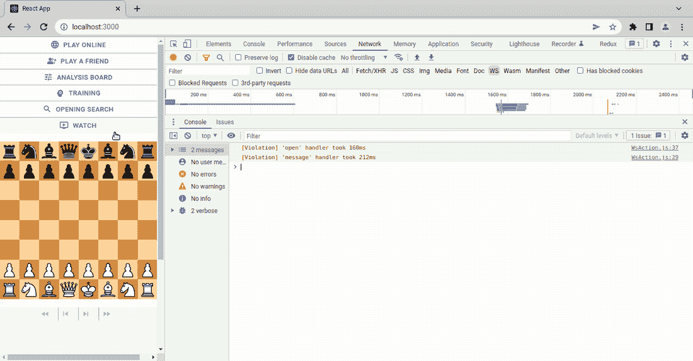

# 如何将 MP4 视频转换成动画 gif

> 原文：<https://blog.devgenius.io/how-to-convert-mp4-videos-to-animated-gifs-649e8e665059?source=collection_archive---------9----------------------->

## 在 GNU/Linux 系统上使用 Kazam 和 ffmpeg


萨姆·麦克格在 [Unsplash](https://unsplash.com/s/photos/video?utm_source=unsplash&utm_medium=referral&utm_content=creditCopyText) 上拍摄的照片

我通常用大量代码片段、图片和 gif 来写技术内容。根据我的经验，后者可能比其他媒体格式更难处理，因为它们可能会占用更多的磁盘空间，以至于超过大小限制。

例如，GitHub 上图像和 gif 的最大文件大小是 10 MB，而 Twitter 上动画 gif 的最大文件大小在手机上是 5 MB，在网络上是 15 MB。

动画 gif 非常有助于报告错误，你无法想象仅仅创建一个描述错误的 gif 可以节省多少时间。

[](https://github.com/chesslablab/redux-chess/issues/315) [## 如果加载包含反斜杠的 FEN 字符串，应用程序会崩溃

### 此时您不能执行该操作。您已使用另一个标签页或窗口登录。您已在另一个选项卡中注销，或者…

github.com](https://github.com/chesslablab/redux-chess/issues/315) 

创建以下示例至少需要几分钟时间，以便为所有参与解决问题的人员节省宝贵的时间。



**图一**。如果加载带反斜杠的 FEN 字符串，应用程序会崩溃。

# 那么，如何把一个视频做成 GIF 呢？

有很多在线工具可以免费为你提供媒体文件转换功能(通常带有广告)，而 Adobe Express 等其他应用程序允许在线执行文件转换，但需要事先注册。

技术读者可以考虑尝试一下他们操作系统中可用的命令行工具。

作为一个 GNU/Linux 用户，我通常会在 Kazam 的帮助下创建一个 MP4 格式的截屏视频，Kazam 是一个很棒的屏幕录制程序，在免费许可下发布。

[](https://launchpad.net/kazam) [## Kazam Screencaster 在 Launchpad

### Kazam 是一个简单的屏幕录制程序，它将捕获您的屏幕内容并录制一个视频文件…

launchpad.net](https://launchpad.net/kazam) 

下面是如何在基于 Debian 的发行版上安装 Kazam:

```
$ sudo apt install kazam
```

然后，我将使用 ffmpeg 将 MP4 文件转换成 GIF 文件。ffmpeg 是一个广泛使用的开源多媒体框架，旨在命令行上使用。

 [## FFmpeg

### FFmpeg-I input.mp4 输出。avi FFmpeg 5.0“洛伦兹”，一个新的主要版本，现在可用！为了这个期待已久的…

ffmpeg.org](https://ffmpeg.org/) 

这是在 Debian 发行版上安装 ffmpeg 的方法:

```
$ sudo apt install ffmpeg
```

如果你看一下文档，你会发现许多参数支持多种不同的媒体格式转换用例。我不会一一介绍，让我与你分享一个 ffmpeg 命令，当我必须为 bug 报告创建 web 应用程序的截屏 gif 时，它非常适合我。

```
$ ffmpeg -y -i input.mp4 -filter_complex "fps=7,scale=1100:-1:flags=lanczos,split[s0][s1];[s0]palettegen=max_colors=64[p];[s1][p]paletteuse=dither=bayer" output.gif
```

正如您在示例中看到的，输出宽度设置为 1100px。

另一方面，仅使用 64 色，这在图像质量方面相当不错，同时文件大小足够小，符合大多数社交媒体和协作工作平台的要求。

这是目前所有的，非常感谢您的阅读！

我想这实际上是写给未来的自己的另一个帖子，然后回来重新学习我是如何设法做一些事情的。如果你想支持我成为一名作家，请[考虑注册我的链接](https://programarivm.medium.com/membership)成为一名媒介会员。我会赚一小笔佣金。