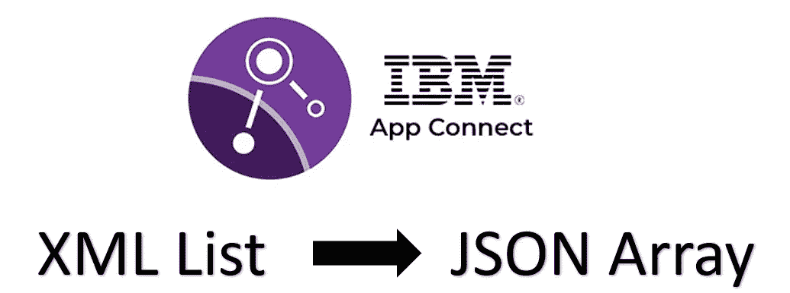
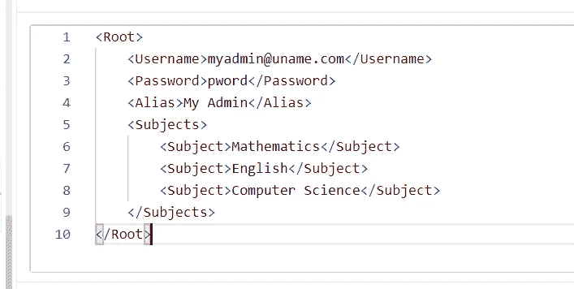
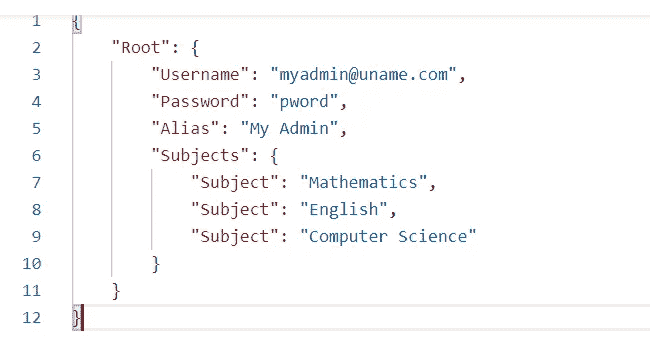
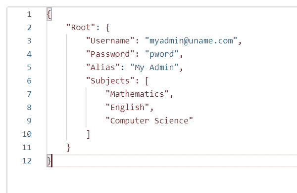
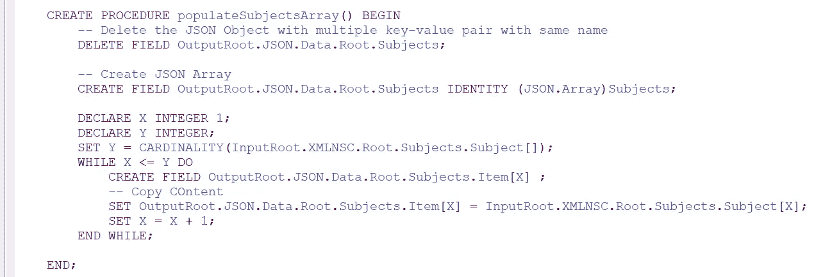
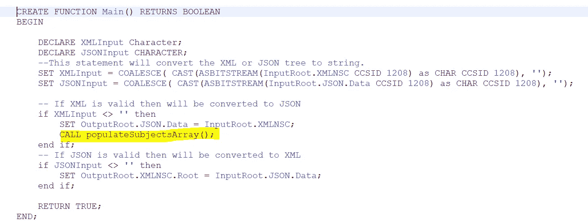
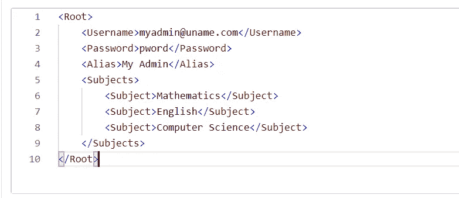
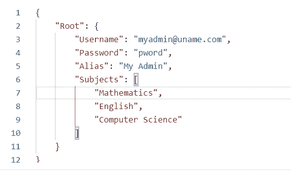

# 如何使用 ESQL 在 IIB(App Connect Enterprise toolkit)将 XML 列表转换为 JSON 数组

> 原文：<https://blog.devgenius.io/how-to-convert-xml-list-to-json-array-in-iib-app-connect-enterprise-toolkit-using-esql-b495673fe838?source=collection_archive---------2----------------------->



以前我写过一篇关于如何在 SOAP XML 和 REST JSON 对象之间进行转换的文章，反之亦然。简而言之，它使用了如下所示的简单逻辑:

```
— If XML is valid then will be converted to JSON if XMLInput <> ‘’ then 
    SET OutputRoot.JSON.Data = InputRoot.XMLNSC; 
end if; — If JSON is valid then will be converted to XML 
if JSONInput <> ‘’ then 
    SET OutputRoot.XMLNSC.Root = InputRoot.JSON.Data; 
end if;
```

[](https://medium.com/dev-genius/how-to-convert-between-json-and-xml-in-ibm-integration-bus-2754a837aec9) [## IBM 集成总线中 JSON 和 XML 之间如何转换

### 消息格式之间的转换是集成软件的主要特性之一。需要这样做是因为…

medium.com](https://medium.com/dev-genius/how-to-convert-between-json-and-xml-in-ibm-integration-bus-2754a837aec9) 

这种转换的问题是，如果我传递一个 xml 列表作为输入，它将返回一个 JSON 对象，其中有多个同名的键值对。它不等于 JSON 数组，返回的 JSON 字符串甚至不是有效的 JSON 对象。因此，在本教程中，我将创建一个包装器函数，从 XML 列表中创建一个 JSON 数组。

## 邮递员请求输入:



图 1:邮递员请求

## 邮递员响应输出:



图 2:邮递员回复

这不是有效的 JSON 对象。实际转换应等于:



图 3:预期响应

为了实现这种转换，我们现在将相应地操作我们的代码。这是我在互联网上做了大量研究，并将两到三个不同的教程整合到我自己的解决方案中之后学到的东西。您可以根据自己的数据结构调整自己的解决方案。

现在让我们假设我期待我的数据结构如上所示，我想把它转换成正确的 JSON 对象。下面的函数将在我的场景中工作:



图 4:添加 JSON 数组的函数



图 5:现在调用这里的新函数

## 代码功能:

```
CREATE PROCEDURE populateSubjectsArray() BEGIN-- Delete the JSON Object with multiple key-value pair with same nameDELETE FIELD OutputRoot.JSON.Data.Root.Subjects;-- Create JSON ArrayCREATE FIELD OutputRoot.JSON.Data.Root.Subjects IDENTITY (JSON.Array)Subjects;DECLARE X INTEGER 1;DECLARE Y INTEGER;SET Y = CARDINALITY(InputRoot.XMLNSC.Root.Subjects.Subject[]);WHILE X <= Y DOCREATE FIELD OutputRoot.JSON.Data.Root.Subjects.Item[X] ;-- Copy COntentSET OutputRoot.JSON.Data.Root.Subjects.Item[X] = InputRoot.XMLNSC.Root.Subjects.Item[X];SET X = X + 1;END WHILE;END;
```

## 让我们从 Postman 运行这个函数:



邮递员请求



新功能实现后的邮递员响应

# 结论:

在本教程中，我们解释了如何使用 IBM Integration Bus(App Connect/Ace Toolkit)中的 ESQL 将 XML 对象转换为 JSON 数组。

更多关于最新技术的教程和文章，请在 medium 上关注我。

快乐学习！！！！