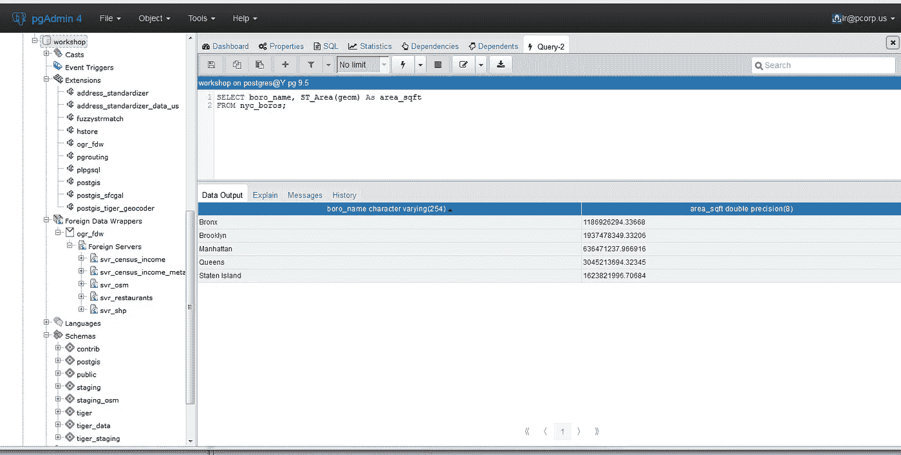

# 如何将 CSV 文件中的数据复制到 POSTGRES 数据库？

> 原文：<https://blog.devgenius.io/how-to-copy-data-from-csv-file-to-postgres-database-44502dd44226?source=collection_archive---------9----------------------->

CRUD 操作和数据迁移操作


来自 https://www.mshowto.org/的 POSTGRES 图片

## 简介—开始时

如果您正在处理数据库，您应该意识到将数据从一个数据库移动到另一个数据库的重要性。数据源可以是多种多样的，比如其他数据库( *MySQL、SQlite、MSSQL Server、MariaDB、Oracle Database、Redis、IBM Db2* 等)。).输出也可以是不同的格式，如 *xlsx，csv，json，xml，xl* s 等。

> 简而言之，数据必须是可共享的。

作为通用格式，我们这里用**CSV****。**因为，它是最简单的格式，具有良好的可读性和可写性。


马修·斯皮特里在 [Unsplash](https://unsplash.com?utm_source=medium&utm_medium=referral) 上拍摄的照片

## 逗号分隔值（csv）文件格式

*CSV —逗号分隔值*表示用逗号分隔的行。每个逗号都是一个分隔符。当您在任何 office 应用程序(如 MS ExceL)中打开 CSV 文件时，ExceL 会用逗号将数据分隔到各个列中。


MS Excel 中的 CSV 文件

# 逐步数据迁移

## 将数据保存到 CSV 文件中

首先打开你的数据库屏幕选择你的数据和保存结果(输出)作为 csv 文件到你的桌面。

## 通过 SQL 查询迁移您的数据

首先打开你的 **pgadmin4** 并打开你的数据库。打开**【查询工具】**



现在让我们检查一下***SQL 查询*** :

```
COPY tablename(column1, column2, column3, column4) 
FROM ‘path’ 
DELIMITER ‘,’CSV HEADER;
```

这里你必须将你的路径从路径部分粘贴到**部分，如下所示:**

对于 Linux:

```
FROM '\home\yourname\Desktop\yourfile.csv'
```

对于 Windows:

```
FROM ‘c:/Desktop/yourfile.csv
```

**分隔符**部分可以是“，”或“；”。这取决于你的 **CSV** 文件的分隔符。如果逗号那么逗号，如果分号那么分号。

```
COPY tablename(column1, column2, column3, column4)
```

在这里，您将在您的 **POSTGRES** 数据库中写入 tablename。例如:

```
tb_phone(contactName, contactSurname, contactPhone)
```

这里最重要的是列的大小。

> 表格中的列数必须与 csv 文件中的列数相同。

## 检查您的数据

在最后一步，我们将检查我们的表和数据。如果一切正常，我们将在 POSTGRES 表中看到我们的数据。

```
SELECT * FROM yourtablename;
```

## 结论

最后，我们可以将任何 csv 格式的数据加载到我们的 POSTGRES 数据库中。

## 接触


Pawel Czerwinski 在 [Unsplash](https://unsplash.com?utm_source=medium&utm_medium=referral) 上的照片

你可以问我任何问题

*   [领英](https://www.linkedin.com/in/gokayburuc/)
*   [Instagram](https://www.instagram.com/gokayburuc/)
*   [脸书](https://www.facebook.com/gokayburucsocial)
*   [邮件](mailto:gokayburuc@yandex.com)
*   [推特](https://twitter.com/tw_gokayburuc)