# 如何在 Linux 系统中复制、移动和重命名文件和目录

> 原文：<https://blog.devgenius.io/how-to-copy-move-and-rename-files-and-directories-in-linux-system-35cec04253ed?source=collection_archive---------8----------------------->

到目前为止我们已经看到了如何在 Linux 系统中**探索**，通配符的含义和使用，以及在 Linux 系统中**创建**和**删除**文件和目录。

现在让我们看看如何复制、移动和重命名这些文件和目录。

让我们从如何复制文件和目录开始

**1。** `**cp**` **命令**

`cp`命令代表**复制**用于**复制 Linux 系统中的文件和目录**。

`cp`命令的语法。

我们可以简单地使用`cp`命令以及**源**和**目标**。

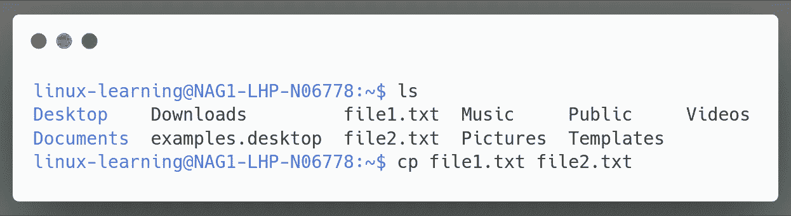

在上面的例子中，我们使用了命令`cp file1.txt file2.txt` where

`cp`代表复制命令
`file1.txt`代表源文件“file 1 . txt”
`file2.txt`代表目标文件“file2.txt”

那么如果 file2.txt 不存在呢？

如果 file2.txt 存在，它将被 file1 的内容覆盖。如果 file2.txt 不存在，则创建它。

好的，但是我们能做些什么来检查文件何时被覆盖吗？

*   将 file1.txt 复制到 file2.txt，并提示 file2.txt 是否被覆盖

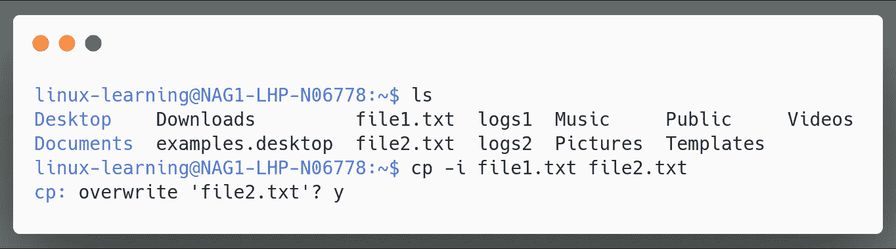

在上面的例子中，我们使用命令`cp -i file1.txt file2.txt`将 file1.txt 复制到 file2.txt，并且我们使用选项`-i`使其交互，并在 file2.txt 被覆盖时向我们提供提示。

好了，现在我们知道了如何复制文件，但是如果我们需要将目录 1 中的所有内容复制到目录 2 中呢？

*   将一个目录的内容复制到另一个目录

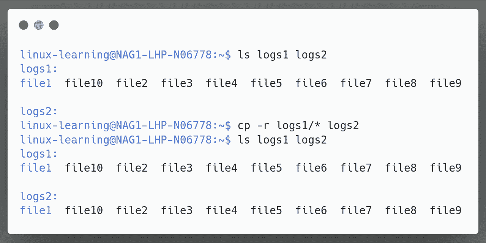

在上面的例子中，我们使用了通配符`*`并创建了命令`cp logs1/* logs2`，其中

`cp`代表复制命令
`logs1`代表源目录
`logs1/*`代表目录 logs1 的所有内容
`logs2`代表目标目录

与我们复制文件的情况不同，当我们使用`cp`命令时，我们需要目标目录存在。

那么，如果我们希望
如果文件夹不存在，那么应该创建文件夹，然后复制内容。

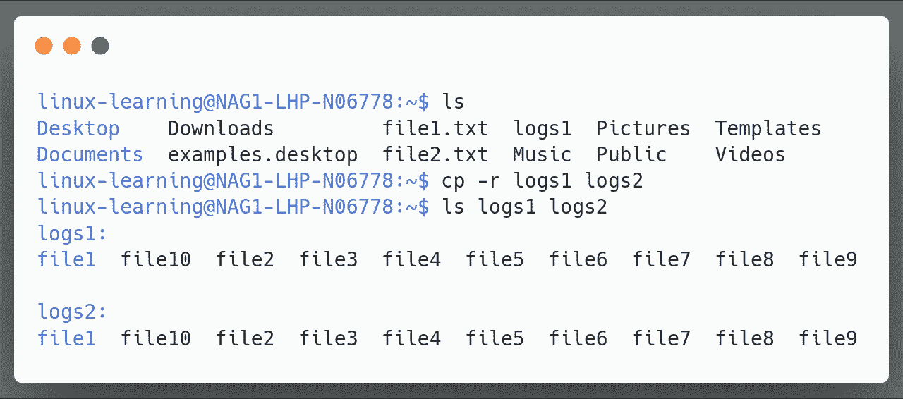

在上面的例子中，我们使用了选项`-r`并创建了命令`cp -r logs1 logs2`,其中

`cp`代表复制命令
`-r`代表递归
`logs1`代表源目录
`logs2`代表目的目录

现在我们知道了如何复制单个文件/目录，但是对于多个文件和目录呢？

用于多个文件和目录的`cp`命令语法

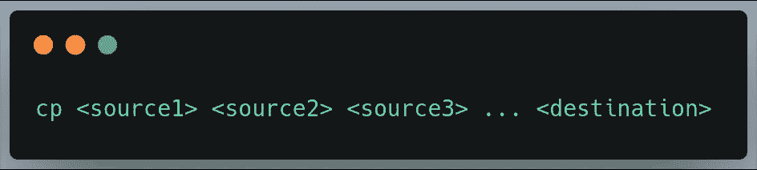

我们可以简单地使用`cp`命令以及**所有源**和**目的地**

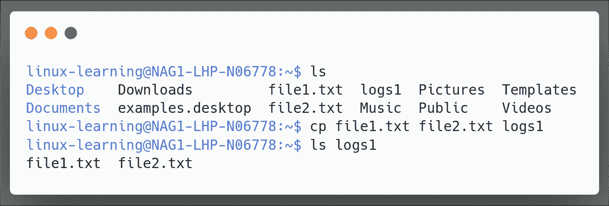

在上面的例子中，我们使用了命令`cp file1.txt file2.txt logs1`，其中

`cp`代表复制命令
`file1.txt`代表源**文件 **file1.txt**
`file2.txt`代表源**文件 **file2.txt**
`logs1`代表目的**目录****log S1******

这些是我们复制文件/目录的方法。现在让我们看看如何移动文件/目录。

**2。** `**mv**` **命令**

`mv`命令代表**移动**用于在 Linux 系统中**移动文件和目录**。

`mv`命令的语法。

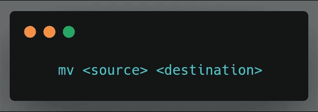

我们可以简单地使用`mv`命令以及源和目的地。

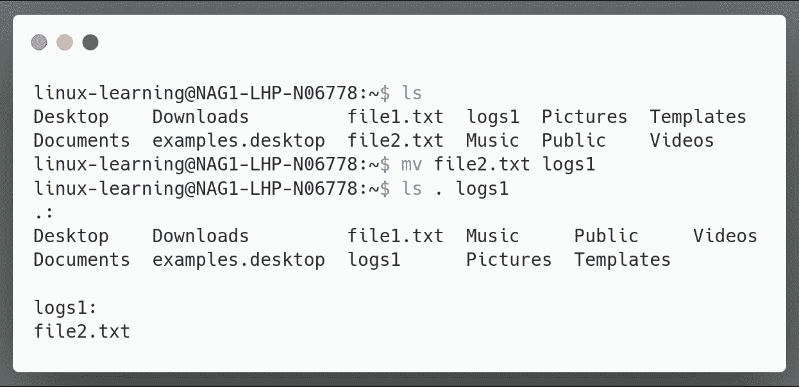

在上面的例子中，我们使用了命令`mv file2.txt logs1`，其中

`mv`代表**移动**命令
代表**源**文件 **file2.txt**
`logs1`代表**目的**目录 **logs1**

为了检查文件是否已经移动到目标目录，我们使用了命令`ls . logs1` where

`ls`代表**列表**命令
代表**当前工作目录**
`logs1`代表目的目录 **logs1**

如果我们想把一个目录移动到另一个目录呢？

*   将目录日志 1 移动到目录日志 2

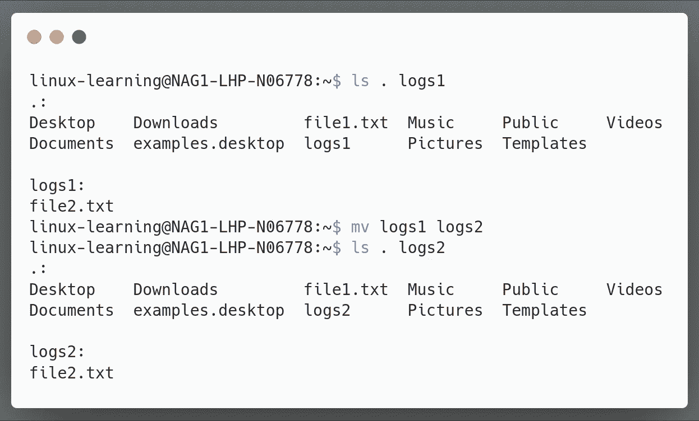

在上面的例子中，我们使用了命令`mv logs1 logs2`，其中

`mv`代表着**移动**命令
T5 代表着**来源**目录**logs 1**
T6 代表着**目的地**目录 **logs2**

为了检查文件是否已经移动到目标目录，我们使用了命令`ls . logs2`,其中

`ls`代表**列表**命令
代表**当前工作目录**
代表`logs2`目标目录 **logs2**

那么，如果目的地 logs2 不存在，会发生什么呢？

如果该目录不存在，则创建一个新目录，然后将内容移动到该目录。

类似于我们看到的`cp`命令，如果文件已经存在的话`mv`命令也会覆盖文件。

但是，如果我们只想移动那些不在目标目录中的文件，而跳过已经存在的文件，该怎么办呢？

*   移动不存在或比现有相应文件新的文件

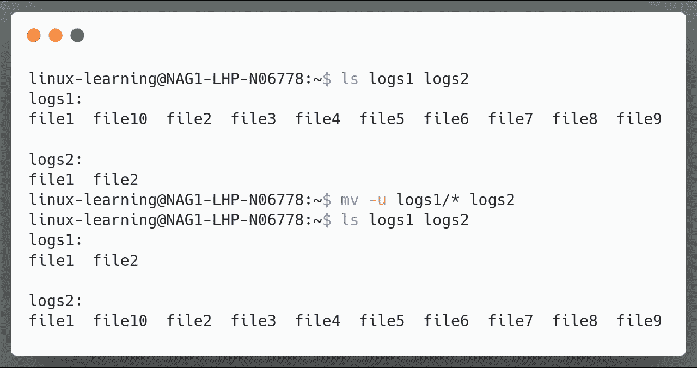

在上面的例子中，我们首先检查了 logs1 和 logs2 目录的内容，发现 logs1 和 logs2 都包含文件 1 和文件 2。

之后，我们使用了命令`mv -u logs1/* logs2`其中

`mv`代表**移动**命令
代表**更新**
`logs1/*`代表里面的**内容**日志 1** 目录
代表**目的地**目录**日志 2****

如果我们想把所有的。txt 文件到一个新文件夹？

*   移动**。txt** 文件到名为“text_files”的文件夹中

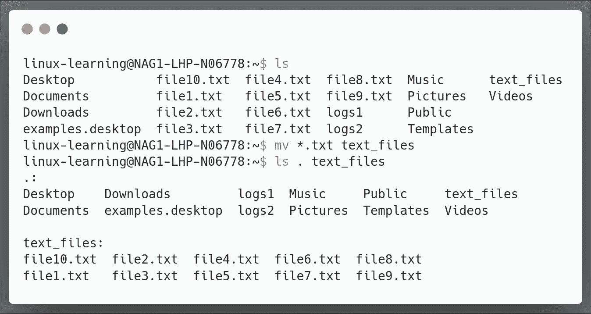

在上面的例子中，我们首先列出当前目录的所有内容，然后使用命令`mv *.txt text_files`其中

`mv`代表**移动**命令
`*.txt`代表**全体。txt 文件**
`text_files`代表**目的地**目录 **text_files**

检查是否所有的文件类型”。txt "有没有被移动过我们使用的`ls . text_files`命令在哪里

`.`代表当前工作目录
代表**目的地**目录 **text_files**

现在我们知道如何通过使用我们的**通配符**在一秒钟内轻松移动大量文件。

这些是我们移动文件/目录的方法。现在让我们看看如何重命名文件/目录。

**3。** `**mv**` **命令用于重命名**

等等，我们刚才不是用了`mv`命令来移动文件和目录吗？

是的,`mv`命令用于移动和重命名文件/目录。

`mv`命令用于重命名的语法

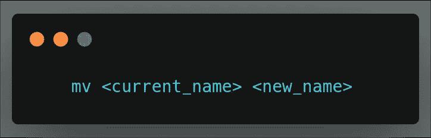

要重命名一个文件，我们只需使用`mv`命令以及当前名称和新名称

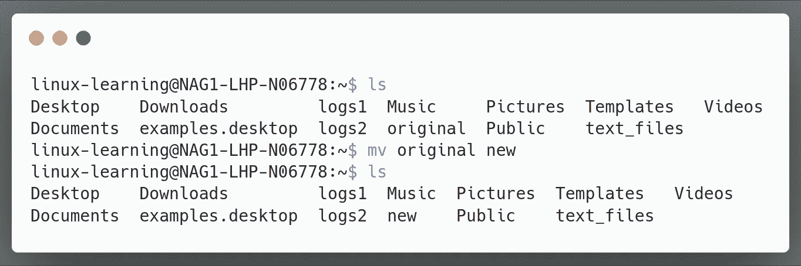

在上面的例子中，我们使用了命令`mv original new`，其中

`mv`代表**移动**命令
代表当前 _ 名称**原**原
代表新 _ 名称**新**

**注意** :-请注意我们给文件的新名称不是已经存在的**文件的名称，因为如果带有**新名称**的文件已经存在，那么当我们使用`mv`命令时，该文件将被**覆盖**。**

让我们来看看如何重命名目录

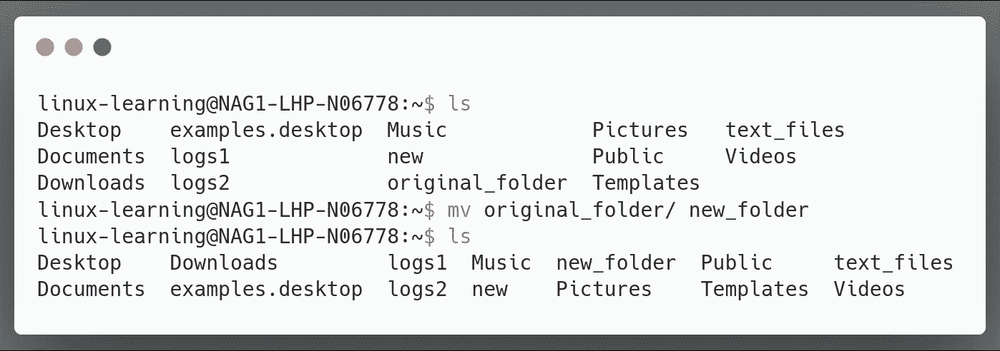

在上面的例子中，我们使用了命令`mv original_folder/ new_folder`，其中

`mv`代表**移动**命令
`original_folder/`代表当前 _ 名称**原始 _ 文件夹**
`new_folder`代表新建 _ 名称**新建 _ 文件夹**

好了，这就是我们需要知道的在 Linux 系统中复制、移动和重命名文件和目录的所有命令。

我希望您理解了 Linux 中文件操作的基础知识。如果有任何问题，请告诉我。