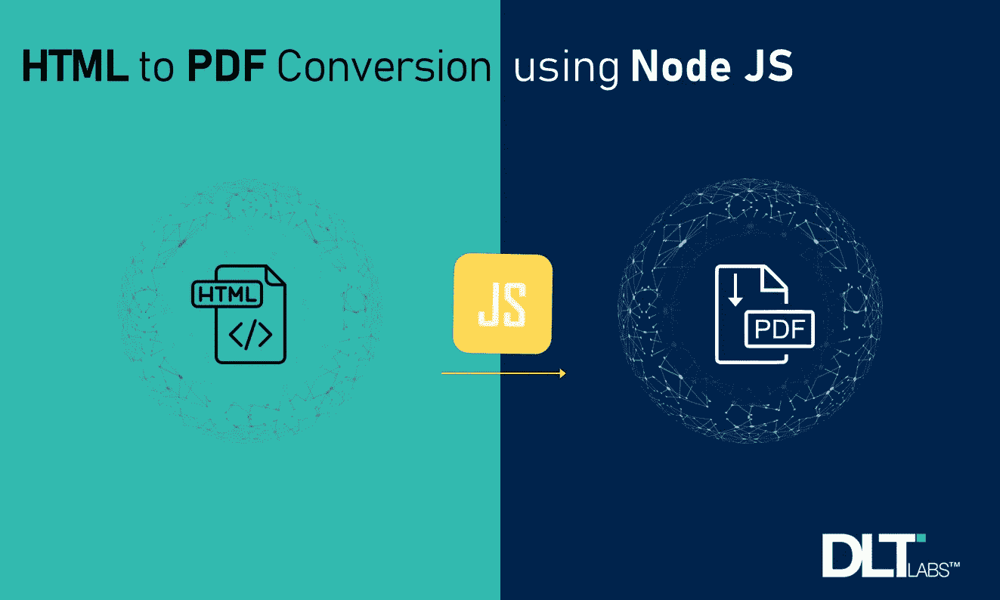
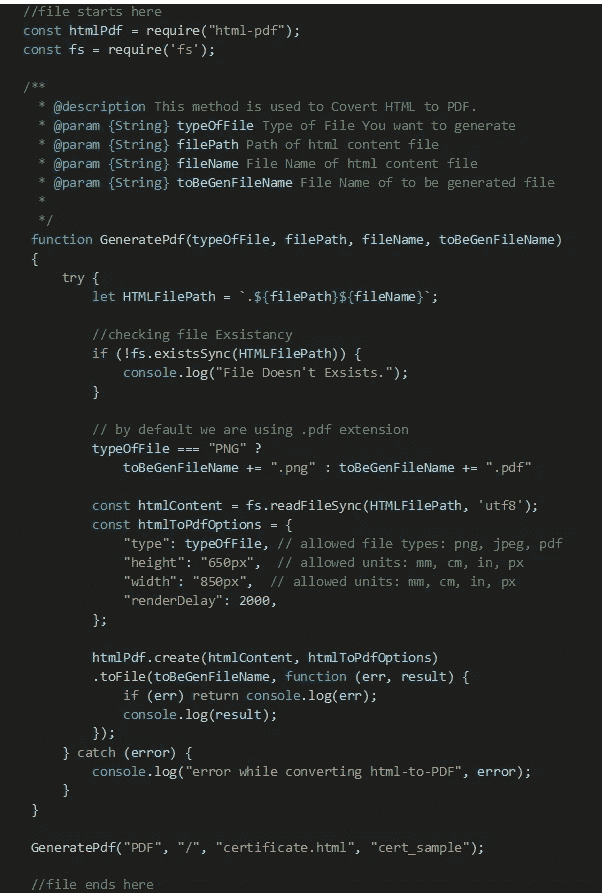
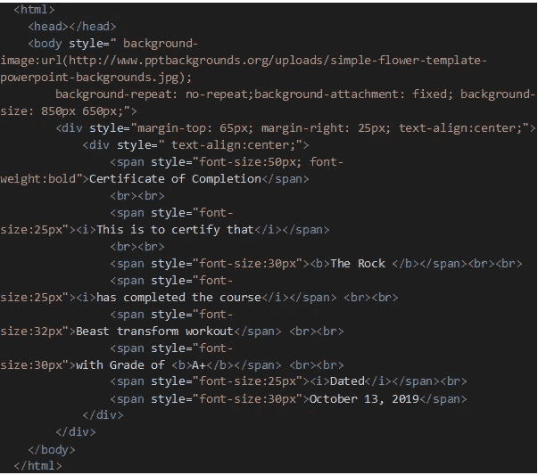
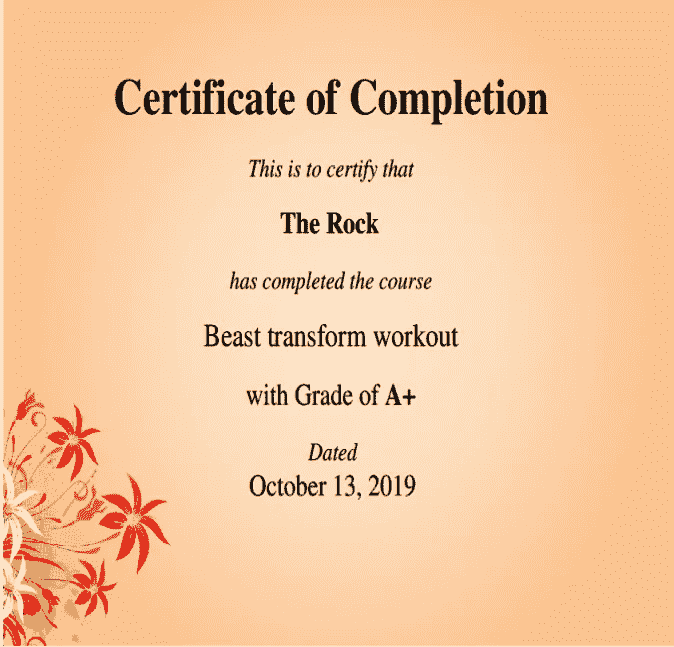
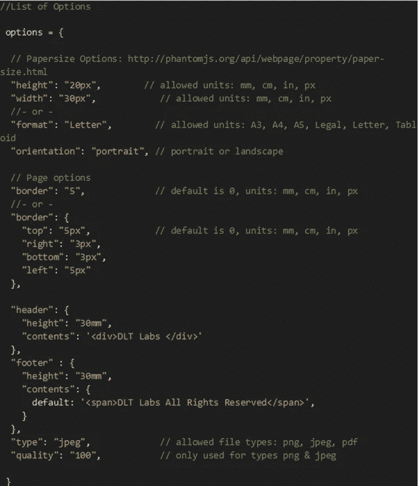

# 如何使用 Node.js 轻松地将 Html 转换为 Pdf 或图像

> 原文：<https://blog.devgenius.io/how-to-covert-html-to-pdf-or-image-easily-with-node-js-cf1c1c7d8b1b?source=collection_archive---------0----------------------->

从 HTML 生成 PDF 是我们不常考虑的事情，因为现在许多应用程序和网站都提供这个功能。例如，许多电子商务网站在为您的购买生成发票时会这样做。

我们在 [DLT 实验室](http://www.dltlabs.com)在 DL Certify 中生成和呈现 pdf，这是一个我们构建的平台，允许发布和管理机构的成绩单、评分表或证书。它还支持以不可变的成绩单和数据记录的形式管理学生和员工数据:

DL 认证简介| [来源](https://www.youtube.com/watch?v=mz1rLH2k-Ko)

我们在 Node.js 中使用了 *Html-Pdf* *npm 模块*，因为它让我们能够安全地生成和呈现 Pdf，而不必依赖客户端来实现这一点。

让我们用一个例子来看看如何使用 Html-Pdf 和节点作为服务器。

# 你需要什么？

需要的必备软件栈很少

*   Node.js:版本 10 或以上
*   [HTML-PDF](https://www.npmjs.com/package/html-pdf) 模块:版本 2.2.0

要安装此模块，请使用以下代码:`$ npm i html-pdf`

# 实施我们的准则

*   首先，我们创建一个示例- *html-to-pdf.js* 文件，并向其中添加以下代码

Sample-html-to-pdf.js | [来源](http://www.dltlabs.com)

*   这里我们使用了 Node.js 的 *fs* 模块从提供的文件中读取 html 内容。如果我们愿意，我们可以使用' *Create'* 函数将字符串直接传递给 Html-Pdf 模块。
*   当在我们的应用程序中使用 Html-Pdf 模块时，我们可以将必要的内容传递到 REST API 内的请求有效负载中。
*   我们创建 certificate.html 文件并粘贴如下所示的代码:

certificate.html |[来源](http://www.dltlabs.com)

*   现在，在终端中运行以下命令以获得所需的输出:

`node sample-html-to-pdf.js`

*   下面是我们的输出结果:

我们的输出是什么样子的| [来源](http://www.dltlabs.com)

*   尽管我们使用了 Node.js 中的一些特性，但还有更多。要找到它们，使用如下所示的*选项*代码:

列出常用选项| [来源](http://www.dltlabs.com)

这就是从 HTML 生成和呈现 pdf 所需的全部内容。希望这有所帮助！

*DL Certify**和 DLT 实验室是 DLT 全球公司*的商标

*作者—图沙尔·贝德瓦，* *DLT 实验室*

**关于作者:** *Tushar* 是一名全栈开发人员，目前加入了我们的 DL Certify 团队。

> 参考
> 
> [https://www.npmjs.com/package/html-pdf](https://www.npmjs.com/package/html-pdf)
> 
> [https://nodejs.org/dist/latest-v12.x/docs/api/](https://nodejs.org/dist/latest-v12.x/docs/api/)
> 
> [http://www.pptbackgrounds.org/](http://www.pptbackgrounds.org/)
> 
> [https://www.talkhelper.com/best-html-to-pdf-converter/](https://www.talkhelper.com/best-html-to-pdf-converter/)

